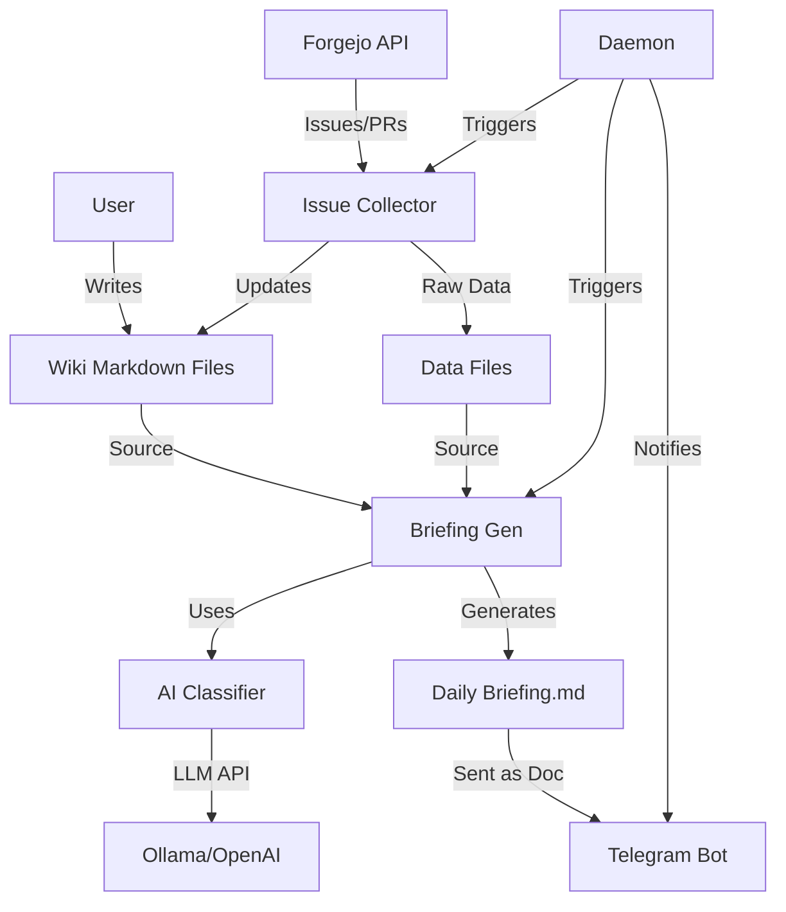

# Automation Architecture

## Overview
This directory contains a suite of Python-based automation tools designed to manage personal knowledge (Wiki), track work items (Forgejo), and provide daily briefings. The system operates as a background daemon or via standalone scripts, integrating with external APIs and local markdown files.

## Components

### 1. Core Services
- **Daemon (`daemon.py`)**:
  - The central orchestrator.
  - Runs in the background (systemd-like behavior).
  - Schedules tasks based on time (Daily Briefing @ 7AM, Issue Sync @ 8AM/11AM/4PM).
  - Sends health and status notifications via Telegram.

### 2. Collectors & Generators
- **Forgejo Issue Collector (`forgejo_issue_collector.py`)**:
  - Connects to Forgejo API.
  - Fetches issues/PRs from configured repositories.
  - Updates local markdown files (`team_issues_summary.md`, `BACKLOG.md`).
- **Daily Briefing Generator (`daily_briefing_generator.py`)**:
  - Aggregates data from PRs, Issues, Backlog, and Inbox.
  - Generates a daily markdown report.
  - Uses AI for summarization/prioritization if enabled.
- **Markdown Optimizer (`markdown_optimizer.py`)**:
  - Scans markdown files.
  - Adds YAML frontmatter (metadata, tags, related files) to improve AI retrieval.

### 3. Intelligence Layer
- **AI Classifier (`ai_classifier.py`)**:
  - Provides intelligence services to other components.
  - Classifies items (Bug/Feature/etc) and assigns Priority (P0/P1/P2).
  - Supports multiple providers: Ollama (local), OpenAI, Anthropic.

## Data Flow

## Directory Structure
- `automation/`: Root for scripts.
- `automation/data/`: Intermediate data files and logs.
- `automation/logs/`: Application logs.
- `.env`: Secrets configuration (API Keys, Tokens).
- `.venv/`: Python virtual environment.

## Dependencies
- **Python 3.10+**
- **Libraries**: `requests`, `python-dotenv`, `fastapi`, `uvicorn` (see `requirements.txt`).
- **External Services**:
  - Forgejo (Git host)
  - Telegram (Notifications)
  - Ollama/OpenAI (Optional AI)

## Configuration
Managed via `.env` file (not committed):
- `FORGEJO_URL`, `FORGEJO_TOKEN`
- `TELEGRAM_BOT_TOKEN`, `TELEGRAM_CHAT_ID`
- `AI_PROVIDER`, `OPENAI_API_KEY` (optional)
