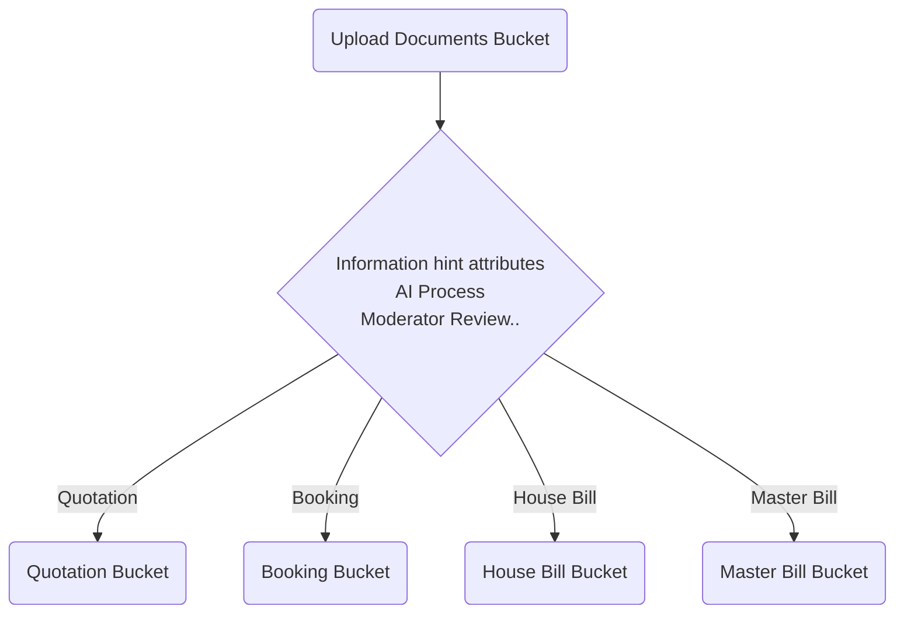

# S3 Storage

## Bucket Storage Structure

{companyCode}-doc-upload
  - {category}-doc-set-{id}/{file}
  - {category}-doc-set-{id}/{file}ie

{companyCode}-doc-accounting
  - house-bill/{house-bill-code}/{type}/{file}
  - master-bill/{house-bill-code}/{type}/{file}

[...]

## S3 Metadata
- The total size of all user-defined metadata that can be associated with a single Amazon S3 object is limited to 2 KB. This size is measured by the sum of the number of bytes in the UTF-8 encoding of each metadata key and value.

```
datatp-storage-protect: true/false
datatp-storage-access-roles: role1,role2,role3
datatp-storage-move-to: bucket:/key

datatp-upload-app: <module|app>:/feature
datatp-upload-date: 01/10/2026
datatp-upload-by: tony.nguyen
datatp-upload-by-id: 1234
datatp-upload-origin: bucket:/key

datatp-ie-date
datatp-ie-by: tony.nguyen
datatp-ie-by-id: 1234
datatp-ie-result: bucket:/key
```
# Buckets

## Upload Document Bucket
- The Bucket Structure:
```
    {companyCode}-doc-upload
        tms-lift-on-off-{docSetId}:
            __info__
            hb-1-invoice-01.pdf
            hb-2-invoice-01.pdf
            hb-1-receipt-01.pdf
            hb-1-other-01.pdf
        custom-clearance-{workflow}-{id}:
            __info__
            invoice-01.pdf
            receipt-01.pdf
            other-01.pdf
        accounting-{workflow}-{id}:
            __info__
            invoice-01.pdf
            receipt-01.pdf
            other-01.pdf
        pricing-fcl-{id}:
            __info__
            pricing-01.xlsx
            pricing-01-standardized.xlsx
        pricing-lcl-{id}:
            __info__
            pricing-01.xlsx
            pricing-01-standardized.xlsx
        pricing-air-{id}:
            __info__
            pricing-01.xlsx
            pricing-01-standardized.xlsx
```
- Once uploaded, the following metadata have to set:
```
datatp-upload-app: <module|app>:/feature
datatp-upload-date: 01/10/2026
datatp-upload-by: tony.nguyen
datatp-upload-by-id: 1234
datatp-upload-origin: bucket:/key
```
- The uploaded documents can have the custom attribute such media type,  information hints, OCR extraction hints...
- Extract and set the extracted information to the attributes
- Move the document to the bucket accounting, quotation, booking

## Accounting Bucket
- The Bucket Structure:
```
    {companyCode}-doc-accounting
        house-bills
            {house-bill-code}
                __info__
                invoices
                    invoice-01.pdf
                    invoice-01.pdfie
                receipts
                    receipt-01.pdf
                    receipt-01.pdfie
                others
                    other-01.pdf
        master-bills
            {master-bill-code}
                __info__
                invoices
                    invoice-01.pdf
                    invoice-01.pdfie
                receipts
                    receipt-01.pdf
                    receipt-01.pdfie
                others
                    other-01.pdf
```

## Custom Clearance Bucket
- The Bucket Structure:
```
    {companyCode}-doc-custom-clearance
        house-bills
            {house-bill-code}
                __info__
                products
                    products-01.pdf
                    products-01.pdfie
                others
                    other-01.pdf
            {master-bill-code}
                __info__
                products
                    products-01.pdf
                    products-01.pdfie
                others
                    other-01.pdf
```

## Quotation Bucket
- The bucket structure
```
    {companyCode}-doc-quotation
        quotation-{id}
            __info__
            legal
                document-1.pdf
                document-2.doc
            Others(customer docs...):
                document-1.pdf
                document-2.pdf
```
- The uploaded documents can have the custom attribute such media type,  information hints, OCR extraction hints...
- Extract and set the extracted information to the attributes
- Rerun the ocr extraction process

## Booking Bucket
- The bucket structure
```
    {companyCode}-doc-booking
        booking-{id}
            __info__
            legal
                document-1.pdf
                document-2.doc
            cariers:
                document-1.pdf
                document-2.doc
            Others(customer docs...):
                document-1.pdf
                document-2.pdf
```
- The uploaded documents can have the custom attribute such media type,  information hints, OCR extraction hints...
- Extract and set the extracted information to the attributes
- Rerun the ocr extraction process

## Carrier Pricing Bucket
- The bucket structure
```
    {companyCode}-doc-carrier-pricing
        {carrier}-upload-{id}
            __info__
            pricing-01-orig.pdf
            pricing-01-standardized.xlsx
```
- The uploaded documents can have the custom attribute such media type,  information hints, OCR extraction hints...
- Extract and set the extracted information to the attributes
- Rerun the ocr extraction process

# Document Upload Process



- The document will be uploaded to the upload bucket and organize as a document set
- A document set can be understood as a set of accounting, customs... documents. The document set can be organized by the time range, customer, partner...
- Once uploaded, the user can add hint to the document such what type of the document, what information the document can contain...
- The user can request the AI service to process the document to extract the information and store the extracted info into the metadata attributes.
- The user can manually add/edit the attributes of the document.
- Once the document has been processed, the user can request to move the document to the final location such Quotation, Booking, House Bill, Master Bill bucket
