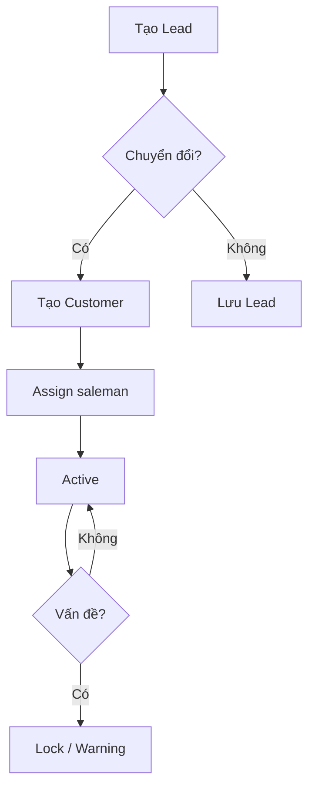
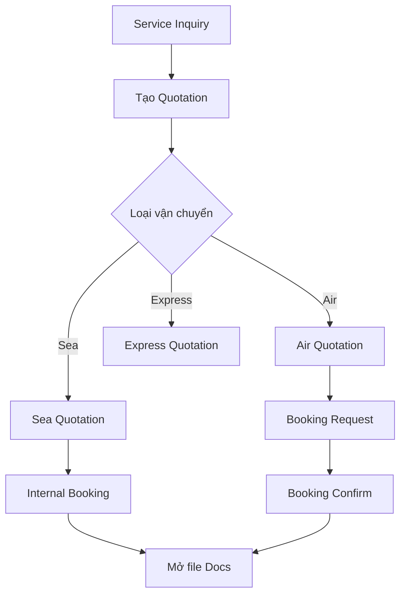
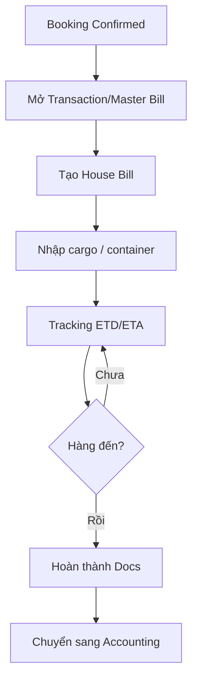
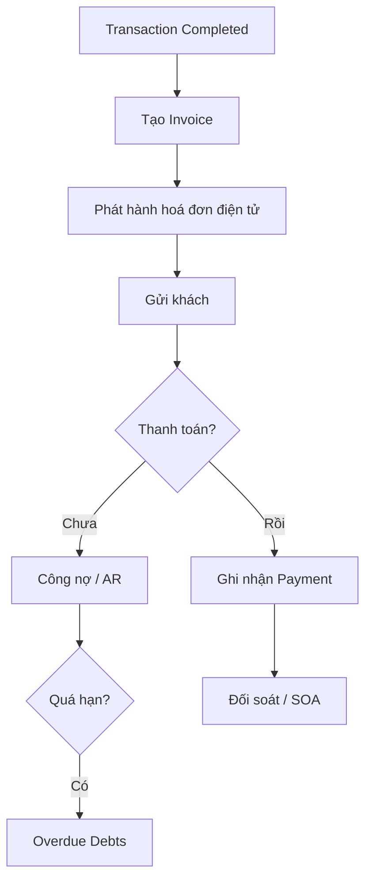

# FMS Documentation Framework — Implementation Plan

> **For agentic workers:** REQUIRED SUB-SKILL: Use superpowers:subagent-driven-development (recommended) or superpowers:executing-plans to implement this plan task-by-task. Steps use checkbox (`- [ ]`) syntax for tracking.

**Goal:** Tạo bộ tài liệu kỹ thuật đầy đủ cho dự án FMS tại `projects/fms/` để dev có thể bắt đầu code ngay.

**Architecture:** Tài liệu chia theo 3 layer song song: `schema/` (DB entities), `api/` (REST endpoints), `modules/` (nghiệp vụ + flow). Mỗi layer có 4 file theo module: catalogue → sales → documentation → accounting. File `architecture.md` là foundation, viết trước tất cả.

**Tech Stack:** Java Spring Boot, Kafka, React TypeScript, PostgreSQL, Debezium CDC (MSSQL source)

---

## Nguồn dữ liệu

| File nguồn | Dùng cho |
|---|---|
| `projects/bf1/fms/erd.md` | Schema: transactions, house_bill, cargo, tracking |
| `projects/bf1/fms/master-data.md` | Schema: catalogue — country, currency, partner, user_role |
| `projects/bf1/bfs/of1-project-analysis.md` | Module flows, business rules, entity relationships |
| `projects/bf1/fms/cdc-architecture.md` | Kafka, Debezium, CDC event format, topic naming |
| `projects/bf1/project-overview.md` | Phase 1 vs Phase 2 strategy |

---

## File Structure

```
projects/fms/
├── README.md
├── architecture.md
├── schema/
│   ├── catalogue.md
│   ├── sales.md
│   ├── documentation.md
│   └── accounting.md
├── api/
│   ├── catalogue.md
│   ├── sales.md
│   ├── documentation.md
│   └── accounting.md
└── modules/
    ├── catalogue.md
    ├── sales.md
    ├── documentation.md
    └── accounting.md
```

---

## Task 1: README.md — Index & Navigation

**Files:**
- Create: `projects/fms/README.md`

**Source:** `projects/bf1/project-overview.md`

- [ ] **Step 1: Tạo file với skeleton**

```markdown
# FMS — Freight Management System

> Hệ thống quản lý vận tải hàng hoá, thay thế BF1 cũ (MSSQL) trên nền tảng mới.

## Tech Stack
| Layer | Technology |
|---|---|
| Backend | Java Spring Boot |
| Message Broker | Apache Kafka |
| Frontend | React + TypeScript |
| Database | PostgreSQL |
| CDC Source | MSSQL via Debezium |

## Tổng quan 2 giai đoạn
...

## Navigation
...

## Trạng thái module
...
```

- [ ] **Step 2: Điền nội dung phần "Tổng quan 2 giai đoạn"**

Từ `project-overview.md`, tóm tắt:
- **Phase 1 — Read-First Migration:** Sync data MSSQL → PostgreSQL qua CDC, build màn hình read (báo cáo, tra cứu, dashboard)
- **Phase 2 — Write-Back Integration:** Build form nhập liệu trên hệ thống mới, ghi vào PostgreSQL, đồng bộ ngược về MSSQL

- [ ] **Step 3: Điền bảng Navigation**

```markdown
## Navigation

| Section | Nội dung |
|---|---|
| [Architecture](architecture.md) | Kiến trúc tổng thể, CDC pipeline, Kafka, config |
| [Schema — Catalogue](schema/catalogue.md) | Partner, User/Role, Master Data |
| [Schema — Sales](schema/sales.md) | Quotation, Booking, Vessel Schedule |
| [Schema — Documentation](schema/documentation.md) | Transactions, House Bill, Cargo, Tracking |
| [Schema — Accounting](schema/accounting.md) | Invoice, Payment, P&L |
| [API — Catalogue](api/catalogue.md) | Partner, User APIs |
| [API — Sales](api/sales.md) | Quotation, Booking APIs |
| [API — Documentation](api/documentation.md) | Shipment, House Bill APIs |
| [API — Accounting](api/accounting.md) | Invoice, Payment APIs |
| [Module — Catalogue](modules/catalogue.md) | Flow quản lý đối tác, danh mục |
| [Module — Sales](modules/sales.md) | Flow Inquiry → Quotation → Booking |
| [Module — Documentation](modules/documentation.md) | Flow Booking → Shipment → Chứng từ |
| [Module — Accounting](modules/accounting.md) | Flow Invoice → Payment → Báo cáo |
```

- [ ] **Step 4: Điền bảng trạng thái module**

```markdown
## Trạng thái module

| Module | Schema | API | Nghiệp vụ | Owner | Status |
|---|---|---|---|---|---|
| Catalogue | [ ] | [ ] | [ ] | — | planned |
| Sales | [ ] | [ ] | [ ] | — | planned |
| Documentation | [ ] | [ ] | [ ] | — | planned |
| Accounting | [ ] | [ ] | [ ] | — | planned |
```

- [ ] **Step 5: Tự review**

Kiểm tra:
- [ ] Có tech stack table
- [ ] Có mô tả Phase 1 / Phase 2
- [ ] Có navigation đến tất cả 13 file còn lại
- [ ] Có module status table với cột owner

- [ ] **Step 6: Commit**

```bash
git add projects/fms/README.md
git commit -m "docs(fms): thêm README index và navigation"
```

---

## Task 2: architecture.md — Kiến trúc & CDC Pipeline

**Files:**
- Create: `projects/fms/architecture.md`

**Source:** `projects/bf1/fms/cdc-architecture.md`, `projects/bf1/project-overview.md`

- [ ] **Step 1: Tạo sơ đồ kiến trúc tổng thể**

```markdown
# Architecture — FMS

## Kiến trúc tổng thể

```
MSSQL (BF1 cũ)
    │ CDC (SQL Server Agent)
    ▼
Debezium Connect (v2.4)
    │ JSON events
    ▼
Apache Kafka (Confluent 7.5.0)
    │ topics: fms.<table_name>
    ▼
Kafka Consumer (Spring Boot)
    │ transform + upsert
    ▼
PostgreSQL (FMS DB mới)
    │ REST API
    ▼
React Frontend (TypeScript)
```

| Component | Version | Vai trò |
|---|---|---|
| SQL Server CDC | Built-in | Bắt thay đổi từ transaction log |
| Debezium Connect | 2.4 | Đọc CDC → Kafka message |
| Apache Kafka | Confluent 7.5.0 | Message broker |
| Kafka Consumer | Spring Boot | Đọc Kafka → ghi PostgreSQL |
| PostgreSQL | latest | Database FMS mới |
| Spring Boot | 3.x | REST API backend |
| React + TS | 18+ | Frontend |
```

- [ ] **Step 2: Viết phần CDC Event Format**

Từ `cdc-architecture.md`, document format message Debezium:

```markdown
## CDC Event Format

Mỗi thay đổi trong MSSQL tạo ra 1 Kafka message có cấu trúc:

```json
{
  "before": { ... },   // trạng thái cũ (null nếu INSERT)
  "after": { ... },    // trạng thái mới (null nếu DELETE)
  "op": "c|u|d|r",     // c=create, u=update, d=delete, r=read/snapshot
  "ts_ms": 1234567890, // timestamp milliseconds
  "source": {
    "db": "BEE_DB",
    "table": "PARTNERS",
    "lsn": "..."
  }
}
```

**Xử lý theo `op`:**
| op | Hành động |
|---|---|
| `c` (create) | INSERT vào PostgreSQL |
| `u` (update) | UPDATE trong PostgreSQL |
| `d` (delete) | DELETE hoặc soft-delete |
| `r` (read) | INSERT/UPSERT (initial snapshot) |
```

- [ ] **Step 3: Viết phần Kafka Topic Naming**

```markdown
## Kafka Topic Naming

**Pattern:** `fms.<table_name>`

**Ví dụ:**
| Topic | Bảng MSSQL nguồn |
|---|---|
| `fms.PARTNERS` | PARTNERS |
| `fms.TRANSACTIONS` | (tên bảng tương ứng BF1 cũ) |

**Consumer Group ID:** `fms-consumer-group`

**Partition strategy:** Mỗi topic dùng table PK làm message key để đảm bảo ordering per-record.
```

- [ ] **Step 4: Viết phần Error Handling / DLQ**

```markdown
## Error Handling & Dead-Letter Queue

Khi Kafka Consumer fail xử lý event:
1. Retry tự động tối đa 3 lần (exponential backoff)
2. Sau 3 lần fail → publish message vào topic `fms.dlq.<table_name>`
3. DLQ được monitor và alert khi có message
4. Manual replay từ DLQ sau khi fix bug

**Spring Kafka config:**
```yaml
spring:
  kafka:
    consumer:
      group-id: fms-consumer-group
    listener:
      ack-mode: MANUAL
```
```

- [ ] **Step 5: Viết phần Phase 1 vs Phase 2 Data Flow**

```markdown
## Phase 1 — Read-First Migration

Data flow: MSSQL → CDC → Kafka → Consumer → PostgreSQL → React (read-only)

- Consumer chỉ sync data, không có write API
- Frontend chỉ có màn hình read: báo cáo, tra cứu, dashboard
- Mục tiêu: validate data model và mapping trước khi build write

## Phase 2 — Write-Back Integration

Data flow thêm chiều ngược:
React → Spring Boot API → PostgreSQL → Kafka Producer → MSSQL (write-back)

- Spring Boot expose write API cho Frontend
- Mỗi write vào PostgreSQL publish event Kafka
- Kafka Consumer riêng ghi ngược về MSSQL để các chức năng kế toán cũ tiếp tục hoạt động
```

- [ ] **Step 6: Viết phần Config Reference**

```markdown
## Config Reference

Các biến môi trường bắt buộc để chạy FMS backend:

```env
# Database
DB_HOST=localhost
DB_PORT=5432
DB_NAME=fms_db
DB_USERNAME=fms_user
DB_PASSWORD=...

# Kafka
KAFKA_BOOTSTRAP_SERVERS=localhost:9092
KAFKA_CONSUMER_GROUP_ID=fms-consumer-group

# Debezium / MSSQL source
MSSQL_HOST=of1.beelogistics.com
MSSQL_PORT=34541
MSSQL_DATABASE=BEE_DB
MSSQL_USERNAME=...
MSSQL_PASSWORD=...

# DLQ
KAFKA_DLQ_TOPIC_PREFIX=fms.dlq
```
```

- [ ] **Step 7: Tự review**

- [ ] Có sơ đồ kiến trúc tổng thể
- [ ] Có CDC event format đầy đủ (before/after/op)
- [ ] Có Kafka topic naming pattern + ví dụ
- [ ] Có consumer group ID và partition strategy
- [ ] Có DLQ error handling flow
- [ ] Có Phase 1 vs Phase 2 data flow
- [ ] Có config reference với tất cả required env vars

- [ ] **Step 8: Commit**

```bash
git add projects/fms/architecture.md
git commit -m "docs(fms): thêm architecture — CDC pipeline, Kafka, Phase 1/2 data flow"
```

---

## Task 3: schema/catalogue.md — Master Data & Partner Schema

**Files:**
- Create: `projects/fms/schema/catalogue.md`

**Source:** `projects/bf1/fms/master-data.md`, `projects/bf1/bfs/of1-project-analysis.md` (mục 2.1)

- [ ] **Step 1: List các bảng sẽ document**

Từ `master-data.md`, ghi ra danh sách:
- `settings_country` — Quốc gia
- `settings_currency` — Tiền tệ
- `settings_location` / `settings_port` — Cảng/địa điểm
- `of1_fms_partner` — Đối tác (Customer, Carrier, Agent, ...)
- `of1_fms_user_role` — User và phân quyền

- [ ] **Step 2: Document từng bảng theo format chuẩn**

Format cho mỗi bảng:
```markdown
### `table_name` — Mô tả ngắn

| Trường | Kiểu | Bắt buộc | Mô tả | FK |
|---|---|---|---|---|
| `id` | bigserial | | PK | |
| ... | ... | | ... | |

**Enum values (nếu có):**
| Code | Mô tả |
|---|---|
| ... | ... |

**Sample data:**
| id | field1 | field2 |
|---|---|---|
| 1 | ... | ... |
```

- [ ] **Step 3: Copy và chuẩn hoá từ master-data.md**

Đọc `master-data.md`, copy các bảng trong Nhóm A (địa lý/tiền tệ) và bảng partner/user vào file mới. Chuẩn hoá format theo template trên.

- [ ] **Step 4: Thêm phần Entity Relations**

```markdown
## Entity Relations

```
settings_country (1) ──── (N) settings_city
settings_currency (1) ──── (N) settings_country
of1_fms_partner (1) ──── (N) of1_fms_house_bill (client)
of1_fms_user_role (1) ──── (N) of1_fms_transactions (created_by)
```
```

- [ ] **Step 5: Tự review**

- [ ] Có ít nhất 5 bảng documented (country, currency, location, partner, user_role)
- [ ] Mỗi bảng có columns table với type và FK rõ ràng
- [ ] Enum values được liệt kê đầy đủ
- [ ] Có sample data ít nhất 2 row mẫu
- [ ] Có entity relations section

- [ ] **Step 6: Commit**

```bash
git add projects/fms/schema/catalogue.md
git commit -m "docs(fms): thêm schema catalogue — partner, user, master data"
```

---

## Task 4: schema/sales.md — Sales Module Schema

**Files:**
- Create: `projects/fms/schema/sales.md`

**Source:** `projects/bf1/bfs/of1-project-analysis.md` (mục 2.2), `projects/bf1/fms/erd.md`

- [ ] **Step 1: List các bảng Sales**

Từ phân tích module Sales:
- `of1_fms_vessel_schedule` — Lịch tàu
- `of1_fms_pricing_air` / `of1_fms_pricing_sea` / `of1_fms_pricing_express` — Database giá
- `of1_fms_quotation` — Báo giá (Air/Sea/Express)
- `of1_fms_booking` — Booking request/confirm
- `of1_fms_service_inquiry` — Yêu cầu dịch vụ

- [ ] **Step 2: Document từng bảng theo format chuẩn**

Với mỗi bảng: columns (type, nullable, FK), enum values, relations đến catalogue entities (FK → `of1_fms_partner`, `settings_location`, ...).

- [ ] **Step 3: Thêm phần Entity Relations**

```markdown
## Entity Relations

```
of1_fms_service_inquiry (N) ──── (1) of1_fms_partner (customer)
of1_fms_quotation (N) ──── (1) of1_fms_partner (customer)
of1_fms_quotation (N) ──── (1) settings_location (POL/POD)
of1_fms_booking (N) ──── (1) of1_fms_quotation
of1_fms_booking (N) ──── (1) of1_fms_partner (carrier)
```
> Xem `schema/catalogue.md` cho định nghĩa đầy đủ của partner và location.
```

- [ ] **Step 4: Tự review**

- [ ] Có ít nhất 4 bảng chính của Sales
- [ ] Có FK rõ ràng đến catalogue entities
- [ ] Có enum values cho booking_status, quotation_status
- [ ] Có entity relations section với note cross-ref catalogue

- [ ] **Step 5: Commit**

```bash
git add projects/fms/schema/sales.md
git commit -m "docs(fms): thêm schema sales — quotation, booking, vessel"
```

---

## Task 5: schema/documentation.md — Documentation Module Schema

**Files:**
- Create: `projects/fms/schema/documentation.md`

**Source:** `projects/bf1/fms/erd.md` (toàn bộ file)

- [ ] **Step 1: List các bảng Documentation**

Từ ERD (Nhóm A và B):
- `of1_fms_transactions` — Master Bill (vận đơn chủ)
- `of1_fms_house_bill` — House Bill (vận đơn nhà)
- `of1_fms_hawb_detail` — Chi tiết vận đơn nhà
- `of1_fms_cargo_container` — Container
- `of1_fms_commodity` — Hàng hóa

- [ ] **Step 2: Document `of1_fms_transactions`**

Copy từ `erd.md` — đây là bảng core nhất. Giữ đầy đủ columns, enum `type_of_service`.

- [ ] **Step 3: Document `of1_fms_house_bill` và `of1_fms_hawb_detail`**

Copy từ `erd.md`. Chú ý: `hawb_detail` có các nhóm trường theo service type (Sea / Logistics).

- [ ] **Step 4: Document tracking entities**

Copy `of1_fms_cargo_container` và `of1_fms_commodity`.

- [ ] **Step 5: Thêm Entity Relations**

```markdown
## Entity Relations

```
of1_fms_booking (1) ──── (N) of1_fms_transactions (master bill)
of1_fms_transactions (1) ──── (N) of1_fms_house_bill
of1_fms_house_bill (1) ──── (1) of1_fms_hawb_detail
of1_fms_house_bill (1) ──── (N) of1_fms_cargo_container
of1_fms_cargo_container (1) ──── (N) of1_fms_commodity
of1_fms_house_bill (N) ──── (1) of1_fms_partner (client)
of1_fms_house_bill (N) ──── (1) of1_fms_user_role (saleman)
```
```

- [ ] **Step 6: Tự review**

- [ ] Có `of1_fms_transactions` đầy đủ columns + enum type_of_service
- [ ] Có `of1_fms_house_bill` + `of1_fms_hawb_detail`
- [ ] Có container và commodity tables
- [ ] Có entity relations section
- [ ] FK đến catalogue entities được ghi rõ

- [ ] **Step 7: Commit**

```bash
git add projects/fms/schema/documentation.md
git commit -m "docs(fms): thêm schema documentation — transactions, house bill, cargo"
```

---

## Task 6: schema/accounting.md — Accounting Module Schema

**Files:**
- Create: `projects/fms/schema/accounting.md`

**Source:** `projects/bf1/bfs/of1-project-analysis.md` (mục Accounting), `projects/bf1/fms/erd.md`

- [ ] **Step 1: List các bảng Accounting**

Từ phân tích module:
- `of1_fms_invoice` — VAT Invoice (hoá đơn điện tử)
- `of1_fms_payment` — Payment (lịch sử thanh toán)
- `of1_fms_advance_request` — Tạm ứng
- `of1_fms_pl_sheet` — P/L Sheet (lợi nhuận/lỗ)
- `of1_fms_debit_note` / `of1_fms_credit_note` — Debit/Credit note

- [ ] **Step 2: Document từng bảng**

Với mỗi bảng: columns, type, FK đến `of1_fms_transactions`, `of1_fms_partner`, `of1_fms_user_role`.

- [ ] **Step 3: Thêm Entity Relations**

```markdown
## Entity Relations

```
of1_fms_transactions (1) ──── (N) of1_fms_invoice
of1_fms_invoice (1) ──── (N) of1_fms_payment
of1_fms_transactions (1) ──── (1) of1_fms_pl_sheet
of1_fms_invoice (N) ──── (1) of1_fms_partner (khách hàng)
```
> Xem `schema/documentation.md` cho định nghĩa transactions.
```

- [ ] **Step 4: Tự review**

- [ ] Có ít nhất 4 bảng Accounting
- [ ] FK đến transactions và partner rõ ràng
- [ ] Có entity relations section

- [ ] **Step 5: Commit**

```bash
git add projects/fms/schema/accounting.md
git commit -m "docs(fms): thêm schema accounting — invoice, payment, P&L"
```

---

## Task 7: api/catalogue.md — Catalogue REST API

**Files:**
- Create: `projects/fms/api/catalogue.md`

**Source:** `projects/fms/schema/catalogue.md` (đã tạo ở Task 3)

- [ ] **Step 1: Tạo file với header**

```markdown
# API — Catalogue

Base URL: `/api/v1`

> Cross-reference: xem `schema/catalogue.md` cho định nghĩa đầy đủ của từng entity.

## Error Response Format

```json
{
  "code": "RESOURCE_NOT_FOUND",
  "message": "Partner not found",
  "status": 404
}
```

**HTTP Status Codes:**
| Code | Ý nghĩa |
|---|---|
| 200 | OK |
| 201 | Created |
| 400 | Bad Request (validation error) |
| 404 | Not Found |
| 409 | Conflict (duplicate) |
| 500 | Internal Server Error |
```

- [ ] **Step 2: Document Partner API**

```markdown
## Partner

### GET /api/v1/partners
Lấy danh sách partner (phân trang).

**Query params:**
| Param | Type | Mô tả |
|---|---|---|
| `type` | string | Lọc theo loại: CUSTOMER, CARRIER, AGENT, ... |
| `status` | string | PUBLIC / LOCK / WARNING |
| `page` | int | Trang (default: 0) |
| `size` | int | Số record/trang (default: 20) |

**Response:**
```json
{
  "content": [{ "id": 1, "name_full": "...", "type": "CUSTOMER", ... }],
  "totalElements": 100,
  "totalPages": 5
}
```

### GET /api/v1/partners/{id}
### POST /api/v1/partners
### PUT /api/v1/partners/{id}
### DELETE /api/v1/partners/{id}
```

- [ ] **Step 3: Document User/Role API**

Tương tự: `GET /api/v1/users`, `GET /api/v1/users/{id}`, POST/PUT.

- [ ] **Step 4: Document Master Data APIs**

```markdown
## Master Data (read-only)

### GET /api/v1/settings/countries
### GET /api/v1/settings/currencies
### GET /api/v1/settings/locations
### GET /api/v1/settings/ports
```

- [ ] **Step 5: Thêm note Phase 1/2**

```markdown
## Phase Notes

| Endpoint | Phase 1 | Phase 2 |
|---|---|---|
| GET (tất cả) | ✓ read-only | ✓ |
| POST/PUT/DELETE partners | ✗ | ✓ writable |
| POST/PUT users | ✗ | ✓ writable |
| Master data | ✓ read-only | ✓ read-only |
```

- [ ] **Step 6: Tự review**

- [ ] Có error response format standard
- [ ] Có HTTP status codes table
- [ ] Có Partner CRUD endpoints
- [ ] Có User/Role endpoints
- [ ] Có Master Data read-only endpoints
- [ ] Có Phase 1/2 table
- [ ] Prefix `/api/v1/` trên tất cả endpoints
- [ ] Cross-reference đến schema/catalogue.md

- [ ] **Step 7: Commit**

```bash
git add projects/fms/api/catalogue.md
git commit -m "docs(fms): thêm API spec catalogue — partner, user, master data"
```

---

## Task 8: api/sales.md — Sales REST API

**Files:**
- Create: `projects/fms/api/sales.md`

**Source:** `projects/fms/schema/sales.md` (Task 4), `projects/bf1/bfs/of1-project-analysis.md`

- [ ] **Step 1: Document Quotation API**

```markdown
# API — Sales

Base URL: `/api/v1`
> Cross-reference: xem `schema/sales.md`.

## Quotation

### GET /api/v1/quotations
### GET /api/v1/quotations/{id}
### POST /api/v1/quotations
### PUT /api/v1/quotations/{id}

**POST /api/v1/quotations — Request body:**
```json
{
  "type": "SEA_FCL",
  "customer_id": 123,
  "pol_code": "VNHCM",
  "pod_code": "SGSIN",
  "currency": "USD",
  "valid_from": "2026-04-01",
  "valid_to": "2026-06-30",
  "rates": [...]
}
```
```

- [ ] **Step 2: Document Booking API**

```markdown
## Booking

### GET /api/v1/bookings
### GET /api/v1/bookings/{id}
### POST /api/v1/bookings
### PUT /api/v1/bookings/{id}/confirm
### PUT /api/v1/bookings/{id}/cancel
```

- [ ] **Step 3: Document Service Inquiry API**

```markdown
## Service Inquiry

### GET /api/v1/inquiries
### POST /api/v1/inquiries
### PUT /api/v1/inquiries/{id}/convert-to-quotation
```

- [ ] **Step 4: Thêm Phase Notes**

| Endpoint | Phase 1 | Phase 2 |
|---|---|---|
| GET (tất cả) | ✓ | ✓ |
| POST/PUT quotation | ✗ | ✓ |
| POST/PUT booking | ✗ | ✓ |
| POST inquiry | ✗ | ✓ |

- [ ] **Step 5: Tự review**

- [ ] Có Quotation CRUD
- [ ] Có Booking với state transitions (confirm, cancel)
- [ ] Có Service Inquiry
- [ ] Có Phase 1/2 table
- [ ] Cross-reference đến schema/sales.md

- [ ] **Step 6: Commit**

```bash
git add projects/fms/api/sales.md
git commit -m "docs(fms): thêm API spec sales — quotation, booking, inquiry"
```

---

## Task 9: api/documentation.md — Documentation REST API

**Files:**
- Create: `projects/fms/api/documentation.md`

**Source:** `projects/fms/schema/documentation.md` (Task 5)

- [ ] **Step 1: Document Transactions (Master Bill) API**

```markdown
# API — Documentation

Base URL: `/api/v1`
> Cross-reference: xem `schema/documentation.md`.

## Transactions (Master Bill)

### GET /api/v1/transactions
**Query params:** `type_of_service`, `state`, `from_date`, `to_date`, `page`, `size`

### GET /api/v1/transactions/{id}
### POST /api/v1/transactions
### PUT /api/v1/transactions/{id}
### PUT /api/v1/transactions/{id}/state
Thay đổi trạng thái: request body `{ "state": "COMPLETED" }`
```

- [ ] **Step 2: Document House Bill API**

```markdown
## House Bill

### GET /api/v1/house-bills
### GET /api/v1/house-bills/{id}
### POST /api/v1/house-bills
### PUT /api/v1/house-bills/{id}

### GET /api/v1/transactions/{id}/house-bills
Lấy tất cả house bills thuộc 1 transaction.
```

- [ ] **Step 3: Document Cargo APIs**

```markdown
## Cargo & Container

### GET /api/v1/house-bills/{id}/containers
### POST /api/v1/house-bills/{id}/containers
### GET /api/v1/house-bills/{id}/commodities
### POST /api/v1/house-bills/{id}/commodities
```

- [ ] **Step 4: Thêm Phase Notes**

| Endpoint | Phase 1 | Phase 2 |
|---|---|---|
| GET transactions | ✓ (synced từ CDC) | ✓ |
| POST/PUT transactions | ✗ | ✓ |
| GET house bills | ✓ (synced từ CDC) | ✓ |
| POST/PUT house bills | ✗ | ✓ |

- [ ] **Step 5: Tự review + Commit**

```bash
git add projects/fms/api/documentation.md
git commit -m "docs(fms): thêm API spec documentation — transactions, house bill, cargo"
```

---

## Task 10: api/accounting.md — Accounting REST API

**Files:**
- Create: `projects/fms/api/accounting.md`

**Source:** `projects/fms/schema/accounting.md` (Task 6)

- [ ] **Step 1: Document Invoice API**

```markdown
# API — Accounting

Base URL: `/api/v1`
> Cross-reference: xem `schema/accounting.md`.

## Invoice

### GET /api/v1/invoices
**Query params:** `partner_id`, `status`, `from_date`, `to_date`, `page`, `size`

### GET /api/v1/invoices/{id}
### POST /api/v1/invoices
### PUT /api/v1/invoices/{id}/issue     — Phát hành hoá đơn
### PUT /api/v1/invoices/{id}/cancel    — Huỷ hoá đơn
```

- [ ] **Step 2: Document Payment API**

```markdown
## Payment

### GET /api/v1/payments
### POST /api/v1/payments
### GET /api/v1/invoices/{id}/payments
```

- [ ] **Step 3: Document P/L và Advance Request**

```markdown
## P/L Sheet

### GET /api/v1/pl-sheets
### GET /api/v1/pl-sheets/{transaction_id}

## Advance Request

### GET /api/v1/advance-requests
### POST /api/v1/advance-requests
### PUT /api/v1/advance-requests/{id}/approve
```

- [ ] **Step 4: Thêm Phase Notes + Commit**

```bash
git add projects/fms/api/accounting.md
git commit -m "docs(fms): thêm API spec accounting — invoice, payment, P&L"
```

---

## Task 11: modules/catalogue.md — Catalogue Business Flow

**Files:**
- Create: `projects/fms/modules/catalogue.md`

**Source:** `projects/bf1/bfs/of1-project-analysis.md` (mục 2.1)

- [ ] **Step 1: Document Partner Management Flow**

```markdown
# Module — Catalogue

## Partner Management Flow



## Partner Status Lifecycle

| Status | Mô tả | Hành động cho phép |
|---|---|---|
| `PUBLIC` | Active, dùng được | Tất cả |
| `LOCK` | Tạm khóa | Chỉ xem |
| `WARNING` | Cảnh báo | Xem + ghi chú |
```

- [ ] **Step 2: Document Phase 1/2 Boundaries**

```markdown
## Phase 1 vs Phase 2

| Operation | Phase 1 | Phase 2 |
|---|---|---|
| Xem danh sách partner (synced từ BF1) | ✓ | ✓ |
| Tìm kiếm, filter partner | ✓ | ✓ |
| Tạo partner mới | ✗ | ✓ |
| Cập nhật partner | ✗ | ✓ |
| Xem master data (country, port) | ✓ | ✓ |
| Thêm/sửa master data | ✗ | ✓ |
```

- [ ] **Step 3: Document Business Rules**

```markdown
## Business Rules

1. **Partner uniqueness:** Mỗi partner có `ac_ref` để liên kết công ty mẹ cho SOA
2. **Partner type:** Một đối tác có thể có nhiều type (vừa là Customer vừa là Carrier)
3. **Agent priority:** Agent có field `priority` (1-8) để hệ thống tự chọn agent phù hợp
4. **Status LOCK:** Partner bị LOCK không thể được chọn trong Quotation/Booking mới
```

- [ ] **Step 4: Tự review + Commit**

- [ ] Có mermaid flow diagram
- [ ] Có status lifecycle table
- [ ] Có Phase 1/2 boundaries table
- [ ] Có business rules

```bash
git add projects/fms/modules/catalogue.md
git commit -m "docs(fms): thêm module catalogue — partner flow, status lifecycle, Phase 1/2"
```

---

## Task 12: modules/sales.md — Sales Business Flow

**Files:**
- Create: `projects/fms/modules/sales.md`

**Source:** `projects/bf1/bfs/of1-project-analysis.md` (mục 2.2)

- [ ] **Step 1: Document Sales Flow chính**

```markdown
# Module — Sales

## Sales Flow


```

- [ ] **Step 2: Document Quotation Status Lifecycle**

```markdown
## Quotation Status

| Status | Mô tả |
|---|---|
| `DRAFT` | Đang soạn |
| `SENT` | Đã gửi cho khách |
| `ACCEPTED` | Khách chấp nhận |
| `REJECTED` | Khách từ chối |
| `EXPIRED` | Hết hạn hiệu lực |

## Booking Status

| Status | Mô tả |
|---|---|
| `PENDING` | Chờ xác nhận |
| `CONFIRMED` | Đã xác nhận |
| `CANCELLED` | Đã huỷ |
| `CLOSED` | Đã mở file sang Docs |
```

- [ ] **Step 3: Document Phase 1/2 Boundaries + Business Rules + Commit**

```bash
git add projects/fms/modules/sales.md
git commit -m "docs(fms): thêm module sales — inquiry→quotation→booking flow"
```

---

## Task 13: modules/documentation.md — Documentation Business Flow

**Files:**
- Create: `projects/fms/modules/documentation.md`

**Source:** `projects/bf1/bfs/of1-project-analysis.md` (mục Documentations)

- [ ] **Step 1: Document Shipment Flow**

```markdown
# Module — Documentation

## Shipment Lifecycle


```

- [ ] **Step 2: Document Transaction Status Lifecycle**

```markdown
## Transaction Status

| Status | Mô tả |
|---|---|
| `OPEN` | Đang xử lý |
| `IN_TRANSIT` | Hàng đang vận chuyển |
| `ARRIVED` | Hàng đã đến |
| `COMPLETED` | Hoàn thành |
| `CANCELLED` | Đã huỷ |
```

- [ ] **Step 3: Document Phase 1/2 + Business Rules + Commit**

Phase 1: Sync transactions từ BF1 cũ qua CDC, hiển thị read-only.
Phase 2: Tạo transaction mới từ FMS, ghi ngược về BF1.

```bash
git add projects/fms/modules/documentation.md
git commit -m "docs(fms): thêm module documentation — shipment lifecycle"
```

---

## Task 14: modules/accounting.md — Accounting Business Flow

**Files:**
- Create: `projects/fms/modules/accounting.md`

**Source:** `projects/bf1/bfs/of1-project-analysis.md` (mục Accounting)

- [ ] **Step 1: Document Accounting Flow**

```markdown
# Module — Accounting

## Accounting Flow


```

- [ ] **Step 2: Document Invoice Status + P/L + Phase 1/2**

```markdown
## Invoice Status

| Status | Mô tả |
|---|---|
| `DRAFT` | Đang soạn |
| `ISSUED` | Đã phát hành |
| `PAID` | Đã thanh toán |
| `CANCELLED` | Đã huỷ |
| `OVERDUE` | Quá hạn |

## Phase 1 vs Phase 2

| Operation | Phase 1 | Phase 2 |
|---|---|---|
| Xem công nợ, báo cáo (synced) | ✓ | ✓ |
| Tạo invoice mới | ✗ | ✓ |
| Ghi nhận payment | ✗ | ✓ |
| P/L Sheet (read) | ✓ | ✓ |
```

- [ ] **Step 3: Tự review + Final commit**

```bash
git add projects/fms/modules/accounting.md
git commit -m "docs(fms): thêm module accounting — invoice flow, payment, P&L"
```

---

## Final Checklist

Sau khi hoàn thành tất cả 14 tasks, kiểm tra:

- [ ] `projects/fms/` có đủ 14 files (1 README + 1 architecture + 4 schema + 4 api + 4 modules)
- [ ] `README.md` có navigation link đến tất cả 13 file còn lại, tất cả link hoạt động
- [ ] Mỗi `api/*.md` có cross-reference đến `schema/*.md` tương ứng
- [ ] Tất cả `modules/*.md` có Phase 1/2 boundaries table
- [ ] Tất cả `modules/*.md` có state/status lifecycle
- [ ] `architecture.md` có config reference đầy đủ env vars
- [ ] Cập nhật module status table trong `README.md` → tất cả `done`
