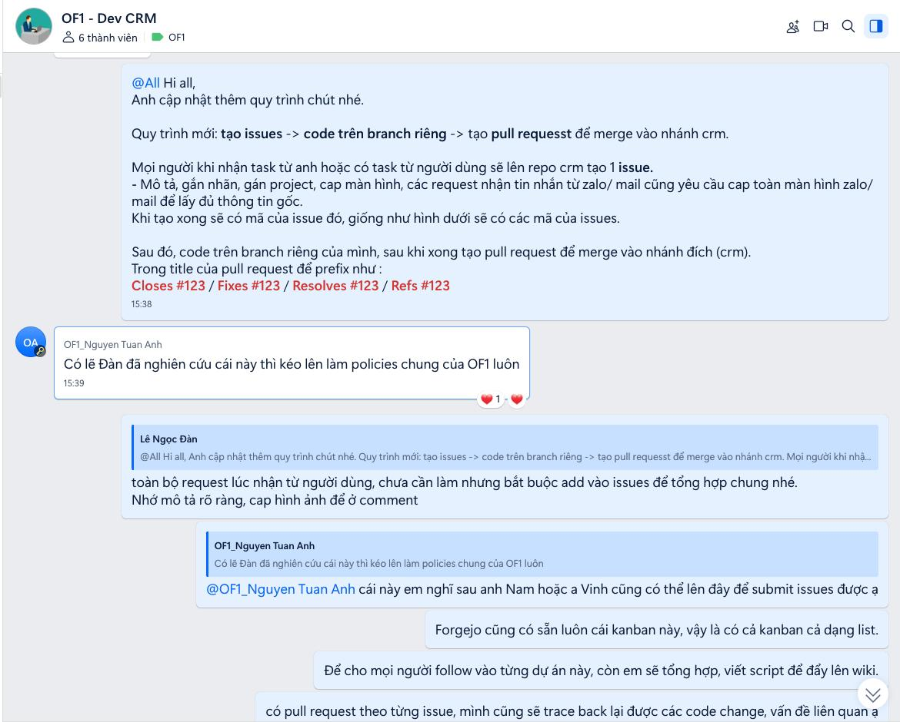

# 2026-02-07 — CRM process: issues → branch → pull request

## Screenshot

## Quick extract (rough)

- Quy trình: tạo **issue** → code trên **branch riêng** → tạo **pull request** merge vào nhánh `crm`.
- Khi nhận request từ user (Zalo/mail/chat): tạo issue, mô tả rõ, gắn nhãn/project, đính kèm screenshot.
- PR title prefix gợi ý: `Closes #123` / `Fixes #123` / `Resolves #123` / `Refs #123`.
