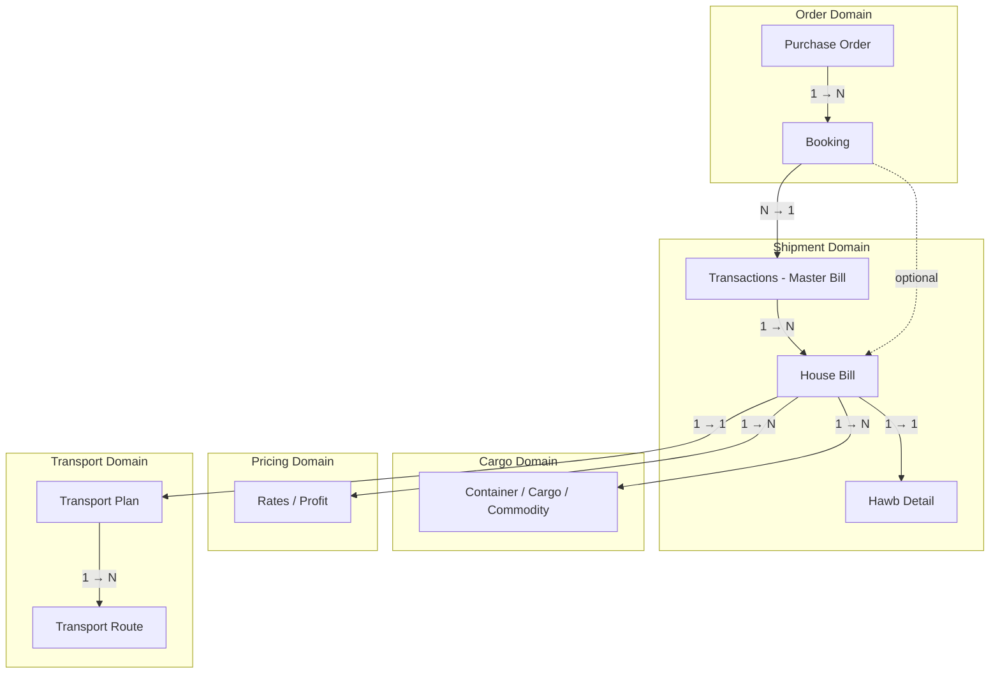
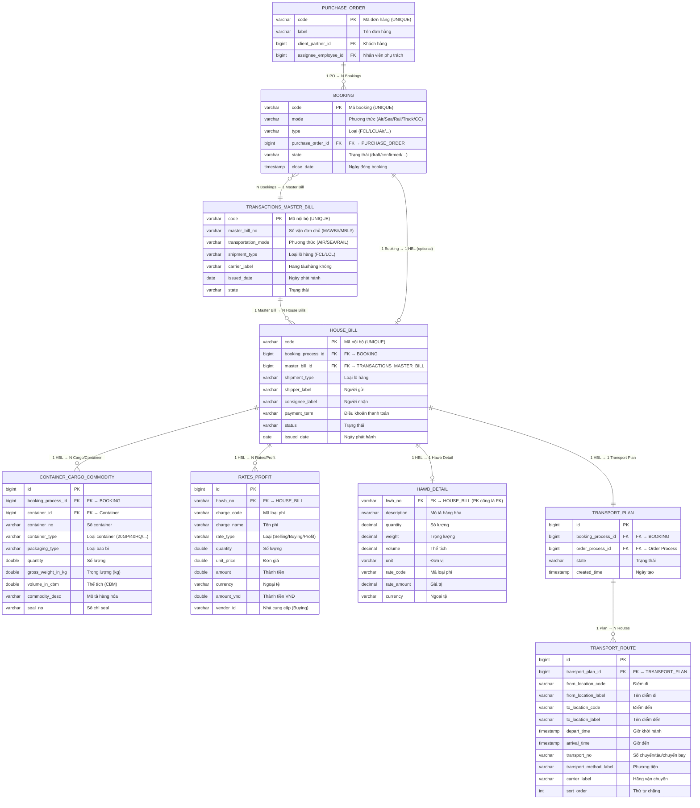

# ERD — BF1 Logistics Management

Sơ đồ Entity Relationship cho các thực thể nghiệp vụ cốt lõi của hệ thống BF1.

> **Nguồn mapping:**
> - Cloud DB (`datatpdb`): `lgc_mgmt_*` tables
> - BEE DB (MSSQL): `Transactions`, `HAWB`, `SellingRate`, `ProfitShares`, v.v.

---

## Sơ đồ Domain Driven Design

---

## Sơ đồ ERD (Mermaid)

---

## Quan hệ chi tiết

| Từ | Đến | Cardinality | Ghi chú |
|---|---|---|---|
| Purchase Order | Booking | 1 → N | 1 PO có nhiều booking theo mode/loại hàng |
| Booking | Transactions (Master Bill) | N → 1 | Nhiều booking gộp vào 1 master bill (consolidation) |
| Transactions (Master Bill) | House Bill | 1 → N | 1 master bill có nhiều house bill |
| Booking | House Bill | 1 → 0..1 | Booking có thể có 1 HBL trực tiếp (tùy luồng) |
| House Bill | Container/Cargo/Commodity | 1 → N | 1 HBL có nhiều cargo/container/commodity |
| House Bill | Rates/Profit | 1 → N | 1 HBL có nhiều dòng phí (selling, buying, profit) |
| House Bill | Hawb Detail | 1 → 1 | Chi tiết in ấn, thông số hàng hóa của HBL |
| House Bill | Transport Plan | 1 → 1 | Mỗi HBL gắn với 1 kế hoạch vận chuyển |
| Transport Plan | Transport Route | 1 → N | 1 kế hoạch có nhiều chặng vận chuyển |

---

## Mapping bảng thực tế

### Cloud DB (`datatpdb` — PostgreSQL)

| Entity (ERD) | Bảng thực tế | Ghi chú |
|---|---|---|
| Purchase Order | `of1_fms_purchase_order` | PK: `id`, UNIQUE: `code` |
| Booking | `of1_fms_booking_process` | FK: `purchase_order_id` |
| Transactions / Master Bill | `of1_fms_air_master_bill` | Mode: Air (MAWB) |
| | `of1_fms_sea_master_bill` | Mode: Sea (MBL) |
| | `of1_fms_rail_master_bill` | Mode: Rail |
| House Bill | `of1_fms_air_house_bill` | Mode: Air (HAWB) |
| | `of1_fms_sea_house_bill` | Mode: Sea FCL/LCL (HBL) |
| | `of1_fms_truck_house_bill` | Mode: Truck |
| | `of1_fms_rail_house_bill` | Mode: Rail |
| | `of1_fms_cc_house_bill` | Mode: Cross-Country |
| Container/Cargo/Commodity | `of1_fms_trackable_cargo` | FK: `booking_process_id`, `container_id` |
| | `of1_fms_trackable_container` | Thông tin container |
| | `of1_fms_booking_process_commodity` | Hàng hóa khai báo trong booking |
| Transport Plan | `of1_fms_transport_plan` | FK: `booking_process_id` |
| | `of1_fms_order_transport_plan` | Kế hoạch theo order |
| | `of1_fms_master_bill_transport_plan` | Kế hoạch theo master bill |
| Transport Route | `of1_fms_transport_route` | FK: `order_transport_plan_id` |

### BEE DB (BFS One — MSSQL)

| Entity (ERD) | Bảng thực tế | Ghi chú |
|---|---|---|
| Booking | `BookingLocal` | PK: `BkgID`; FK: `ConformJobNo` → Transactions |
| Transactions (Master Bill) | `Transactions` | PK: `TransID` |
| House Bill | `HAWB` | PK: `HWBNO`; FK: `TRANSID` |
| Hawb Detail | `HAWBDETAILS` | FK: `HWBNO` — chi tiết hàng hóa |
| | `HAWBRATE` | FK: `HWBNO` — giá theo vận đơn |
| Container/Cargo | `ContainerListOnHBL` | FK: `HBLNo` → HAWB |
| | `ContainerLoadedHBL` | Container đã đóng hàng |
| Rates/Profit | `SellingRate` | FK: `HAWBNO` — giá bán |
| | `BuyingRateWithHBL` | FK: `HAWBNO` — giá mua |
| | `ProfitShares` | FK: `HAWBNO` — chia lợi nhuận |
| | `OtherChargeDetail` | FK: `HBL` — phí khác |
