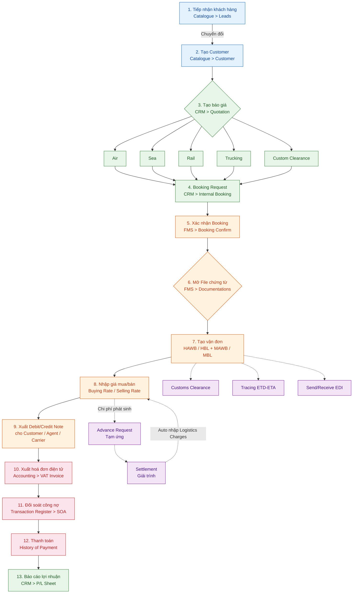
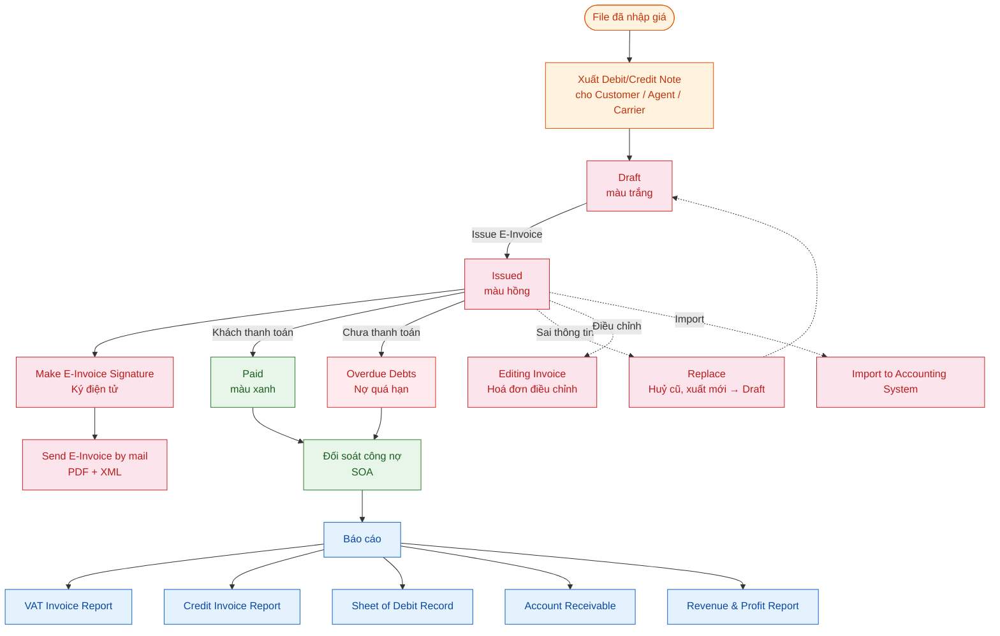
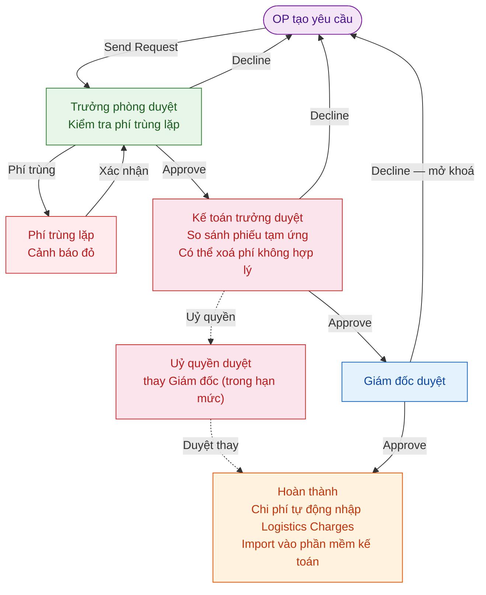

# ERP Analysis — OF1 Freight Management System

**Purpose:** Tài liệu phân tích toàn bộ nghiệp vụ và đặc tả tính năng của hệ thống OF1 FMS.

---

## 1. System Overview

### 1.1 Các ứng dụng trong hệ thống

| App | Mô tả |
|-----|-------|
| **Catalogue** | Master Data — đối tác, cảng, container, danh mục |
| **CRM** | Sales Executive — báo giá, đặt chỗ, internal booking |
| **FMS** | Documentations — chứng từ, vận đơn, giá mua/bán, invoice |
| **Accounting** | Accounting — hoá đơn điện tử, công nợ, tạm ứng, báo cáo |

### 1.2 Luồng dữ liệu giữa các app

---

## 2. Business Process Flows

### 2.1 Vòng đời lô hàng (Shipment Lifecycle — 13 bước)

---

### 2.2 Invoice Flow

---

### 2.3 Settlement Flow (Duyệt tạm ứng / giải trình — 3 cấp)

---

## 3. Catalogue Module

Catalogue là nền tảng master data của toàn hệ thống. Tất cả module đều tham chiếu dữ liệu từ đây.

| Nhóm | Tên | Vai trò / Đặc điểm | Comment |
|------|-----|--------------------|---------|
| **Hệ thống** | Departments | Phân quyền nội bộ — Admin only, theo chi nhánh | Chuyển function về HRM |
| | Container List | Container với ISO code, trọng lượng, kích thước | Cân nhắc bỏ |
| | Shipment Type Warning | Hàng hoá đặc biệt (nguy hiểm, đông lạnh, ...) | Cần làm rõ, review lại nghiệp vụ |
| | Transaction Task List | Danh sách giao dịch / công việc hệ thống | Cân nhắc bỏ |
| **Địa lý** | Country | Quốc gia — mã ISO 3166, tiền tệ mặc định, định dạng địa chỉ | |
| | Country Group | Nhóm quốc gia (ASEAN, EU, ...) — hỗ trợ phân cấp | |
| | Zone | Khu vực vận chuyển (Global, VN North, ...) | |
| | Location State | Tỉnh / Bang — mã hành chính, FK → Country | |
| | Location District | Huyện / Quận — FK → State | |
| | Location Subdistrict | Phường / Xã — FK → District | |
| | Location | Địa điểm — Airport, Port, KCN (IATA, UN/LOCODE) | Gộp chung Location - Master Data |
| | Port Index | Cảng biển và hàng không theo chuẩn UNECE | Gộp chung Location - Master Data |
| | Port Index Trucking | Cảng chuyên dùng cho trucking nội địa | Gộp chung Location - Master Data |
| **Đối tác** | Leads | Khách hàng tiềm năng — chuyển đổi 1-1 thành Customer | Chuyển function về CRM; chuyển đổi 1-1, giữ nguyên lịch sử liên lạc |
| | Customer | Khách hàng thực tế — trung tâm Quotation / File / Invoice | Chuyển function về CRM |
| | Shipper | Người gửi hàng — xuất hiện trên vận đơn | Chuyển function về CRM |
| | Consignee | Người nhận hàng — xuất hiện trên vận đơn | Chuyển function về CRM |
| | Carrier | Hãng tàu / hãng bay — vận chuyển thực tế | Chuyển function về CRM |
| | Agents | Đại lý nước ngoài — có `priority` (1–8) và `association_group` | Chuyển function về CRM; gợi ý theo priority 1–8 khi mở file |
| | Other Contacts | Hải quan, kho bãi, ... — liên hệ không thuộc nhóm trên | Chuyển function về CRM |
| | Industry | Ngành nghề đối tác — Manufacturing, Logistics, ... | Chuyển function về CRM |
| | Partner Source | Nguồn đối tác / mạng lưới forwarder — WCA, WPA | Chuyển function về CRM |
| | Custom List | Chi cục hải quan — mã, tỉnh, đội thủ tục | |
| | Partner | Đối tác / Khách hàng — category, group, scope, tax, bank | ac_ref: gom công nợ theo nhóm khi xuất SOA; status=Warning: ngăn tạo file mới |
| **Other** | Currency | Tiền tệ — mã ISO 4217, ký hiệu, số thập phân | |
| | Currency Exchange Rate | Tỷ giá theo thời kỳ — nguồn SBV / manual | |
| | Unit Group | Nhóm đơn vị đo (weight, volume, quantity) | |
| | Unit | Đơn vị đo — mã ISO, tỷ lệ quy đổi (kg, cbm, ...) | |
| | Commodity | Loại hàng hóa — HS code, cờ hàng nguy hiểm | |
| | Bank | Ngân hàng — mã SWIFT, FK → Country | |
| | Name Fee Description | Danh mục tên phí | |

---

## 4. Sales Executive Module

Quản lý toàn bộ quy trình kinh doanh: từ nhập cơ sở dữ liệu giá, lập báo giá, gửi cho khách hàng, đặt chỗ, đến gửi Internal Booking sang Documentations.

### Price Database (Cơ sở dữ liệu giá)

Lưu giá gốc từ nhà cung cấp để Sales dùng khi lập báo giá.

#### Database of AirFreight, SeaFreight, Trucking Pricing -> từ CRM.

#### Vessel Schedules (Lịch tàu)

> **Note:** CRM chưa có tính năng này.

Nhập lịch tàu từ hãng tàu. Tham chiếu khi báo giá Sea và tư vấn khách về ETD/ETA.

| Field | Kiểu | Mô tả |
|-------|------|-------|
| `line` | varchar | Tên hải trình |
| `pol` / `pod` | FK Port | Cảng đi / Cảng đến |
| `etd` / `eta` | date | Ngày dự kiến khởi hành / đến |
| `etd_transship` / `eta_transship` | date | ETD/ETA tại cảng chuyển tải |
| `vessel` / `vessel_no` | varchar | Tên tàu / Số hiệu hải trình |
| `is_active` | boolean | Đang hoạt động |

**Entity:** `of1_fms_vessel_schedule`

### Quotation, Booking & Request Management

Sales lập báo giá → khách confirm → đặt chỗ → tạo Service Request gửi sang Docs → Docs approve mở file hoặc decline trả lại.

**Tính năng:**

| Tính năng | Nhóm | Mô tả | Comment |
|-----------|------|-------|---------|
| Quotation | Báo giá | Tạo / chỉnh sửa / xóa / copy. Print Preview 5 dạng. Gửi Internal Booking (Draft → Sent). Re-send / Send Mail | |
| AirFreight Booking Request | Booking | Gửi yêu cầu đặt chỗ đến hãng bay / co-loader | Gộp chung thành 1 bảng Booking Request |
| AirFreight Booking Confirm | Booking | Xác nhận từ hãng bay — MAWB, HAWB, chuyến bay thực tế | Gộp chung thành 1 bảng Booking Request |
| Sea Booking Acknowledgement | Booking | Acknowledge booking đường biển từ co-loader / hãng tàu | Gộp chung thành 1 bảng Booking Request |
| Logistics Service Request | Request | Handover Sales → Docs. Tạo từ Quotation hoặc thủ công. Docs Approve → mở file / Decline → trả lại | Gộp chung thành 1 bảng Booking Request |
| Inland Trucking Request | Request | Tương tự Logistics Service Request, chuyên cho trucking nội địa | Gộp chung thành 1 bảng Booking Request |
| Freight Shipment Management | Request | Danh sách lô hàng đang vận chuyển — Sales theo dõi tiến độ sau handover | Gộp chung thành 1 bảng Booking Request |
| Internal Booking Request Management | Request | Tổng quan tất cả Internal Booking chưa approve, phân theo tháng — re-send | Gộp chung thành 1 bảng Booking Request |
| P/L Sheet | Request | `P/L = Selling Rate − Costing Rate` quy đổi về nội tệ | |

**Trạng thái Booking Request:** `Wait` → `Approved` / `Declined`

| Field | Kiểu | Mô tả |
|-------|------|-------|
| `request_no` | varchar | Số yêu cầu (auto-gen) |
| `revision` | int | Lần sửa đổi |
| `salesman_id` | FK | Nhân viên kinh doanh |
| `customer_id` | FK | Khách hàng |
| `type_of_service` | varchar | Air / Sea / Trucking / Logistics |
| `service_type_direction` | varchar | Export / Import |
| `pol` / `pod` | varchar | Cảng đi / Cảng đến |
| `etd` / `eta` | date | Ngày dự kiến |
| `status` | varchar | Wait / Approved / Declined |
| `costing_lines` | table | Giá mua |
| `selling_lines` | table | Giá bán |

---

## 5. Documentations Module

Nhận Internal Booking từ Sales → mở file → tạo vận đơn → nhập giá → xuất Debit/Credit Note.
"File" (Transaction) là thực thể trung tâm của toàn hệ thống.

### 5.2 Shared Components (dùng chung cho tất cả loại đơn hàng)

#### Costing Rate (Giá mua)
→ ERD mapping: `of1_fms_hawb_rates` với `rate_type = 'Credit'`

Phí công ty phải trả cho nhà cung cấp (co-loader, hãng tàu, hãng bay, customs agent).

#### Selling Rate (Giá bán)

→ ERD mapping: `of1_fms_hawb_rates` với `rate_type = 'Debit'`

Phí khách hàng trả cho công ty. Cấu trúc tương tự Costing Rate.

#### Invoice & Debit/Credit Note

Docs xuất Invoice từ Selling Rate → theo dõi thanh toán.

**Màu trạng thái đơn hàng:**

| Màu | Trạng thái |
|-----|-----------|
| Trắng | Chưa nhập giá |
| Hồng nhạt | Đã xuất Debit, chưa thanh toán |
| Xanh lá | Đã xuất Invoice / Debit / Credit |
| Đỏ | Thu chi xong hết |
| Xanh nước biển | Gợi ý giá (lô đã qua cảng) |

#### Customs Clearance

Theo dõi tờ khai hải quan. Gắn với OPS cho Logistics/Trucking.

#### Task Notes

Ghi chú công việc theo file. Gán cho OPS Staff với deadline và trạng thái.

#### EDI (Electronic Data Interchange)

Gửi/nhận dữ liệu điện tử với hãng tàu, cảng, hải quan.

#### Shipping Instruction (SI)

Hướng dẫn vận chuyển gửi co-loader / hãng tàu. Print Preview để gửi email.

---

### 5.3 Các loại đơn hàng (11 loại)

| Loại | Hướng | Phương thức | Đặc điểm |
|------|-------|-------------|----------|
| Express | Xuất | Chuyên phát nhanh | Đơn giản nhất, ít fields |
| Outbound Air | Xuất | Hàng không | MAWB + HAWB, Print 2 dạng |
| Inbound Air | Nhập | Hàng không | + Arrival Notice, Authorized Letter, DO |
| LCL Outbound Sea | Xuất | Biển lẻ | HBL 15+ loại in, Extract E-Manifest |
| LCL Inbound Sea | Nhập | Biển lẻ | + Arrival Notice, DO |
| FCL Outbound Sea | Xuất | Biển nguyên cont | + Container info (No, Type, Seal, GW/CBM) |
| FCL Inbound Sea | Nhập | Biển nguyên cont | + Arrival Notice, DO |
| Outbound Sea Consol | Xuất | Gom hàng biển | Nhiều HBL → 1 MBL |
| Inbound Sea Consol | Nhập | Gom hàng biển | Nhiều HBL → 1 MBL |
| Inland Trucking | Nội địa | Xe tải | Truck Type, From/To, CDS No. |
| Logistics | Phức hợp | Thông quan | CDS No/Date, Selectivity, Customs Agency |

→ ERD mapping: `of1_fms_transactions` (Master Bill) + `of1_fms_house_bill` (House Bill)

---

### 5.4 Cross-cutting Functions

| Chức năng | Mô tả |
|-----------|-------|
| Tracing ETD/ETA | Theo dõi ngày thực tế vs dự kiến, alert khi trễ |
| Change Salesman / Partner | Thay đổi nhân sự / đối tác trên file đang tồn tại, có audit trail |
| Send/Receive EDI Local | Gửi/nhận manifest điện tử với cảng, hải quan |
| Warehouse Management | Nhập/xuất kho, quản lý vị trí lưu trữ |
| CFS Inbound | Quản lý hàng nhập tại Container Freight Station |
| OPS Management | Dashboard task cho nhân viên OPS: danh sách, deadline, trạng thái |
| Customs Clearance List | Danh sách tờ khai hải quan theo kỳ, filter theo loại/nhân viên |

---

## 6. Accounting Module

### 6.1 Vai trò

Quản lý toàn bộ tài chính: từ xuất hoá đơn điện tử, đối soát công nợ, xử lý tạm ứng/giải trình, đến báo cáo tài chính. Đây là điểm kết thúc của vòng đời lô hàng.

### 6.2 Nhóm A — VAT Invoice (Hoá đơn điện tử)

#### New VAT Invoice

Tạo hoá đơn từ Debit/Credit Note của file.

**Luồng tạo:**
1. Chọn Accounting > New VAT Invoice
2. Add from list → chọn KH / File → Filter → tick chi phí → OK
3. Kiểm tra → Save

**Vòng đời:**

| Trạng thái | Màu | Hành động có thể thực hiện |
|------------|-----|---------------------------|
| Draft | Trắng | Issue E-Invoice |
| Issued | Hồng | Sign (ký điện tử), Send Mail (PDF + XML), Replace, Editing Invoice, Import to Acc System |
| Paid | Xanh | Đối soát SOA |
| Cancelled | Xám | Bị huỷ (sau Replace) |

#### VAT Invoice Management

Danh sách và quản lý tất cả hoá đơn đã phát hành. Filter theo kỳ, khách hàng, trạng thái.

---

### 6.3 Nhóm B — Quản lý công nợ

| Tính năng | Mô tả |
|-----------|-------|
| **Accounting Management** | Phiếu thu / phiếu chi — ghi nhận dòng tiền thực tế |
| **Transaction Register** | Trung tâm đối soát công nợ — gom tất cả Debit/Credit theo khách |
| **Statement of Account (SOA)** | Báo cáo công nợ tổng hợp gửi khách hàng theo kỳ |
| **Account Receivable** | Công nợ phải thu — theo dõi tiền khách chưa trả |
| **Overdue Debts** | Cảnh báo nợ quá hạn — filter theo số ngày trễ |

**Entity:**

| Entity | Mô tả |
|--------|-------|
| `INVOICE` | `invoice_no`, `job_id`, `customer_id`, `amount`, `vat`, `status` (Draft/Issued/Paid/Cancelled), `type` (VAT/Debit/Credit) |
| `SOA` | `soa_no`, `customer_id`, `from_date`, `to_date`, `total_amount`, `status` (Open/Paid/Partial) |

---

### 6.4 Nhóm C — Tạm ứng & Giải trình

| Tính năng | Mô tả |
|-----------|-------|
| **Advance Request** | OP tạo yêu cầu tạm ứng tiền mặt cho chi phí vận hành |
| **History of Payment** | Lịch sử giải trình đã hoàn thành |
| **Payment Request Control** | Kiểm soát các yêu cầu thanh toán đang chờ duyệt |
| **Shipment Payment Control** | Kiểm soát thanh toán theo file lô hàng |

**Quy trình duyệt 3 cấp:** (xem Section 2.3)

**Business rules:**
- Trưởng phòng: cảnh báo đỏ nếu phí trùng lặp với file khác
- Kế toán trưởng: có thể xoá chi phí không hợp lý, có thể uỷ quyền duyệt thay Giám đốc trong hạn mức
- Giám đốc Decline: mở khoá để OP chỉnh sửa (không xoá record)
- Sau khi approve xong: chi phí tự động nhập vào Logistics Charges của file

**Entity:**

| Entity | Mô tả |
|--------|-------|
| `ADVANCE_REQUEST` | `id`, `creator`, `amount`, `request_date`, `status` (Pending/Approved/Cleared) |
| `SETTLEMENT` | `id`, `advance_id`, `job_id`, `amount`, `status`, `approved_by_manager`, `approved_by_accountant`, `approved_by_director` |

---

### 6.5 Nhóm D — Reports & Financial Planning

| Báo cáo | Mô tả |
|---------|-------|
| **VAT Invoice Report** | Tổng hợp hoá đơn VAT theo kỳ |
| **Credit Invoice Report** | Báo cáo hoá đơn điều chỉnh / credit |
| **Sheet of Debit Record** | Danh sách Debit Note đã phát hành |
| **Account Receivable Report** | Công nợ phải thu theo khách hàng |
| **Revenue & Profit Report** | Doanh thu và lợi nhuận tổng hợp |
| **Financial Planning** | Kế hoạch thu chi — Payment-Receivable Planning |
| **Bank Transaction History** | Biến động tài khoản ngân hàng |

---

## 7. User Roles & Permissions

| Vai trò | Quyền hạn chính |
|---------|----------------|
| **Admin** | Toàn quyền hệ thống, quản trị phân quyền, đa chi nhánh |
| **Giám đốc** | Duyệt tạm ứng/giải trình cấp cao nhất, uỷ quyền cho KTT |
| **Kế toán trưởng** | Duyệt tài chính, uỷ quyền duyệt thay Giám đốc trong hạn mức |
| **Trưởng phòng** | Duyệt nghiệp vụ, ký Settlement |
| **Salesman** | Quản lý KH, báo giá, booking, xem P/L Sheet |
| **Nhân viên chứng từ** | Mở file, tạo vận đơn, nhập giá, xuất Debit/Credit, approve Internal Booking |
| **Kế toán** | Xuất hoá đơn VAT, quản lý công nợ, báo cáo tài chính |
| **Nhân viên OP** | Tạm ứng, giải trình, trucking request |

---
