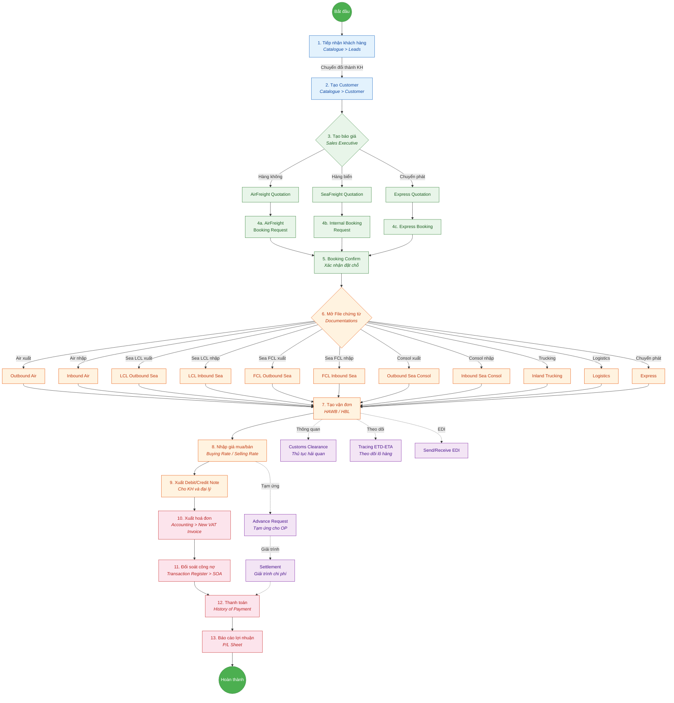
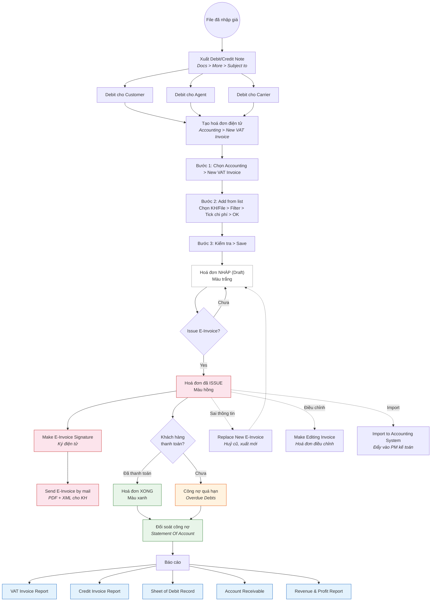
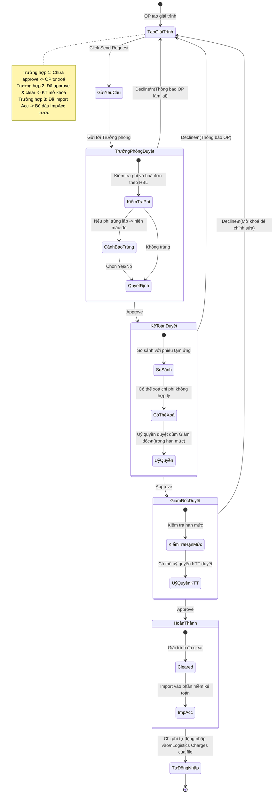
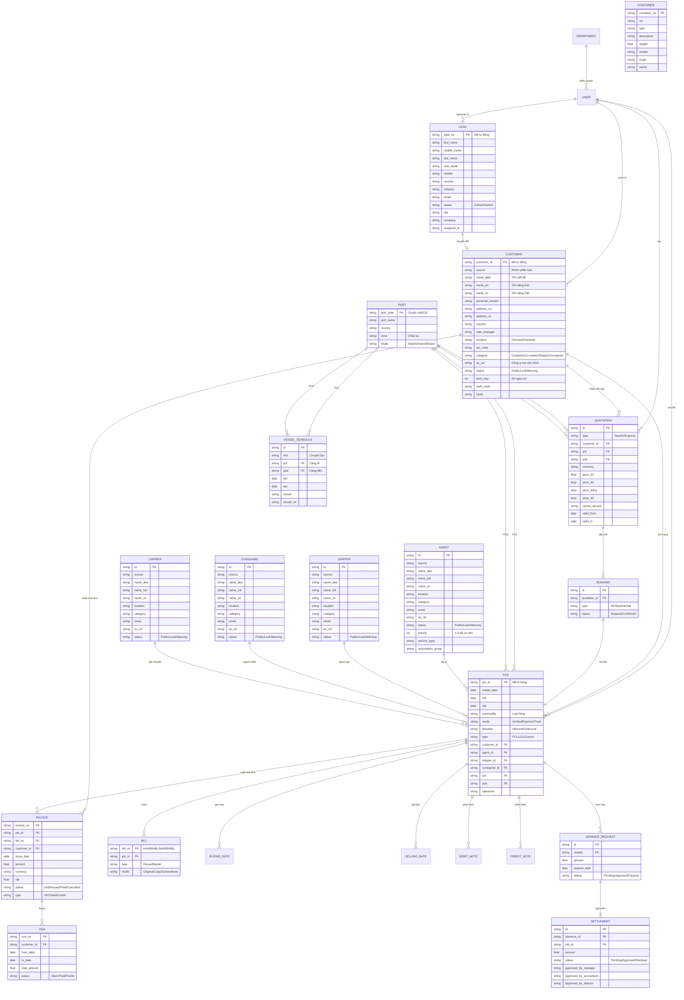
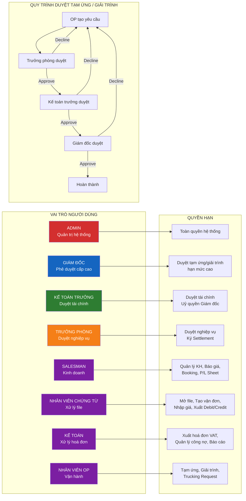

# Phân tích Dự án OF1 - Freight Management System

## 1. Tổng quan hệ thống

OF1 (OpenFreightOne) là một hệ thống quản lý vận tải hàng hoá (Freight Management System) được thiết kế cho các công ty giao nhận vận tải quốc tế (Freight Forwarder) tại Việt Nam. Hệ thống bao phủ toàn bộ quy trình nghiệp vụ từ tiếp nhận khách hàng, báo giá, đặt chỗ, quản lý chứng từ, xuất hoá đơn, đến đối soát công nợ và báo cáo tài chính.

Hệ thống được chia thành **4 module chính**:

- **Catalogue** - Quản lý danh mục dữ liệu gốc (master data)
- **Sales Executive** - Quản lý kinh doanh, báo giá và đặt chỗ
- **Documentations** - Quản lý chứng từ và vận hành lô hàng
- **Accounting** - Kế toán, hoá đơn và báo cáo tài chính

### Kiến trúc tổng thể hệ thống

```mermaid
graph TB
    subgraph OF1["HỆ THỐNG PHẦN MỀM OF1 - Freight Management System"]
        direction TB

        subgraph MOD_CAT["II. CATALOGUE - Danh mục dữ liệu"]
            CAT_DEPT["Departments<br/>Phân quyền quản trị"]
            CAT_LEADS["Leads<br/>Khách hàng tiềm năng"]
            CAT_CUST["Customer<br/>Khách hàng"]
            CAT_SHIP["Shipper List<br/>Nhà vận chuyển"]
            CAT_CONS["Consignee List<br/>Người nhận hàng"]
            CAT_CARR["Carrier List<br/>Co-loader"]
            CAT_AGENT["Agents<br/>Đại lý"]
            CAT_OTHER["Other Contacts<br/>Liên hệ khác"]
            CAT_PORT["Port Index<br/>Danh mục cảng"]
            CAT_CONT["Container List<br/>Danh sách container"]
            CAT_TRUCK["Port Index Trucking"]
            CAT_WARN["Shipment Type Warning<br/>Hàng cảnh báo"]
            CAT_TASK["Transaction Task List"]
        end

        subgraph MOD_SALE["III. SALES EXECUTIVE - Kinh doanh"]
            SALE_VESSEL["Vessel Schedules<br/>Lịch tàu"]
            SALE_DB_AIR["DB AirFreight Pricing"]
            SALE_DB_EXP["DB Express Pricing"]
            SALE_DB_SEA["DB SeaFreight Pricing"]
            SALE_QUO_AIR["AirFreight Quotation<br/>Báo giá hàng không"]
            SALE_QUO_EXP["Express Quotation<br/>Báo giá chuyển phát"]
            SALE_QUO_SEA["SeaFreight Quotation<br/>Báo giá hàng biển"]
            SALE_BOOK_REQ["AirFreight Booking Request"]
            SALE_BOOK_CFM["AirFreight Booking Confirm"]
            SALE_LOG_REQ["Logistics Service Request"]
            SALE_TRUCK_REQ["Inland Trucking Request"]
            SALE_FREIGHT["Freight Shipment Mgmt"]
            SALE_SEA_ACK["Sea Booking Acknowledgement"]
            SALE_INT_BOOK["Internal Booking Request"]
            SALE_INQUIRY["Service Inquiry"]
            SALE_PL["P/L Sheet<br/>Lợi nhuận / Lỗ"]
        end

        subgraph MOD_DOCS["V. DOCUMENTATIONS - Chứng từ"]
            DOCS_EXPRESS["Express<br/>Chuyển phát nhanh"]
            DOCS_AIR_OUT["Outbound Air<br/>Xuất hàng không"]
            DOCS_AIR_IN["Inbound Air<br/>Nhập hàng không"]
            DOCS_LCL_OUT["LCL Outbound Sea<br/>LCL xuất biển"]
            DOCS_LCL_IN["LCL Inbound Sea<br/>LCL nhập biển"]
            DOCS_FCL_OUT["FCL Outbound Sea<br/>FCL xuất biển"]
            DOCS_FCL_IN["FCL Inbound Sea<br/>FCL nhập biển"]
            DOCS_CONSOL_OUT["Outbound Sea Consol<br/>Consol xuất"]
            DOCS_CONSOL_IN["Inbound Sea Consol<br/>Consol nhập"]
            DOCS_TRUCK["Inland Trucking<br/>Giao nhận nội địa"]
            DOCS_LOG["Logistics"]
            DOCS_WH["Warehouse Mgmt<br/>Quản lý kho"]
            DOCS_CFS["CFS Inbound"]
            DOCS_OPS["OPS Management"]
            DOCS_CUSTOMS["Customs Clearance"]
            DOCS_TRACE["Tracing ETD-ETA"]
            DOCS_EDI["EDI Local"]
        end

        subgraph MOD_ACC["IV. ACCOUNTING - Kế toán"]
            ACC_VAT_NEW["New VAT Invoice<br/>Tạo hoá đơn điện tử"]
            ACC_VAT_MGT["VAT Invoice Management"]
            ACC_MGMT["Accounting Management<br/>Phiếu thu/chi"]
            ACC_TRANS["Transaction Register<br/>Công nợ"]
            ACC_ADV["Advance Request<br/>Tạm ứng"]
            ACC_PAY["History of Payment<br/>Giải trình"]
            ACC_PAY_CTRL["Payment Request Control"]
            ACC_SHIP_PAY["Shipment Payment Control"]
            ACC_CREDIT["Credit Invoice Report"]
            ACC_DEBIT["Sheet of Debit Record"]
            ACC_REPORT["VAT Invoice Report"]
            ACC_AR["Account Receivable<br/>Công nợ phải thu"]
            ACC_OD["Overdue Debts<br/>Nợ quá hạn"]
            ACC_FP["Financial Planning<br/>Kế hoạch tài chính"]
        end
    end

    %% Quan hệ liên module
    CAT_LEADS -->|"Chuyển đổi"| CAT_CUST
    CAT_CUST -->|"Tạo báo giá"| SALE_QUO_SEA
    CAT_CUST -->|"Tạo báo giá"| SALE_QUO_AIR
    CAT_AGENT -->|"Chọn đại lý"| DOCS_AIR_OUT
    CAT_PORT -->|"POL/POD"| SALE_QUO_SEA
    CAT_PORT -->|"POL/POD"| DOCS_FCL_OUT

    SALE_QUO_SEA -->|"Booking"| SALE_INT_BOOK
    SALE_QUO_AIR -->|"Booking"| SALE_BOOK_REQ
    SALE_BOOK_REQ -->|"Confirm"| SALE_BOOK_CFM
    SALE_INT_BOOK -->|"Mở file"| DOCS_FCL_OUT
    SALE_INT_BOOK -->|"Mở file"| DOCS_AIR_OUT

    DOCS_AIR_OUT -->|"Xuất hoá đơn"| ACC_VAT_NEW
    DOCS_FCL_OUT -->|"Xuất hoá đơn"| ACC_VAT_NEW
    ACC_VAT_NEW -->|"Quản lý"| ACC_VAT_MGT
    ACC_TRANS -->|"SOA"| ACC_AR
    ACC_ADV -->|"Giải trình"| ACC_PAY

    classDef catStyle fill:#E3F2FD,stroke:#1565C0,color:#0D47A1
    classDef saleStyle fill:#E8F5E9,stroke:#2E7D32,color:#1B5E20
    classDef docsStyle fill:#FFF3E0,stroke:#E65100,color:#BF360C
    classDef accStyle fill:#FCE4EC,stroke:#C62828,color:#B71C1C

    class CAT_DEPT,CAT_LEADS,CAT_CUST,CAT_SHIP,CAT_CONS,CAT_CARR,CAT_AGENT,CAT_OTHER,CAT_PORT,CAT_CONT,CAT_TRUCK,CAT_WARN,CAT_TASK catStyle
    class SALE_VESSEL,SALE_DB_AIR,SALE_DB_EXP,SALE_DB_SEA,SALE_QUO_AIR,SALE_QUO_EXP,SALE_QUO_SEA,SALE_BOOK_REQ,SALE_BOOK_CFM,SALE_LOG_REQ,SALE_TRUCK_REQ,SALE_FREIGHT,SALE_SEA_ACK,SALE_INT_BOOK,SALE_INQUIRY,SALE_PL saleStyle
    class DOCS_EXPRESS,DOCS_AIR_OUT,DOCS_AIR_IN,DOCS_LCL_OUT,DOCS_LCL_IN,DOCS_FCL_OUT,DOCS_FCL_IN,DOCS_CONSOL_OUT,DOCS_CONSOL_IN,DOCS_TRUCK,DOCS_LOG,DOCS_WH,DOCS_CFS,DOCS_OPS,DOCS_CUSTOMS,DOCS_TRACE,DOCS_EDI docsStyle
    class ACC_VAT_NEW,ACC_VAT_MGT,ACC_MGMT,ACC_TRANS,ACC_ADV,ACC_PAY,ACC_PAY_CTRL,ACC_SHIP_PAY,ACC_CREDIT,ACC_DEBIT,ACC_REPORT,ACC_AR,ACC_OD,ACC_FP accStyle
```



---

## 2. Phân tích từng Module

### 2.1 Catalogue - Nền tảng dữ liệu gốc

Module này là nền tảng cho toàn bộ hệ thống, quản lý toàn bộ đối tượng tham gia vào quy trình giao nhận.

**Quản lý đối tác (8 nhóm):**

| Đối tượng | Vai trò | Đặc điểm |
|-----------|---------|----------|
| Departments | Phân quyền nội bộ | Admin only, phân quyền theo chi nhánh |
| Leads | Khách hàng tiềm năng | Có thể chuyển đổi thành Customer |
| Customer | Khách hàng thực tế | Trung tâm của toàn bộ giao dịch |
| Shipper | Người gửi hàng | Xuất hiện trên vận đơn |
| Consignee | Người nhận hàng | Xuất hiện trên vận đơn |
| Carrier | Hãng tàu/hãng bay | Vận chuyển thực tế |
| Agents | Đại lý | Đại diện tại nước ngoài |
| Other Contacts | Liên hệ khác | Hải quan, kho bãi, ... |

**Danh mục hệ thống (5 loại):**

- Port Index: Danh mục cảng biển, cảng hàng không theo chuẩn UNECE
- Container List: Danh sách container với ISO code, trọng lượng, kích thước
- Port Index Trucking: Cảng chuyên dùng cho trucking nội địa
- Shipment Type Warning: Hàng hoá đặc biệt (hàng nguy hiểm, ...)
- Transaction Task List: Danh sách giao dịch/công việc

**Nhận xét:**
- Cấu trúc đối tác (mục 3-8) sử dụng chung các trường: source, name_aka, name_full, name_vn, location, category, email, ac_ref, status
- Trường "ac_ref" dùng để liên kết công ty mẹ cho báo cáo SOA - thiết kế này giúp gom công nợ theo nhóm công ty
- Trường "status" có 3 trạng thái: Public / Lock / Warning - cho phép kiểm soát đối tác có vấn đề
- Agent có thêm trường "priority" (1-8) và "association_group" - cho thấy hệ thống hỗ trợ lựa chọn đại lý theo độ ưu tiên

### 2.2 Sales Executive - Kinh doanh & Báo giá

Module này quản lý toàn bộ quy trình từ báo giá đến đặt chỗ, bao gồm 16 chức năng chính.

**Quy trình chính:**

```
Database Giá -> Báo giá -> Đặt chỗ (Booking) -> Xác nhận -> Mở file
```

**Database Giá (3 loại):**
- AirFreight Pricing: Giá từ hãng hàng không
- SeaFreight Pricing: Giá từ hãng tàu
- Express Pricing: Giá từ nhà thầu phụ

**Báo giá (Quotation):** Hệ thống hỗ trợ 3 loại báo giá tương ứng với 3 phương thức vận chuyển. Mỗi báo giá chứa: customer, POL/POD, currency, giá theo loại container (20/40/40HQ/45), thời gian hiệu lực.

**Booking:** Chia thành 2 nhánh:
- AirFreight: Booking Request -> Booking Confirm (2 bước riêng biệt)
- Sea/Internal: Internal Booking Request (1 bước, đơn giản hơn)

**P/L Sheet:** Báo cáo lợi nhuận/lỗ của từng lô hàng - kết nối trực tiếp từ Selling Rate và Buying Rate trên file.

**Nhận xét:**
- Vessel Schedules là feature quan trọng giúp Sales có dữ liệu lịch tàu để tư vấn khách hàng
- Quy trình Air phức tạp hơn Sea (2 bước booking vs 1 bước) - phản ánh thực tế ngành freight forwarding
- Service Inquiry cho phép yêu cầu chỉnh sửa giá mua - có quy trình duyệt riêng
- P/L Sheet là điểm kết nối giữa module Sales và Accounting

### 2.3 Documentations - Vận hành & Chứng từ

Đây là module lớn nhất với 20 chức năng, quản lý toàn bộ chứng từ cho các loại lô hàng.

**Phân loại lô hàng (11 loại):**

| Loại | Hướng | Phương thức |
|------|-------|-------------|
| Express | Xuất | Chuyển phát nhanh |
| Outbound Air | Xuất | Hàng không |
| Inbound Air | Nhập | Hàng không |
| LCL Outbound Sea | Xuất | Đường biển lẻ |
| LCL Inbound Sea | Nhập | Đường biển lẻ |
| FCL Outbound Sea | Xuất | Đường biển nguyên cont |
| FCL Inbound Sea | Nhập | Đường biển nguyên cont |
| Outbound Sea Consol | Xuất | Gom hàng đường biển |
| Inbound Sea Consol | Nhập | Gom hàng đường biển |
| Inland Trucking | Nội địa | Xe tải |
| Logistics | Phức hợp | Dịch vụ logistics |

**Các thành phần chung của mỗi file:**

Mỗi file lô hàng đều có các thành phần:
- Thông tin cơ bản: Job ID, Customer, Agent, Shipper, Consignee, POL/POD, ETD/ETA
- Vận đơn: HAWB/HBL (House Bill) và MAWB/MBL (Master Bill)
- Giá mua/bán: Buying Rate, Selling Rate
- Debit/Credit Note: Xuất cho Customer, Agent, Carrier
- Logistics Charges: Chi phí vận hành
- Container chi tiết (đối với hàng biển FCL)

**Chức năng bổ trợ:**
- Warehouse Management: Quản lý kho hàng
- CFS Inbound: Quản lý hàng nhập kho CFS
- OPS Management: Điều phối vận hành
- Customs Clearance: Thủ tục hải quan
- Tracing ETD-ETA: Theo dõi lô hàng theo thời gian thực
- EDI Local: Trao đổi dữ liệu điện tử với các bên
- Task Notes: Ghi chú/nhắc nhở theo file

**Nhận xét:**
- Cấu trúc "File" là trung tâm của toàn bộ hệ thống - mọi giao dịch đều xoay quanh File
- Hệ thống hỗ trợ cả Inbound (nhập) và Outbound (xuất) cho mọi phương thức
- Sea Consol (gom hàng) là loại phức tạp nhất - liên kết nhiều HBL vào 1 MBL
- Chức năng "Change Salesman/Partner in file" cho thấy có nhu cầu chuyển đổi nhân sự phụ trách
- EDI là điểm kết nối với hệ thống bên ngoài (customs, hãng tàu, ...)

### 2.4 Accounting - Kế toán & Tài chính

Module này gồm 22 chức năng, chia thành các nhóm:

**Hoá đơn điện tử (VAT Invoice):**
- Tạo hoá đơn từ Debit/Credit Note của file
- Vòng đời: Draft (trắng) -> Issued (hồng) -> Paid (xanh)
- Hỗ trợ: Issue, Sign (ký điện tử), Send by mail (PDF + XML)
- Xử lý đặc biệt: Replace (huỷ cũ xuất mới), Editing Invoice (điều chỉnh)

**Quản lý công nợ:**
- Transaction Register: Trung tâm đối soát công nợ
- Statement of Account (SOA): Báo cáo công nợ theo khách hàng
- Account Receivable: Công nợ phải thu
- Overdue Debts: Cảnh báo nợ quá hạn

**Tạm ứng & Giải trình (Settlement):**
- Quy trình duyệt 3 cấp: Trưởng phòng -> Kế toán trưởng -> Giám đốc
- Mỗi cấp có quyền Approve hoặc Decline
- Kế toán trưởng có thể uỷ quyền duyệt thay Giám đốc (trong hạn mức)
- Sau khi duyệt xong, chi phí tự động nhập vào Logistics Charges của file

**Báo cáo (Reports):**
- VAT Invoice Report
- Credit Invoice Report
- Sheet of Debit Record
- Account Receivable
- Revenue & Profit Report

**Financial Planning:**
- Payment-Receivable Planning: Kế hoạch thu chi
- Bank Transaction History: Theo dõi biến động tài khoản ngân hàng

**Nhận xét:**
- Hoá đơn điện tử tích hợp ký số và gửi mail - phù hợp quy định pháp luật VN
- Quy trình duyệt tạm ứng/giải trình rất chặt chẽ với 3 cấp, có cảnh báo phí trùng lặp
- Financial Planning với Bank Transaction History cho thấy hệ thống hướng đến quản lý dòng tiền toàn diện

---

## 3. Quy trình nghiệp vụ chính (Business Processes)

### 3.1 Vòng đời lô hàng (Shipment Lifecycle)



Quy trình 13 bước từ tiếp nhận khách hàng đến báo cáo lợi nhuận, xuyên suốt 4 module. Đây là quy trình cốt lõi của hệ thống.

**Các nhánh phụ:**
- Tạm ứng / Giải trình: Song song với quy trình chính, phục vụ vận hành
- Customs Clearance: Thủ tục hải quan tại các node vận đơn
- Tracing: Theo dõi lô hàng theo thời gian thực
- EDI: Trao đổi dữ liệu điện tử

### 3.2 Quy trình xuất hoá đơn (Invoice Flow)



Bắt đầu từ việc nhập giá trên file, xuất Debit/Credit Note cho 3 đối tượng (Customer, Agent, Carrier), sau đó tạo hoá đơn điện tử. Hoá đơn trải qua 3 trạng thái màu sắc: trắng (Draft) -> hồng (Issued) -> xanh (Paid).

### 3.3 Quy trình duyệt tạm ứng / giải trình (Settlement Flow)



Quy trình 3 cấp với các lưu ý:
- Trưởng phòng kiểm tra phí và cảnh báo trùng lặp
- Kế toán so sánh với phiếu tạm ứng, có thể xoá chi phí không hợp lý
- Giám đốc có thể uỷ quyền cho Kế toán trưởng duyệt trong hạn mức

---

## 4. Mô hình dữ liệu (Data Model)

### 4.1 Sơ đồ quan hệ thực thể (Entity Relationship)



### 4.2 Các thực thể chính

Hệ thống có khoảng **15 thực thể chính** với quan hệ phức tạp:

**Nhóm đối tác:** Lead, Customer, Shipper, Consignee, Agent, Carrier
- Lead có thể chuyển đổi thành Customer (quan hệ 1-1)
- Customer là trung tâm kết nối với Quotation, File, Invoice

**Nhóm vận hành:** Port, Container, Vessel Schedule, Quotation, Booking, File, Bill
- File là thực thể trung tâm nhất, liên kết với hầu hết các thực thể khác
- Bill (vận đơn) có 2 loại: House (HAWB/HBL) và Master (MAWB/MBL)

**Nhóm tài chính:** Invoice, SOA, Settlement, Advance Request
- Invoice có 3 loại: VAT, Debit, Credit
- SOA gom nhiều Invoice theo khách hàng và thời gian

### 4.3 Quan hệ đáng chú ý

- **File -> Bill**: 1 file có thể có nhiều vận đơn (1:N)
- **File -> Invoice**: 1 file có thể xuất nhiều hoá đơn (1:N)
- **File -> Buying/Selling Rate**: Giá mua/bán riêng cho từng file
- **Customer -> SOA**: Đối soát công nợ theo khách hàng
- **Advance Request -> Settlement**: Mỗi tạm ứng phải có giải trình (1:N)

---

## 5. Hệ thống phân quyền (User Roles)

### 5.1 Sơ đồ vai trò và quyền hạn



### 5.2 Các vai trò

| Vai trò | Quyền hạn chính |
|---------|----------------|
| Admin | Toàn quyền hệ thống, quản trị phân quyền |
| Giám đốc | Duyệt tạm ứng/giải trình cấp cao nhất |
| Kế toán trưởng | Duyệt tài chính, uỷ quyền duyệt thay Giám đốc |
| Trưởng phòng | Duyệt nghiệp vụ, ký Settlement |
| Salesman | Quản lý KH, báo giá, booking, xem P/L Sheet |
| Nhân viên chứng từ | Mở file, tạo vận đơn, nhập giá, xuất Debit/Credit |
| Kế toán | Xuất hoá đơn VAT, quản lý công nợ, báo cáo |
| Nhân viên OP | Tạm ứng, giải trình, trucking request |

### 5.3 Quy trình duyệt phân cấp

```
OP tạo yêu cầu -> Trưởng phòng duyệt -> Kế toán trưởng duyệt -> Giám đốc duyệt -> Hoàn thành
```

Bất kỳ cấp nào Decline đều trả về OP làm lại. Đây là quy trình kiểm soát nội bộ nghiêm ngặt, phù hợp với doanh nghiệp logistics VN.

