# II. CATALOGUE

## Mục lục

| # | Chức năng | Mô tả |
|---|-----------|-------|
| **Quản lý đối tác** | | |
| 1 | [Departments](#1-departments-phan-quyen-quan-tri) | Phân quyền người dùng (Admin only) |
| 2 | [Leads](#2-leads-khach-hang-tiem-nang) | Quản lý khách hàng tiềm năng |
| 3 | [Customer](#3-customer-khach-hang) | Quản lý khách hàng thực tế |
| 4 | [Shipper List](#4-shipper-list-danh-sach-nha-van-chuyen) | Danh sách nhà vận chuyển |
| 5 | [Consignee List](#5-consignee-list-danh-sach-nguoi-nhan-hang) | Danh sách người nhận hàng |
| 6 | [Carrier List](#6-carrier-list-danh-sach-co-loader) | Danh sách co-loader |
| 7 | [Agents](#7-agents-dai-ly) | Danh sách đại lý |
| 8 | [Other Contacts](#8-other-contacts-cac-moi-lien-he-khac) | Các mối liên hệ khác |
| **Danh mục hệ thống** | | |
| 9 | [Port Index](#9-port-index-danh-muc-cang) | Danh mục cảng biển, cảng hàng không |
| 10 | [Container List](#10-container-list-danh-sach-container) | Danh sách container |
| 11 | [Port Index Trucking](#11-port-index-trucking-danh-muc-cang-trucking) | Danh mục cảng trucking |
| 12 | [Shipment Type in Warning](#12-shipment-type-in-warning-loai-hang-canh-bao) | Danh mục hàng hóa đặc biệt |
| 13 | [Transaction Task List](#13-transaction-task-list-danh-sach-giao-dich) | Danh sách giao dịch |

> **Ghi chú chung:** Các mục 3-8 (Customer, Shipper, Consignee, Carrier, Agent, Other Contacts) có cấu trúc tương tự nhau. Xem phần [Các trường thông tin chung](#cac-truong-thong-tin-chung-cho-doi-tac-muc-3-8) để hiểu các field dùng chung.

---

## 1. Departments (Phân quyền quản trị)

Quản trị về phân quyền người có quyền làm trưởng phòng, kế toán trưởng, giám đốc... Họ sẽ có quyền tương tác tương ứng trên phần mềm. Tùy theo mức độ cấp user thì có thể truy cập và xem xét các lô hàng. Ta có thể cấp quyền cho user hoặc chi nhánh khác có thể xem xét hàng hóa.

**Cách thực hiện:** Chọn Catalogue -> Departments

Bảng sẽ hiển thị nhóm người dùng có thẩm quyền cao trong chi nhánh đó như Giám đốc văn phòng, Chủ tịch hội đồng quản trị, Kế toán trưởng... Họ sẽ có những thẩm quyền nhất định trong công ty.

Ta có thể xem các chi nhánh khác bằng cách chọn chi nhánh cần hiển thị, thông tin sẽ hiển thị ra bảng bên dưới.

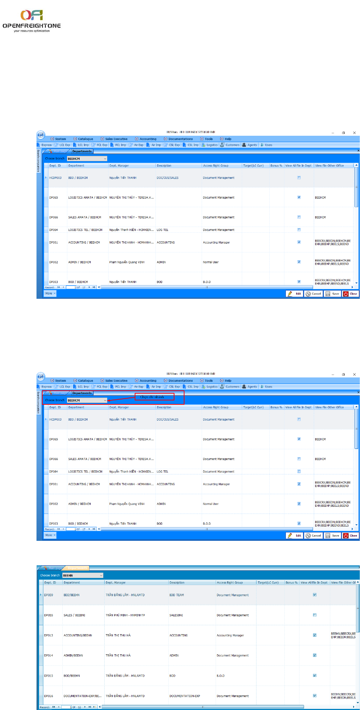

---

## 2. Leads (Khách hàng tiềm năng)

Nơi quản lý các khách hàng tiềm năng của công ty. Tùy theo user được cấp quyền mới có thể thêm các khách hàng vào bảng.

**Cách thực hiện:** Chọn Catalogue -> Leads

Bảng sẽ hiển thị tất cả các khách hàng tiềm năng được user có ủy quyền nhập vào để hệ thống kiểm soát các khách hàng mới hoặc có khả năng làm ăn lâu dài với công ty. Chỉ có Admin mới có quyền thêm/sửa/xóa, hoặc Admin ủy quyền cho một user nào đó.

### Tạo mới Lead

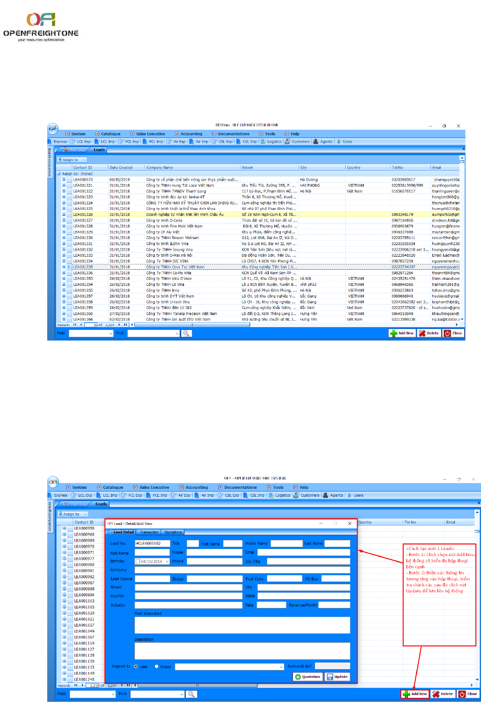

Các trường thông tin:

- **Lead No.:** Mã khách hàng tiềm năng (hệ thống tự động cấp)
- **First Name:** Họ của khách hàng
- **Middle Name:** Tên lót của khách hàng
- **Last Name:** Tên của khách hàng
- **Nick Name:** Tên viết tắt của khách hàng (nếu có)
- **Mobile:** Số điện thoại liên lạc
- **Country:** Vị trí của khách hàng hiện tại đang ở khu vực nào
- **Industry:** Loại hình kinh doanh của khách hàng
- **Email:** Địa chỉ email
- **Status:** Trạng thái khách hàng hiện tại có đang giao dịch với công ty hay không
- **City:** Thành phố
- **Company:** Tên công ty của khách hàng
- **Assigned to:** Được nhập bởi người dùng hoặc nhóm người dùng

Sau khi điền đầy đủ thông tin, click chọn **Update**. Hệ thống sẽ tự động thêm khách hàng và thông tin vào bảng Leads.

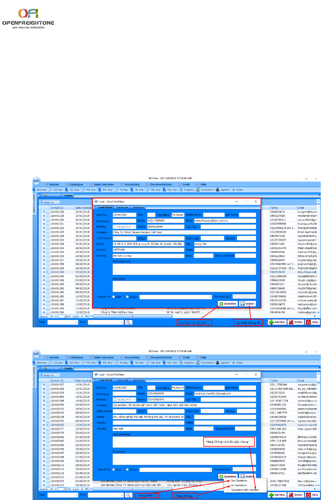

### Quản lý Leads

Ta có thể xem chi tiết một khách hàng bằng cách double click vào khách hàng muốn xem.

**Quotation:** Từ Lead có thể tạo báo giá trực tiếp:
- **Sea Quotation:** Liên kết đến tab SeaFreight Quotation
- **Air Quotation:** Liên kết đến tab AirFreight Quotation
- **Quotation with Combine:** Làm báo giá cho cả hàng đường biển và đường hàng không tùy theo yêu cầu khách hàng

> Xem chi tiết các trường báo giá tại phần [Cấu trúc báo giá Sea/Air Freight](#cau-truc-bao-gia-sea--air-freight).

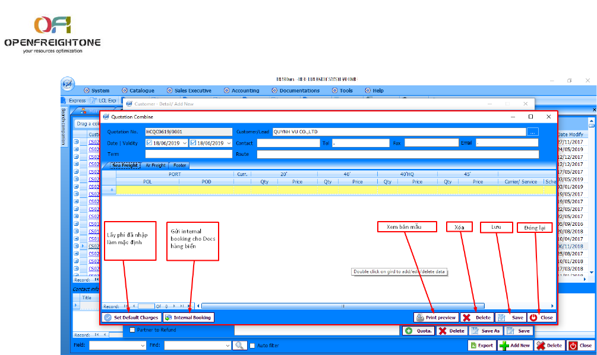

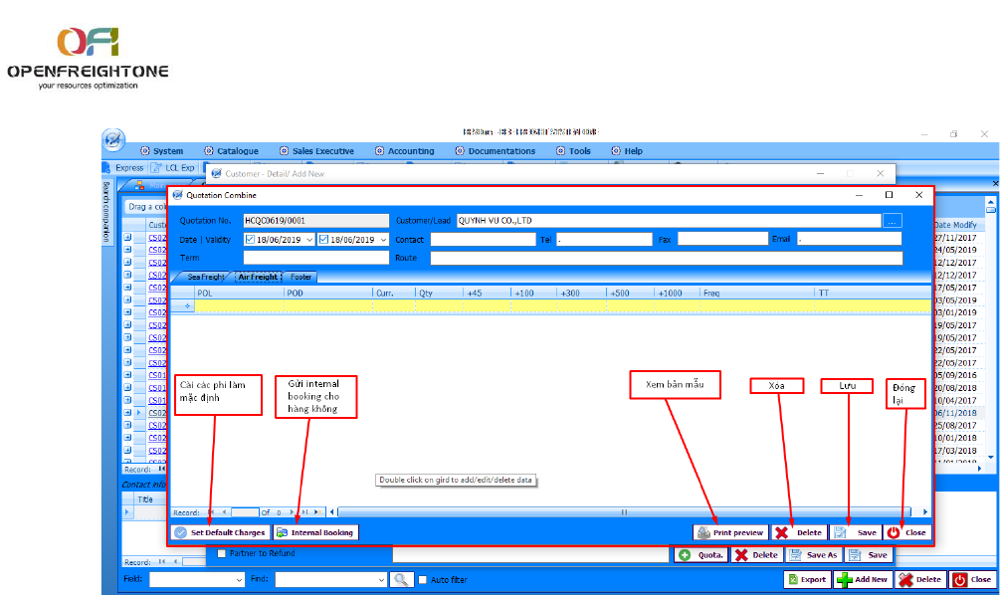

**Footer:** Nội dung bao gồm tên công ty, địa chỉ, số điện thoại, trang web và các điều khoản trên hợp đồng.

---

## 3. Customer (Khách hàng)

Nơi chứa các khách hàng thực sự của công ty đã và đang giao dịch.

**Cách thực hiện:** Chọn Catalogue -> Customer (hoặc chọn nút **Customer** trên thanh công cụ)

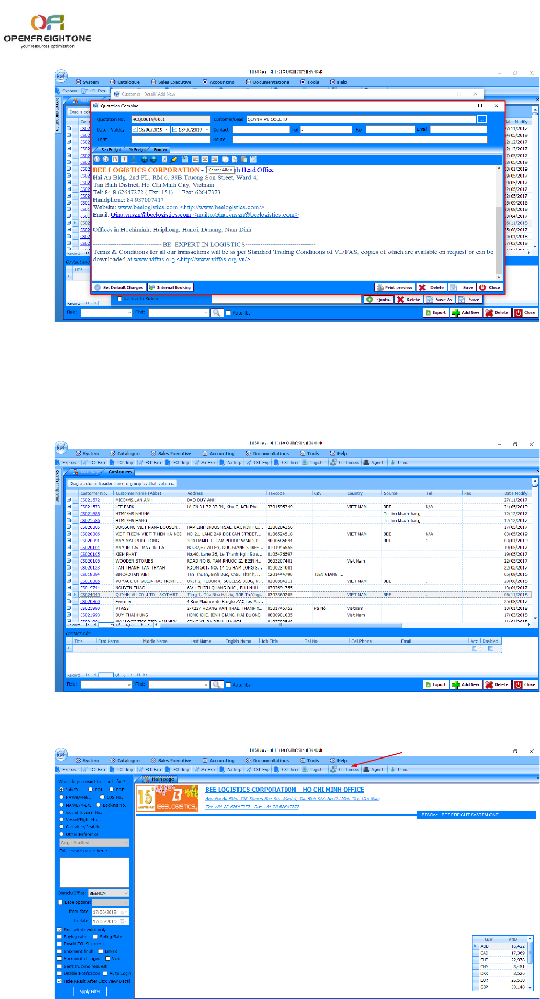

### Xem chi tiết khách hàng

Double click vào khách hàng, hệ thống sẽ hiện form đầy đủ thông tin.

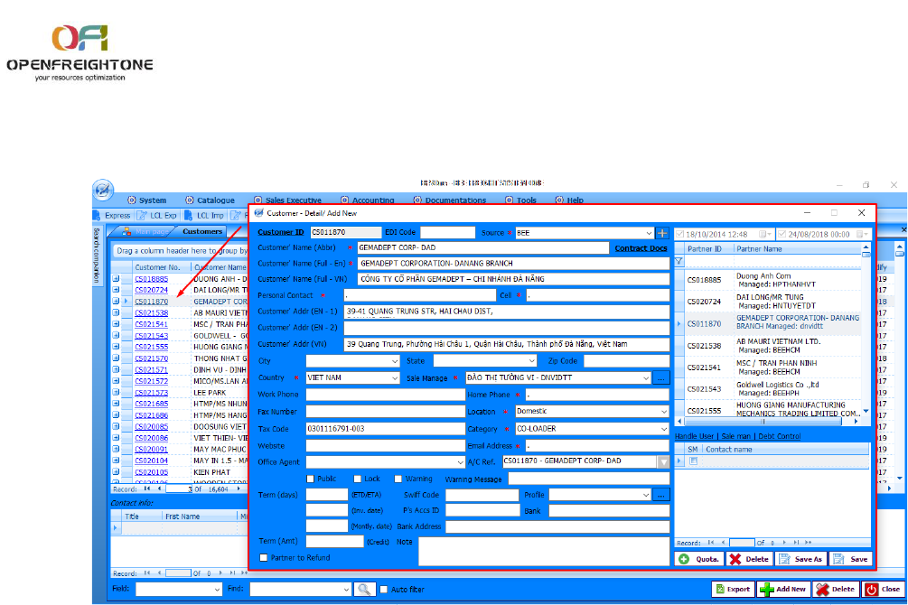

Các trường thông tin:

- **Customer ID:** Số ID của khách hàng (hệ thống tự động cấp)
- **Source:** Chọn nhóm để phân loại khách hàng, tiện cho việc xem xét và làm báo cáo
- **Customer Name (Abbr):** Tên viết tắt của khách hàng
- **Customer Name (Full EN):** Tên viết đầy đủ bằng tiếng Anh
- **Customer Name (Full VN):** Tên viết đầy đủ bằng tiếng Việt
- **Personal Contact:** Thông tin liên hệ cá nhân đối với khách hàng đại diện cho công ty
- **Customer Address (EN):** Địa chỉ của khách hàng bằng tiếng Anh
- **Customer Address (VN):** Địa chỉ của khách hàng bằng tiếng Việt
- **Country:** Vị trí của công ty khách hàng đang ở khu vực nào
- **Sale Manager:** Nhân viên kinh doanh người thỏa thuận với khách hàng
- **Location:** Oversea hoặc Domestic (nước ngoài hoặc nội địa) đối với khu vực của văn phòng hiện tại
- **Tax Code:** Mã số thuế của khách hàng (hoặc công ty của khách hàng)
- **Category:** Bao gồm 4 nhóm: Customer, Co-loader, Shipper và Consignee. (90% là Customer; Co-loader là phân cấp cao hơn; Shipper và Consignee có phân cấp thấp hơn.) Chỉ có thể chọn 1 trong 4 nhóm.
- **A/C Ref:** Địa chỉ công ty mẹ để gửi SOA (bắt buộc nhập) để kiểm soát công nợ trong khu vực
- **Note:** Ghi chú

### Contact Info

Dùng để nhập thông tin người liên hệ mà salesman của công ty làm việc. Có thể nhập nhiều người liên hệ (ví dụ kế toán liên hệ một người khác cũng thuộc công ty đó).

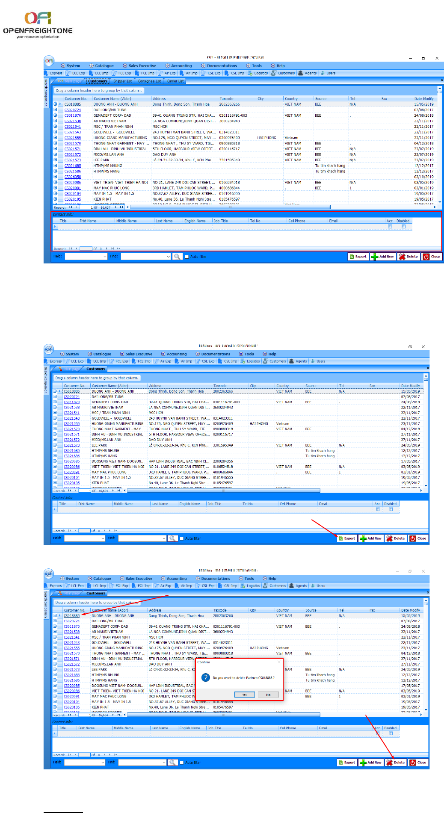

### Các công cụ

- **Export:** Xuất dữ liệu ra file Excel
- **Delete:** Xóa customer đang chọn. Hệ thống sẽ hỏi lại một lần nữa để xác nhận.

> **Lưu ý:** Phải liên hệ hoặc báo cáo cấp trên để xóa khách hàng ra khỏi hệ thống. Yêu cầu phải có lý do gửi cho cấp trên để xem xét và phê duyệt.

- **Close:** Đóng bảng Customer
- **Add New:** Thêm mới khách hàng

### Tạo mới Customer

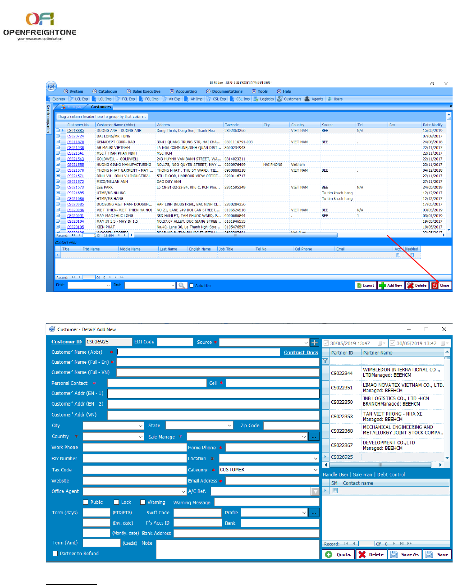

> **Lưu ý:** Những trường có dấu sao đó là bắt buộc phải nhập.

Các trường thông tin:

- **ID:** Mã số do hệ thống tự động cấp
- **EDI:** Mã của đơn hàng của khách hàng khi cần import qua hệ thống văn phòng khác
- **Source:** Chọn nhóm để phân loại khách hàng
- **Customer Name (AKA):** Tên viết tắt
- **Customer Name (Full Name):** Tên đầy đủ
- **Customer Name (Ten VN):** Tên bằng tiếng Việt
- **Sale Manager:** Nhân viên kinh doanh
- **Location:** Oversea hoặc Domestic
- **Category:** Chọn 1 trong 4 nhóm (Customer, Co-loader, Shipper, Consignee)
- **Email Address:** Địa chỉ email
- **A/C Ref:** Địa chỉ công ty mẹ để gửi SOA (bắt buộc nhập)

### Trạng thái khách hàng

Có 3 lựa chọn tùy thuộc mức độ của khách hàng:

- **Public:** Ai cũng có thể thấy khách hàng này và có thể sales lô hàng
- **Lock:** Khóa khách hàng lại, không cho phát sinh bất cứ giao dịch nào. *Lưu ý: Phải kiểm tra xem xét rõ và biết được lý do tại sao phải khóa.*
- **Warning:** Khi một salesman giao dịch với khách hàng này, hệ thống sẽ hiển thị thông báo cảnh báo (ví dụ: trả tiền chậm, không giải quyết được lô hàng...). Thông báo này cũng hiển thị cho bộ phận Cus, Docs.

> **Lưu ý:** Khách hàng của salesman nào chịu trách nhiệm thì chỉ có salesman đó có thể thấy được danh sách khách hàng của mình. Salesman khác sẽ không thấy được để tránh rác rối trong công việc.

### Thông tin thanh toán

- **Term Day:** Ngày khách hàng có thể nợ là bao nhiêu ngày tính từ ngày ETA/ETD
- **Inv. Date:** Ngày khách hàng nợ kế từ ngày xuất hóa đơn
- **Monthly Date:** Ngày khách hàng trả nợ theo ngày trong tháng
- **SWIFT Code:** Mã giao dịch của khách hàng tại ngân hàng
- **Bank:** Ngân hàng của khách hàng
- **Bank Address:** Địa chỉ ngân hàng

Sau khi điền đầy đủ thông tin, click **Save** để lưu thông tin lên hệ thống. Từ đó có thể truy xuất khách hàng để làm bảng báo giá và gửi internal booking.

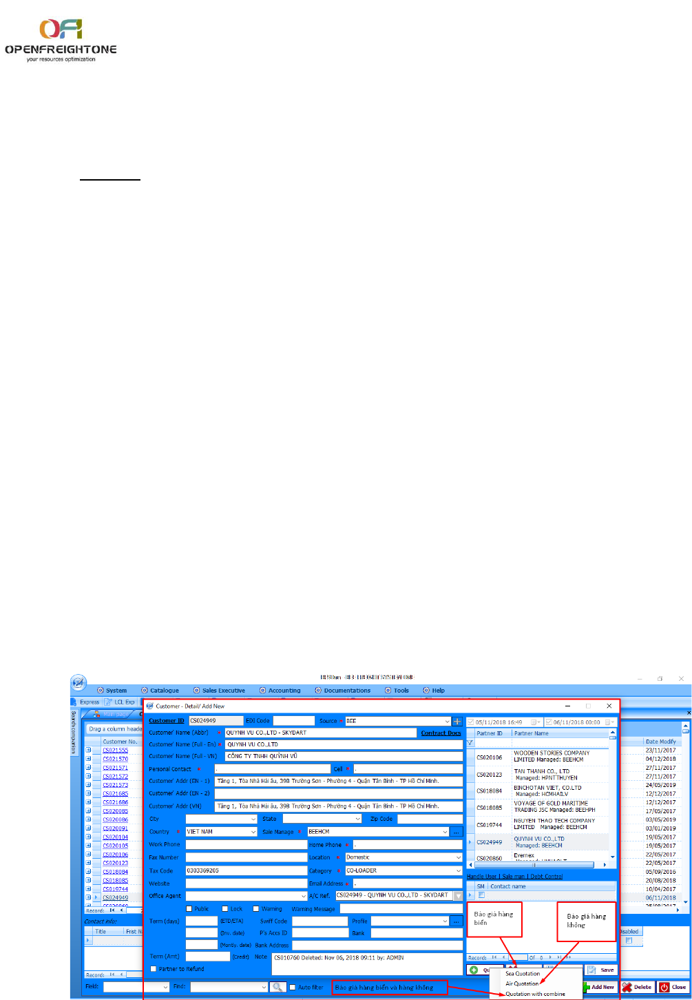

### Các công cụ bổ sung

- **Quotation:** Tạo báo giá (Sea Quotation, Air Quotation, Quotation with Combine)
- **Delete:** Xóa khách hàng đang chọn hoặc đang tạo
- **Save As:** Sao lưu thông tin khách hàng sang bản khác với ID mới
- **Save:** Lưu thông tin lên hệ thống

> Xem chi tiết các trường báo giá tại phần [Cấu trúc báo giá Sea/Air Freight](#cau-truc-bao-gia-sea--air-freight).

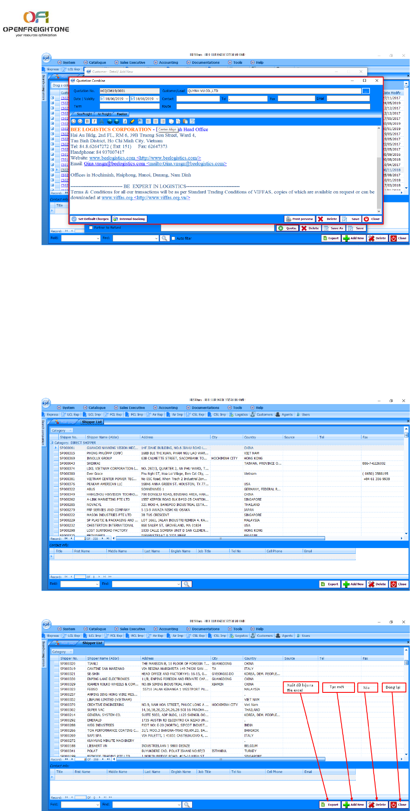

---

## 4. Shipper List (Danh sách nhà vận chuyển)

Tương tự như Customer, Shipper List chứa các công ty vận chuyển đã và đang làm việc với công ty.

**Cách thực hiện:** Chọn Catalogue -> Shipper List

### Các thao tác

- **Export:** Xuất dữ liệu ra file Excel
- **Delete:** Double click vào shipper, sau đó ấn nút **Delete** để xóa
- **Close:** Đóng bảng Shipper List
- **Add New:** Thêm shipper mới

### Tạo mới Shipper

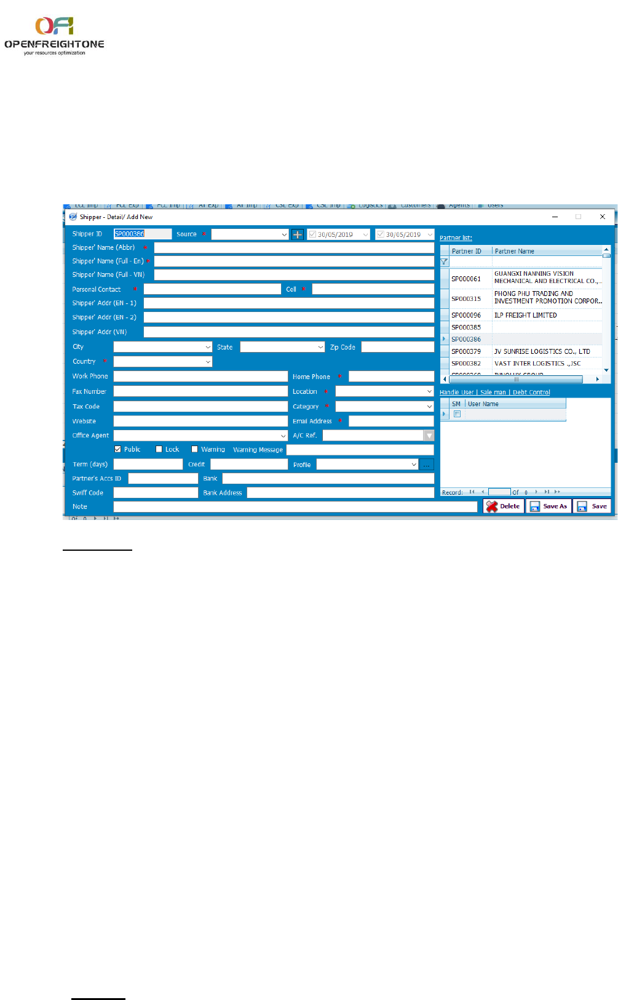

> **Lưu ý:** Những trường có dấu sao đó là bắt buộc phải nhập.

Các trường thông tin:

- **ID:** Mã số do hệ thống tự động cấp
- **Source:** Chọn nhóm để phân loại
- **Shipper Name (AKA):** Tên viết tắt của nhà vận chuyển
- **Shipper Name (Full Name):** Tên đầy đủ
- **Shipper Name (Ten VN):** Tên bằng tiếng Việt
- **Location:** Oversea hoặc Domestic
- **Category:** Chọn 1 trong 4 nhóm (Customer, Co-loader, Shipper, Consignee)
- **Email Address:** Địa chỉ email
- **A/C Ref:** Địa chỉ công ty mẹ để gửi SOA (bắt buộc nhập)

Trạng thái (Public / Lock / Warning) và thông tin thanh toán (Term Day, Inv. Date, Monthly Date, SWIFT Code, Bank, Bank Address) tương tự như [Customer](#trang-thai-khach-hang).

### Các công cụ

- **Save:** Lưu thông tin shipper lên hệ thống
- **Delete:** Xóa thông tin shipper đang nhập hoặc đang mở
- **Save As:** Sao lưu thông tin hiện tại thành shipper mới với ID mới
- **Contact Info:** Nhập thông tin người liên hệ

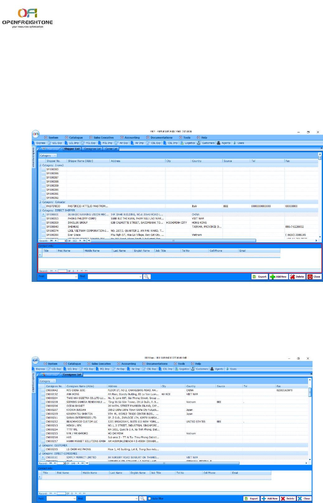

---

## 5. Consignee List (Danh sách người nhận hàng)

Tương tự như Customer và Shipper List, Consignee List là nơi chứa những người nhận hàng đã và đang làm việc với công ty.

**Cách thực hiện:** Chọn Catalogue -> Consignee List

### Các thao tác

- **Export:** Xuất dữ liệu ra file Excel
- **Delete:** Double click vào người nhận hàng, sau đó ấn **Delete**
- **Close:** Đóng bảng Consignee List
- **Add New:** Thêm người nhận hàng mới (ở góc phải màn hình)

### Tạo mới Consignee

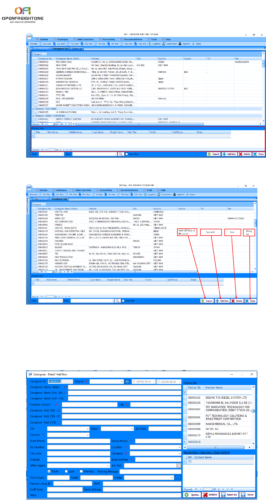

> **Lưu ý:** Những trường có dấu sao đó là bắt buộc phải nhập.

Các trường thông tin:

- **ID:** Mã số do hệ thống tự động cấp
- **Source:** Chọn nhóm để phân loại
- **Consignee Name (AKA):** Tên viết tắt
- **Consignee Name (Full Name):** Tên đầy đủ
- **Consignee Name (Ten VN):** Tên bằng tiếng Việt
- **Location:** Oversea hoặc Domestic
- **Category:** Chọn 1 trong 4 nhóm (Customer, Co-loader, Shipper, Consignee)
- **Email Address:** Địa chỉ email
- **A/C Ref:** Địa chỉ công ty mẹ để gửi SOA (bắt buộc nhập)

Trạng thái (Public / Lock / Warning) và thông tin thanh toán tương tự như [Customer](#trang-thai-khach-hang).

### Các công cụ

- **Save:** Lưu thông tin người nhận hàng lên hệ thống
- **Delete:** Xóa thông tin người nhận hàng đang mở hoặc đang tạo
- **Save As:** Sao lưu thông tin thành người nhận hàng mới với ID mới
- **Quotation:** Làm báo giá đối với người nhận hàng đó
- **Contact Info:** Nhập thông tin người liên hệ

> Xem chi tiết các trường báo giá tại phần [Cấu trúc báo giá Sea/Air Freight](#cau-truc-bao-gia-sea--air-freight).

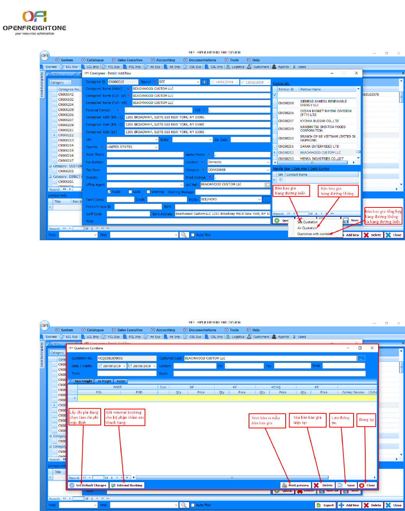

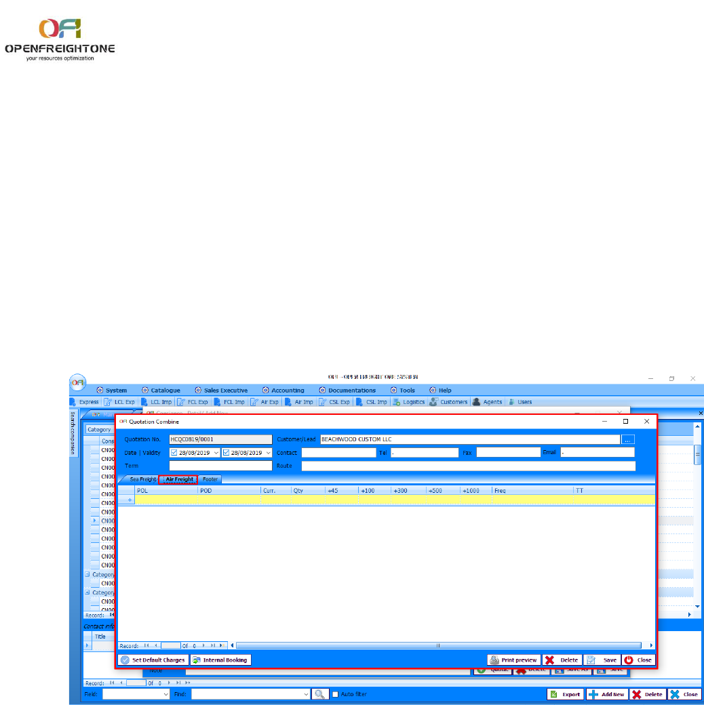

**Footer:** Nội dung bao gồm tên công ty, địa chỉ, số điện thoại, trang web và các điều khoản trên hợp đồng.

---

## 6. Carrier List (Danh sách Co-loader)

Là nơi chứa các địa chỉ co-loader. Ai cũng có thể xem nếu được cấp quyền.

**Cách thực hiện:** Chọn Catalogue -> Carrier List

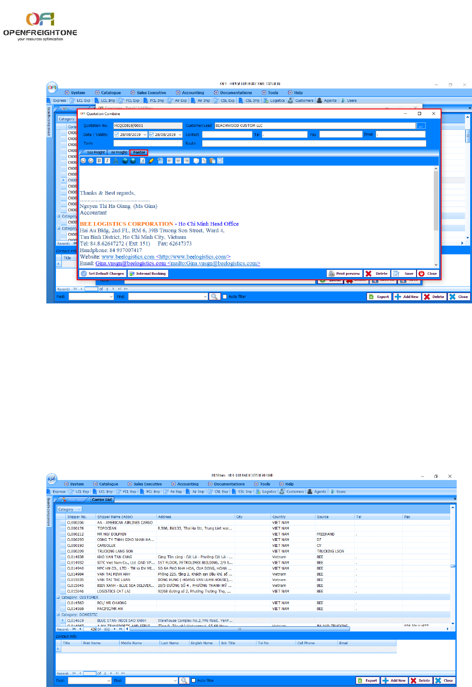

### Các thao tác

- **Export:** Xuất dữ liệu ra file Excel
- **Delete:** Double click vào carrier, sau đó ấn **Delete**
- **Close:** Đóng bảng Carrier List
- **Add New:** Thêm co-loader mới

Bảng sẽ hiển thị thông tin của đại lý, co-loader bao gồm địa chỉ, thành phố...

### Tạo mới Co-loader

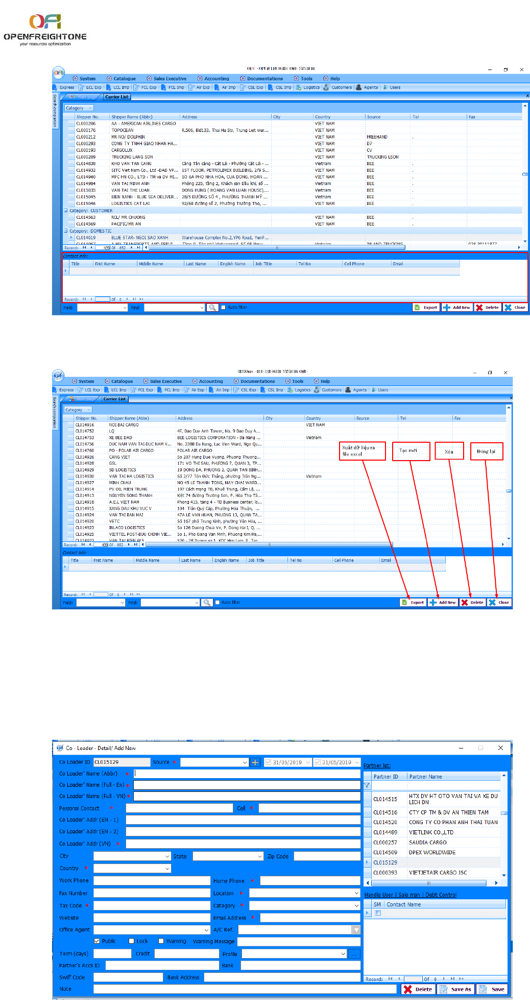

> **Lưu ý:** Những trường có dấu sao đó là bắt buộc phải nhập.

Các trường thông tin:

- **ID:** Mã số do hệ thống tự động cấp
- **Source:** Chọn nhóm để phân loại
- **Co Loader Name (AKA):** Tên viết tắt của co-loader
- **Co Loader Name (Full Name):** Tên đầy đủ
- **Co Loader Name (Ten VN):** Tên bằng tiếng Việt
- **Location:** Oversea hoặc Domestic
- **Category:** Chọn 1 trong 4 nhóm (Customer, Co-loader, Shipper, Consignee)
- **Email Address:** Địa chỉ email
- **A/C Ref:** Địa chỉ công ty mẹ để gửi SOA (bắt buộc nhập)

Trạng thái (Public / Lock / Warning) và thông tin thanh toán tương tự như [Customer](#trang-thai-khach-hang).

### Các công cụ

- **Save:** Lưu thông tin co-loader lên hệ thống
- **Delete:** Xóa thông tin co-loader đang nhập hoặc đang mở
- **Save As:** Sao lưu thông tin thành co-loader mới với ID mới
- **Contact Info:** Nhập thông tin người liên hệ

---

## 7. Agents (Đại lý)

Là nơi chứa địa chỉ các đại lý. Ai cũng có thể xem được nếu được cấp quyền.

**Cách thực hiện:** Chọn Catalogue -> Agents

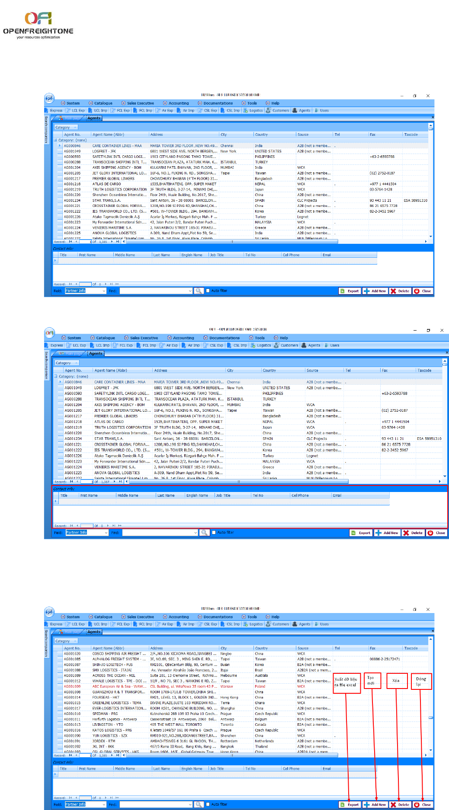

### Các thao tác

- **Export:** Xuất dữ liệu ra file Excel
- **Delete:** Double click vào agent, sau đó ấn **Delete**
- **Close:** Đóng bảng Agent

Bảng sẽ hiển thị thông tin của các đại lý đã và đang làm việc với công ty, bao gồm họ và tên, địa chỉ, fax, mã số thuế...

### Tạo mới Agent

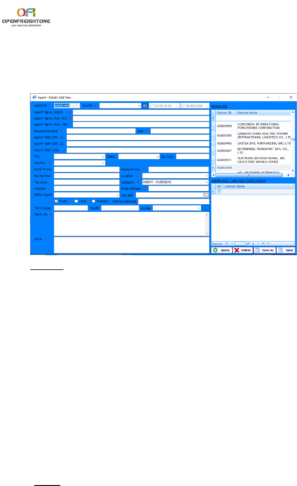

> **Lưu ý:** Những trường có dấu sao đó là bắt buộc phải nhập.

Các trường thông tin:

- **ID:** Mã số do hệ thống tự động cấp
- **Source:** Chọn nhóm để phân loại
- **Agent Name (AKA):** Tên viết tắt của đại lý
- **Agent Name (Full Name):** Tên đầy đủ
- **Agent Name (Ten VN):** Tên bằng tiếng Việt
- **Location:** Oversea hoặc Domestic
- **Category:** Chọn 1 trong 4 nhóm (Customer, Co-loader, Shipper, Consignee)
- **Email Address:** Địa chỉ email
- **A/C Ref:** Địa chỉ công ty mẹ để gửi SOA (bắt buộc nhập)

Trạng thái (Public / Lock / Warning) và thông tin thanh toán tương tự như [Customer](#trang-thai-khach-hang).

### Các công cụ

- **Save:** Lưu thông tin đã nhập lên hệ thống BFSone
- **Delete:** Xóa thông tin đại lý đang mở hoặc đang tạo
- **Save As:** Sao lưu thông tin đại lý thành đại lý mới với ID mới
- **Relate to:** Hiển thị các Agent liên quan (nếu có) đến Agent hiện tại đang chọn
- **Quotation:** Làm báo giá cho agent hiện tại

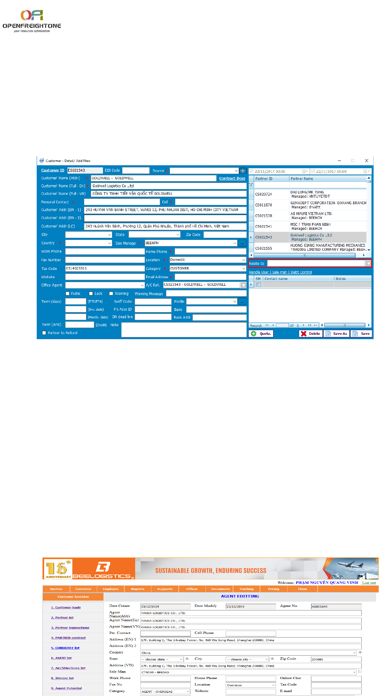

### Đánh giá mức độ ưu tiên đại lý

User phụ trách khách hàng đại lý thực hiện đánh giá mức độ ưu tiên của đại lý khi thực hiện duyệt hoặc tạo mới khách hàng đại lý.

**a) Thực hiện trên CRM:**

- **Duyệt yêu cầu:** Sau khi chọn khách hàng đại lý cần duyệt, trượt xuống thông tin phía bên dưới để xác định các tiêu chí ưu tiên bao gồm: Nhóm hiệp hội, Loại hình dịch vụ và độ ưu tiên.
- **Đại lý đã tồn tại:** Chọn chức năng chỉnh sửa thông tin, sau đó trượt xuống bên dưới để đánh giá tương tự.

**b) Thực hiện trên OF1:**

Vào chức năng danh sách đại lý -> Thêm mới hoặc đánh giá đại lý đã có trong hệ thống -> Chọn đại lý cần đánh giá bằng cách double click. Các bước thực hiện tương tự như mô tả ở trên.

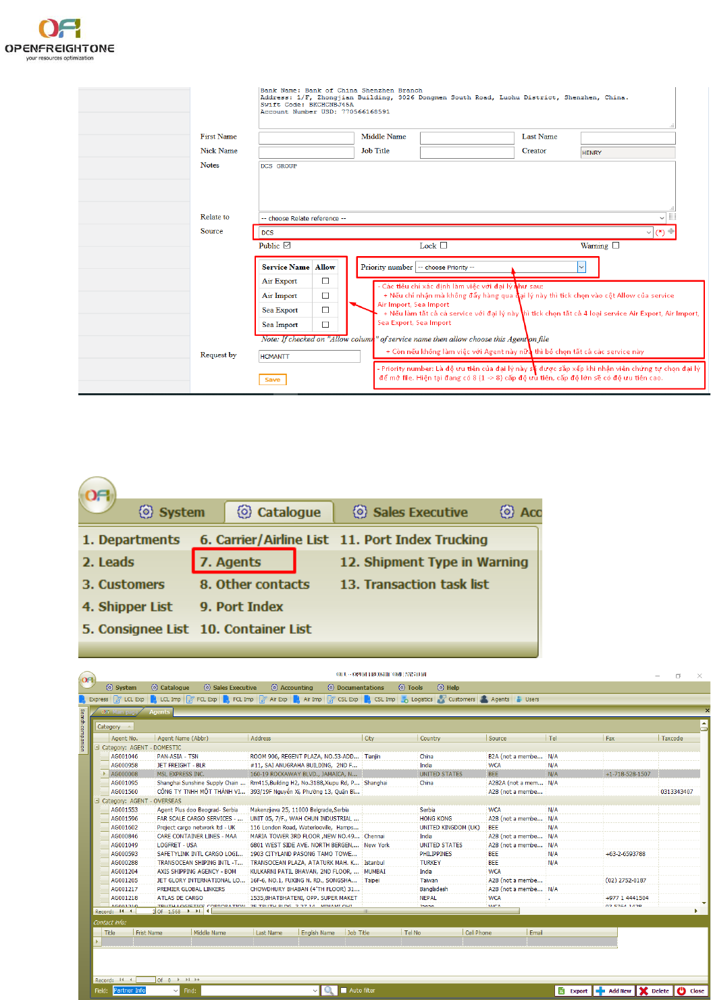

**c) Nhân viên chứng thư chọn đại lý khi tạo file:**

Khi nhân viên chứng thư tạo file và chọn đại lý, hệ thống sẽ kiểm tra các điều kiện bắt buộc trước khi chọn đại lý:
- **POL/POD** (tùy theo loại hình dịch vụ)
- **Service Type** (Free Hand / Nominated) phải được chọn trước

Sau đó hệ thống sẽ đưa vào các tiêu chí đã đánh giá của đại lý mà thực hiện filter dữ liệu tùy theo loại hình dịch vụ và độ ưu tiên tương ứng với POL/POD.

> **Lưu ý:** Những đại lý nếu không được đánh giá thì nhân viên chứng thư sẽ không chọn được để mở file. Nếu cùng dịch vụ và quốc gia thì đại lý nào có độ ưu tiên (1->8) cao hơn sẽ được sắp xếp nằm phía trên.

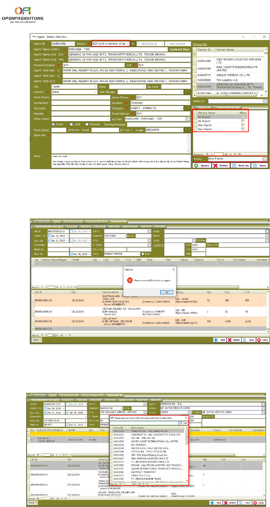

---

## 8. Other Contacts (Các mối liên hệ khác)

Là nơi chứa các mối liên hệ khác của công ty chưa xác định là thuộc thành phần mối liên hệ nào.

**Cách thực hiện:** Chọn Catalogue -> Other Contacts

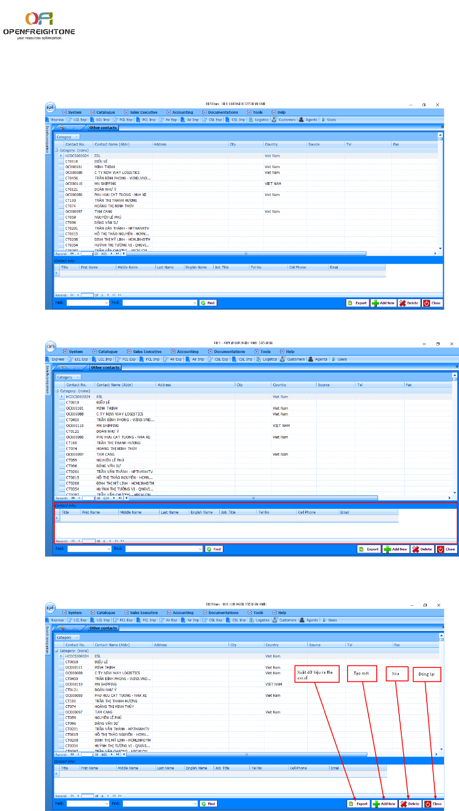

### Các thao tác

- **Export:** Xuất dữ liệu ra file Excel
- **Delete:** Double click vào mối liên hệ, sau đó ấn **Delete**
- **Close:** Đóng bảng Other Contacts
- **Add New:** Thêm mối liên hệ mới (chỉ user được cấp quyền mới có thể thêm)

### Tạo mới Other Contact

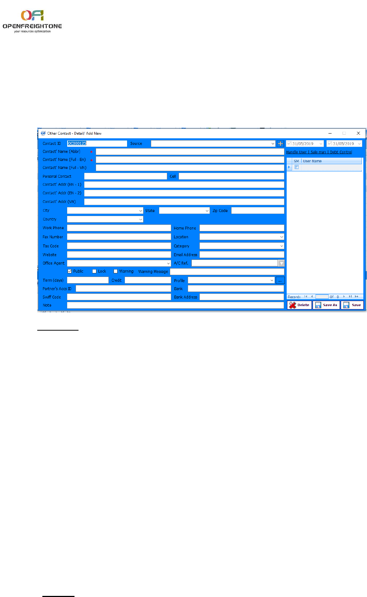

> **Lưu ý:** Những trường có dấu sao đó là bắt buộc phải nhập.

Các trường thông tin:

- **ID:** Mã số do hệ thống tự động cấp
- **Source:** Chọn nhóm để phân loại
- **Name (AKA):** Tên viết tắt
- **Name (Full Name):** Tên đầy đủ
- **Name (Ten VN):** Tên bằng tiếng Việt
- **Location:** Oversea hoặc Domestic
- **Category:** Chọn 1 trong 4 nhóm (Customer, Co-loader, Shipper, Consignee)
- **Email Address:** Địa chỉ email
- **A/C Ref:** Địa chỉ công ty mẹ để gửi SOA (bắt buộc nhập)

Trạng thái (Public / Lock / Warning) và thông tin thanh toán tương tự như [Customer](#trang-thai-khach-hang).

### Các công cụ

- **Save:** Lưu thông tin người liên hệ lên hệ thống
- **Delete:** Xóa thông tin người liên hệ đang nhập hoặc đang mở
- **Save As:** Sao lưu thông tin thành người liên hệ mới với ID mới
- **Contact Info:** Nhập thông tin người liên hệ

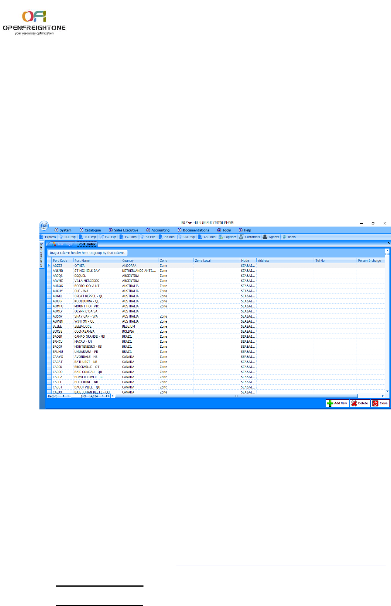

---

## 9. Port Index (Danh mục cảng)

Danh mục các cảng biển, cảng hàng không. Yêu cầu nhập đầy đủ để có thể tìm kiếm hoặc báo cáo doanh thu.

**Cách thực hiện:** Chọn Catalogue -> Port Index

Các trường thông tin:

- **Port Code:** Mã code của cảng
- **Port Name:** Tên đầy đủ của cảng
- **Country:** Khu vực nơi cảng
- **Zone:** Châu lục nào trên thế giới
- **Mode:** Là cảng biển hay hàng không...

### Cách nhập ID Port

Theo chuẩn của UNECE:

- **Đối với hàng Sea:** 2 ký tự đầu là viết tắt của nước, 3 ký tự sau là viết tắt của cảng
- **Đối với hàng Air:** có 3 ký tự code

Ta có thể nhập cảng mới lên hệ thống bằng cách click chọn **Add New**. Hệ thống sẽ hiển thị form để nhập thông tin cảng.

Các trường cần nhập:

- **Port ID:** Yêu cầu nhập đúng chuẩn UN
- **Port Name:** Tên đầy đủ của cảng
- **Mode:** Chọn loại cảng (Air, Sea, Inland, Depot...)
- **Zone:** Khu vực (Châu Á, Châu Âu...)

---

## 10. Container List (Danh sách container)

Nơi chứa danh sách các container của công ty.

**Cách thực hiện:** Chọn Catalogue -> Container List

Các trường thông tin:

- **Container No.:** Số cont được hệ thống tự động cấp
- **ISO:** Số ISO của cont
- **Type:** Loại cont
- **Description:** Mô tả cont
- **Weight:** Khối lượng của cont
- **Vendor:** Người bán
- **Origin:** Nơi cont đang để
- **Owner:** Người đang sở hữu

Click chọn **Add New** để thêm cont mới, hoặc **Delete** để xóa cont đang chọn.

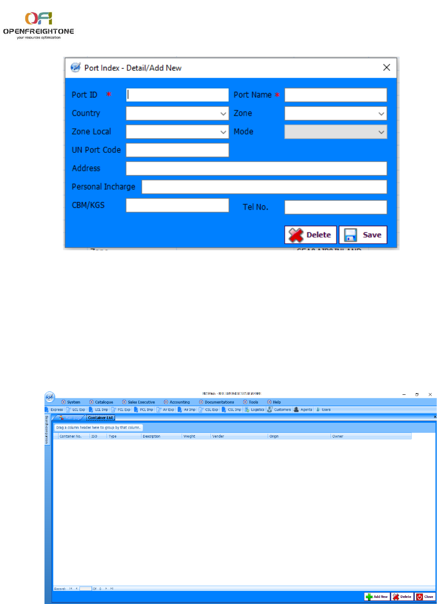

Nhập các thông tin của cont vào form:

- **Cont No.:** Số cont
- **Cont Type:** Loại cont
- **Weight:** Khối lượng cont
- **Description:** Mô tả cont
- **Vendor:** Người bán cont
- **Owner:** Người sở hữu

Sau khi nhập đầy đủ thông tin, click chọn **Save** để lưu thông tin cont lên hệ thống.

---

## 11. Port Index Trucking (Danh mục cảng trucking)

Nơi chứa danh sách những cảng để trucking đơn hàng của công ty.

**Cách thực hiện:** Chọn Catalogue -> Port Index Trucking

Các trường thông tin:

- **Port Code:** Mã code của cảng
- **Port Name:** Tên của cảng
- **Country:** Khu vực của cảng
- **Zone:** Khu vực
- **Address:** Địa chỉ của cảng

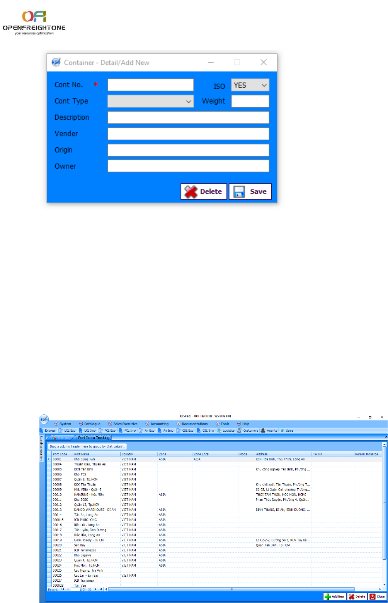

### Các thao tác

- **Delete:** Xóa thông tin của cảng đang chọn
- **Close:** Đóng tab Port Index Trucking
- **Add New:** Tạo mới thông tin Port

Các trường cần nhập:

- **Port ID:** Yêu cầu nhập đúng chuẩn UN
- **Port Name:** Tên đầy đủ của cảng
- **Country:** Khu vực của cảng
- **Mode:** Cảng hàng không hay cảng biển...
- **Zone:** Khu vực
- **Address:** Địa chỉ của cảng

Sau khi ghi đầy đủ thông tin, click chọn **Save** để lưu thông tin lên hệ thống hoặc **Delete** để xóa.

---

## 12. Shipment Type in Warning (Loại hàng cảnh báo)

Nơi chứa các danh mục cần chú ý -- chứa các đơn hàng hóa có những nhu cầu đặc biệt như hàng nguy hiểm, chất lỏng... hoặc có yêu cầu đặc biệt khác.

**Cách thực hiện:** Chọn Catalogue -> Shipment Type in Warning

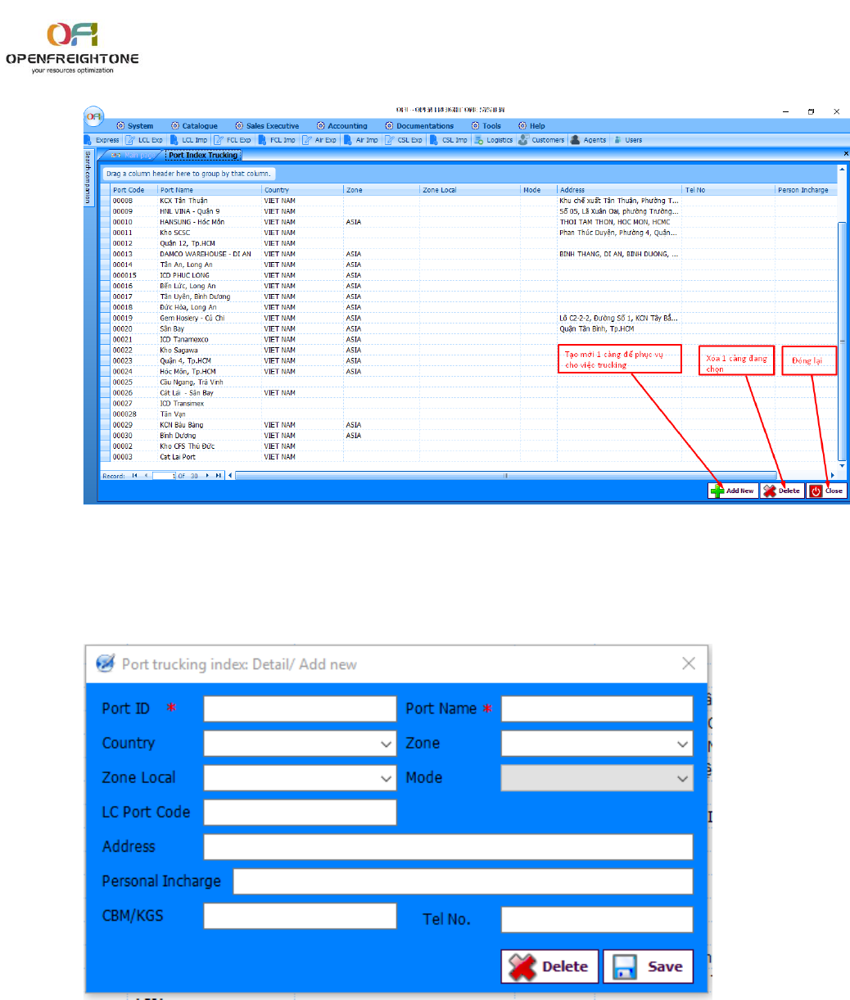

Thông tin bao gồm các loại mặt hàng đặc biệt phải gửi email đến những người có thẩm quyền để xin phép thực hiện lô hàng. Khi những người có thẩm quyền chấp nhận, sẽ có một email thông báo lại với nhân viên sales chịu trách nhiệm lô hàng đó và cho phép thực hiện.

---

## 13. Transaction Task List (Danh sách giao dịch)

Nơi chứa các danh sách giao dịch của công ty với khách hàng.

**Cách thực hiện:** Chọn Catalogue -> Transaction Task List

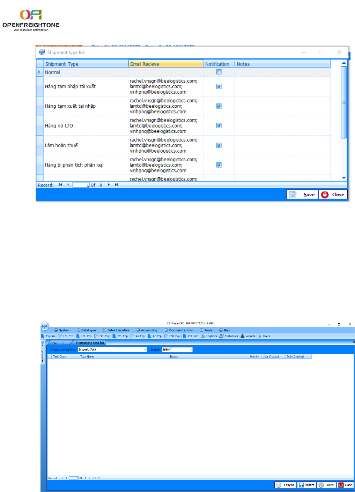

---

## Phụ lục

### Các trường thông tin chung cho đối tác (Mục 3-8)

Các mục Customer, Shipper, Consignee, Carrier, Agent và Other Contacts đều có các trường chung sau:

**Thông tin cơ bản:**

| Trường | Mô tả |
|--------|-------|
| ID | Mã số do hệ thống tự động cấp |
| Source | Nhóm phân loại để tiện xem xét và báo cáo |
| Name (AKA) | Tên viết tắt |
| Name (Full Name) | Tên đầy đủ |
| Name (Ten VN) | Tên bằng tiếng Việt |
| Location | Oversea hoặc Domestic |
| Category | 1 trong 4 nhóm: Customer, Co-loader, Shipper, Consignee |
| Email Address | Địa chỉ email |
| A/C Ref | Địa chỉ công ty mẹ để gửi SOA (bắt buộc nhập) |

**Trạng thái:**

| Trạng thái | Mô tả |
|------------|-------|
| Public | Ai cũng có thể thấy và giao dịch |
| Lock | Khóa lại, không cho phát sinh giao dịch. Phải có lý do rõ ràng. |
| Warning | Hiển thị cảnh báo khi salesman giao dịch (ví dụ: nợ trễ, không giải quyết lô hàng...). Thông báo cũng hiển thị cho bộ phận Cus, Docs. |

**Thông tin thanh toán:**

| Trường | Mô tả |
|--------|-------|
| Term Day | Số ngày có thể nợ tính từ ngày ETA/ETD |
| Inv. Date | Ngày nợ kế từ ngày xuất hóa đơn |
| Monthly Date | Ngày trả nợ theo tháng |
| SWIFT Code | Mã giao dịch tại ngân hàng |
| Bank | Ngân hàng |
| Bank Address | Địa chỉ ngân hàng |

**Các công cụ chung:**

| Công cụ | Mô tả |
|---------|-------|
| Save | Lưu thông tin lên hệ thống |
| Delete | Xóa thông tin đang mở hoặc đang tạo |
| Save As | Sao lưu thành bản mới với ID mới |
| Export | Xuất dữ liệu ra file Excel |
| Close | Đóng bảng hiện tại |
| Contact Info | Nhập thông tin người liên hệ |

### Cấu trúc báo giá Sea / Air Freight

Khi tạo báo giá từ Leads, Customer hoặc Consignee, các trường thông tin như sau:

**Sea Freight:**

- **PORT:**
  - **POL (Port of Loading):** Cảng bắt đầu đi của lô hàng
  - **POD (Port of Discharge):** Cảng dịch đến của lô hàng
- **Curr (Currency):** Tỉ giá
- **20':** Cont 20' -- Q'ty (số lượng) + Price (giá)
- **40':** Cont 40' -- Q'ty + Price
- **40'HQ:** Cont 40'HQ -- Q'ty + Price
- **45':** Cont 45' -- Q'ty + Price
- **Other:**
  - **Carrier/Service:** Hãng tàu / Dịch vụ
  - **Schedule Vessel:** Lịch trình hãng tàu
  - **Transit Time:** Thời gian chuyển tải (nếu có)
  - **Valid:** Hiệu lực của bản báo giá

**Air Freight:** Tương tự như Sea Freight với các trường tương ứng.

**Footer:** Nội dung bao gồm tên công ty, địa chỉ, số điện thoại, trang web và các điều khoản trên hợp đồng.

---

*Tài liệu này cung cấp hướng dẫn chi tiết về các chức năng của Catalogue module trong phần mềm OF1.*
