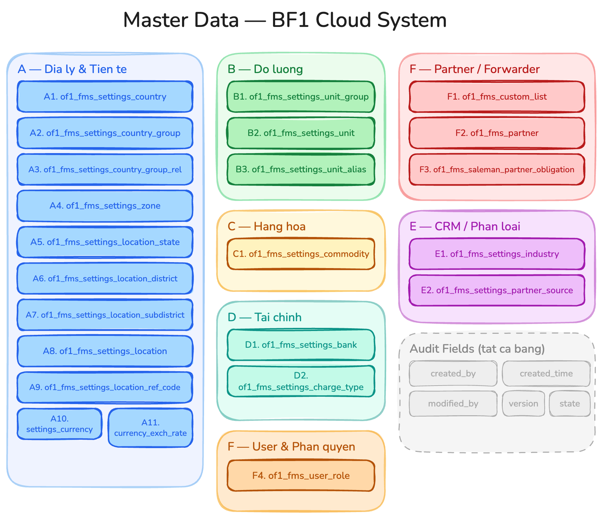

# Master Data — BF1 Cloud System

---

## Nhóm A — Địa lý & Tiền tệ

### A1. `of1_fms_settings_country` — Quốc gia

| Trường | BF1 Column | Kiểu | Bắt buộc | Mô tả |
|---|---|---|---|---|
| `id` | `id` | bigint |  | PK |
| `code` | `code` | varchar(2) |  | Mã ISO 3166-1 alpha-2 (e.g. `VN`, `US`) — UNIQUE |
| `code3` | — | varchar(3) |  | Mã ISO 3166-1 alpha-3 (e.g. `VNM`) |
| `label` | `label` | varchar |  | Tên quốc gia (tiếng Anh, uppercase) |
| `localized_label` | `label2` | varchar |  | Tên bản địa |
| `phone_code` | `phone_code` | varchar(10) |  | Mã điện thoại quốc tế (e.g. `+84`) |
| `currency_code` | `currency` | varchar(3) |  | Mã tiền tệ mặc định (FK → `of1_fms_settings_currency.code`) |
| `address_format` | `address_format` | varchar |  | Template định dạng địa chỉ theo quốc gia |

**Sample data:**

| id | code | code3 | label | localized_label | phone_code | currency_code |
|---|---|---|---|---|---|---|
| 1 | `VN` | `VNM` | VIETNAM | Việt Nam | `+84` | `VND` |
| 2 | `US` | `USA` | UNITED STATES | Hoa Kỳ | `+1` | `USD` |

### A2. `of1_fms_settings_country_group` — Nhóm quốc gia

| Trường | BF1 Column | Kiểu | Bắt buộc | Mô tả |
|---|---|---|---|---|
| `id` | `id` | bigint |  | PK |
| `code` | `name` | varchar |  | Mã nhóm (e.g. `ASEAN`, `EU`) — UNIQUE |
| `label` | `label` | varchar |  | Tên nhóm |
| `parent_id` | — | bigint |  | FK → `of1_fms_settings_country_group.id` (hỗ trợ phân cấp) |

**Sample data:**

| id | code | label | parent_id |
|---|---|---|---|
| 1 | `ASEAN` | ASEAN Countries | null |
| 2 | `EU` | European Union | null |

### A3. `of1_fms_settings_country_group_rel` — Mapping quốc gia ↔ nhóm

| Trường | BF1 Column | Kiểu | Bắt buộc | Mô tả |
|---|---|---|---|---|
| `country_id` | `country` | bigint |  | FK → `of1_fms_settings_country.id` |
| `group_id` | `country_group` | bigint |  | FK → `of1_fms_settings_country_group.id` |

**Sample data:**

| country_id | group_id | (mô tả) |
|---|---|---|
| 1 (VN) | 1 (ASEAN) | Vietnam → ASEAN |
| 2 (US) | 2 (EU) | — |

### A4. `of1_fms_settings_zone` — Khu vực vận chuyển

| Trường | BF1 Column | Kiểu | Bắt buộc | Mô tả |
|---|---|---|---|---|
| `id` | `id` | bigint |  | PK |
| `code` | `name` | varchar |  | Mã khu vực — UNIQUE |
| `label` | `label` | varchar |  | Tên khu vực |
| `zone_type` | — | varchar |  | Phân loại: `global`, `local`, `custom` |

**Sample data:**

| id | code | label | zone_type |
|---|---|---|---|
| 1 | `GLOBAL` | Global | `global` |
| 2 | `VN_NORTH` | Vietnam - North | `local` |

### A5. `of1_fms_settings_location_state` — Tỉnh / Bang

| Trường | BF1 Column | Kiểu | Bắt buộc | Mô tả |
|---|---|---|---|---|
| `id` | `id` | bigint |  | PK |
| `code` | `code` | varchar |  | Mã định danh — UNIQUE |
| `label` | `label` | varchar |  | Tên tỉnh/bang |
| `country_id` | `country_id` | bigint |  | FK → `of1_fms_settings_country.id` |
| `country_code` | `country_label` | varchar(2) |  | Denormalized |
| `gov_code` | `gov_administration_code` | varchar |  | Mã hành chính nhà nước |
| `administrative_unit` | `administrative_unit` | varchar |  | Loại đơn vị (Tỉnh, Thành phố trực thuộc TW) |

**Sample data:**

| id | code | label | country_id | country_code | gov_code | administrative_unit |
|---|---|---|---|---|---|---|
| 1 | `VN-SG` | Hồ Chí Minh | 1 | `VN` | `79` | Thành phố trực thuộc TW |
| 2 | `VN-HN` | Hà Nội | 1 | `VN` | `01` | Thành phố trực thuộc TW |

### A6. `of1_fms_settings_location_district` — Huyện / Quận

| Trường | BF1 Column | Kiểu | Bắt buộc | Mô tả |
|---|---|---|---|---|
| `id` | `id` | bigint |  | PK |
| `code` | `code` | varchar |  | Mã định danh — UNIQUE |
| `label` | `label` | varchar |  | Tên huyện/quận |
| `state_id` | `state_id` | bigint |  | FK → `of1_fms_settings_location_state.id` |
| `state_label` | `state_label` | varchar |  | Denormalized |
| `gov_code` | `gov_administration_code` | varchar |  | Mã hành chính nhà nước |
| `administrative_unit` | `administrative_unit` | varchar |  | Loại đơn vị (Huyện, Quận, Thị xã) |

**Sample data:**

| id | code | label | state_id | state_label | gov_code | administrative_unit |
|---|---|---|---|---|---|---|
| 1 | `VN-SG-Q1` | Quận 1 | 1 | Hồ Chí Minh | `760` | Quận |
| 2 | `VN-HN-HK` | Hoàn Kiếm | 2 | Hà Nội | `002` | Quận |

### A7. `of1_fms_settings_location_subdistrict` — Phường / Xã

| Trường | BF1 Column | Kiểu | Bắt buộc | Mô tả |
|---|---|---|---|---|
| `id` | `id` | bigint |  | PK |
| `code` | `code` | varchar |  | Mã định danh — UNIQUE |
| `label` | `label` | varchar |  | Tên phường/xã |
| `district_id` | `district_id` | bigint |  | FK → `of1_fms_settings_location_district.id` |
| `district_label` | `district_label` | varchar |  | Denormalized |
| `state_id` | `state_id` | bigint |  | FK → `of1_fms_settings_location_state.id` |
| `state_label` | `state_label` | varchar |  | Denormalized |
| `gov_code` | `gov_administration_code` | varchar |  | Mã hành chính nhà nước |
| `administrative_unit` | `administrative_unit` | varchar |  | Loại đơn vị (Phường, Xã, Thị trấn) |
| `postal_code` | — | varchar |  | Mã bưu chính |

**Sample data:**

| id | code | label | district_id | district_label | state_id | state_label | gov_code | administrative_unit | postal_code |
|---|---|---|---|---|---|---|---|---|---|
| 1 | `VN-SG-Q1-BN` | Bến Nghé | 1 | Quận 1 | 1 | Hồ Chí Minh | `26734` | Phường | `700000` |
| 2 | `VN-SG-Q1-BT` | Bến Thành | 1 | Quận 1 | 1 | Hồ Chí Minh | `26737` | Phường | `700000` |

### A8. `of1_fms_settings_location` — Địa điểm (Sân bay, Cảng, KCN, ...)

| Trường | BF1 Column | Kiểu | Bắt buộc | Mô tả |
|---|---|---|---|---|
| `id` | `id` | bigint |  | PK |
| `code` | `code` | varchar |  | Mã nội bộ — UNIQUE |
| `iata_code` | `iata_code` | varchar(3) |  | Mã IATA sân bay |
| `un_locode` | `un_locode` | varchar |  | Mã UN/LOCODE cảng biển |
| `label` | `label` | varchar |  | Tên đầy đủ |
| `short_label` | `short_label` | varchar |  | Tên viết tắt |
| `location_type` | `location_type` | varchar |  | `Airport` / `Port` / `KCN` / `State` / `District` / `Address` |
| `country_id` | `country_id` | bigint |  | FK → `of1_fms_settings_country.id` |
| `country_label` | `country_label` | varchar |  | Denormalized |
| `state_id` | `state_id` | bigint |  | FK → `of1_fms_settings_location_state.id` |
| `district_id` | `district_id` | bigint |  | FK → `of1_fms_settings_location_district.id` |
| `subdistrict_id` | `subdistrict_id` | bigint |  | FK → `of1_fms_settings_location_subdistrict.id` |
| `latitude` | `latitude` | double |  | Vĩ độ |
| `longitude` | `longitude` | double |  | Kinh độ |
| `postal_code` | `postal_code` | varchar |  | Mã bưu chính |
| `contact` | `contact` | varchar |  | Thông tin liên hệ |

**Sample data:**

| id | code | iata_code | un_locode | label | short_label | location_type | country_id | country_label | state_id | latitude | longitude |
|---|---|---|---|---|---|---|---|---|---|---|---|
| 1 | `SGN` | `SGN` | — | Tan Son Nhat International Airport | SGN | `Airport` | 1 | VIETNAM | 1 | 10.8188 | 106.6520 |
| 2 | `VNSGN` | — | `VNSGN` | Ho Chi Minh Port (Cat Lai) | Cat Lai | `Port` | 1 | VIETNAM | 1 | 10.7741 | 106.7590 |

### A9. `of1_fms_settings_location_reference_code` — Mã tham chiếu bổ sung

| Trường | BF1 Column | Kiểu | Bắt buộc | Mô tả |
|---|---|---|---|---|
| `id` | `id` | bigint |  | PK |
| `location_id` | `location_id` | bigint |  | FK → `of1_fms_settings_location.id` |
| `code` | `code` | varchar |  | Giá trị mã |
| `code_type` | `type` | varchar |  | Loại mã: `IATA`, `UNLOCODE`, `CAN_CODE`, `AUS_CODE`, `US_CODE`, ... |

**Sample data:**

| id | location_id | code | code_type |
|---|---|---|---|
| 1 | 1 (SGN) | `SGN` | `IATA` |
| 2 | 2 (VNSGN) | `VNSGN` | `UNLOCODE` |

### A10. `of1_fms_settings_currency` — Tiền tệ

| Trường | BF1 Column | Kiểu | Bắt buộc | Mô tả |
|---|---|---|---|---|
| `id` | `id` | bigint |  | PK |
| `code` | `name` | varchar(3) |  | Mã ISO 4217 (e.g. `VND`, `USD`) — UNIQUE |
| `label` | — | varchar |  | Tên tiền tệ |
| `symbol` | `symbol` | varchar(10) |  | Ký hiệu (e.g. `đ`, `$`, `€`) |
| `decimal_places` | `decimal_places` | int |  | Số chữ số thập phân (VND=0, USD=2) |
| `rounding` | `rounding` | double |  | Đơn vị làm tròn |

**Sample data:**

| id | code | label | symbol | decimal_places | rounding |
|---|---|---|---|---|---|
| 1 | `VND` | Vietnamese Dong | `đ` | 0 | 1.0 |
| 2 | `USD` | US Dollar | `$` | 2 | 0.01 |

### A11. `of1_fms_settings_currency_exchange_rate` — Tỷ giá theo thời kỳ

| Trường | BF1 Column | Kiểu | Bắt buộc | Mô tả |
|---|---|---|---|---|
| `id` | `id` | bigint |  | PK |
| `currency_id` | `currency` | bigint |  | FK → `of1_fms_settings_currency.id` |
| `base_currency_id` | — | bigint |  | Tiền tệ cơ sở (thường là USD hoặc VND) |
| `rate` | `exchange_rate` | decimal(20,6) |  | Tỷ giá |
| `valid_from` | `valid_from` | timestamp |  | Ngày bắt đầu hiệu lực |
| `valid_to` | `valid_to` | timestamp |  | Ngày kết thúc hiệu lực (null = còn hiệu lực) |
| `source` | — | varchar |  | Nguồn tỷ giá (e.g. `SBV`, `manual`) |

**Sample data:** *(base = USD, tỷ giá tham khảo Q1/2026)*

| id | currency_id | base_currency_id | rate | valid_from | valid_to | source |
|---|---|---|---|---|---|---|
| 1 | 1 (VND) | 2 (USD) | `25450.000000` | `2026-01-01` | null | `SBV` |
| 2 | 1 (VND) | 2 (USD) | `24850.000000` | `2025-01-01` | `2025-12-31` | `SBV` |

---

## Nhóm B — Đơn vị đo lường

### B1. `of1_fms_settings_unit_group` — Nhóm đơn vị

| Trường | BF1 Column | Kiểu | Bắt buộc | Mô tả |
|---|---|---|---|---|
| `id` | `id` | bigint |  | PK |
| `code` | `name` | varchar |  | Mã nhóm (e.g. `weight`, `volume`, `quantity`) — UNIQUE |
| `label` | `label` | varchar |  | Tên nhóm |

**Sample data:**

| id | code | label |
|---|---|---|
| 1 | `weight` | Weight |
| 2 | `volume` | Volume |

### B2. `of1_fms_settings_unit` — Đơn vị đo

| Trường | BF1 Column | Kiểu | Bắt buộc | Mô tả |
|---|---|---|---|---|
| `id` | `id` | bigint |  | PK |
| `code` | `name` | varchar |  | Mã đơn vị (e.g. `KGM`, `MTQ`) — UNIQUE |
| `label` | `label` | varchar |  | Tên hiển thị (e.g. `kg(s)`, `cbm`) |
| `group_id` | `group_name` | bigint |  | FK → `of1_fms_settings_unit_group.id` |
| `iso_code` | `iso_code` | varchar |  | Mã ISO |
| `scale` | `scale` | double |  | Tỷ lệ quy đổi về đơn vị chuẩn của nhóm |
| `description` | `en_description` | varchar |  | Mô tả tiếng Anh |
| `localized_description` | `description` | varchar |  | Mô tả tiếng Việt |

**Sample data:**

| id | code | label | group_id | iso_code | scale | description | localized_description |
|---|---|---|---|---|---|---|---|
| 1 | `KGM` | kg(s) | 1 (weight) | `KGM` | 1.0 | Kilogram | Kilogram |
| 2 | `MTQ` | cbm | 2 (volume) | `MTQ` | 1.0 | Cubic Meter | Mét khối |

### B3. `of1_fms_settings_unit_alias` — Bí danh đơn vị

| Trường | BF1 Column | Kiểu | Bắt buộc | Mô tả |
|---|---|---|---|---|
| `id` | `id` | bigint |  | PK |
| `unit_id` | `unit_id` | bigint |  | FK → `of1_fms_settings_unit.id` |
| `alias` | `alias_id` | varchar |  | Tên alias |
| `system` | `system` | varchar |  | Hệ thống dùng alias (e.g. `AFR`, `AMS_ACI`) |

**Sample data:**

| id | unit_id | alias | system |
|---|---|---|---|
| 1 | 1 (KGM) | `KG` | `AFR` |
| 2 | 1 (KGM) | `KGS` | `AMS_ACI` |

---

## Nhóm C — Hàng hóa

### C1. `of1_fms_settings_commodity` — Loại hàng hóa

| Trường | BF1 Column | Kiểu | Bắt buộc | Mô tả |
|---|---|---|---|---|
| `id` | `id` | bigint |  | PK |
| `code` | `name` | varchar |  | Mã hàng hóa — UNIQUE |
| `label` | `label` | varchar |  | Tên hàng hóa |
| `hs_code` | — | varchar |  | Mã HS code |
| `is_dangerous` | — | boolean |  | Hàng nguy hiểm |

**Sample data:**

| id | code | label | hs_code | is_dangerous |
|---|---|---|---|---|
| 1 | `GEN` | General Cargo | — | false |
| 2 | `DGR` | Dangerous Goods | — | true |

---

## Nhóm D — Tài chính

### D1. `of1_fms_settings_bank` — Ngân hàng

| Trường | BF1 Column | Kiểu | Bắt buộc | Mô tả |
|---|---|---|---|---|
| `id` | `id` | bigint |  | PK |
| `code` | `name` | varchar |  | Mã ngân hàng — UNIQUE |
| `swift_code` | `swift_code` | varchar |  | Mã SWIFT/BIC |
| `label` | `label` | varchar |  | Tên đầy đủ |
| `short_label` | `short_label` | varchar |  | Tên viết tắt |
| `country_id` | `country_id` | bigint |  | FK → `of1_fms_settings_country.id` |

**Sample data:**

| id | code | swift_code | label | short_label | country_id |
|---|---|---|---|---|---|
| 1 | `VCB` | `BFTVVNVX` | Ngân hàng TMCP Ngoại Thương Việt Nam | Vietcombank | 1 (VN) |
| 2 | `BIDV` | `BIDVVNVX` | Ngân hàng TMCP Đầu Tư và Phát Triển VN | BIDV | 1 (VN) |

### D2. `of1_fms_settings_charge_type` — Danh mục loại phí

| Trường | BF1 Column | Kiểu | Bắt buộc | Mô tả |
|---|---|---|---|---|
| `id` | `id` | bigint |  | PK |
| `code` | `name` | varchar |  | Mã phí — UNIQUE |
| `label` | `label` | varchar |  | Tên phí (e.g. THC, B/L Fee, Origin CFS) |
| `localized_label` | `local_label` | varchar |  | Tên bản địa |
| `charge_group` | `charge_group` | varchar |  | Nhóm phí (Origin, Freight, Destination, Other) |
| `type` | `type` | varchar |  | Phân loại: `SELLING` / `BUYING` |

**Sample data:**

| id | code | label | localized_label | charge_group | type |
|---|---|---|---|---|---|
| 1 | `OBL` | Original B/L Fee | Phí vận đơn gốc | `Origin` | `SELLING` |
| 2 | `OCF` | Ocean Freight | Cước biển | `Freight` | `BUYING` |

---

## Nhóm E — CRM / Phân loại đối tác

### E1. `of1_fms_settings_industry` — Ngành nghề

| Trường | BF1 Column | Kiểu | Bắt buộc | Mô tả |
|---|---|---|---|---|
| `id` | `id` | bigint |  | PK |
| `code` | `name` | varchar |  | Mã ngành — UNIQUE |
| `label` | `label` | varchar |  | Tên ngành nghề |

**Sample data:**

| id | code | label |
|---|---|---|
| 1 | `MAN` | Manufacturing |
| 2 | `LOG` | Logistics / Freight Forwarding |

### E2. `of1_fms_settings_partner_source` — Nguồn đối tác (mạng lưới forwarder)

| Trường | BF1 Column | Kiểu | Bắt buộc | Mô tả |
|---|---|---|---|---|
| `id` | `id` | bigint |  | PK |
| `label` | `name` | varchar |  | Tên mạng lưới / kênh nguồn |

**Sample data:**

| id | label |
|---|---|
| 1 | WCA |
| 2 | WPA |

---

## Nhóm F — Partner / Forwarder

### F1. `of1_fms_custom_list` — Danh sách chi cục hải quan

| Trường | BF1 Column | Kiểu | Bắt buộc | Mô tả |
|---|---|---|---|---|
| `id` | `id` | bigserial |  | PK |
| `code` | `code` | varchar(255) | ✓ | Mã chi cục hải quan — UNIQUE |
| `label` | `label` | varchar(255) |  | Tên chi cục hải quan |
| `name` | `name` | varchar(255) |  | Mã nội bộ / tên định danh |
| `note` | `note` | varchar(4096) |  | Ghi chú |
| `province` | `province` | varchar(255) |  | Tỉnh/thành phố |
| `team_code` | `team_code` | varchar(255) |  | Mã cục hải quan cấp trên |
| `team_name` | `team_name` | varchar(255) |  | Tên đội thủ tục |
| `storage_state` | `storage_state` | varchar(255) |  | Trạng thái: `CREATED` / `ACTIVE` / `INACTIVE` / `JUNK` / `DEPRECATED` / `ARCHIVED` |

**Sample data:**

| id | code | label | name | province | team_code | team_name | storage_state |
|---|---|---|---|---|---|---|---|
| 788 | `01D1` | Chi cục HQ Bưu Điện TP Hà Nội | MYDINHBDHN | Hà Nội | `00` | Đội Thủ tục HH XNK liên tỉnh | `ACTIVE` |
| 789 | `01D2` | Chi cục HQ Bưu Điện TP Hà Nội | FEDEXBDHN | Hà Nội | `00` | Đội Thủ tục HH XNK CPN – FeDex | `ACTIVE` |

### F2. `of1_fms_partner` — Đối tác / Khách hàng

**Định danh & phân loại**

| Trường | BF1 Column | Kiểu | Bắt buộc | Mô tả |
|---|---|---|---|---|
| `id` | `id` | bigserial |  | PK |
| `partner_code` | `partner_code` | varchar |  | Mã đối tác — UNIQUE (e.g. `CS016288`, `CN000138`) |
| `category` | `category` | varchar |  | Loại: `CUSTOMER`, `VENDOR`, ... |
| `partner_group` | `partner_group` | varchar |  | Nhóm: `CUSTOMERS`, `AGENTS`, ... |
| `scope` | `scope` | varchar |  | Phạm vi: `Domestic` / `International` |
| `shareable` | `shareable` | varchar |  | Chia sẻ: `PRIVATE` / `PUBLIC` |
| `source` | `source` | varchar |  | Hệ thống nguồn (e.g. `BEE`) |
| `partner_source` | `partner_source` | varchar |  | Mạng lưới / kênh (FK → `of1_fms_settings_partner_source.label`, e.g. `BEE_VN`) |
| `status` | `status` | varchar |  | Trạng thái bổ sung |
| `storage_state` | `storage_state` | varchar |  | `CREATED` / `ACTIVE` / `INACTIVE` / `JUNK` / `DEPRECATED` / `ARCHIVED` |

**Tên & địa chỉ**

| Trường | BF1 Column | Kiểu | Mô tả |
|---|---|---|---|
| `label` | `label` | varchar | Tên tiếng Anh (uppercase) |
| `localized_label` | `localized_label` | varchar | Tên tiếng Việt |
| `name` | `name` | varchar | Tên ngắn / tên in |
| `address` | `address` | varchar | Địa chỉ tiếng Anh |
| `localized_address` | `localized_address` | varchar | Địa chỉ tiếng Việt |
| `work_address` | `work_address` | varchar | Địa chỉ làm việc |
| `country_id` | `country_id` | bigint | FK → `of1_fms_settings_country.id` |
| `country_label` | `country_label` | varchar | Denormalized |
| `province_id` | `province_id` | bigint | FK → `of1_fms_settings_location_state.id` |
| `province_label` | `province_label` | varchar | Denormalized |
| `continent` | `continent` | varchar | Châu lục |

**Liên hệ**

| Trường | BF1 Column | Kiểu | Mô tả |
|---|---|---|---|
| `email` | `email` | varchar | Email |
| `cell` | `cell` | varchar | Điện thoại di động |
| `home_phone` | `home_phone` | varchar | Điện thoại nhà |
| `work_phone` | `work_phone` | varchar | Điện thoại văn phòng |
| `fax` | `fax` | varchar | Fax |
| `personal_contact` | `personal_contact` | varchar | Người liên hệ |
| `vip_contact` | `vip_contact` | varchar | Liên hệ VIP |
| `vip_cellphone` | `vip_cellphone` | varchar | SĐT VIP |
| `vip_email` | `vip_email` | varchar | Email VIP |
| `vip_position` | `vip_position` | varchar | Chức vụ VIP |

**Tài chính & thuế**

| Trường | BF1 Column | Kiểu | Mô tả |
|---|---|---|---|
| `tax_code` | `tax_code` | varchar | Mã số thuế |
| `swift_code` | `swift_code` | varchar | Mã SWIFT |
| `bank_name` | `bank_name` | varchar | Tên ngân hàng |
| `bank_accs_no` | `bank_accs_no` | varchar | Số tài khoản |
| `bank_address` | `bank_address` | varchar | Địa chỉ ngân hàng |
| `bank_account` | `bank_account` | varchar | Tài khoản ngân hàng bổ sung |
| `bank_currency` | `bank_currency` | varchar | Tiền tệ tài khoản |
| `is_refund` | `is_refund` | boolean | Có hoàn tiền không |

**Phân loại ngành & KCN**

| Trường | BF1 Column | Kiểu | Mô tả |
|---|---|---|---|
| `industry_code` | `industry_code` | varchar | FK → `of1_fms_settings_industry.code` |
| `industry_label` | `industry_label` | varchar | Denormalized |
| `kcn_code` | `kcn_code` | varchar | Mã khu công nghiệp |
| `kcn_label` | `kcn_label` | varchar | Tên khu công nghiệp |
| `investment_origin` | `investment_origin` | varchar | Nguồn vốn đầu tư |

**Quản lý & phê duyệt**

| Trường | BF1 Column | Kiểu | Mô tả |
|---|---|---|---|
| `account_id` | `account_id` | bigint | FK account người phụ trách |
| `sale_owner_account_id` | `sale_owner_account_id` | bigint | Account sale phụ trách |
| `sale_owner_full_name` | `sale_owner_full_name` | varchar | Tên sale phụ trách |
| `approved_by_account_id` | `approved_by_account_id` | bigint | Account duyệt |
| `approved_by_full_name` | `approved_by_full_name` | varchar | Tên người duyệt |
| `request_by_account_id` | `request_by_account_id` | bigint | Account yêu cầu tạo |
| `request_by_full_name` | `request_by_full_name` | varchar | Tên người yêu cầu |
| `group_name` | `group_name` | varchar | Nhóm quản lý |
| `bfsone_group_id` | `bfsone_group_id` | bigint | ID nhóm BFSOne |
| `lead_code` | `lead_code` | varchar | Mã lead |
| `date_created` | `date_created` | timestamp | Ngày tạo nghiệp vụ (khác `created_time`) |
| `date_modified` | `date_modified` | timestamp | Ngày sửa nghiệp vụ |

**Khác**

| Trường | BF1 Column | Kiểu | Mô tả |
|---|---|---|---|
| `note` | `note` | varchar | Ghi chú |
| `warning_message` | `warning_message` | varchar | Cảnh báo hiển thị |
| `suggestion` | `suggestion` | varchar | Gợi ý |
| `position` | `position` | varchar | Chức vụ |
| `print_custom_confirm_bill_info` | `print_custom_confirm_bill_info` | varchar | Thông tin in trên confirm bill |

**Sample data:**

| id | partner_code | label | localized_label | category | tax_code | province_label | partner_source | storage_state |
|---|---|---|---|---|---|---|---|---|
| 34682 | `CS016288` | LAVERGNE VIETNAM CO LTD | Công ty TNHH Lavergne Việt Nam | `CUSTOMER` | `4000765976` | Quảng Nam | `BEE_VN` | `ACTIVE` |
| 34700 | `CS016198` | HANESBRANDS VIETNAM CO., LTD-HUE BRANCH | CÔNG TY TNHH HANESBRANDS VIỆT NAM HUẾ | `CUSTOMER` | `3301559929` | Thừa Thiên Huế | `BEE_VN` | `ACTIVE` |

### F3. `of1_fms_saleman_partner_obligation` — Cam kết salesman ↔ đối tác

| Trường | BF1 Column | Kiểu | Bắt buộc | Mô tả |
|---|---|---|---|---|
| `id` | `id` | bigserial |  | PK |
| `code` | `code` | varchar |  | Mã cam kết — UNIQUE |
| `obligation_type` | `obligation_type` | varchar |  | Loại cam kết |
| `partner_id` | `partner_id` | bigint |  | FK → `of1_fms_partner.id` |
| `partner_name` | `partner_name` | varchar |  | Denormalized |
| `saleman_company_id` | `saleman_company_id` | bigint |  | FK → công ty salesman |
| `saleman_account_id` | `saleman_account_id` | bigint |  | FK → account salesman |
| `saleman_label` | `saleman_label` | varchar |  | Tên salesman (denormalized) |
| `effective_from` | `effective_from` | varchar |  | Ngày bắt đầu hiệu lực |
| `effective_to` | `effective_to` | varchar |  | Ngày kết thúc hiệu lực |
| `note` | `note` | varchar |  | Ghi chú |
| `storage_state` | `storage_state` | varchar |  | `CREATED` / `ACTIVE` / `INACTIVE` / `JUNK` / `DEPRECATED` / `ARCHIVED` |

**Sample data:**

| id | obligation_type | partner_id | partner_name | saleman_company_id | saleman_account_id | saleman_label | storage_state |
|---|---|---|---|---|---|---|---|
| 409473 | `OWNER` | 85303 | BALTIC HAI DUONG-BALTIC HAI DUONG | 8 | 62378 | BEE HPH | `ACTIVE` |
| 409474 | `OWNER` | 81187 | XAY DUNG DIEN GREEN TECH | 8 | 2605 | TRẦN THỊ HỒNG LINH - NDLINHTTH | `ACTIVE` |

### F4. `of1_fms_user_role` — Người dùng & phân quyền

| Trường | BF1 Column | Kiểu | Bắt buộc | Mô tả |
|---|---|---|---|---|
| `id` | `id` | bigserial |  | PK |
| `account_id` | `account_id` | bigint |  | ID tài khoản hệ thống |
| `bfsone_code` | `bfsone_code` | varchar |  | Mã nhân viên BFSOne (e.g. `CT2025`) |
| `bfsone_username` | `bfsone_username` | varchar |  | Username BFSOne (e.g. `JOY.VNHPH`) |
| `full_name` | `full_name` | varchar |  | Họ tên đầy đủ |
| `email` | `email` | varchar |  | Email công ty |
| `phone` | `phone` | varchar |  | Số điện thoại |
| `position` | `position` | varchar |  | Chức vụ (e.g. `SALES`) |
| `type` | `type` | varchar |  | Loại: `OTHER`, ... |
| `is_active` | `is_active` | boolean |  | Đang hoạt động |
| `team` | `team` | varchar |  | Tên team |
| `department_name` | `department_name` | varchar |  | Mã phòng ban (e.g. `SALES/BEEHP`) |
| `department_label` | `department_label` | varchar |  | Tên phòng ban hiển thị |
| `company_branch_id` | `company_branch_id` | bigint |  | FK → chi nhánh công ty |
| `company_branch_code` | `company_branch_code` | varchar |  | Mã chi nhánh (e.g. `beehph`) |
| `company_branch_name` | `company_branch_name` | varchar |  | Tên chi nhánh (denormalized) |
| `work_branch_code` | `work_branch_code` | varchar |  | Mã nơi làm việc (e.g. `BEEHP`) |
| `work_place_code` | `work_place_code` | varchar |  | Tên nơi làm việc (e.g. `BEE - Hải Phòng`) |
| `data_source` | `data_source` | varchar |  | Nguồn dữ liệu (e.g. `BEE_VN`) |
| `storage_state` | `storage_state` | varchar |  | `CREATED` / `ACTIVE` / `INACTIVE` / `JUNK` / `DEPRECATED` / `ARCHIVED` |

**Sample data:**

| id | account_id | bfsone_code | bfsone_username | full_name | email | phone | position | department_label | company_branch_name | work_place_code | storage_state |
|---|---|---|---|---|---|---|---|---|---|---|---|
| 2795 | 94465 | `CT2025` | `JOY.VNHPH` | NGUYỄN HƯƠNG TRANG | joy.vnhph@beelogistics.com | `+84974596843` |  | CONSOL LCL - IMP / BEEHP | BEE VN HPH | `BEE - Hải Phòng` | `ACTIVE` |
| 2796 | 94466 | `CT2029` | `CLARA.VNHPH` | PHẠM THỊ ÁNH DƯƠNG - CLARA.VNHPH | clara.vnhph@beelogistics.com | `+84705799268` | `SALES` | SALES/BEEHP | BEE VN HPH | `BEE - Hải Phòng` | `ACTIVE` |

---

## Audit Fields (áp dụng cho tất cả bảng)

| Trường | Kiểu | Mô tả |
|---|---|---|
| `created_by` | varchar | Người tạo |
| `created_time` | timestamp | Thời điểm tạo |
| `modified_by` | varchar | Người sửa cuối |
| `modified_time` | timestamp | Thời điểm sửa cuối |
| `version` | int | Optimistic locking |
| `storage_state` | varchar | Vòng đời bản ghi: `CREATED` / `ACTIVE` / `INACTIVE` / `JUNK` / `DEPRECATED` / `ARCHIVED` |

---