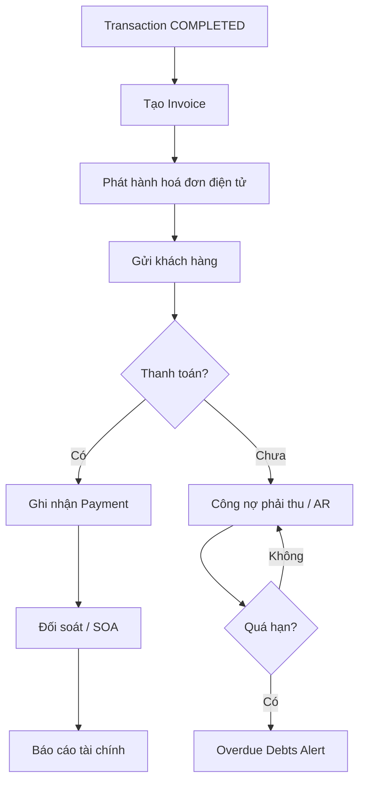

# Module — Accounting

> Schema: [schema/accounting.md](../schema/accounting.md) | API: [api/accounting.md](../api/accounting.md)

## Business Flow

## Invoice Status

| Status | Mô tả | Hành động tiếp theo |
|---|---|---|
| DRAFT | Đang soạn | Chỉnh sửa, Phát hành |
| ISSUED | Đã phát hành | Ghi nhận thanh toán, Huỷ |
| PAID | Đã thanh toán đủ | — |
| PARTIAL_PAID | Thanh toán một phần | Tiếp tục nhận thanh toán |
| CANCELLED | Đã huỷ | — |
| OVERDUE | Quá hạn thanh toán | Gửi reminder, chuyển debt collection |

## Advance Request Status

| Status | Mô tả |
|---|---|
| PENDING | Chờ duyệt |
| APPROVED | Đã duyệt, cần giải trình sau |
| REJECTED | Bị từ chối |
| SETTLED | Đã giải trình xong |

## Phase 1 vs Phase 2

| Operation | Phase 1 | Phase 2 |
|---|---|---|
| Xem công nợ, AR report (synced từ BF1) | ✓ | ✓ |
| P/L Sheet (read, synced) | ✓ | ✓ |
| Xem lịch sử thanh toán (synced) | ✓ | ✓ |
| Tạo Invoice mới | ✗ | ✓ |
| Phát hành hoá đơn điện tử | ✗ | ✓ |
| Ghi nhận Payment | ✗ | ✓ |
| Tạo / duyệt Advance Request | ✗ | ✓ |

## Business Rules

1. **Invoice từ Transaction:** Invoice chỉ tạo được khi Transaction ở trạng thái COMPLETED
2. **Multi-payment:** Một Invoice có thể có nhiều Payment record (partial payments)
3. **P/L auto-calculate:** P/L Sheet tự tính khi có đủ revenue và cost entries cho một Transaction
4. **Advance settlement:** Advance Request phải được giải trình (SETTLED) trước khi đóng Transaction
5. **Overdue detection:** Invoice tự chuyển OVERDUE khi due_date < ngày hiện tại và status != PAID
6. **SOA by ac_ref:** Statement of Account gom theo `partner.ac_ref` để bao gồm tất cả công ty trong cùng nhóm

## Màn hình liên quan

- Danh sách hoá đơn (filter by partner/status/date)
- Chi tiết hoá đơn + lịch sử thanh toán
- Công nợ phải thu (AR) — phân loại theo hạn thanh toán
- P/L Sheet theo lô hàng
- Báo cáo tài chính tổng hợp
- Advance Request management
