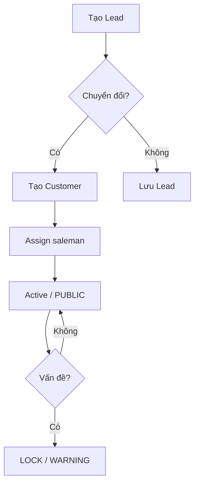

# Module — Catalogue

> Schema: [schema/catalogue.md](../schema/catalogue.md) | API: [api/catalogue.md](../api/catalogue.md)

## Business Flow

## Partner Status Lifecycle

| Status | Mô tả | Hành động cho phép |
|---|---|---|
| PUBLIC | Active, dùng được | Chọn trong Quotation/Booking/Invoice |
| WARNING | Cảnh báo, cần kiểm tra | Chọn được nhưng hiển thị cảnh báo |
| LOCK | Tạm khóa | Không thể chọn cho giao dịch mới |

## Phase 1 vs Phase 2

| Operation | Phase 1 | Phase 2 |
|---|---|---|
| Xem danh sách partner (synced từ BF1) | ✓ | ✓ |
| Tìm kiếm, filter partner | ✓ | ✓ |
| Tạo / cập nhật partner | ✗ | ✓ |
| Xem master data (country, port, currency) | ✓ | ✓ |
| Thêm / sửa master data | ✗ | ✓ |

## Business Rules

1. **Uniqueness:** Mỗi partner có `ac_ref` để liên kết công ty mẹ — dùng để gom công nợ theo nhóm trong SOA
2. **Multi-type:** Một đối tác có thể có nhiều category (vừa là CUSTOMER vừa là CARRIER)
3. **Agent priority:** Field `priority` (1-8) cho phép hệ thống tự chọn agent phù hợp theo thứ tự ưu tiên
4. **LOCK restriction:** Partner bị LOCK không được chọn trong Quotation/Booking/Invoice mới
5. **Lead conversion:** Lead chuyển thành Customer khi có đủ thông tin và được assign saleman

## Màn hình liên quan

- Danh sách đối tác (list + search + filter by type/status)
- Chi tiết đối tác (view/edit)
- Quản lý master data (country, currency, port/location)
- Quản lý user và phân quyền
