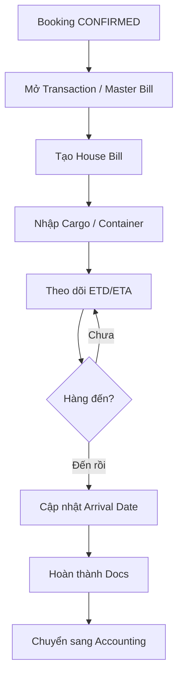

# Module — Documentation

> Schema: [schema/documentation.md](../schema/documentation.md) | API: [api/documentation.md](../api/documentation.md)

## Business Flow

## Transaction Status

| Status | Mô tả | Hành động tiếp theo |
|---|---|---|
| OPEN | Đang xử lý, hàng chưa rời cảng | Nhập thêm thông tin, tạo HBL |
| IN_TRANSIT | Hàng đang trên đường vận chuyển | Track, cập nhật ETA |
| ARRIVED | Hàng đã đến cảng đích | Xử lý chứng từ, delivery |
| COMPLETED | Hoàn tất — chuyển sang Accounting | Xuất hoá đơn |
| CANCELLED | Đã huỷ | — |

## House Bill Status

| Status | Mô tả |
|---|---|
| DRAFT | Đang nhập thông tin |
| CONFIRMED | Đã xác nhận thông tin hàng |
| ISSUED | Đã phát hành chứng từ |
| COMPLETED | Hoàn tất |
| SURRENDERED | Đã surrender bill (Sea) | — |
| TELEX_RELEASED | Đã telex release (Sea) | — |

## Phase 1 vs Phase 2

| Operation | Phase 1 | Phase 2 |
|---|---|---|
| Xem danh sách lô hàng (synced từ BF1) | ✓ | ✓ |
| Tra cứu, filter theo loại dịch vụ/trạng thái | ✓ | ✓ |
| Dashboard theo dõi ETD/ETA | ✓ | ✓ |
| Tạo Transaction / Master Bill | ✗ | ✓ |
| Tạo / cập nhật House Bill | ✗ | ✓ |
| Nhập cargo, container | ✗ | ✓ |
| Thay đổi trạng thái lô hàng | ✗ | ✓ |

## Business Rules

1. **Transaction mở từ Booking:** Transaction được tạo từ Booking CONFIRMED; một Booking → một Transaction
2. **Multi-HBL:** Một Transaction có thể có nhiều House Bill (nhiều khách hàng khác nhau trong cùng lô)
3. **Service-specific fields:** hawb_detail có các trường riêng biệt cho Sea (surrender bill, free time) và Logistics (tờ khai hải quan)
4. **State machine:** Transaction không thể quay lại trạng thái trước (COMPLETED → không về OPEN)
5. **Completion gate:** Transaction chỉ COMPLETED khi tất cả HBL đã COMPLETED

## Màn hình liên quan

- Danh sách lô hàng (theo loại dịch vụ: Air/Sea/Trucking/Logistics)
- Chi tiết lô hàng + Master Bill
- Danh sách House Bill theo lô hàng
- Chi tiết House Bill + cargo/container
- Dashboard tracking ETD/ETA
- Chứng từ (Documents checklist)
