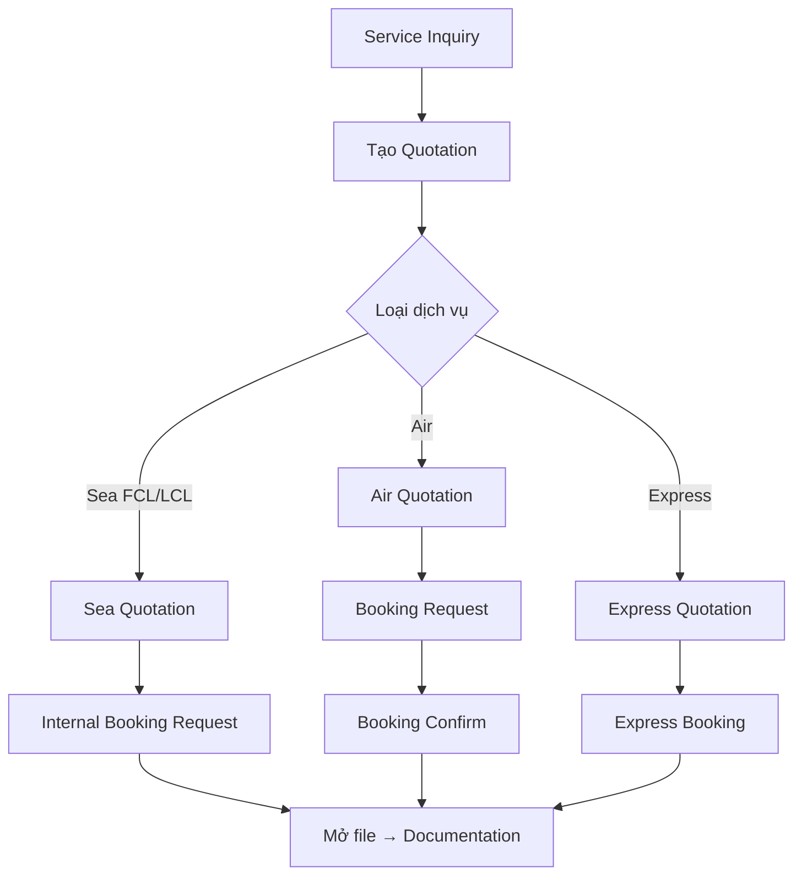

# Module — Sales

> Schema: [schema/sales.md](../schema/sales.md) | API: [api/sales.md](../api/sales.md)

## Business Flow

## Quotation Status

| Status | Mô tả | Hành động tiếp theo |
|---|---|---|
| DRAFT | Đang soạn | Chỉnh sửa, xoá, Gửi |
| SENT | Đã gửi khách | Chờ phản hồi, Accept, Reject |
| ACCEPTED | Khách chấp nhận | Tạo Booking |
| REJECTED | Khách từ chối | Không thể tạo Booking |
| EXPIRED | Hết hạn (valid_to < today) | Không thể tạo Booking |

## Booking Status

| Status | Mô tả | Hành động tiếp theo |
|---|---|---|
| PENDING | Chờ xác nhận | Confirm, Cancel |
| CONFIRMED | Đã xác nhận | Mở file sang Docs, Cancel |
| CANCELLED | Đã huỷ | — |
| CLOSED | Đã mở file sang Documentation | — |

## Phase 1 vs Phase 2

| Operation | Phase 1 | Phase 2 |
|---|---|---|
| Xem quotation, booking (synced từ BF1) | ✓ | ✓ |
| Tìm kiếm, filter theo trạng thái | ✓ | ✓ |
| Tạo Service Inquiry | ✗ | ✓ |
| Tạo / cập nhật Quotation | ✗ | ✓ |
| Tạo / confirm / cancel Booking | ✗ | ✓ |
| Xem Vessel Schedule (synced) | ✓ | ✓ |

## Business Rules

1. **Booking từ Quotation:** Booking chỉ được tạo từ Quotation có status ACCEPTED
2. **Air vs Sea booking:** Air dùng 2 bước (Request → Confirm), Sea/Internal dùng 1 bước trực tiếp
3. **Quotation expiry:** Quotation tự chuyển EXPIRED khi valid_to < ngày hiện tại
4. **Multi-currency:** Quotation hỗ trợ nhiều loại tiền tệ, exchange rate lấy từ settings_currency
5. **POL/POD validation:** pol_code và pod_code phải tồn tại trong settings_location

## Màn hình liên quan

- Danh sách báo giá (filter by type/status/customer/date range)
- Chi tiết báo giá + bảng giá (rates)
- Tạo/chỉnh sửa báo giá
- Danh sách booking
- Lịch tàu/chuyến bay (vessel schedule)
- Service Inquiry management
