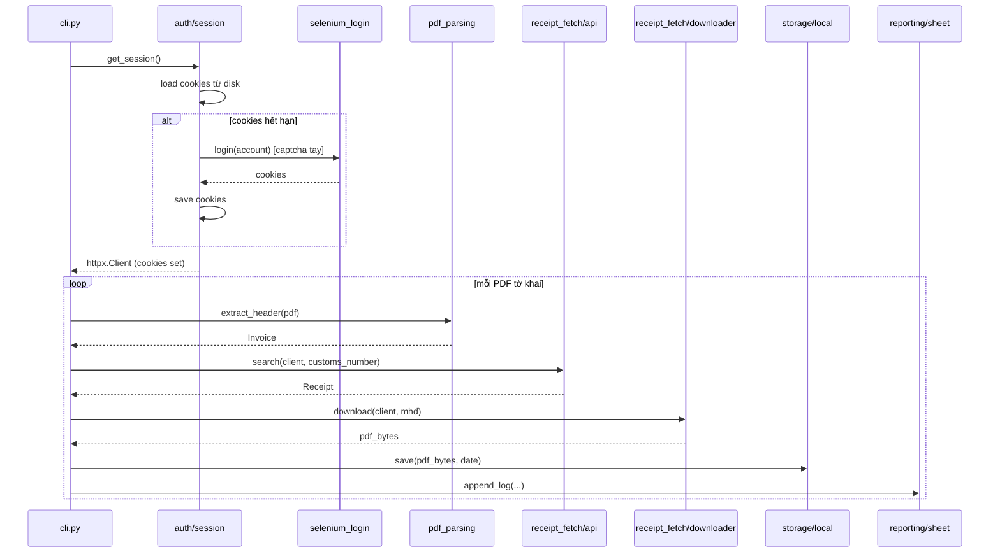

# Customs Receipt Bot v5 — Modular + HTTP-first Design

**Date:** 2026-04-07
**Project:** customs-receipt-bot
**Status:** Approved, ready for implementation plan

## 1. Mục tiêu & Scope

**Giữ:**
- Desktop CLI (không chuyển client-server)
- PyInstaller build
- Selenium cho login (captcha nhập tay)
- Google Sheet logging
- Local storage theo ngày (`~/Desktop/customs/<dd-mm-yyyy>/`)

**Đổi:**
- Sau khi login Selenium → extract cookies → dùng `httpx` thuần cho mọi API call + download PDF
- Refactor codebase theo cấu trúc feature-based
- Thêm pydantic models, pytest, loguru
- Replace `pdfminer.six` → `pymupdf` (fitz)
- Xóa `pyodbc` (chỉ có dòng `import`, không dùng)

**Out of scope:**
- Client-server architecture
- Web UI multi-user
- Đổi sang Playwright
- Tự động giải captcha

## 2. Cấu trúc thư mục (feature-based)

```
customs_receipt_bot/
├── pyproject.toml              # thay requirements.txt
├── src/customs_bot/
│   ├── __main__.py             # entry: python -m customs_bot
│   ├── cli.py                  # argparse, orchestration
│   ├── config.py               # pydantic Settings
│   ├── logging.py              # loguru setup
│   │
│   ├── shared/
│   │   ├── models.py           # Account, Invoice, Receipt, BatchResult
│   │   ├── http.py             # httpx.Client factory
│   │   └── paths.py
│   │
│   ├── features/
│   │   ├── auth/
│   │   │   ├── selenium_login.py    # CHỈ login → trả cookies
│   │   │   ├── session.py           # cookie persist, refresh
│   │   │   ├── account_pool.py
│   │   │   └── tests/
│   │   ├── pdf_parsing/
│   │   │   ├── parser.py            # pymupdf + regex
│   │   │   ├── extractors.py
│   │   │   └── tests/
│   │   ├── receipt_fetch/
│   │   │   ├── api_client.py        # httpx
│   │   │   ├── downloader.py        # httpx stream
│   │   │   ├── pipeline.py
│   │   │   └── tests/
│   │   ├── storage/
│   │   │   ├── local.py
│   │   │   └── tests/
│   │   └── reporting/
│   │       ├── sheet_client.py
│   │       └── tests/
│   └── build/
│       └── pyinstaller_build.py
└── tests/
    ├── conftest.py
    └── e2e/
```

**Nguyên tắc:**
- Mỗi feature self-contained, có `tests/` riêng
- Cross-feature qua `shared/`
- Features không import nhau trực tiếp — orchestrate qua `cli.py`

## 3. Flow chính



**Điểm chính:**
- Selenium chạy 1 lần/phiên (hoặc khi cookies hết hạn) → đóng Chrome ngay
- httpx nhanh hơn 5-10x Selenium navigation
- Cookies persist giữa các lần chạy CLI

## 4. Library changes

| Hiện tại | Thay bằng | Lý do |
|---|---|---|
| `requests` | `httpx` | HTTP/2, pool, sẵn sàng async |
| `pdfminer.six` | `pymupdf` (fitz) | ~10x nhanh, table extraction (AGPL OK vì nội bộ) |
| `selenium 4.1` | `selenium 4.25+` | Upgrade version |
| `print` ad-hoc | `loguru` | Structured log, rotation |
| (none) | `pydantic v2` | Validate config + models |
| 2 file test rời | `pytest` + `pytest-mock` + `respx` | Test framework |
| `requirements.txt` | `pyproject.toml` | Modern packaging |
| `pyodbc` | **xóa** | Không dùng |

Giữ: `webdriver-manager`, `tenacity`, `google-api-python-client`, `pyinstaller`, `Pillow`, `openpyxl`.

## 5. Testing strategy

- Unit tests mỗi feature trong `features/*/tests/`
- `pdf_parsing`: PDF samples anonymized trong `tests/fixtures/`
- `receipt_fetch/api_client`: mock httpx bằng `respx`
- `storage`: `tmp_path` fixture
- **Không test:** `selenium_login` (smoke test thủ công)
- Coverage target: 70%+ non-selenium code
- (Optional) GitHub Actions: pytest + ruff trên PR

## 6. Migration plan (phase-based, mỗi phase 1 PR)

**Phase 0 — Setup**
- `pyproject.toml`, migrate deps, xóa `pyodbc`
- Setup pytest, ruff, loguru, pydantic
- Skeleton `src/customs_bot/` + `shared/models.py`
- Code cũ vẫn chạy song song

**Phase 1 — Bóc tách features (no behavior change)**
- Move `pdf_invoice_parser.py` → `features/pdf_parsing/parser.py` + tests
- Move `local_storage_utils.py` → `features/storage/local.py` + tests
- Move `google_sheet_utils.py` → `features/reporting/sheet_client.py`
- Move login parts → `features/auth/`
- Dùng pydantic models cho data passing

**Phase 2 — Bỏ Selenium navigation (core change)**
- `auth/session.py`: extract cookies từ driver, đóng Chrome
- `receipt_fetch/api_client.py`: httpx client, replace `custom_api_client.py`
- `receipt_fetch/downloader.py`: httpx stream, replace Selenium download
- E2E test với 1 PDF thật

**Phase 3 — Replace pdfminer → pymupdf**
- Rewrite `parser.py` dùng `fitz`
- Snapshot tests để đảm bảo output identical
- Benchmark before/after

**Phase 4 — Cleanup**
- Xóa code cũ
- Update `build.py` → `build/pyinstaller_build.py`
- Update README

## 7. Risks & mitigations

| Risk | Impact | Mitigation |
|---|---|---|
| Cookies từ Selenium không work với httpx (UA/header mismatch) | Cao | Spike test đầu Phase 2: login → dump cookies → 1 httpx call. Copy UA + headers nếu fail |
| ASP.NET check `__VIEWSTATE` cho mọi request | TB | Inspect DevTools trước. Fetch trang để lấy viewstate nếu cần |
| `pymupdf` output khác `pdfminer` → regex fail | TB | Snapshot tests trước khi swap |
| PyInstaller bundle `pymupdf` lỗi native deps | Thấp-TB | Test build sớm Phase 0 với dummy import |
| Cookies hết hạn giữa batch | Thấp | `session.py` detect 401 → re-login + retry |
| Refactor làm vỡ production flow | Cao | Mỗi phase 1 PR, entry point cũ chạy song song đến Phase 4 |

## Open questions (none — all resolved during brainstorm)

## Next step

Invoke `writing-plans` skill để tạo implementation plan chi tiết cho Phase 0 trước.
