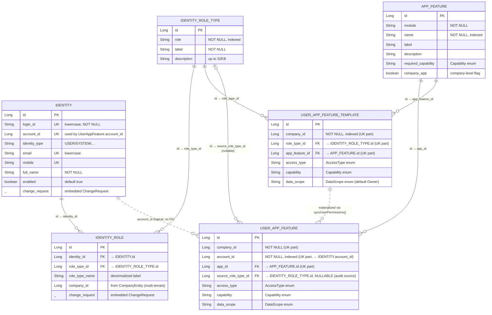

# Identity + App Feature ERD — platform-federation

> Module: `of1-core/module/platform-federation`
> Packages: `datatp.platform.identity.entity`, `datatp.platform.resource.entity`
> Date: 2026-04-10

## Scope

- Identity core: `Identity`, `IdentityRole`, `IdentityRoleType`
- App feature / permission: `AppFeature`, `UserAppFeature`, `UserAppFeatureTemplate`
- **Out of scope** (tạm chưa dùng): `IdentityGroup`, `IdentityMembership`

---

## ERD



**Legend:**
- `||--o{` — hard FK constraint (mandatory)
- `|o--o{` — optional FK constraint (nullable column)
- `||..o{` — logical/behavioral link, **no DB foreign key**

---

## Audit source column: `source_role_type_id`

Để trả lời câu hỏi **"permission này từ role type nào, hay là custom?"** — thêm 1 cột nullable `source_role_type_id` vào `security_user_app_feature`:

| Value | Ý nghĩa |
|-------|---------|
| `NULL` | **CUSTOM** — admin gán permission thủ công, sync không được xoá |
| `NOT NULL` | **Từ role type** — reference `identity_role_type.id` đã sinh ra row qua template |

**Tại sao `role_type_id` thay vì `identity_role_id`?**

- Câu hỏi audit là "từ role **type** nào" → trả lời thẳng bằng role type
- `IdentityRoleType` là master data stable, không bị xoá-tạo lại như `IdentityRole` instance
- Template đã key theo `role_type_id` → natural match
- Khi user mất 1 `IdentityRole` nhưng còn role khác cùng `roleTypeId` → không cần update cột

---

## Lookup path (full flow)

```
IdentityRole ──(role_type_id)──→ IdentityRoleType ──(role_type_id)──→ UserAppFeatureTemplate
                                        │                                    │
                                        │                            (app_feature_id)
                                        │                                    ▼
                                        │                               AppFeature
                                        │                                    ▲
                                        │                                (app_id)
                                        │                                    │
                              (source_role_type_id)  ───────────────→ UserAppFeature
                                                                             ▲
                                                                   (account_id, logical)
                                                                             │
                                                                        Identity
```

---

## Sync logic (target implementation)

File: `UserAppFeatureTemplateLogic.syncUserPermissions`

```java
public void syncUserPermissions(
    ClientContext ctx,
    Long companyId,
    Long accountId,
    List<Long> roleTypeIds
) {
  List<UserAppFeature> existing =
      userAppFeatureRepo.findAppPermissionByAccountId(companyId, accountId);

  // CUSTOM rows (source_role_type_id IS NULL) are never touched by sync
  List<UserAppFeature> roleSourced = existing.stream()
      .filter(p -> p.getSourceRoleTypeId() != null)
      .toList();

  if (roleTypeIds.isEmpty()) {
    if (!roleSourced.isEmpty()) userAppFeatureRepo.deleteAll(roleSourced);
    return;
  }

  List<UserAppFeatureTemplate> templates =
      templateRepo.findByRoleTypeIdIn(companyId, roleTypeIds);

  // Index existing role-sourced rows by appId
  Map<Long, UserAppFeature> bySourcedAppId = roleSourced.stream()
      .collect(Collectors.toMap(UserAppFeature::getAppId, p -> p, (p1, p2) -> p1));

  Set<Long> validAppIds = new HashSet<>();
  List<UserAppFeature> toSave = new ArrayList<>();

  for (UserAppFeatureTemplate template : templates) {
    validAppIds.add(template.getAppFeatureId());
    UserAppFeature current = bySourcedAppId.get(template.getAppFeatureId());

    if (current == null) {
      // Insert new role-sourced row
      UserAppFeature fresh = new UserAppFeature();
      fresh.setAppId(template.getAppFeatureId());
      fresh.setAccountId(accountId);
      fresh.setCompanyId(companyId);
      fresh.setSourceRoleTypeId(template.getRoleTypeId());   // ← tag source
      fresh.setAccessType(template.getAccessType());
      fresh.setCapability(template.getCapability());
      fresh.setDataScope(template.getDataScope());
      fresh.set(ctx);
      toSave.add(fresh);
    } else {
      // Refresh existing role-sourced row from latest template values
      current.setSourceRoleTypeId(template.getRoleTypeId());
      current.setAccessType(template.getAccessType());
      current.setCapability(template.getCapability());
      current.setDataScope(template.getDataScope());
      toSave.add(current);
    }
  }

  if (!toSave.isEmpty()) userAppFeatureRepo.saveAll(toSave);

  // Delete role-sourced rows no longer backed by a template
  List<UserAppFeature> toDelete = roleSourced.stream()
      .filter(p -> !validAppIds.contains(p.getAppId()))
      .toList();
  if (!toDelete.isEmpty()) userAppFeatureRepo.deleteAll(toDelete);
}
```

**Key guarantees:**

- Rows có `source_role_type_id IS NULL` (CUSTOM) **không bao giờ bị xoá** bởi sync
- Rows có `source_role_type_id IS NOT NULL` luôn được refresh từ template mới nhất
- Xoá role type → tất cả rows có `source_role_type_id` đó được xoá (cascade qua logic, xem section "Cascade" bên dưới)

---

## Audit query

**Single query trả lời "permission của user X đến từ đâu":**

```sql
SELECT
  uaf.id,
  uaf.app_id,
  af.module,
  af.name                AS app_name,
  uaf.capability,
  uaf.data_scope,
  uaf.access_type,
  CASE
    WHEN uaf.source_role_type_id IS NULL THEN 'CUSTOM'
    ELSE rt.role
  END                    AS source,
  rt.label               AS source_role_label
FROM security_user_app_feature uaf
JOIN security_app_feature af      ON af.id = uaf.app_id
LEFT JOIN identity_role_type rt   ON rt.id = uaf.source_role_type_id
WHERE uaf.account_id = ?
  AND uaf.company_id = ?
ORDER BY af.module, af.name;
```

Kết quả ví dụ:

| app_id | app_name | capability | source    | source_role_label |
|-------:|---------|-----------|-----------|-------------------|
| 1 | crm.customers  | ReadWrite | `ADMIN` | Administrator |
| 5 | fms.dashboard  | Read      | `STAFF` | Staff |
| 9 | fms.reports    | Write     | `CUSTOM` | *(null)* |

---

## Cascade behavior

| Operation | Effect on `security_user_app_feature` |
|-----------|----------------------------------------|
| Delete `IdentityRoleType` | All rows có `source_role_type_id = deleted.id` được xoá trong `IdentityLogic.deleteRoleTypes` |
| Delete `IdentityRole` (không phải role type) | Sync lại: gọi `syncUserPermissions(ctx, companyId, accountId, remainingRoleTypeIds)` cho account liên quan |
| Admin manual set permission | Set `source_role_type_id = NULL` → protected from sync |
| Template thay đổi | Gọi `syncUserPermissions` để refresh các row bị ảnh hưởng |

---

## Multi-role conflict resolution

Scenario: user có `IdentityRole` cho cả `ADMIN` và `AUDITOR`, cả 2 templates đều có entry cho `app_feature_id = 5`.

Unique constraint `(company_id, account_id, app_id)` → chỉ 1 row duy nhất cho app 5 → chỉ 1 `source_role_type_id` được lưu.

**Resolution strategy** (in sync logic): **last template iteration wins**.

- Template thứ hai iterate sẽ override row từ template trước (do đi qua nhánh `else` — refresh)
- Không lý tưởng nhưng deterministic khi templates được sort stable
- Nếu muốn merge capability (MAX) thì thêm logic trong nhánh `else`

**Ghi chú thực tế**: hiện tại chưa có requirement cho capability merge → giữ đơn giản, last wins. Khi cần sẽ extend.

---

## Trade-off (before vs after)

| Aspect | Before (no column) | After (`source_role_type_id`) |
|--------|-------------------|-------------------------------|
| Snapshot independence | ✅ | ✅ |
| Hot-path permission lookup O(1) | ✅ | ✅ không ảnh hưởng |
| Manual override support | ✅ any row editable | ✅ NULL flag được bảo vệ |
| Audit "từ role type nào" | ❌ phải join 4 bảng | ✅ 1 LEFT JOIN, dùng index |
| Distinguish custom vs role-sourced | ❌ không thể | ✅ IS NULL check |
| Cascade delete role type | ❌ manual | ✅ delete by `source_role_type_id` |
| Migration cost | — | 1 cột + 1 index + update sync |

---

## Tables Overview

### Identity domain (`datatp.platform.identity.entity`)

| Table | Purpose | Unique / Index |
|-------|---------|----------------|
| `identity_identity` | Core identity (user/system/service account) | UK `login_id`, UK `email`, UK `mobile` |
| `identity_role` | Identity ↔ role type, scoped by company | UK `(identity_id, role_type_id, company_id)` |
| `identity_role_type` | Master data of role types (system-wide, no company) | Index `role` |

### App feature domain (`datatp.platform.resource.entity`)

| Table | Purpose | Unique / Index |
|-------|---------|----------------|
| `security_app_feature` | Catalog of app features/modules | Index `name` |
| `security_user_app_feature` | Per-user permission grant on 1 feature | UK `(company_id, account_id, app_id)`; Index `source_role_type_id` |
| `security_user_app_feature_template` | Per-role-type default permissions | UK `(company_id, app_feature_id, role_type_id)` |

> `AppFeaturePermission` **không phải entity** — DTO/view class implementing `IFeaturePermission`, dùng ở query layer.

> `identity_group` và `identity_membership` tạm thời chưa dùng — đã bỏ khỏi ERD này.

---

## Relationship Details

### A. Direct FK relationships (5 mandatory)

| # | From | Cardinality | To | Column |
|---|------|------------|----|--------|
| 1 | `Identity` | 1 — N | `IdentityRole` | `identity_role.identity_id → identity.id` |
| 2 | `IdentityRoleType` | 1 — N | `IdentityRole` | `identity_role.role_type_id → identity_role_type.id` |
| 3 | `IdentityRoleType` | 1 — N | `UserAppFeatureTemplate` | `user_app_feature_template.role_type_id → identity_role_type.id` |
| 4 | `AppFeature` | 1 — N | `UserAppFeature` | `user_app_feature.app_id → app_feature.id` |
| 5 | `AppFeature` | 1 — N | `UserAppFeatureTemplate` | `user_app_feature_template.app_feature_id → app_feature.id` |

### B. Optional FK (nullable) — audit source

| # | From | Cardinality | To | Column |
|---|------|------------|----|--------|
| 6 | `IdentityRoleType` | 0..1 — N | `UserAppFeature` | `user_app_feature.source_role_type_id → identity_role_type.id` **NULLABLE** |

- `NULL` ⇒ custom (admin gán tay)
- `NOT NULL` ⇒ materialized từ template của role type này

### C. Logical links (no DB FK)

| # | From | To | Mechanism |
|---|------|----|-----------|
| 7 | `Identity` | `UserAppFeature` | `user_app_feature.account_id` convention-matches `identity.account_id` |
| 8 | `UserAppFeatureTemplate` | `UserAppFeature` | Materialized via `syncUserPermissions()` — template link được vật hoá qua `source_role_type_id + app_id` |

### D. Embedded

| Embeddable | Owners | Purpose |
|-----------|--------|---------|
| `ChangeRequest` | `Identity`, `IdentityRole` | Track ackStatus (`WAITING`/`PROCESSED`) cho Kafka sync protocol |

---

## Entity Invariants

| Entity | Invariant | Enforced Where |
|--------|-----------|----------------|
| `Identity` | `login_id`, `email` always lowercase | Setter override |
| `Identity` | `login_id`, `email`, `mobile` unique system-wide | DB unique |
| `IdentityRole` | 1 role type per identity per company | DB UK `(identity_id, role_type_id, company_id)` |
| `UserAppFeature` | 1 permission per `(company, account, app)` | DB UK `(company_id, account_id, app_id)` |
| `UserAppFeature.source_role_type_id` | Nullable FK to `identity_role_type.id`; NULL = CUSTOM | App-level (no DB FK constraint recommended — keep nullable flexible) |
| `UserAppFeatureTemplate` | 1 template per `(company, feature, role type)` | DB UK `(company_id, app_feature_id, role_type_id)` |
| `ChangeRequest.ackStatus` | `WAITING → PROCESSED` only | Only `IdentityEventLogic` flips |

---

## Enum Reference

| Enum | Values | Defined In |
|------|--------|-----------|
| `Capability` | `Read`, `Write`, `ReadWrite`, `Moderator` | `net.datatp.security.client.Capability` |
| `AccessType` | `Employee`, ... | `net.datatp.security.client.AccessType` |
| `DataScope` | `Owner`, `Group`, `Company`, `All` | `net.datatp.security.client.DataScope` |
| `ChangeRequest.AckStatus` | `WAITING`, `PROCESSED` | inner enum |
| `IdentityEventType` | `Create`, `Update`, `Delete`, `Sync` | enum file |

---

## Keycloak Link (logical, không phải FK)

```
identity_identity.login_id   ──→  Keycloak username
identity_identity.account_id ──→  of1-platform account system
identity_identity.email      ──→  Keycloak email
```

Password không lưu trong `identity_identity` — toàn bộ qua Keycloak admin client:
- `IdentityLogic.createKeycloakUserIfNotExists`
- `IdentityLogic.resetAccountPassword`
- `IdentityLogic.disabledIdentities`

---

## Implementation Checklist

- [x] **Entity**: thêm field `@Column(name = "source_role_type_id") private Long sourceRoleTypeId;` vào `UserAppFeature.java`
- [x] **Repository**: thêm `findBySourceRoleTypeId(Long)`, `deleteBySourceRoleTypeId(Long)` vào `AppPermissionRepository`
- [x] **Sync logic**: update `UserAppFeatureTemplateLogic.syncUserPermissions` theo pseudocode ở trên
- [x] **Cascade**: `IdentityLogic.deleteRoleTypes` gọi `permissionRepo.deleteBySourceRoleTypeId(id)` trước khi xoá `IdentityRoleType`
- [x] **DB migration SQL**: xem [`260410-user-app-feature-source-role-type-sql.md`](./260410-user-app-feature-source-role-type-sql.md) — PostgreSQL + MSSQL, rollback, backfill, verification queries
- [ ] **Audit query** (optional): thêm `findPermissionsWithSource(accountId, companyId)` trả về `List<SqlMapRecord>` dùng query trong section Audit
- [ ] **API docs**: update `wiki/projects/of1/identity.md` nếu có endpoint trả về permission source

---

## References

- Entity source: `module/platform-federation/src/main/java/datatp/platform/{identity,resource}/entity/`
- Sync logic: `datatp/platform/resource/logic/UserAppFeatureTemplateLogic.syncUserPermissions`
- Permission read path: `datatp/platform/resource/logic/AppLogic.getAppPermission`
- API docs: `/Users/nqcdan/dev/wiki/wiki/projects/of1/identity.md`
- Module guide: `of1-core/module/platform-federation/CLAUDE.md`
