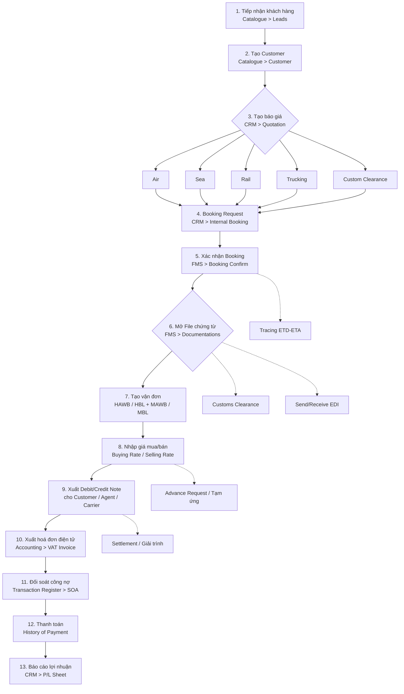
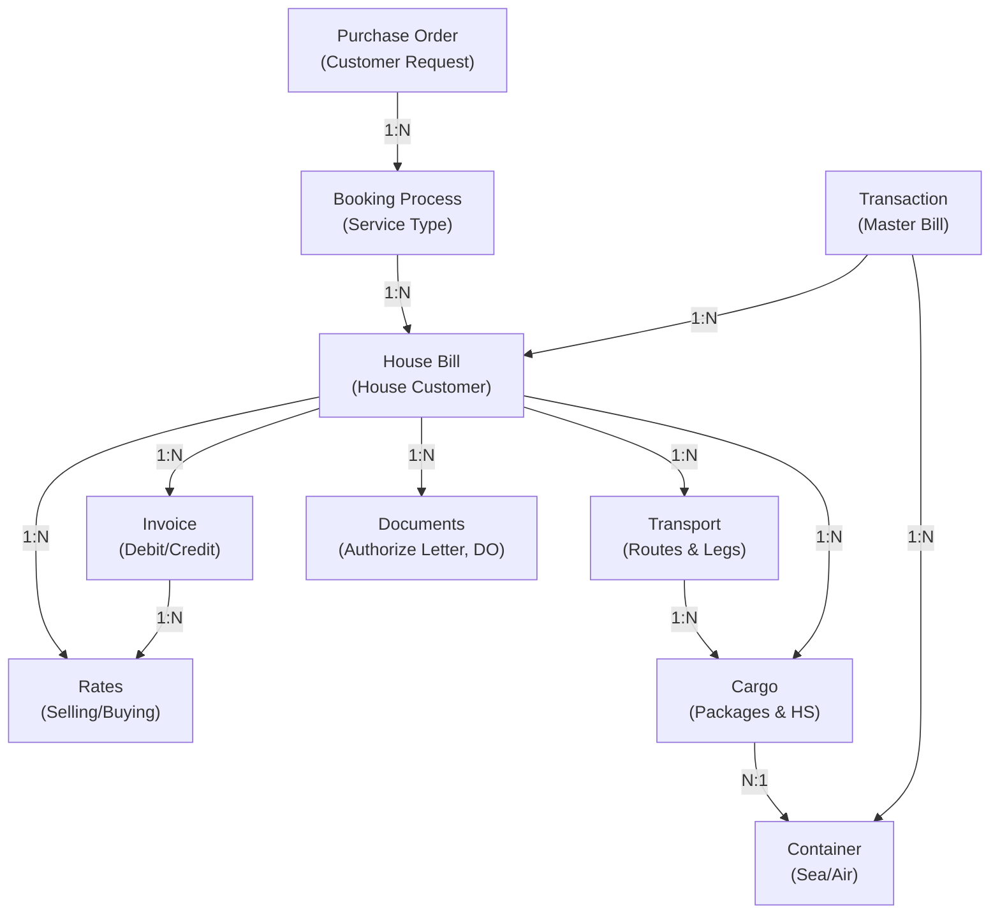

# Feature Specification

Tài liệu phân tích nghiệp vụ và đặc tả tính năng của hệ thống OF1 FMS.

See also: [[bf1-fms-01-overview]] · [[bf1-fms-03-data-model]]

---

## 1. Applications

| App | Purpose |
|-----|---------|
| **Catalogue** | Master Data — đối tác, cảng, container, danh mục |
| **CRM** | Sales Executive — báo giá, đặt chỗ, internal booking |
| **FMS** | Documentations — chứng từ, vận đơn, giá mua/bán, invoice |
| **Accounting** | Accounting — hoá đơn điện tử, công nợ, tạm ứng, báo cáo |

---

## 2. Business Process — Vòng đời lô hàng (13 bước)

Xem thêm: [[bf1-fms-01-overview|01-overview.md §3]] cho chi tiết Invoice Flow và Settlement Flow.

---

## 3. Core Features

### 3.1 Transaction Management (Quản lý lô hàng)

- Create shipment from booking request
- Track shipment status (draft, confirmed, in-transit, delivered, closed)
- Multiple service types: Air Export/Import, Sea FCL/LCL, Customs & Logistics, Inland Trucking, Cross Border
- Manage ETD/ETA and tracking events
- Support multiple house bills per shipment

**Entities:** `of1_fms_transactions`, `of1_fms_booking_process`

### 3.2 House Bill & Documentation

**House Bill:**
- Generate house bills (HAWB/HBL) per house customer
- Service-specific details (Air, Sea, Trucking, Logistics)
- Container tracking
- Cargo description, commodity classification, HS code
- Bill status workflow

**Documentation:**
- Authorize Letter, Delivery Order generation
- Document versioning and history (PDF snapshot with audit trail)
- Multi-language support (Vietnamese & English)
- Company info, shipper/consignee/notify party capture

**Entities:** `of1_fms_house_bill`, `of1_fms_house_bill_detail_base`, `of1_fms_air_house_bill_detail`, `of1_fms_sea_house_bill_detail`, `of1_fms_document_history`

### 3.3 Rate Management

**Selling Rates:** Charge tracking per house bill, multi-currency, VND equivalents, tax calculation.
**Buying Rates:** Vendor-based cost tracking, margin analysis, on-behalf-of handling.
**Other Charges:** Demurrage, detention, storage.

**Entities:** `of1_fms_hawb_rates`, `of1_fms_house_bill_invoice`, `of1_fms_house_bill_invoice_item`

### 3.4 Invoicing & Debit Notes

- Generate debit/credit notes
- Multi-party invoicing (customer, agent, carrier)
- Tax calculation and VAT handling
- Currency management with exchange rates
- Invoice status tracking and approval workflow
- Line-item breakdown by charge type
- Partial payment tracking, settlement reconciliation

**Entities:** `of1_fms_house_bill_invoice`, `of1_fms_house_bill_invoice_item`

### 3.5 Transportation & Tracking

**Transport Planning:** Multi-leg journey, route sequencing, carrier per leg, ETD/ETA per leg.
**Container Management:** Type, count, seal, weight/volume per container.
**Cargo Tracking:** Per-piece tracking, commodity, packaging, HS code, container linkage.

**Entities:** `of1_fms_transport_plan`, `of1_fms_transport_route`, `of1_fms_container`, `of1_fms_cargo`

### 3.6 Order & Booking Management

**Purchase Order:** Master order from customer, multiple bookings per order (phased shipments).
**Booking Process:** Service-type specific booking, link to PO, state tracking, close date.

**Entities:** `of1_fms_purchase_order`, `of1_fms_booking_process`

### 3.7 Payment Tracking

- Multiple payments per invoice item or full invoice
- Payment date and amount tracking
- Currency-specific payment records
- Payment history and reconciliation
- Settlement status tracking

---

## 4. System Entity Relationships

---

## 5. Audit & Compliance

All entities support common audit fields:

- `created_by` / `created_time` — creation audit
- `modified_by` / `modified_time` — modification audit
- `version` — optimistic locking
- `storage_state` — record lifecycle (`CREATED`, `ACTIVE`, `INACTIVE`, `JUNK`, `DEPRECATED`, `ARCHIVED`)
- `company_id` — multi-tenant isolation

---

## 6. Cross-Cutting Capabilities

- **Vietnamese Localization:** bilingual labels, regional compliance (VND, local tax codes)
- **Multi-Currency:** exchange rate management, domestic (VND) equivalents
- **Service Type Support:** Air, Sea FCL/LCL, customs, trucking, cross-border, warehouse
