# IV. Kế toán (Accounting)

## 1. Tạo hóa đơn điện tử mới (New VAT Invoice)

### a. Giới thiệu và hướng dẫn cách tạo 1 hóa đơn

**Tạo hóa đơn điện tử:**

Thực hiện các bước sau:

**Bước 1:** Chọn Accounting → New VAT Invoice

Hệ thống sẽ hiển thị form để tạo hóa đơn điện tử mới để xuất cho khách hàng. Để xuất được hóa đơn, ta cần nhập số job của file và số bill tương ứng trên file đó. Số hóa đơn điện tử sẽ tự động sinh ra.

**Bước 2:** Click "Add from list"

Hệ thống sẽ hiển thị bảng để chọn tên khách hàng hoặc tên số file cần xuất hóa đơn. Click chọn nút Filter sẽ hiển thị các dòng phí cần xuất hóa đơn. Tích chọn vào chi phí cần xuất ra hóa đơn, sau đó click chọn OK để xuất ra hóa đơn.

Sau khi OK, sẽ chuyển sang màn hình kiểm tra nội dung. Nếu thấy OK, ta click nút Save để lưu lên hệ thống.

**Cách tạo 1 hóa đơn kèm theo bảng kê:**

- **Bước 1:** Thực hiện các bước như đã hướng dẫn ở phía trên
- **Bước 2:** Nhập bằng tay thêm 1 dòng phần description ghi nội dung xuất cho bảng kê theo yêu cầu. Các trường khác ta nhập phần tổng của hóa đơn. Uncheck các chi phí trong hóa đơn.
- **Bước 3:** Check lại dòng mà ta đã nhập bằng tay vào hóa đơn, sau đó Save lại. Lúc ta Print Preview, hệ thống chỉ hiển thị các chi phí nào đã được tích.

Nếu muốn xuất hóa đơn, ta click chọn More → Issue E-Invoice.

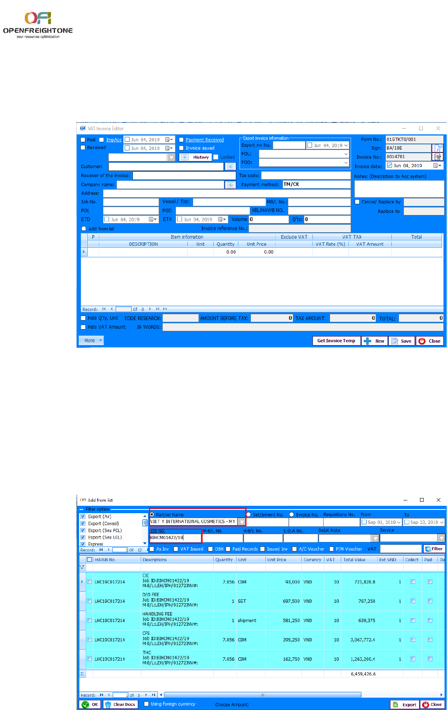

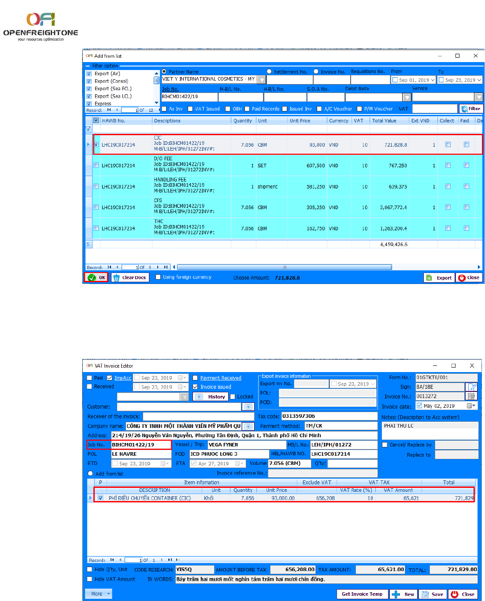

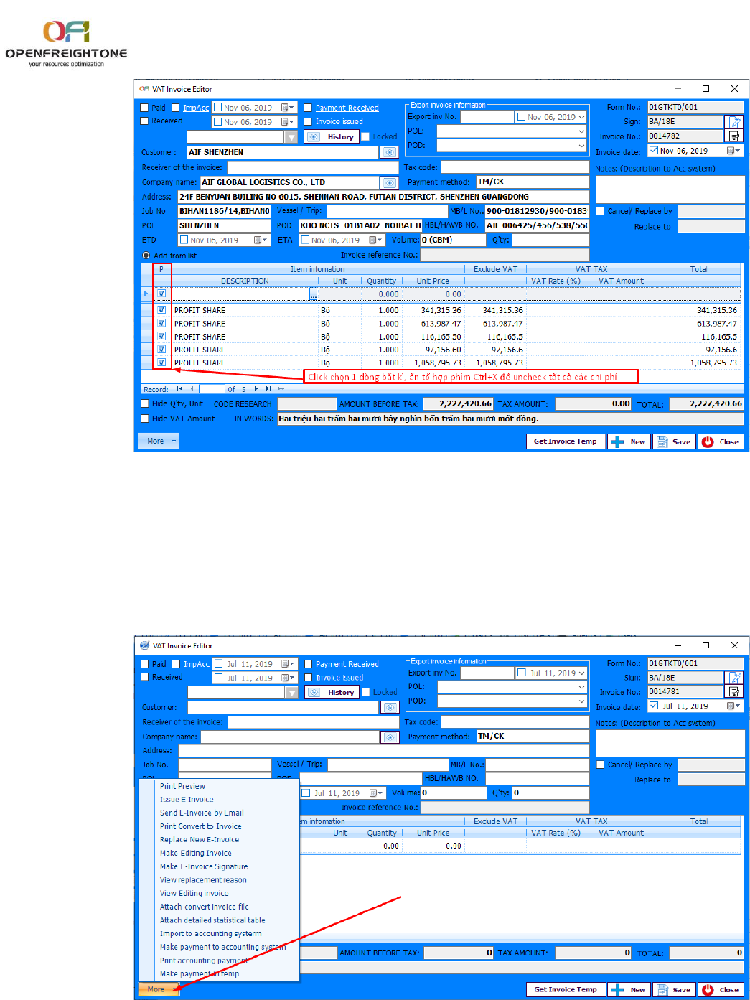

### b. Các công cụ

**More:**

- **Print Preview:** Xem bản hóa đơn nháp trước khi issue hoặc trước khi in.

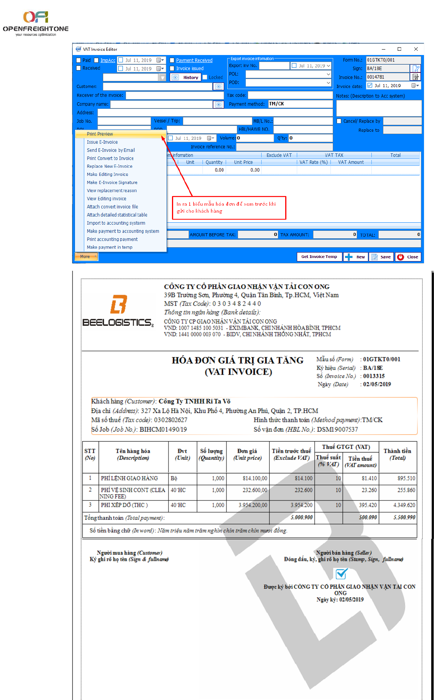

- **Issue E-Invoice:** Sau khi chọn sẽ xuất hiện hộp thoại. Đọc kĩ tùy chọn Yes hoặc No trước khi thực hiện thao tác trên hóa đơn.

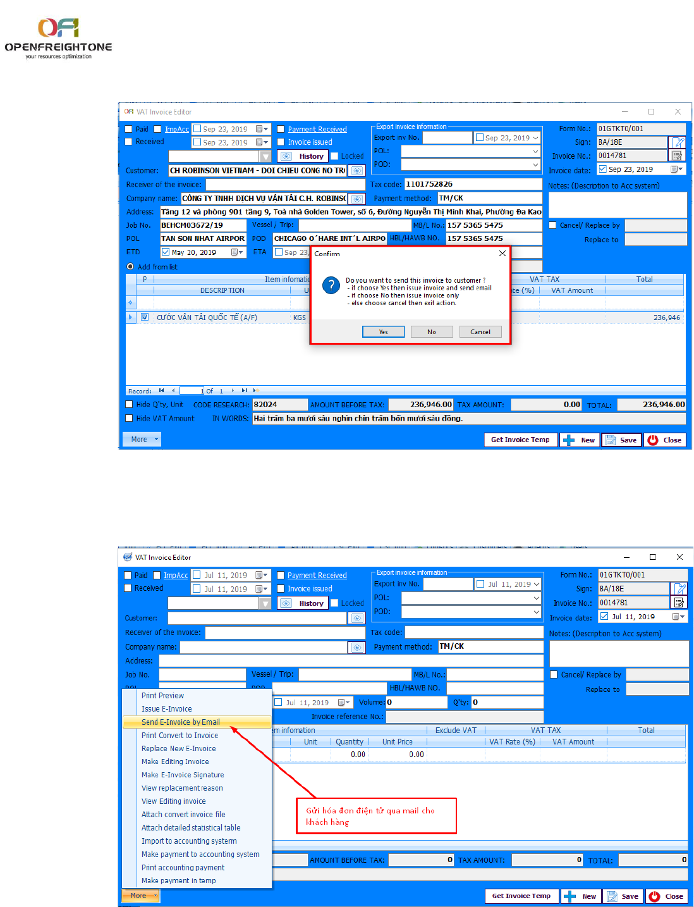

- **Send E-Invoice by mail:** Gửi mail có file PDF và file mã hóa XML cho khách hàng với điều kiện hóa đơn đã issue.

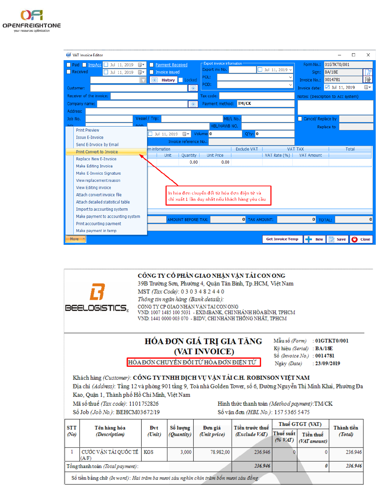

- **Print Convert to Invoice:** Chuyển hóa đơn điện tử thành hóa đơn chuyển đổi.

- **Replace New E-Invoice:** Dùng để xuất hóa đơn mới thay thế cho hóa đơn cũ bị hủy.

Quy trình thay thế hóa đơn:

1. Chọn hóa đơn cũ cần hủy: rã các chi phí bên trong hóa đơn cũ (Add from list, tích chọn chi phí, click Clear Docs để rã), sau đó click chọn nút Save để lưu thông tin đã chỉnh sửa của hóa đơn cũ.
2. Vào file cần chỉnh sửa và nhập vào giá mới của lô hàng.
3. Ở tại hóa đơn cũ cần hủy, chọn More → Replace New E-Invoice. Hệ thống sẽ xuất hiện 1 hóa đơn mới để thay thế cho hóa đơn cũ.
4. Sau đó click Add from list để lấy dữ liệu chi phí mới cần xuất và thực hiện các bước tiếp theo như đã hướng dẫn bên trên.
5. Sau khi hoàn thành công việc, trên hóa đơn cũ và hóa đơn mới sẽ có thể hiển thị mối liên hệ ở phần này.

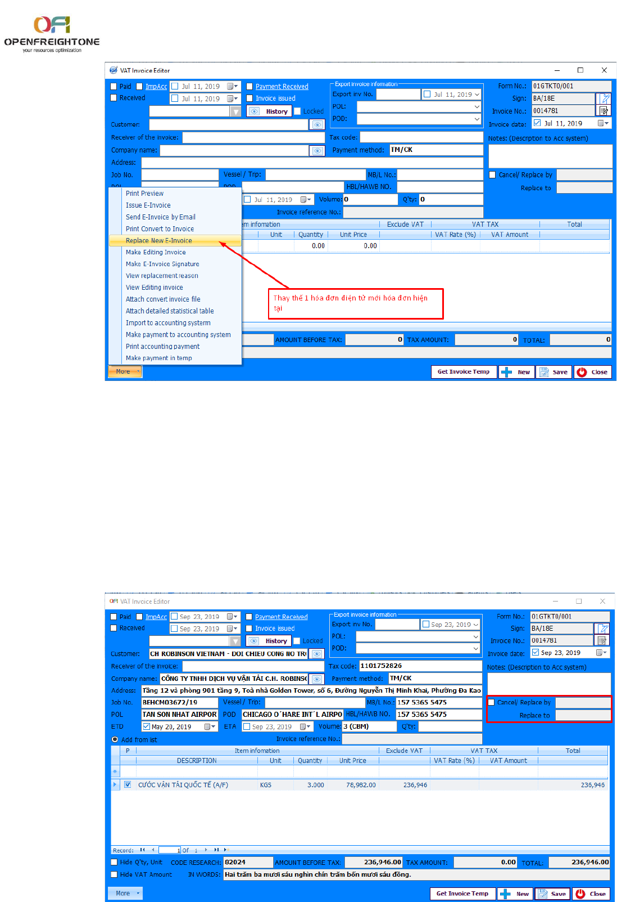

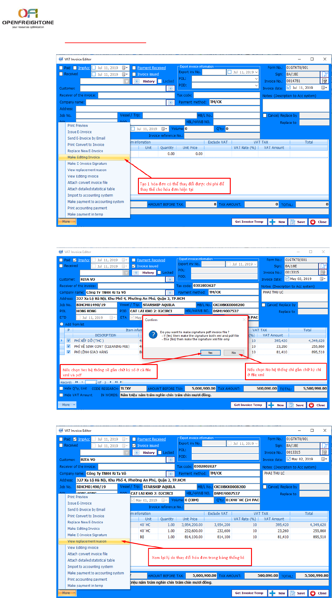

- **Make Editing Invoice:** Tạo hóa đơn điều chỉnh có giá trị và nội dung có thể thay đổi theo yêu cầu của khách hàng có hiệu lực như hóa đơn cũ.

- **Make E-Invoice Signature:** Ký điện tử cho hóa đơn.

- **View replacement reason:** Tạo, xem và in biên bản điều chỉnh hóa đơn.

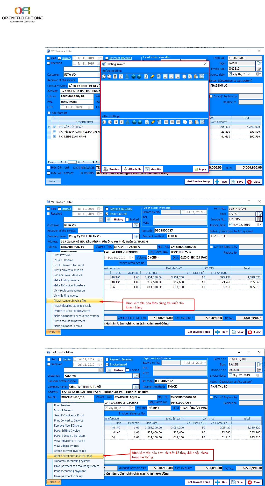

- **View Editing Invoice:** Tạo, xem và in biên bản điều chỉnh hóa đơn.

- **Attach convert invoice file:** Đính kèm file hóa đơn cứng để xuất cho khách hàng.

- **Attach detailed statistical table:** Đính kèm file bảng kê vào hóa đơn được lưu trong dữ liệu hệ thống.

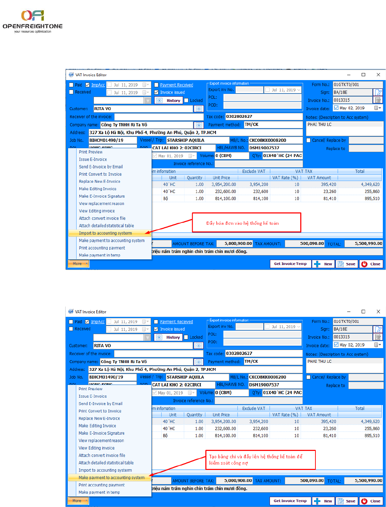

- **Import to Accounting System:** Đẩy hóa đơn vào trong hệ thống kế toán.

- **Make payment to accounting system:** Tạo bảng chi và đẩy lên hệ thống kế toán.

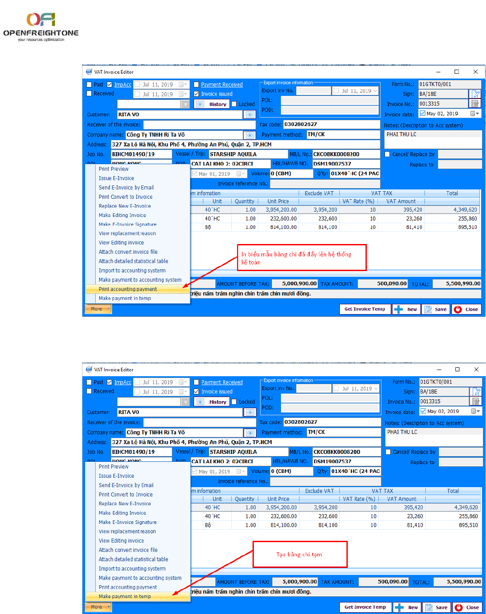

- **Print accounting payment:** In phiếu chi từ phần mềm kế toán.

- **Make payment in temp:** Tạo phiếu chi tạm thời.

- **Get Invoice Temp:** Xem trạng thái hóa đơn.

### c. Các lưu ý

**Cách khai báo hóa đơn:**

Click chọn Add New và điền các thông tin theo yêu cầu của màn hình. Nhớ click chọn Active kích hoạt hóa đơn đó mới có thể sử dụng được, sau đó chọn Save để lưu.

**Dành hóa đơn:**

Hệ thống cho phép dành hóa đơn theo nhu cầu.

**Xuất hóa đơn cho nhiều file:**

Có thể xuất hóa đơn cho nhiều file.

**Ứng dụng chức năng Clear Docs:**

Clear Docs được dùng để rã hóa đơn khi hủy hóa đơn hoặc khi cần chỉnh sửa hóa đơn chưa issue chính thức. Sau khi click chọn Clear Docs, hệ thống sẽ hiển thị hộp thoại để xác nhận.

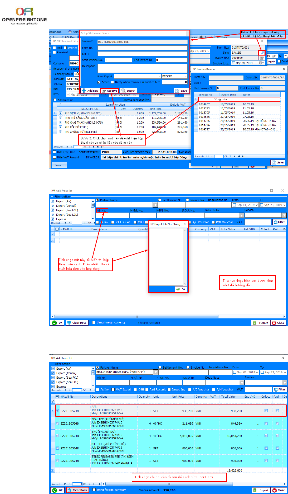

Click chọn OK để thực hiện công việc.

**Ký điện tử hàng loạt hóa đơn:**

Thực hiện ký điện tử theo hướng dẫn trên giao diện.

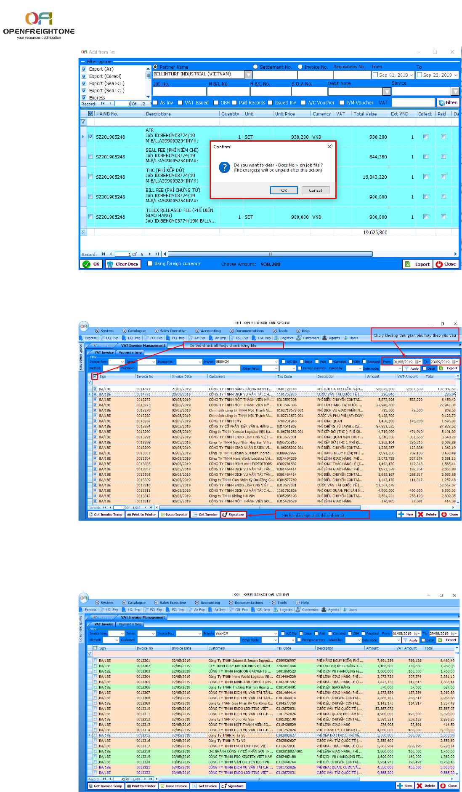

---

## 2. Quản lý hóa đơn thuế GTGT (VAT Invoice Management)

### a. Giới thiệu, cách tạo và xem chi tiết hóa đơn

Bảng bao gồm tất cả hóa đơn đã thanh toán, chưa thanh toán, đã issue hoặc chưa issue.

**Thực hiện:**

**Bước 1:** Chọn Accounting → VAT Invoice Management

**Bước 2:** Sau khi điền thông tin trường tương ứng, click chọn nút Apply để hệ thống lọc dữ liệu và xuất thông tin ra bảng bên dưới.

**Tạo hóa đơn:**

Click chọn nút New. Hệ thống sẽ hiển thị ra 1 form để nhập thông tin hóa đơn mới. Cách thực hiện công việc như đã hướng dẫn ở phần New VAT Invoice.

**Xem chi tiết 1 hóa đơn:**

Ta nhấp đôi vào hóa đơn cần xem, hệ thống sẽ hiển thị ra form bao gồm các thông tin của hóa đơn đó.

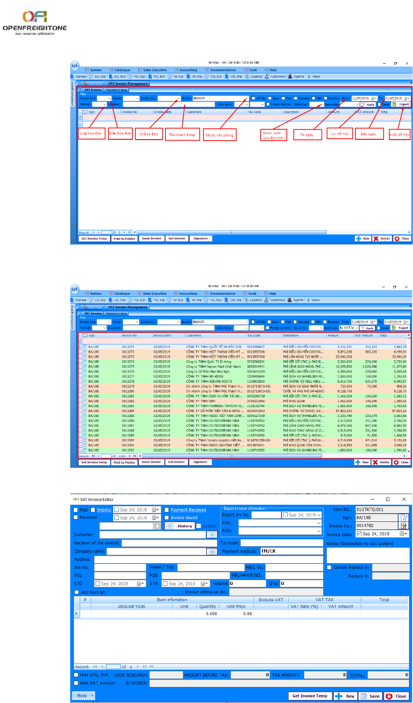

**Các trạng thái của hóa đơn:**

- Màu hồng: Đã issue hóa đơn nhưng chưa thanh toán.
- Màu xanh: Đã issue hóa đơn và khách hàng đã thanh toán.
- Màu đỏ: Hóa đơn không có link liên kết với file. Có thể là hóa đơn về chi phí quản lý hoặc hóa đơn bị hủy.

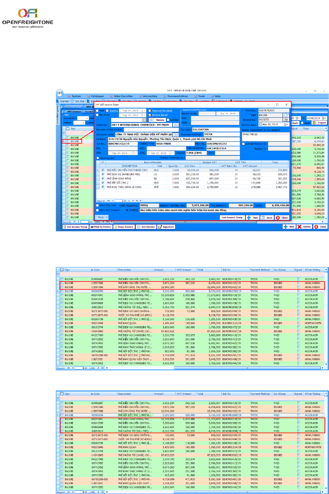

### b. Các công cụ

**Get Invoice Temp:** Xem hóa đơn đang tạo có người sử dụng hay chưa.

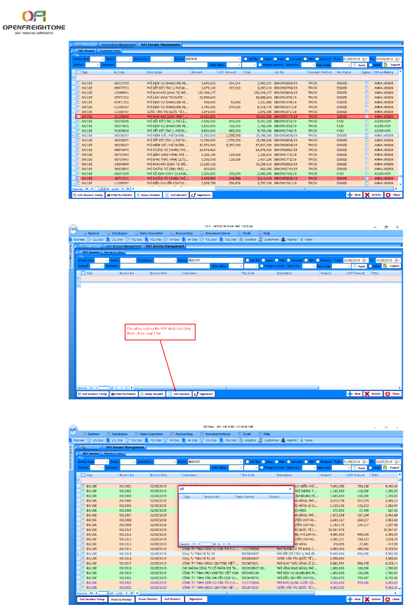

---

## 3. Quản lý phiếu thu phiếu chi (Accounting Management)

### a. Giới thiệu

Phần này quản lý các phiếu thu và phiếu chi trong hệ thống.

### b. Cách tạo và xem chi tiết 1 hóa đơn

**Thực hiện:**

**Bước 1:** Chọn Accounting → Accounting Management

**Bước 2:** Lọc dữ liệu theo trường tương ứng

**Bước 3:** Click chọn Apply để hệ thống lọc dữ liệu

Có thể tạo mới phiếu thu hoặc phiếu chi bằng cách click chọn nút New.

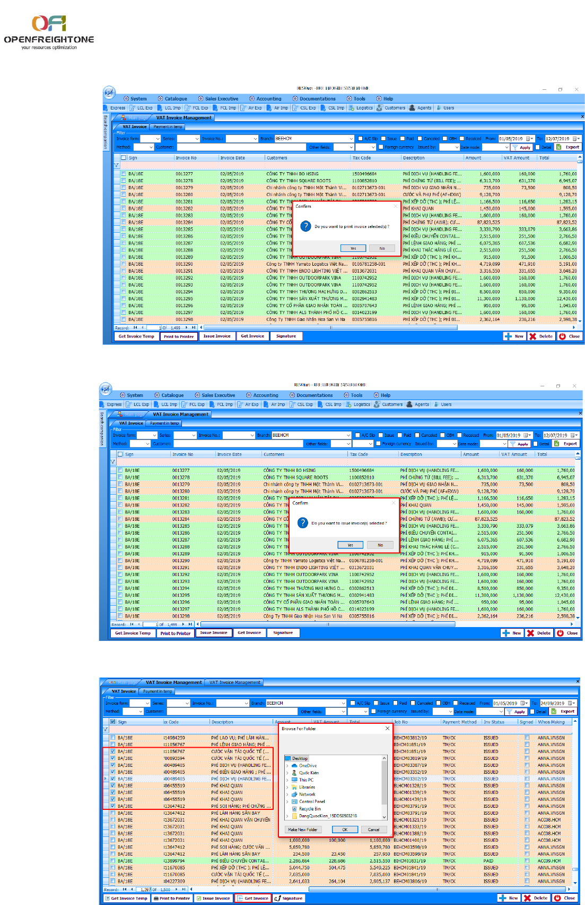

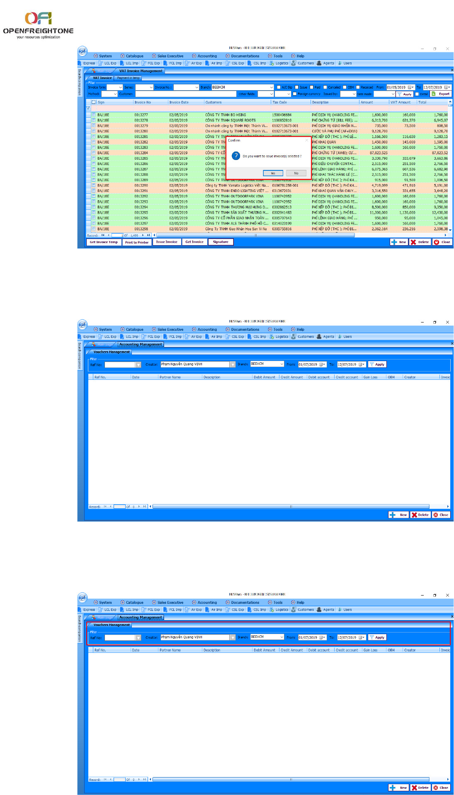

---

## 4. Quản lý công nợ (Transaction Register)

### a. Tab Invoice List

**Vị trí:** Accounting → Transaction Register → Invoice List

Bảng này hiển thị danh sách các hóa đơn và các giao dịch liên quan.

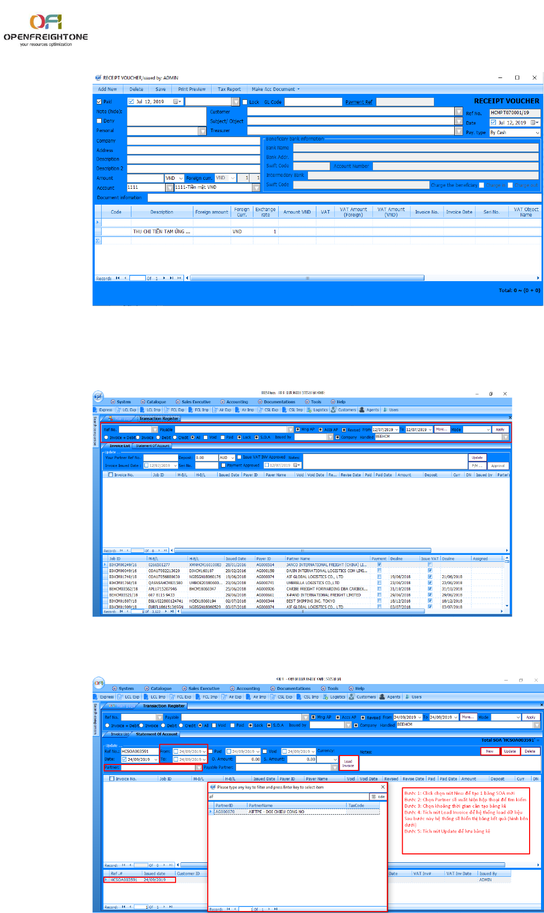

### b. Tab Statement Of Account

Được dùng để quản lý công nợ chi tiết của từng khách hàng.

---

## 5. Tạm ứng cho OP (Advance Request)

**Nội dung:**

Chức năng này cho phép tạo yêu cầu tạm ứng cho các operating partner.

**Thực hiện:**

Chọn Accounting → Advance Request

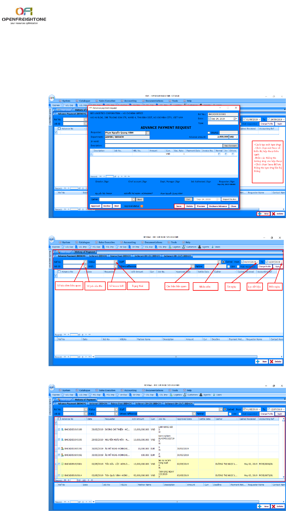

---

## 6. Quản lý tạm ứng (History of Payment)

### a. Tab Advance Payment

**Nội dung:**

Quản lý các khoản tạm ứng đã cấp.

**Thực hiện:**

Chọn Accounting → History of Payment → Tab Advance Payment

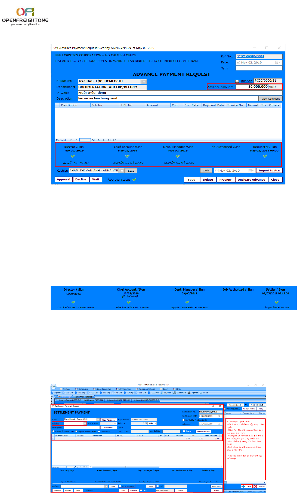

### b. Tab Settlement

**Nội dung:**

Quản lý quyết toán các khoản tạm ứng.

**Thực hiện:**

Chọn Accounting → History of Payment → Tab Settlement

Sau khi điền đầy đủ thông tin tương ứng, click chọn Apply để hệ thống lọc dữ liệu.

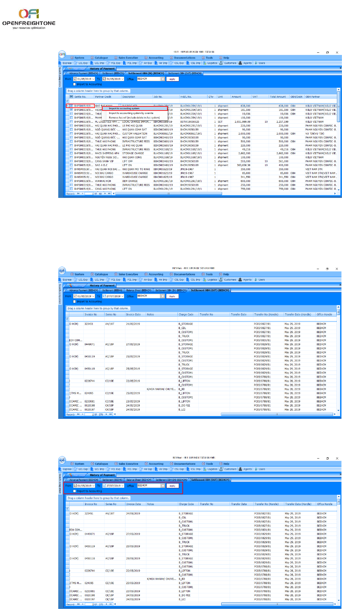

---

## 7. Kiểm soát Yêu cầu Thanh toán (Payment Request Control)

**Nội dung:**

Chức năng này cho phép kiểm soát các yêu cầu thanh toán trong hệ thống.

**Thực hiện:**

Chọn Accounting → Payment Request Control

Có thể lọc dữ liệu theo các trường tương ứng và click Apply để xem chi tiết các yêu cầu thanh toán.

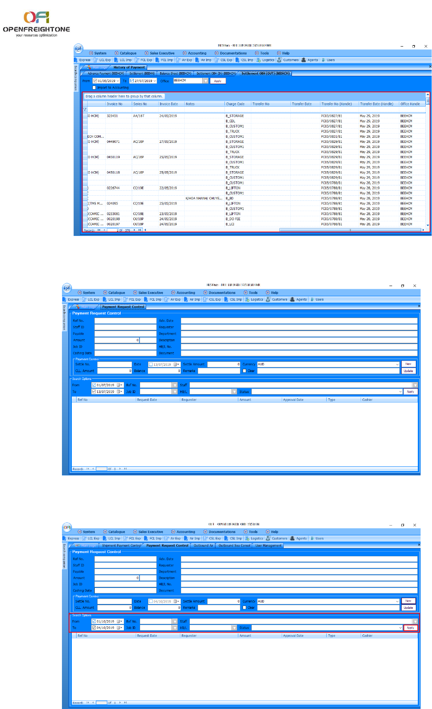

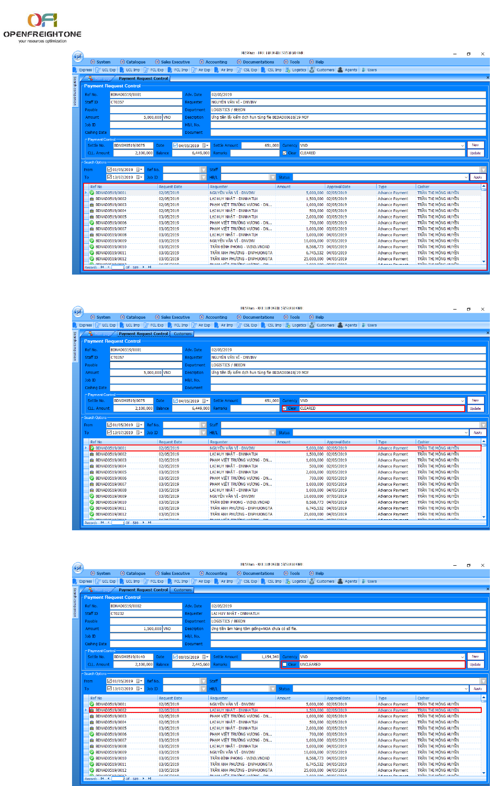

---

## 8. Kiểm soát Thanh toán Vận chuyển (Shipment Payment Control)

**Nội dung:**

Quản lý và kiểm soát các khoản thanh toán liên quan đến vận chuyển.

**Thực hiện:**

Chọn Accounting → Shipment Payment Control

Ta có thể lựa chọn các chi phí để xuất ra cho đại lý bằng các tích chọn những chi phí ở bảng bên dưới, sau đó click chuột phải chọn New Payment Voucher. Hệ thống sẽ hiển thị 1 form bao gồm đầy đủ thông tin chi phí và đại lý.

Kiểm tra lại các chi phí 1 lần nữa nếu không có gì chỉnh sửa, ta click chọn Save để lưu thông tin.

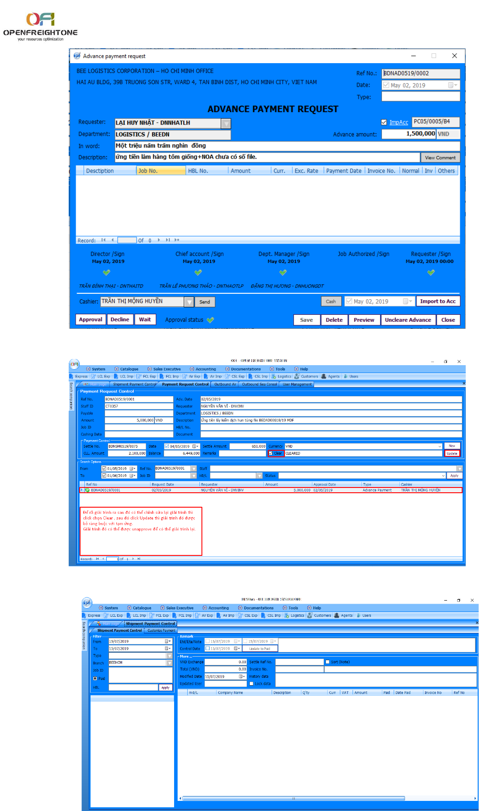

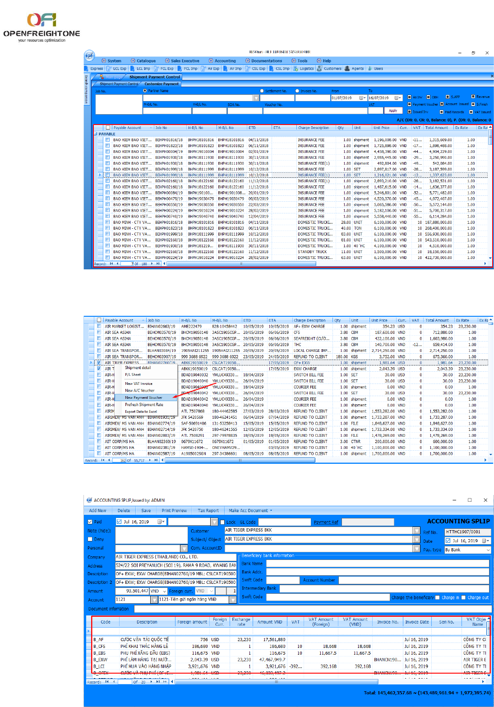

---

## 9. Báo cáo Hóa đơn Có hạn chế (Credit Invoice Report)

### a. Giới thiệu

Nơi thống kê tất cả các hóa đơn phải chi với đại lý, agent, khách hàng.

**Thực hiện:**

Chọn Accounting → Credit Invoice Report

### b. Chi tiết Credit Note

Chức năng này thể hiện chi tiết tất cả các Credit Note phát hành cho đại lý.

Ta có thể lọc dữ liệu bằng cách điền trường thông tin tương ứng. Sau khi chọn trường thông tin tương ứng, ta click chọn Apply để hệ thống lọc dữ liệu và hiển thị kết quả ra bảng bên dưới.

Ta có thể chọn 1 hoặc nhiều credit note để đẩy vào phần mềm AV.

**Bước 1:** Click chọn các credit note cần đẩy vào phần mềm AV.

**Bước 2:** Click chọn More → Import to Acc system. Hệ thống sẽ hiển thị hộp thoại. Nếu đồng ý, ta click chọn Yes, nếu không click chọn No.

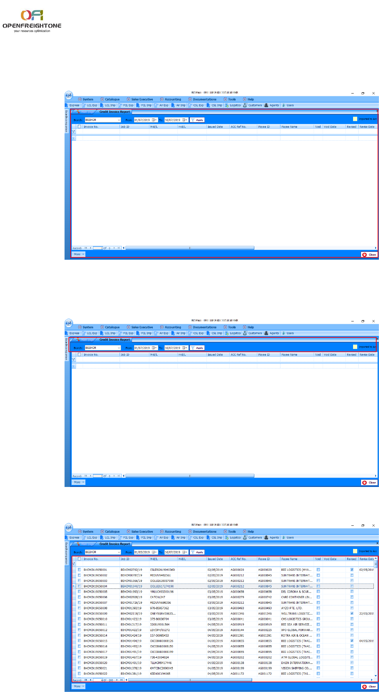

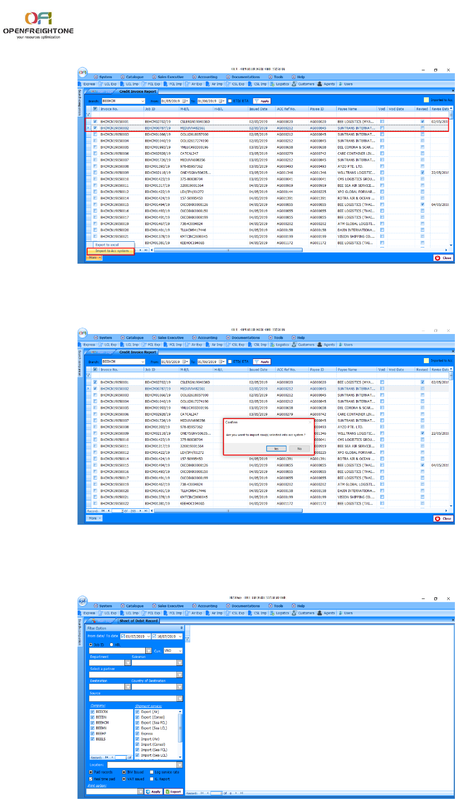

---

## 10. Bảng Ghi nợ (Sheet of Debit Record)

### a. Giới thiệu

Xem tổng hợp công nợ trong tháng dựa trên giá mua, giá bán, other credit, other debit, Logistics charges, v.v.

**Thực hiện:**

Chọn Accounting → Sheet of Debit Record

### b. Cách xem các loại báo cáo tổng hợp

Ta có thể lọc dữ liệu theo trường tương ứng.

**Print Option:**

- **Payment Sheet:** Bảng kê thanh toán tại văn phòng. Bảng được sắp xếp dữ liệu ưu tiên theo trường thông tin Company Name.

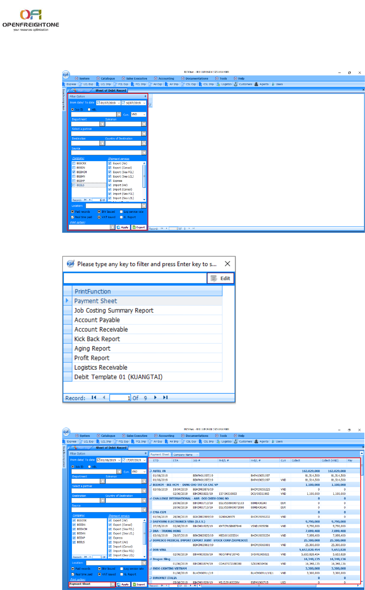

Hoặc ta có thể sắp xếp dữ liệu theo trường tương ứng ta muốn bằng cách click chuột vào trường cần chọn, kéo và thả trường đó vào phía bên trên của bảng. Hệ thống sẽ tự động sắp xếp dữ liệu theo trường tương ứng phía bên trên.

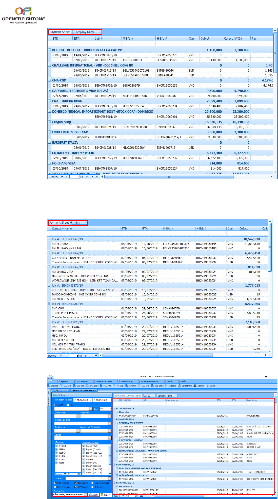

- **Job Costing Summary Report:** Bảng báo cáo chi phí của file. Bảng được sắp xếp dữ liệu ưu tiên theo trường thông tin Job ID và sau đó đến Company Name.

Hoặc ta có thể sắp xếp dữ liệu theo trường tương ứng ta muốn bằng cách click chuột vào trường cần chọn, kéo và thả trường đó vào phía bên trên của bảng. Hệ thống sẽ tự động sắp xếp dữ liệu theo trường tương ứng phía bên trên.

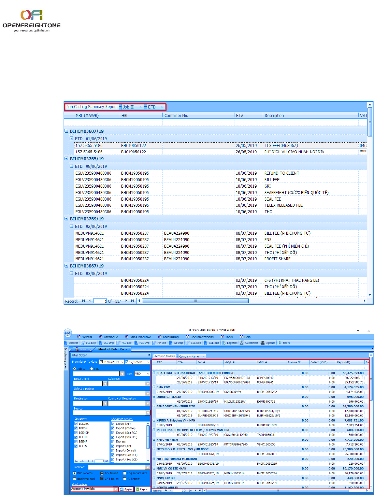

- **Account Payable:** Gọi dữ liệu các khoản phải trả. Bảng được sắp xếp dữ liệu ưu tiên theo trường thông tin Company Name.

Hoặc ta có thể sắp xếp dữ liệu theo trường tương ứng ta muốn bằng cách click chuột vào trường cần chọn, kéo và thả trường đó vào phía bên trên của bảng. Hệ thống sẽ tự động sắp xếp dữ liệu theo trường tương ứng phía bên trên.

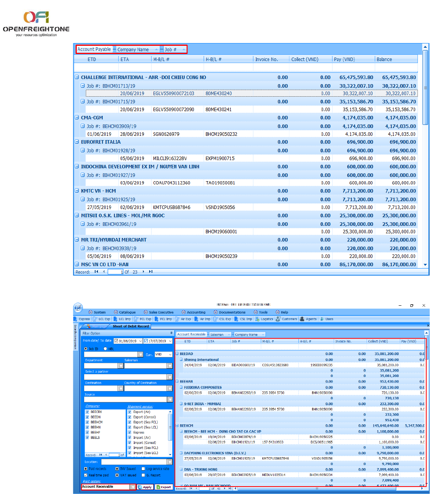

- **Account Receivable:** Gọi dữ liệu các khoản phải thu. Bảng được sắp xếp dữ liệu ưu tiên theo trường thông tin Salesman và Company Name.

Hoặc ta có thể sắp xếp dữ liệu theo trường tương ứng ta muốn bằng cách click chuột vào trường cần chọn, kéo và thả trường đó vào phía bên trên của bảng. Hệ thống sẽ tự động sắp xếp dữ liệu theo trường tương ứng phía bên trên.

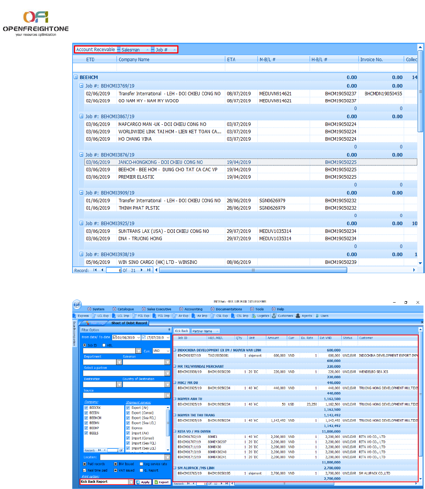

- **Kick Back Report:** Bản báo cáo tiền hoa hồng. Bảng được sắp xếp dữ liệu ưu tiên theo trường thông tin Partner Name.

Hoặc ta có thể sắp xếp dữ liệu theo trường tương ứng ta muốn bằng cách click chuột vào trường cần chọn, kéo và thả trường đó vào phía bên trên của bảng. Hệ thống sẽ tự động sắp xếp dữ liệu theo trường tương ứng phía bên trên.

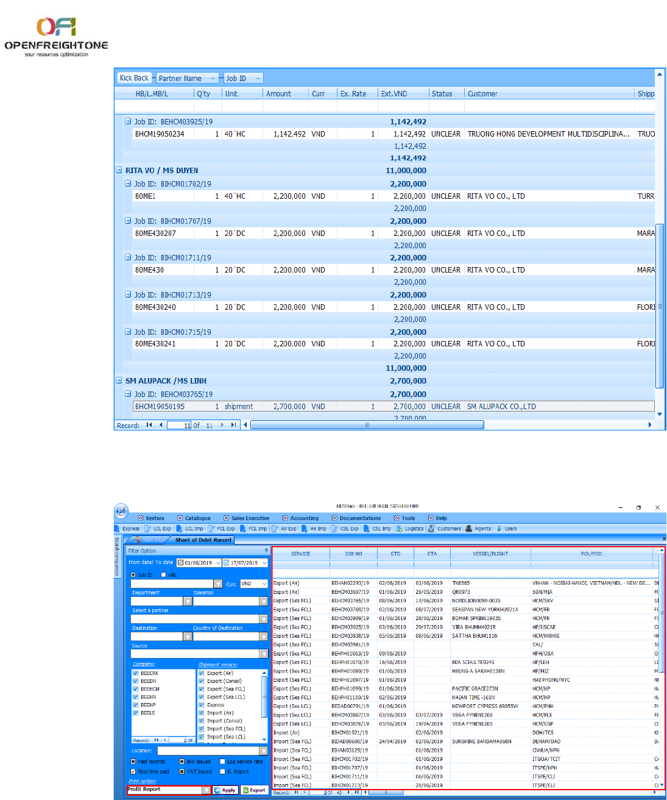

- **Aging Report:** Bản báo cáo tuổi nợ.

- **Profit Report:** Bản báo cáo lợi nhuận (P/L).

Ta có thể sắp xếp dữ liệu theo trường tương ứng ta muốn bằng cách click chuột vào trường cần chọn, kéo và thả trường đó vào phía bên trên của bảng. Hệ thống sẽ tự động sắp xếp dữ liệu theo trường tương ứng phía bên trên.

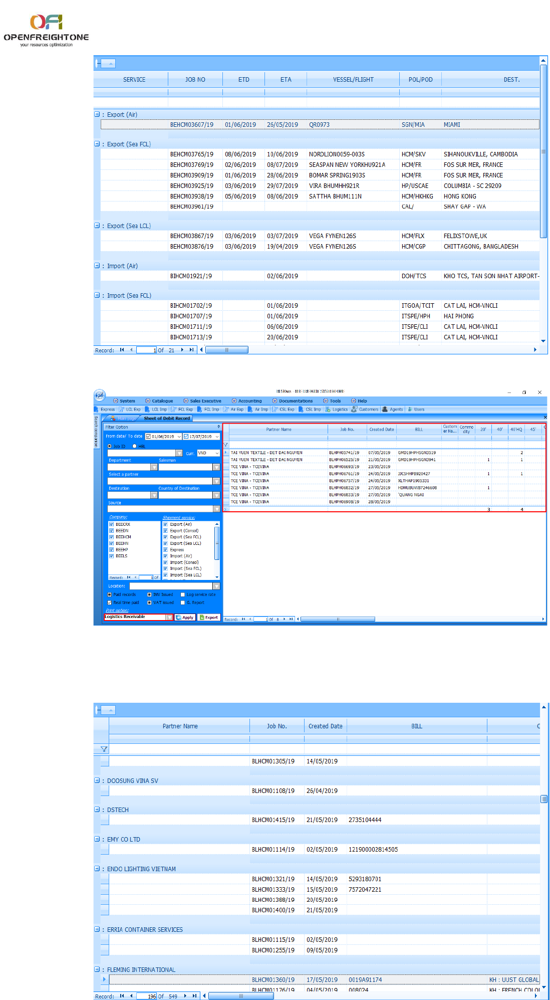

- **Logistics Receivable:** Form công nợ riêng cho khách hàng đặc biệt.

Ta có thể sắp xếp dữ liệu theo trường tương ứng ta muốn bằng cách click chuột vào trường cần chọn, kéo và thả trường đó vào phía bên trên của bảng. Hệ thống sẽ tự động sắp xếp dữ liệu theo trường tương ứng phía bên trên.

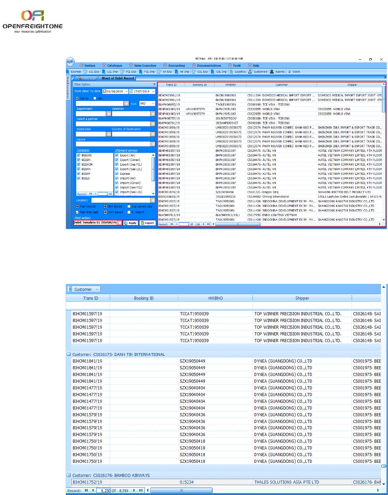

- **Debit Template 01 (KUANGTAI):** Form công nợ riêng cho khách hàng đặc biệt.

Ta có thể sắp xếp dữ liệu theo trường tương ứng ta muốn bằng cách click chuột vào trường cần chọn, kéo và thả trường đó vào phía bên trên của bảng. Hệ thống sẽ tự động sắp xếp dữ liệu theo trường tương ứng phía bên trên.

---

## 11. Báo cáo Hóa đơn VAT (VAT Invoice Report)

### a. Giới thiệu

Nơi chứa các hóa đơn VAT.

**Thực hiện:**

Chọn Accounting → VAT Invoice Report

### b. Cách xem chi tiết 1 hóa đơn và đẩy vào phần mềm kế toán

Ta có thể lọc dữ liệu theo trường thông tin tương ứng bằng cách chọn ngày tháng năm, văn phòng cần xem. Sau khi chọn được trường thông tin cần xem, ta click chọn Apply để hệ thống lọc dữ liệu và xuất ra kết quả bên dưới.

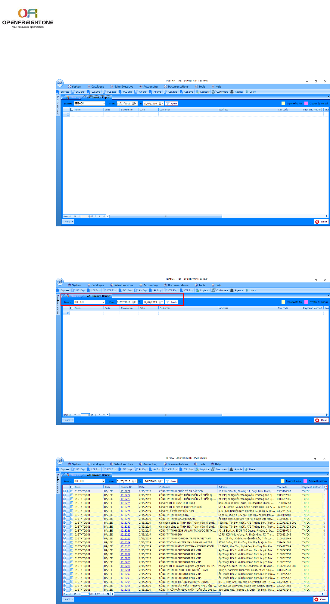

**Có 3 trạng thái của hóa đơn:**

- Màu vàng: Đã đẩy vào phần mềm kế toán và đã thanh toán.
- Màu trắng: Chưa đẩy vào phần mềm kế toán và chưa thanh toán.
- Màu hồng đậm: Hóa đơn xuất khác không liên quan đến job của file.

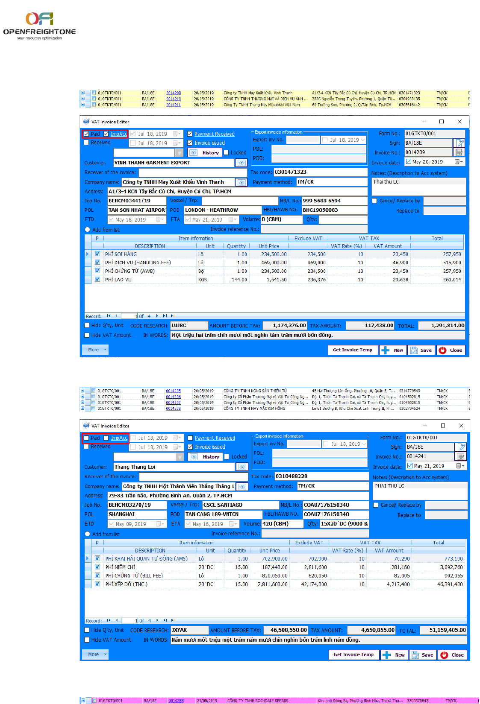

---

## 12. Thông tin Ngân hàng VAT (VAT Bank Information)

**Nội dung:**

Nơi chứa thông tin ngân hàng của văn phòng.

**Thực hiện:**

Chọn Accounting → VAT Bank Information

Ta có thể xem thông tin ngân hàng của chi nhánh khác bằng cách chọn.

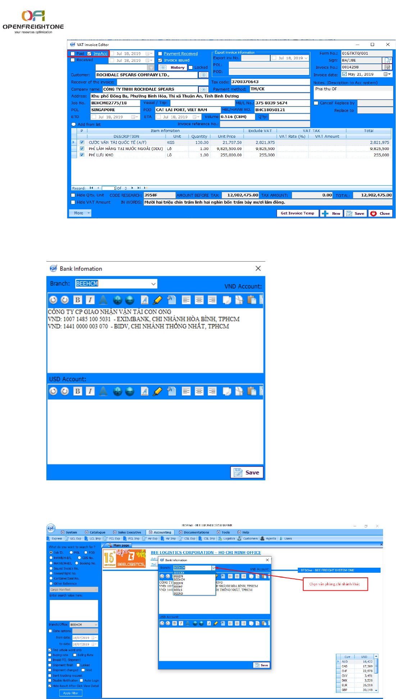

---

## 13. Báo cáo Tình hình Sử dụng Hóa đơn VAT (VAT Invoice Status Using Report)

**Nội dung:**

Báo cáo tình hình sử dụng hóa đơn.

---

## 14. Quản lý Công nợ Cũ (Account Old Debit)

### a. Giới thiệu

Nơi quản lý công nợ theo tuổi nợ.

**Thực hiện:**

Chọn Accounting → Account Old Debit

### b. Cách xem chi tiết 1 công nợ theo tuổi nợ

Ta có thể lọc dữ liệu theo trường thông tin tương ứng.

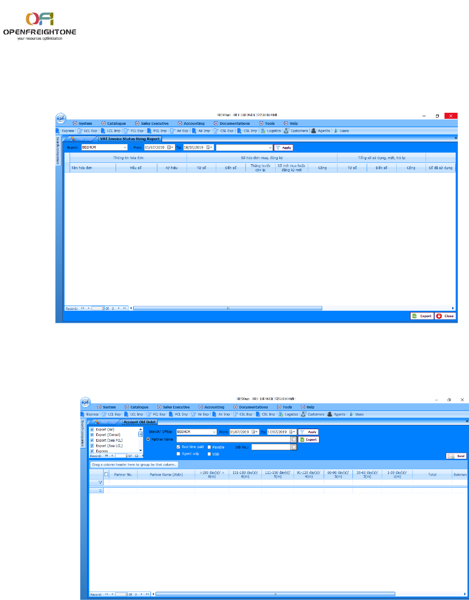

Ta cũng có thể chọn loại hình dịch vụ đơn hàng trong bảng nếu chọn ta click chọn ô, nếu không hệ thống tự động hiển thị tất cả các đơn hàng.

Sau khi điền đầy đủ trường thông tin tương ứng, ta click chọn Apply để hệ thống lọc dữ liệu và hiển thị kết quả ra bảng bên dưới.

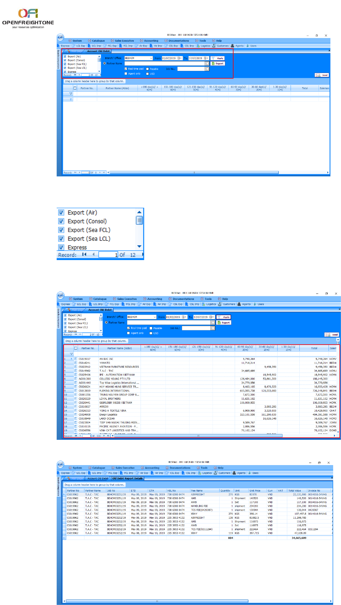

Tại bất kì khách hàng nào cần xem chi tiết, ta nhấp đôi vào khách hàng đó.

Ta có thể xem chi tiết đơn hàng của khách hàng bằng cách nhấp đôi vào đơn hàng đó, hệ thống sẽ chuyển đến tab của đơn hàng đó.

**Có thể gửi công nợ tự động cho khách hàng:**

Ta click chọn vào khách hàng cần gửi mail, sau đó bấm nút Send để gửi mail cho người liên hệ của khách hàng đó.

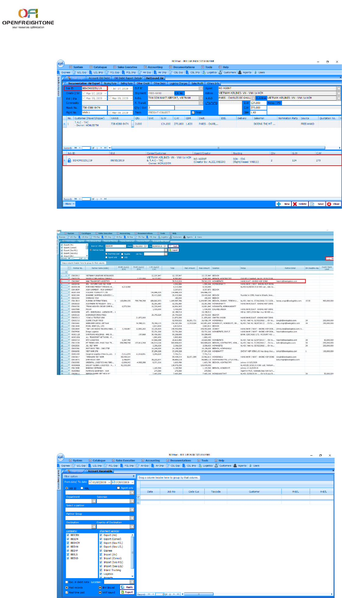

---

## 15. Công nợ Phải Thu (Account Receivable)

### a. Giới thiệu

Xem công nợ chi tiết của 1 đối tượng.

**Thực hiện:**

Chọn Accounting → Account Receivable

### b. Cách xem chi tiết công nợ của 1 khách hàng hoặc nhiều khách hàng

Ta có thể lọc dữ liệu theo trường tương ứng bằng cách nhập thông tin vào bảng bên cạnh.

---

## 16. Công nợ Quá hạn (Overdue Debts)

**Nội dung:**

Nơi quản lý công nợ quá hạn.

**Thực hiện:**

Chọn Accounting → Overdue Debts

Ta có thể xem chi tiết các hóa đơn và các khoản thanh toán của khách hàng để kiểm soát công nợ. Ta có thể lọc dữ liệu theo trường tương ứng bằng cách chọn ngày và click chọn Apply.

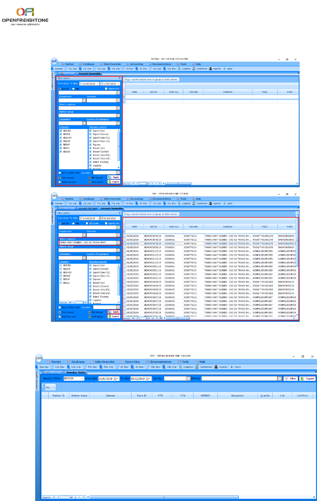

**Bảng bên trên có Invoice Term và Payment Term:**

- **Invoice Term:** Là tất cả các chi phí khách hàng đã thanh toán và đã xuất hóa đơn.
- **Payment Term:** Là các khoản chi hộ hoặc refund cho agent.

Nếu ta click chuột phải vào Invoice Term hoặc Payment Term bất kì, ta có thể chọn khách hàng đó vào danh sách cảnh báo vì lý do nợ quá hạn hợp đồng, hoặc có thể xem khách hàng đó đã có trong danh sách cảnh báo hay không.

Nếu thêm vào danh sách cảnh báo, ta chọn Add to warning list hoặc View warning list.

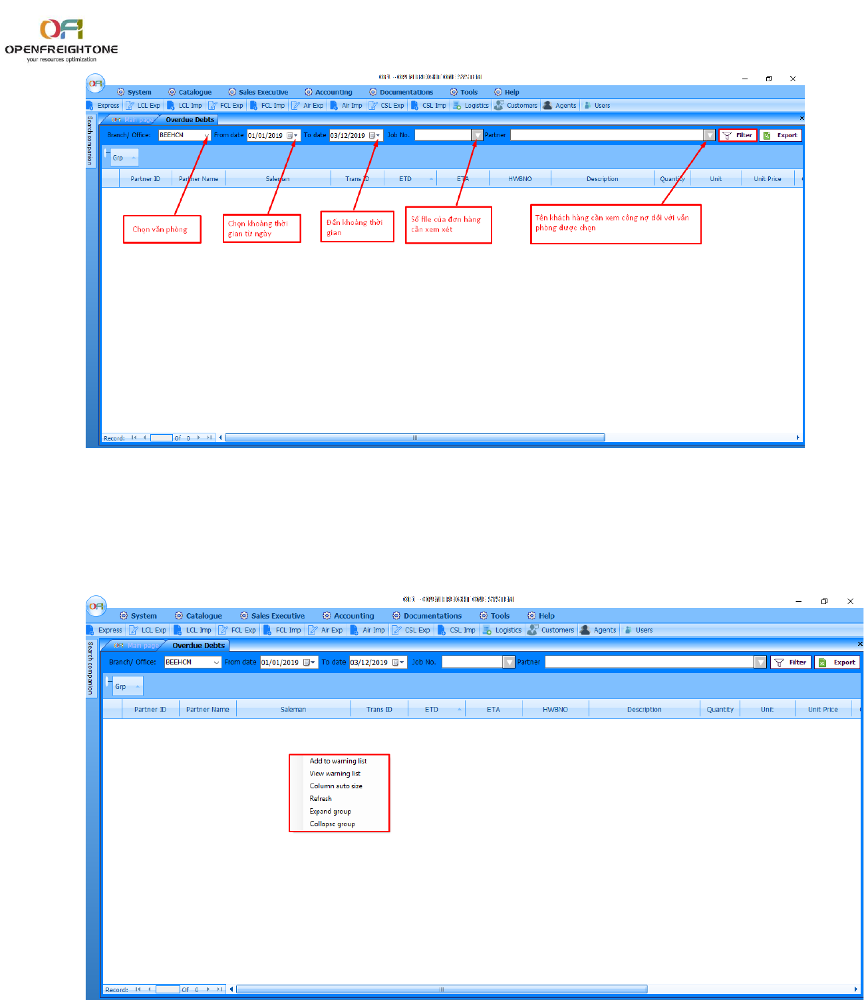

Ta có thể điền lý do tại sao phải cảnh báo khách hàng đó, thì sau này khi Salesman làm hàng với khách hàng đó sẽ hiện thông báo cảnh báo về khách hàng đó.

**Hạn mức công nợ:**

Khi nhân viên kế toán khai báo hạn mức công nợ theo khách hàng (ví dụ khách hàng này được phép nợ tối đa là 100 triệu đồng), hoặc kế toán chủ động khóa khách hàng này ở checkbox "Lock" hoặc đưa khách hàng này vào danh sách khóa ở chức năng "Overdue Debts".

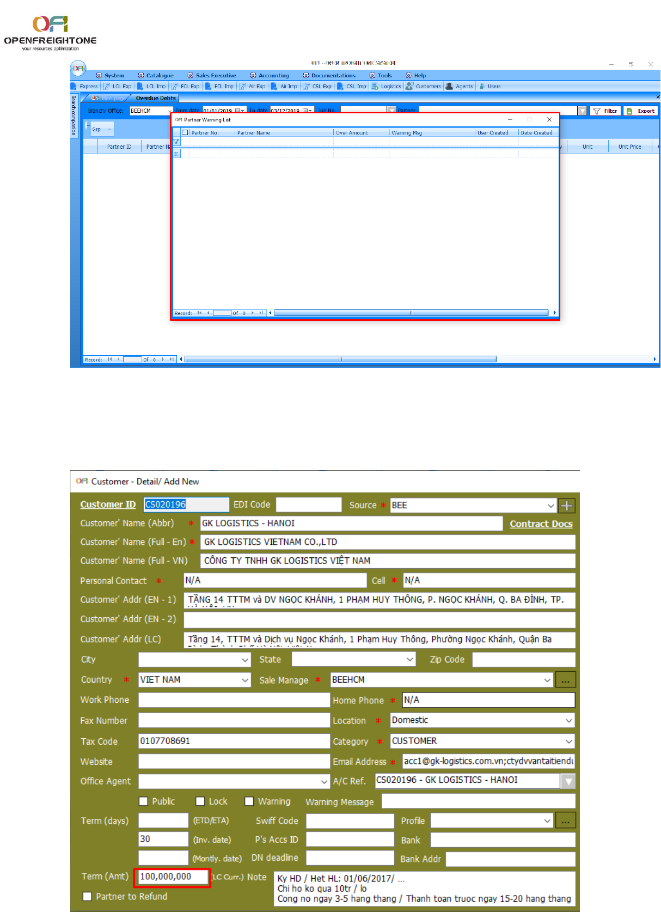

Khi nhân viên Doc/Cus mở file, nếu chọn khách hàng này, thì hệ thống sẽ kiểm tra trong danh sách khóa xem có khách hàng này hay không. Nếu không có, thì hệ thống sẽ tính toán công nợ của khách hàng này trong 1 năm (từ thời điểm hiện tại lùi về 1 năm). Nếu số tiền khách hàng nợ vượt trên số tiền hạn mức được nợ (nếu kế toán có cài đặt) hoặc tối đa 500 triệu đồng (nếu kế toán không cài đặt), thì sẽ nhận được thông báo.

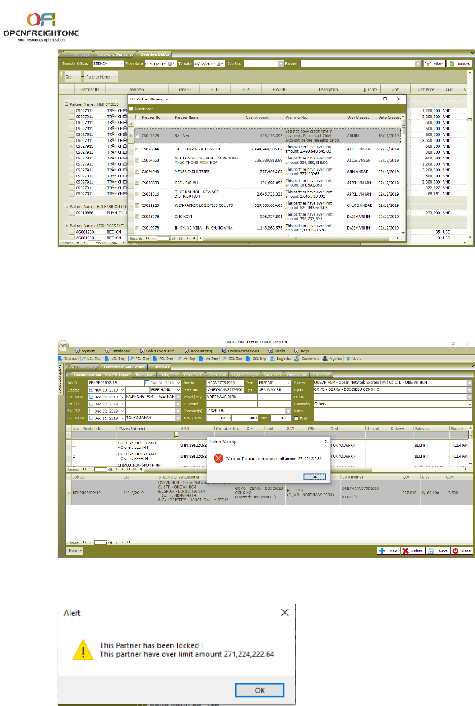

Lúc này nhân viên Doc/Cus vẫn có thể tiếp tục tạo file và HBL bình thường. Đến khi ta in bill, thì hệ thống sẽ không cho in mà xuất hiện thông báo với nội dung là khách hàng đã nợ số tiền này.

Sau đó sẽ xuất hiện màn hình yêu cầu duyệt bảo lãnh cho Giám đốc văn phòng. Mặc định hệ thống sẽ load ra người approve (Giám đốc văn phòng).

Nhân viên Doc/Cus cũng có thể đổi người approve nếu văn phòng có nhiều người phụ trách.

Sau khi điền thông tin lý do, thì bấm nút "Send". Lúc này hệ thống sẽ gửi mail yêu cầu duyệt theo nội dung trên.

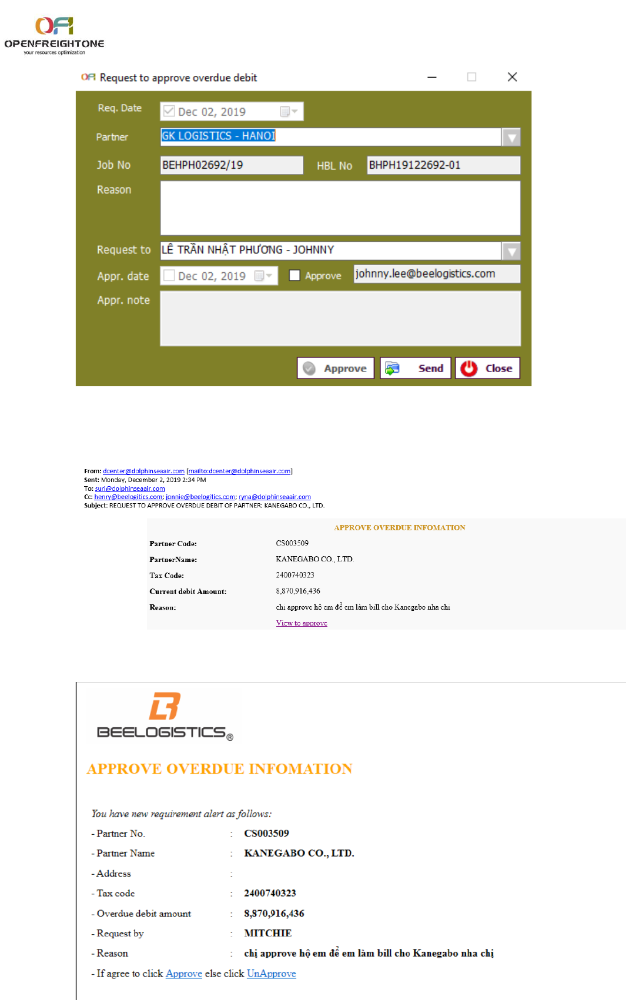

Lúc này Giám đốc văn phòng sẽ nhận được mail. Khi nhận được email chỉ cần bấm vào link "View to approve", lúc này sẽ xuất hiện màn hình duyệt.

Nếu đồng ý thì bấm "Approve", ngược lại "UnApprove" và sẽ điền lý do vào hoặc có thể vào trực tiếp HBL trên phần mềm OF1 để approve theo hình dưới.

Và lúc này sẽ xuất hiện màn hình để duyệt. Bấm vào nút Approve để duyệt.

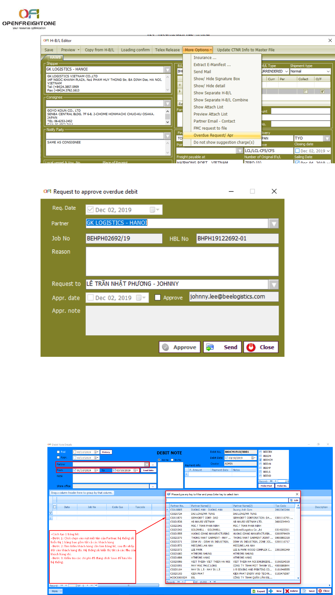

Nhân viên Doc/Cus chỉ in được bill khi yêu cầu đã được duyệt.

---

## 17. Ghi nợ (Debit Note)

**Mục đích:**

Tạo bảng kê để đối chiếu công nợ và ghi nhận thanh toán, import vào phần mềm AV.

**Cách tạo 1 bảng kê:**

Chọn Accounting → Debit Note → New

Khi click chọn, hệ thống sẽ hiển thị màn hình để nhập dữ liệu.

**Có 2 trạng thái của bảng kê:**

- Đã thanh toán: Sẽ có chữ màu đỏ là đã thanh toán và nền màu vàng là đã import vào phần mềm AV.
- Còn màu trắng: Bảng kê vẫn chưa thanh toán.

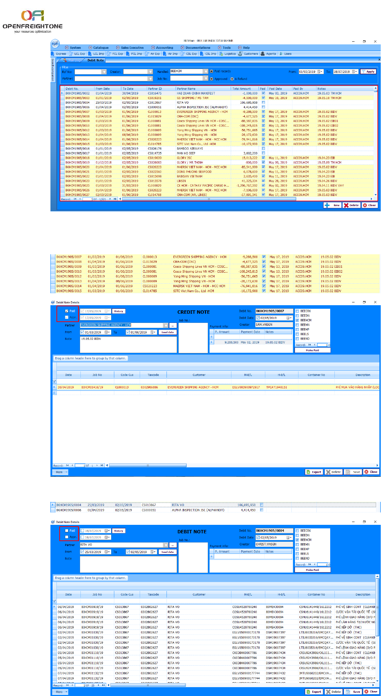

---

## 18. Hóa đơn cho Công nợ Phải Trả (Invoice for Account Payable)

**Nội dung:**

Nơi nhập hóa đơn (Input) đầu vào tương ứng với các đối tượng cung cấp dịch vụ của từng lô hàng.

**Thực hiện:**

Chọn Accounting → Invoice for Account Payable

Ta có thể lọc dữ liệu theo trường tương ứng. Sau khi điền đầy đủ thông tin trường tương ứng, ta click chọn Apply để hệ thống lọc dữ liệu và xuất ra kết quả ở bảng bên dưới.

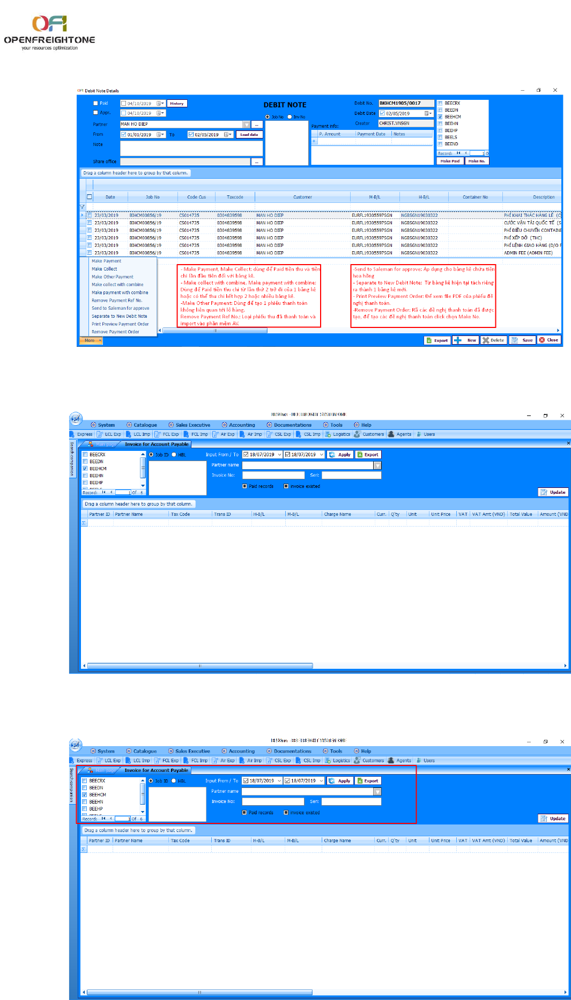

**Có 3 trạng thái của hóa đơn:**

- Màu trắng: Chưa có dữ liệu liên quan đến hóa đơn.
- Màu tím: Đã khai báo hóa đơn. Nếu đã có hóa đơn ở công ty, thì sẽ có check ở ô Inv Received và số hóa đơn ở bên cột Seri No, Inv Date. Còn nếu không có, thì sẽ để trống.
- Màu vàng: Đã có hóa đơn ở công ty và đã nhập số hóa đơn lên hệ thống, đẩy vào phần mềm kế toán.

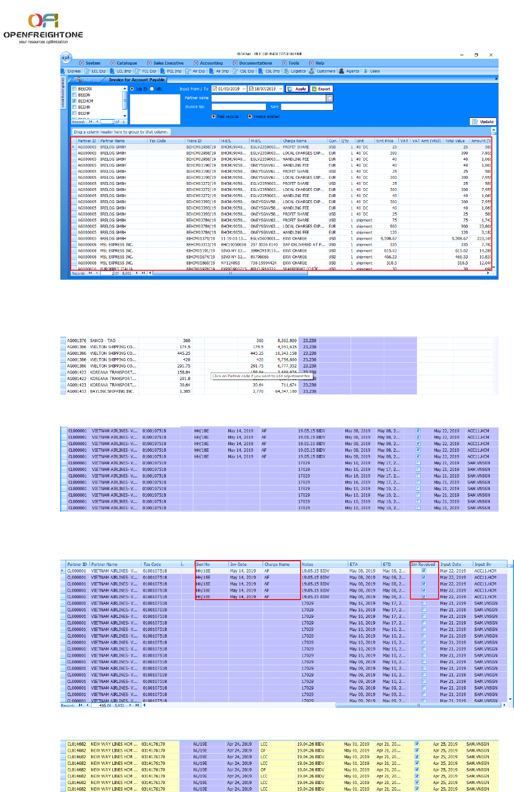

Nếu ta muốn xem chi tiết đơn hàng, ta nhấp đôi vào đơn hàng đó, hệ thống sẽ hiển thị form của đơn hàng đó.

Ta cũng có thể chỉnh sửa lại chi phí nếu hóa đơn đó chưa in ra để thanh toán với hãng tàu bằng cách nhấp đôi vào Partner ID. Hệ thống sẽ hiển thị ra form để thay đổi điều chỉnh chi phí.

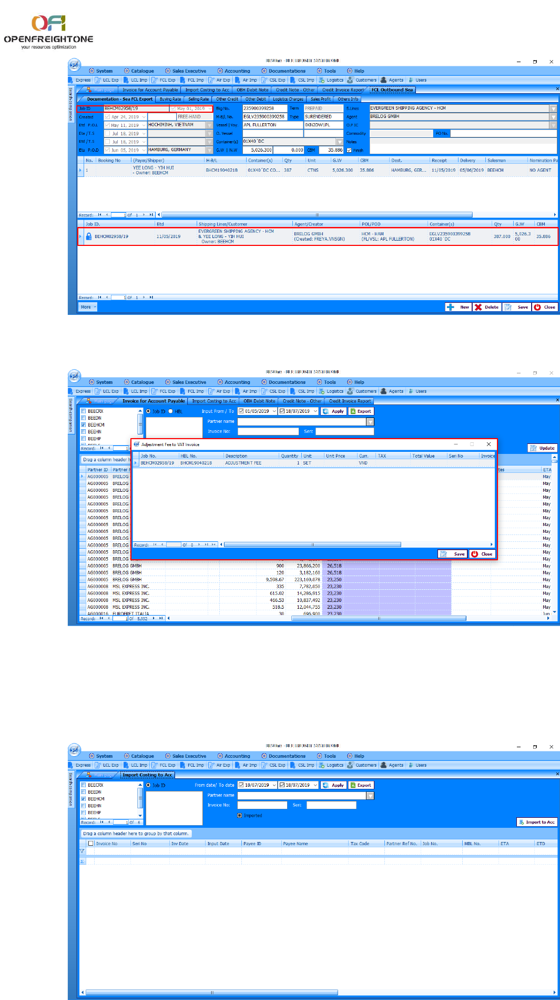

Sau khi đã chỉnh sửa xong, ta click chọn Save để lưu thông tin và chọn click Update để cập nhật vào hệ thống.

---

## 19. Import Chi phí vào Kế toán (Import Costing to Acc)

**Nội dung:**

Nơi để import hóa đơn đã khai ở tab Invoice for Account Payable vào phần mềm AV.

**Thực hiện:**

Chọn Accounting → Import Costing to Acc

Ta chọn khoảng thời gian và click chọn Apply để xuất dữ liệu ra như hình bên dưới.

**Có 3 trạng thái của hóa đơn:**

- Màu vàng: Đã import hóa đơn đầy đủ vào phần mềm AV.
- Màu xám: Chưa đầy đủ thông tin về hóa đơn.
- Màu trắng: Đã có đầy đủ thông tin về hóa đơn.

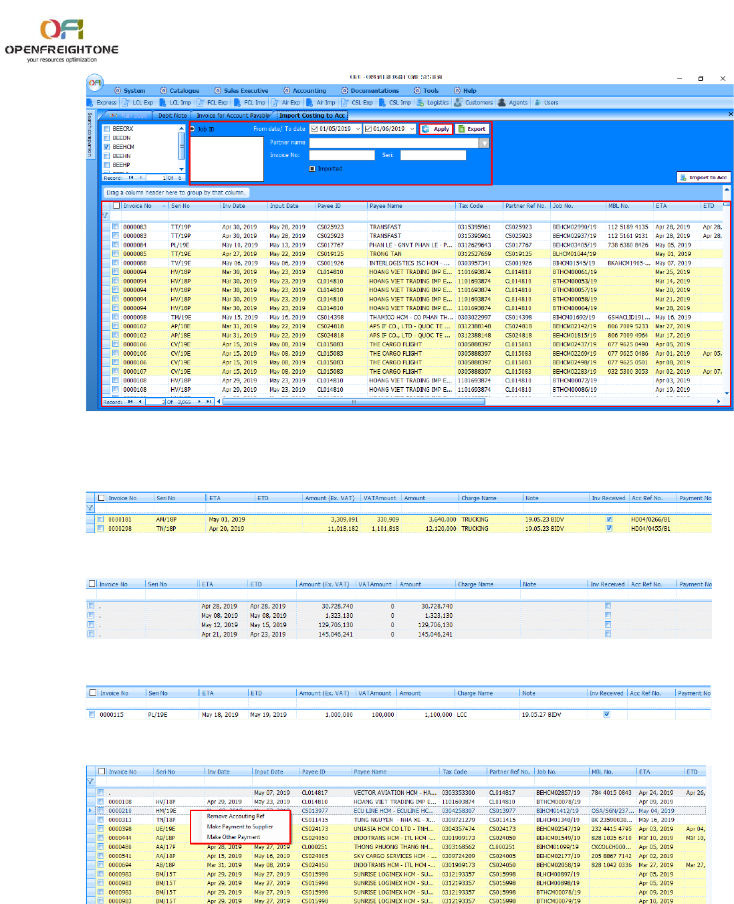

Nếu ta muốn chỉnh sửa phải chuyển qua tab Invoice for Account Payable.

**Các chức năng khác:**

- **Remove Accounting Ref:** Bỏ hóa đơn liên quan trong phần mềm kế toán.
- **Make Payment to Supplier:** Tạo phiếu chi cho hãng tàu.
- **Make Other Payment:** Tạo phiếu chi khác.

---

## 20. Ghi nợ OBH (OBH Debit Note)

**Nội dung:**

Nơi quản lý các bảng kê chi hộ cho khách hàng.

**Thực hiện:**

Chọn Accounting → OBH Debit Note

Sau khi điền đầy đủ thông tin tương ứng, ta click chọn Apply để hệ thống lọc dữ liệu và xuất ra kết quả ở bảng bên dưới.

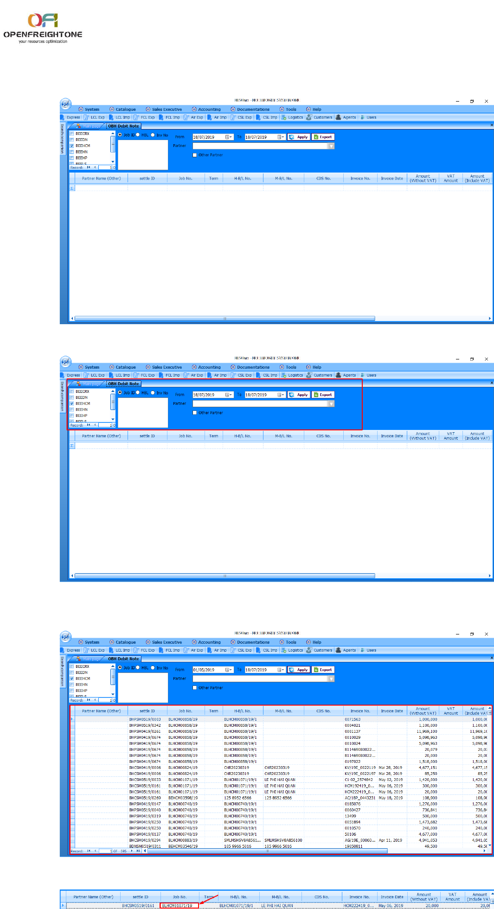

Nếu ta muốn xem chi tiết đơn hàng, thì ta nhấp đôi vào số Job ID của file đó. Hệ thống sẽ hiển thị tab của file đó.

Nếu ta muốn xem chi tiết bảng giải trình của đơn hàng, ta nhấp đôi vào Settle ID. Hệ thống sẽ hiển thị bảng giải trình chi tiết của đơn hàng.

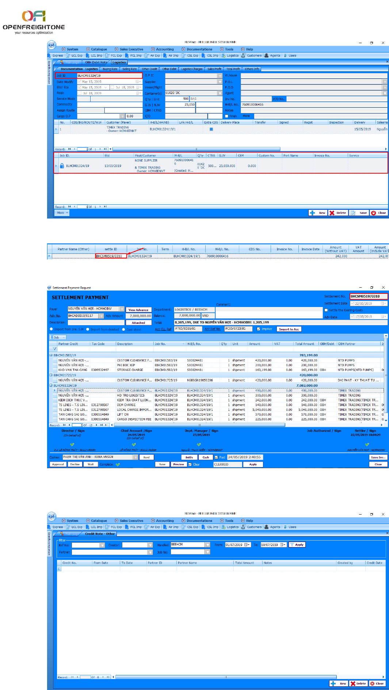

---

## 21. Ghi Có Khác (Credit Note – Other)

**Nội dung:**

Nơi tạo và chứa các bảng kê tiền refund cho các đối tượng được nhận.

**Thực hiện:**

Chọn Accounting → Credit Note - Other

Ta có thể tạo mới bằng cách click chọn New.

Khi ta click chọn New, hệ thống sẽ hiển thị 1 form để điền thông tin refund của khách hàng.

Sau khi kiểm tra đầy đủ thông tin chi phí, ta click chọn Save để lưu bảng Other charges lên hệ thống hoặc click chọn Export để xuất dữ liệu ra bảng excel.

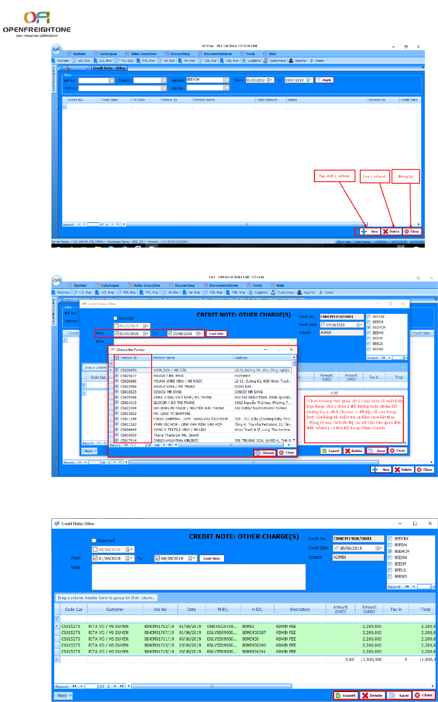

**Các chức năng khác:**

- **Make the Credit to Acc system:** Đẩy bảng kê vào phần mềm AV.
- **Remove Credit from Acc system:** Loại phiếu hạch toán ra khỏi phần mềm AV.

---

## 22. Kế hoạch Tài chính (Financial Planning)

**Nội dung:**

Chức năng quản lý kế hoạch tài chính của công ty.

**Thực hiện:**

Chọn Accounting → Financial Planning

### Tab Payment – Receivable Planning

**Nơi tạo và quản lý các kế hoạch thu chi.**

**Cách tạo 1 kế hoạch:**

Click chọn nút Add New, xuất hiện hộp thoại điền dữ liệu tương ứng và click chọn Save. Sau khi Save dữ liệu sẽ xuất hiện ở hình bên dưới.

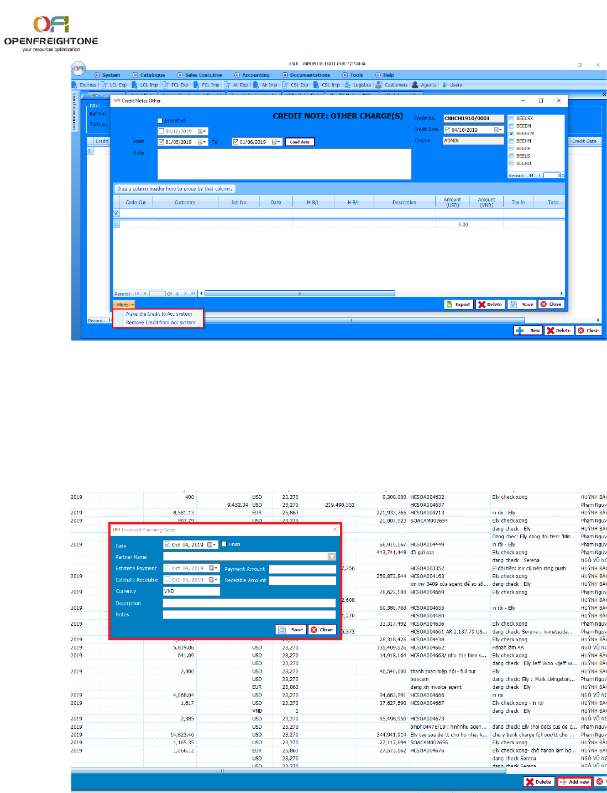

Khi kế hoạch hoàn thành, ta click chọn các dòng kế hoạch, click chuột phải để chọn Make finish selected row(s). Hoặc Make un-finished selected row(s) để undo lại.

### Tab Bank Transaction History

**Nội dung:**

Nơi quản lý tất cả các phát sinh tăng giảm của tài khoản ngân hàng.

Để có được dữ liệu trong bảng này, ta phải Import dữ liệu từ file excel có format theo quy định bên dưới.

**Cách sử dụng:**

Điền số các bảng kê tương ứng để dễ hạch toán.

Chọn dòng cần chỉnh sửa hoặc thêm bảng kê vào dòng tương ứng, click chuột phải vào dòng đó sẽ hiển thị các nút:

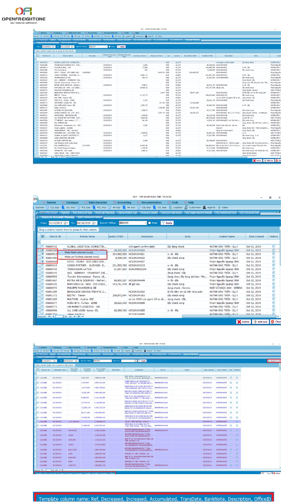

- **Add New Debit Note:** Thêm 1 bảng kê từ hệ thống tương ứng với chi phí của file.
- **Make Finish:** Đã hoàn thành file. Sau khi tích Finish, thì trạng thái của dòng sẽ đổi thành màu tím.

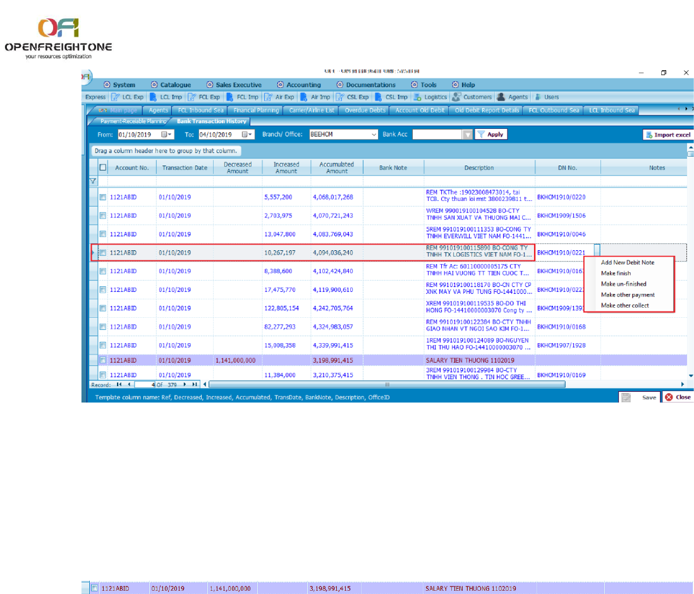

- **Make un-finished:** Undo lại file để chỉnh sửa.
- **Make other payment:** Tạo 1 phiếu chi khác.
- **Make other collect:** Tạo 1 phiếu thu khác.

---

*Tài liệu này được tạo để hỗ trợ công tác kế toán và quản lý tài chính trong hệ thống OF1 FMS. Vui lòng tham khảo hình ảnh minh họa cho từng bước để hiểu rõ hơn về các quy trình.*
