# III. SALES EXECUTIVE

## Mục lục

| # | Chức năng | Mô tả |
|---|-----------|-------|
| **Database (Cơ sở dữ liệu giá)** | | |
| 1 | [Vessel Schedules](#1-vessel-schedules-lich-tau) | Nhập lịch tàu |
| 2 | [Database of AirFreight Pricing](#2-database-of-airfreight-pricing-bang-du-lieu-gia-hang-khong) | Giá hàng không từ hãng hàng không |
| 3 | [Database of Express Pricing](#3-database-of-express-pricing-bang-du-lieu-gia-hang-xuat-khau) | Giá hàng xuất từ nhà thầu phụ |
| 4 | [Database of SeaFreight Pricing](#4-database-of-seafreight-pricing-bang-du-lieu-gia-hang-bien) | Giá hàng biển từ hãng tàu |
| **Quotation (Báo giá)** | | |
| 5 | [AirFreight Quotation](#5-airfreight-quotation-bao-gia-hang-khong) | Báo giá hàng không |
| 6 | [Express Quotation](#6-express-quotation-bao-gia-hang-xuat) | Báo giá hàng xuất |
| 7 | [SeaFreight Quotation](#7-seafreight-quotation-bao-gia-hang-bien) | Báo giá hàng biển |
| **Booking** | | |
| 8 | [AirFreight Booking Request](#8-airfreight-booking-request-yeu-cau-dat-cho-hang-khong) | Yêu cầu đặt chỗ hàng không |
| 9 | [AirFreight Booking Confirm](#9-airfreight-booking-confirm-xac-nhan-dat-cho-hang-khong) | Xác nhận đặt chỗ hàng không |
| **Quản lý yêu cầu & lô hàng** | | |
| 10 | [Logistics Service Request Management](#10-logistics-service-request-management-quan-ly-yeu-cau-dich-vu-logistics) | Quản lý internal booking |
| 11 | [Inland Trucking Request Management](#11-inland-trucking-request-management-quan-ly-yeu-cau-trucking-noi-dia) | Quản lý yêu cầu trucking |
| 12 | [Freight Shipment Management](#12-freight-shipment-management-quan-ly-van-chuyen-hang-hoa) | Quản lý đơn hàng vận chuyển |
| 13 | [Sea Booking Acknowledgement](#13-sea-booking-acknowledgement-xem-xet-don-dat-hang-duong-bien) | Xem xét booking đường biển |
| 14 | [Internal Booking Request Management](#14-internal-booking-request-management-quan-ly-cac-yeu-cau-internal-booking) | Quản lý internal booking |
| **Báo cáo & Truy vấn** | | |
| 15 | [Service Inquiry](#15-service-inquiry-yeu-cau-chinh-sua-gia-mua) | Yêu cầu pricing chỉnh sửa giá |
| 16 | [P/L Sheet](#16-pl-sheet-bang-loi-nhuan--lo) | Xem lợi nhuận / lỗ của lô hàng |

---

## 1. Vessel Schedules (Lịch tàu)

Nơi nhập lịch tàu.

**Cách thực hiện:** Chọn Sales Executive → Vessel Schedules

Bảng sẽ hiển thị các thông tin về lịch của hãng tàu như:

- **Line:** Chuyến tàu
- **POL (Port of Loading):** Cảng xuất phát
- **ETD (Estimated Time of Departure):** Ngày dự kiến khởi hành
- **POD (Port of Discharge):** Cảng dịch
- **ETA (Estimated Time of Arrival):** Ngày dự kiến đến cảng dịch

Ta có thể thêm lịch tàu bằng cách click chọn **Add New**, hệ thống sẽ hiển thị một form cho người dùng điền thông tin.

Các trường thông tin cần nhập:

- **Line:** Chuyến tàu
- **POL (Port of Loading):** Cảng đi
- **POD (Port of Discharge):** Cảng đến
- **ETA (Estimated Time of Arrival):** Ngày dự kiến đến nơi
- **ETD (Estimated Time of Departure):** Ngày dự kiến khởi hành
- **ETA (Estimated Time of Arrival):** Ngày dự kiến đến cảng chuyển tải
- **ETD (Estimated Time of Departure):** Ngày dự kiến khởi hành ở cảng chuyển tải
- **Vessel:** Hàng tàu
- **Vessel No.:** Số hàng tàu
- **Note:** Ghi chú
- **Active:** Cho phép hoạt động

Sau khi điền đầy đủ thông tin, click chọn **Save** để lưu lịch tàu lên hệ thống của công ty, hoặc click chọn **Delete** để xóa thông tin lịch tàu.

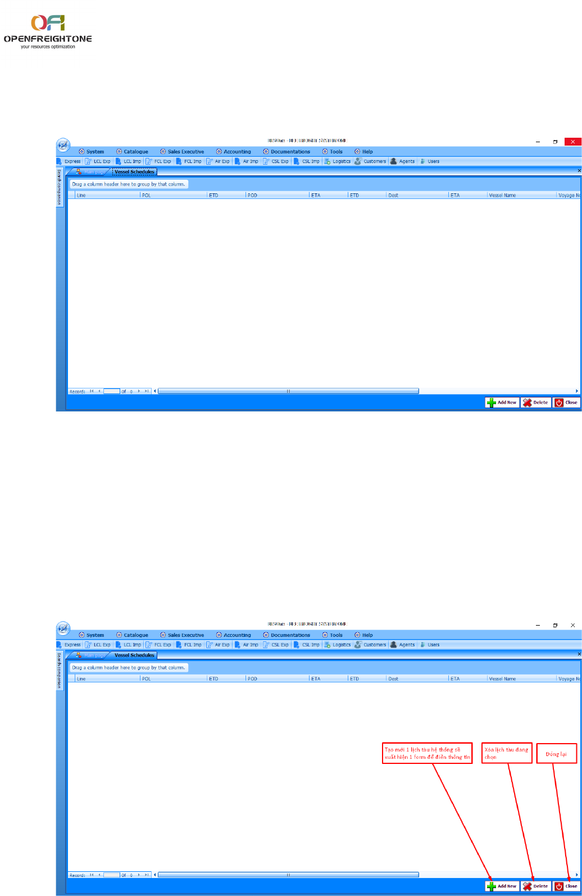

---

## 2. Database of AirFreight Pricing (Bảng dữ liệu giá hàng không)

Nơi chứa giá của đơn hàng air cần nhập lấy từ hãng hàng không. Những người được phân quyền có thể lấy giá từ tab này.

**Cách thực hiện:** Chọn Sales Executive → Database of AirFreight Pricing

Các trường thông tin:

- **Code:** Hệ thống tự động cấp mã
- **Destination:** Điểm đến
- **Vendor:** Nhà cung cấp
- **FSC (Fuel Surcharge):** Phụ phí nhiên liệu
- **SSC (Security Surcharge):** Phụ phí an ninh
- **Curr (Currency):** Tỷ giá hiện tại
- **Date Update:** Ngày cập nhật giá
- **Validity:** Ngày hết hiệu lực
- **T/T (Transit Time):** Thời gian chuyển tải
- **Freq (Frequency):** Tần suất hiệu lực

Ta có thể thêm giá mới của hãng hàng không nếu như được cấp quyền. Click chọn **Edit**, hệ thống sẽ tự động thêm một dòng đầu tiên để nhập các thông tin giá, mã, khối lượng...

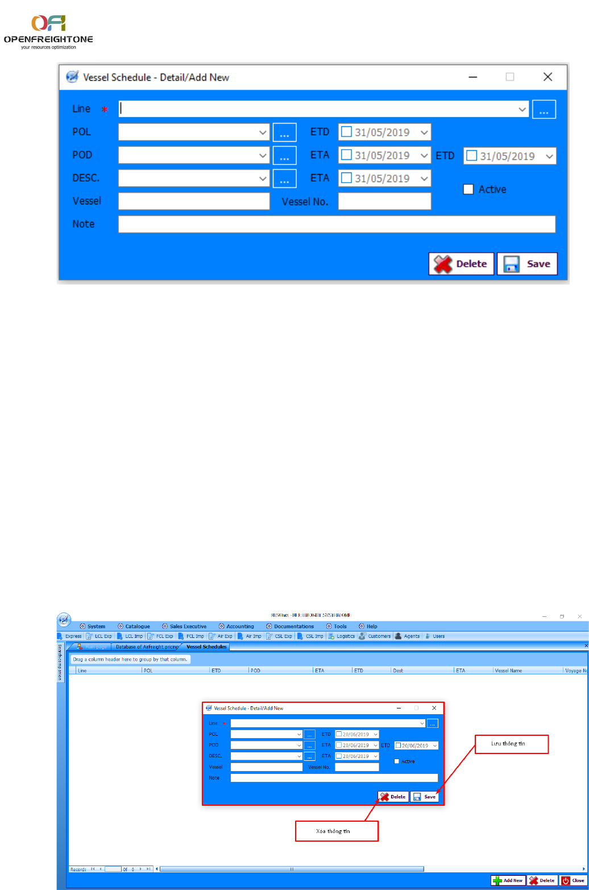

Tỷ giá sẽ được mặc định ở USD. Nếu muốn đưa dữ liệu của báo giá lên hệ thống OF1, click chọn **Import**. Hệ thống sẽ hiển thị một form để đầy dữ liệu lên.

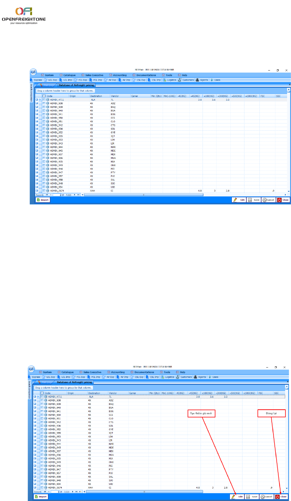

Click chọn **Open file** để mở tập tin có sẵn trong máy để đây lên hệ thống.

Sau khi kiểm tra đầy đủ, click chọn **Save** để lưu bảng báo giá vào hệ thống OF1.

Ta có thể làm bảng báo giá cho khách hàng bằng cách nhập đối vào báo giá đó.

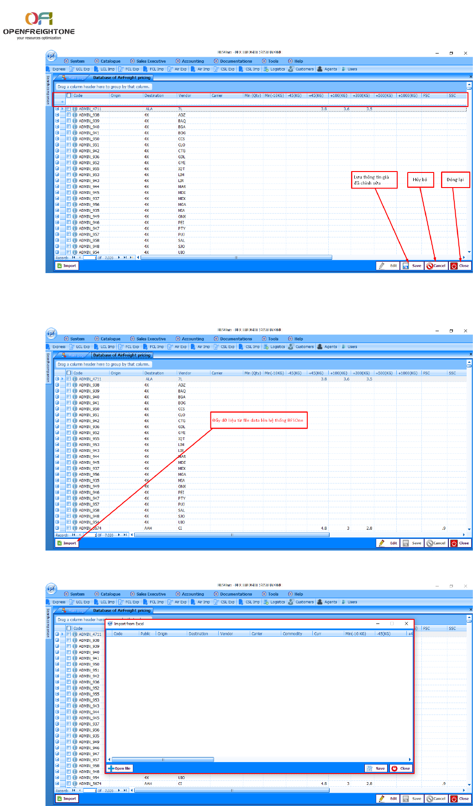

Click chọn **Create New Quotation** để hệ thống mở form và chuyển đến tab Air Quotation.

---

## 3. Database of Express Pricing (Bảng dữ liệu giá hàng xuất khẩu)

Nơi chứa giá hàng xuất khẩu cần nhập lấy từ nhà thầu phụ. Những người được phân quyền có thể lấy giá từ tab này.

**Cách thực hiện:** Chọn Sales Executive → Database of Express Pricing

Các trường thông tin:

- **Ref No.:** Mã số của báo giá (hệ thống tự động cấp)
- **Vendor:** Nhà thầu phụ
- **Express Service:** Dịch vụ hàng xuất
- **Additional Note:** Lưu ý thêm
- **Currency:** Tỷ giá hiện tại
- **%VAT:** % thuế giá trị gia tăng
- **Valid Date:** Ngày hiệu lực
- **Modified:** Người chỉnh sửa
- **Created:** Người tạo file

Sau khi nhập đầy đủ thông tin, click chọn **Save** để lưu thông tin lên hệ thống.

---

## 4. Database of SeaFreight Pricing (Bảng dữ liệu giá hàng biển)

Nơi chứa giá của đơn hàng biển cần nhập lấy từ hãng tàu. Những người được phân quyền có thể lấy giá từ tab này.

**Cách thực hiện:** Chọn Sales Executive → Database of SeaFreight Pricing

Ta có thể thêm các giá mới của hãng tàu nếu như được cấp quyền. Click chọn **Edit**, hệ thống tự động thêm một dòng đầu tiên để điền thông tin giá, khối lượng...

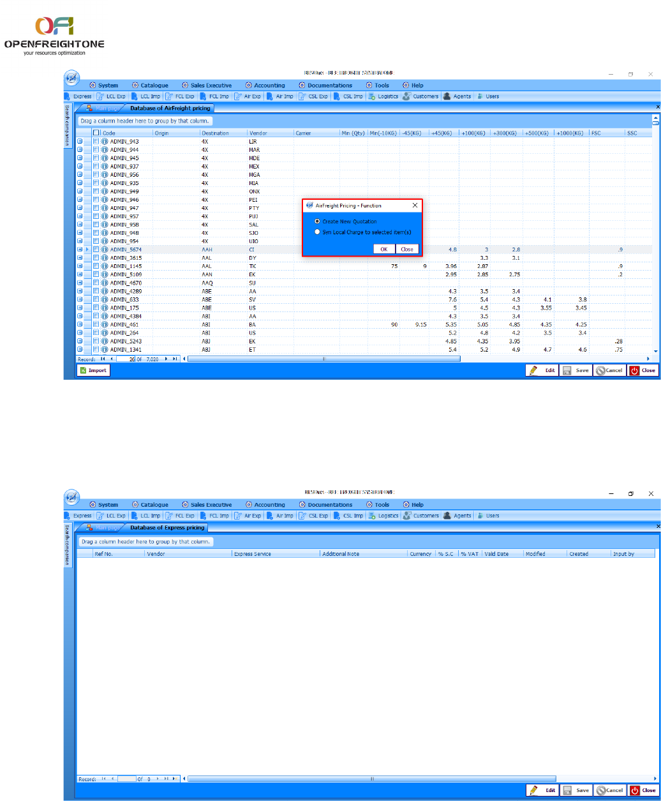

Các trường thông tin:

- **Pricing Code:** Mã giá
- **POL (Port of Loading):** Cảng đi
- **Area:** Khu vực
- **Destination:** Điểm đến
- **Carrier:** Hãng tàu
- **Line:** Lộ trình
- **Commodity:** Loại mặt hàng
- **Curr (Currency):** Tỷ giá
- **Min (LCL):** Hàng LCL tối thiểu
- **LCL:** Số lượng hàng LCL
- **20 DC:** Số cont 20 DC
- **40 DC:** Số cont 40 DC
- **40HC:** Số cont 40HC
- **45 HC:** Số cont 45 HC
- **Others:** Các loại cont khác
- **VAT:** Thuế giá trị gia tăng
- **T/T (Transit Time):** Thời gian chuyển tải
- **Freq (Frequency):** Tần suất hiệu lực
- **Cut off:** Thời gian tàu chạy
- **Effect Date:** Ngày hiệu lực
- **Valid Date to:** Có hạn đến ngày
- **Modify Date:** Ngày chỉnh sửa
- **Create Date:** Ngày tạo
- **Note:** Ghi chú
- **User Input:** Người nhập

Sau khi nhập đầy đủ thông tin, click chọn **Save** để lưu thông tin lên hệ thống hoặc chọn **Delete** để xóa thông tin đang tạo hoặc đang chọn.

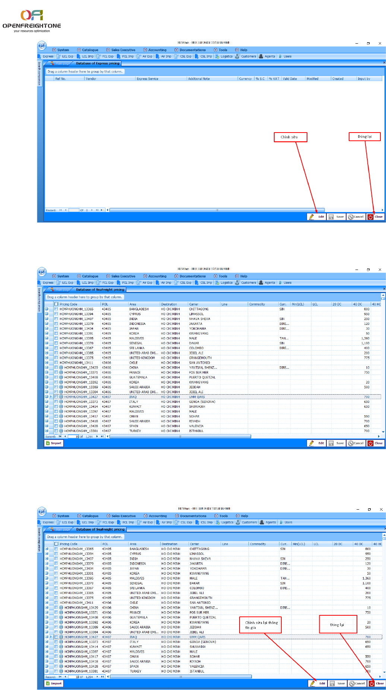

Ta có thể lọc dữ liệu theo trường tương ứng bằng cách click chuột phải vào lưới. Hệ thống sẽ hiển thị dòng đầu tiên trên bảng để nhập trường dữ liệu tìm kiếm tương ứng.

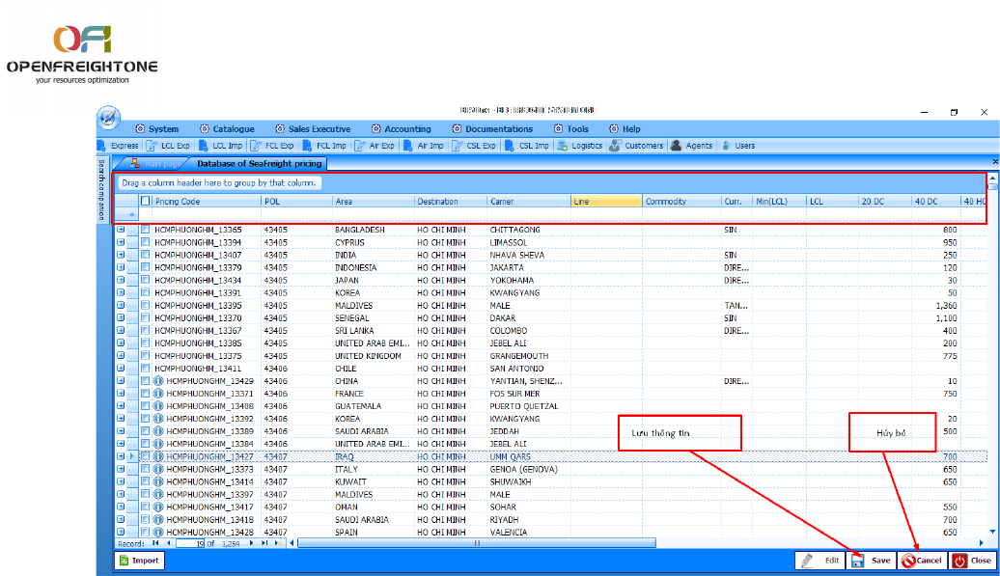

Ta có thể đẩy file báo giá bằng Excel lên hệ thống OF1. Hệ thống sẽ hiển thị một form để mở file bảng báo giá có trong máy để đưa vào hệ thống.

Click chọn **Open file** để mở file dữ liệu bảng Excel để đưa vào OF1.

Sau khi kiểm tra đầy đủ, click chọn **Save** để lưu thông tin bảng báo giá vào hệ thống.

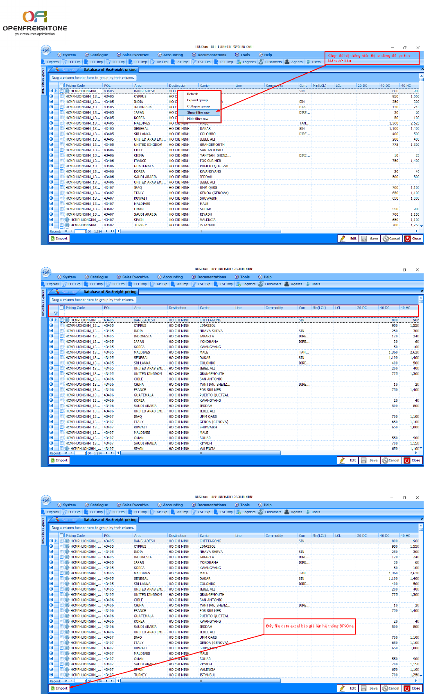

Ta có thể làm bảng báo giá cho khách hàng bằng cách nhập đối vào mã báo giá đó. Chọn **Create New Quotation** để hệ thống chuyển đến bảng báo giá ở tab SeaQuotation.

---

## 5. AirFreight Quotation (Báo giá hàng không)

### a. Giới thiệu

Nơi tạo báo giá hàng đi đường hàng không.

**Cách thực hiện:** Chọn Sales Executive → AirFreight Quotation

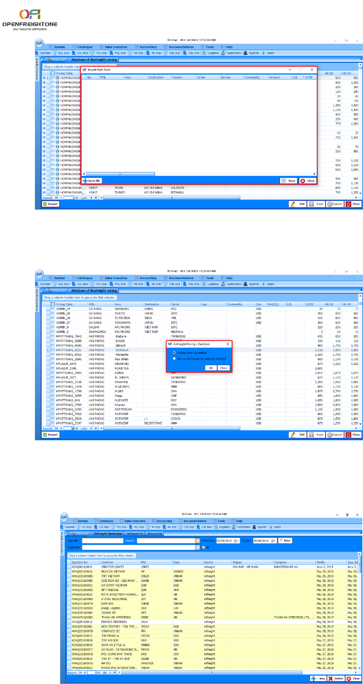

Các trường thông tin:

- **Quotation No.:** Số bản báo giá (do hệ thống tự động cấp)
- **Customer:** Tên khách hàng
- **POL:** Cảng đi
- **Destination:** Điểm đến
- **Service:** Dịch vụ
- **Shipper:** Người vận chuyển
- **Consignee:** Người nhận hàng
- **Modify:** Ngày file được chỉnh sửa
- **Quo.Date:** Ngày tạo báo giá
- **Validity:** Ngày hết hiệu lực
- **Creator:** Người tạo file

Mầu trắng là báo giá chưa gửi internal booking, mầu vàng là đã xuất internal booking cho bộ phận chứng từ và đã được approve.

### b. Cách tìm kiếm và xem chi tiết

Ta có thể tìm kiếm file bằng cách chọn ngày tháng năm sau đó click chọn **Filter** để lọc dữ liệu.

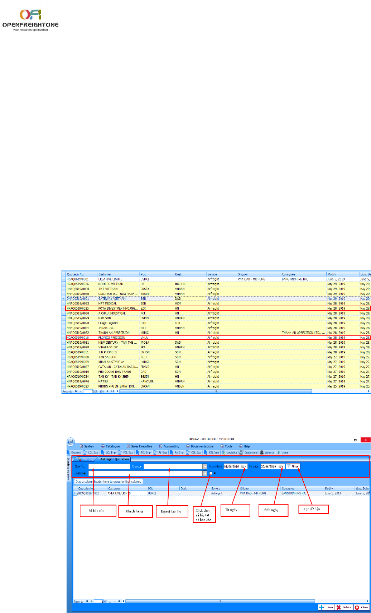

Ta có thể xem chi tiết bản báo giá bằng cách double click vào bản báo giá đó. Hệ thống sẽ hiển thị một form bao gồm đầy đủ thông tin của bản báo giá.

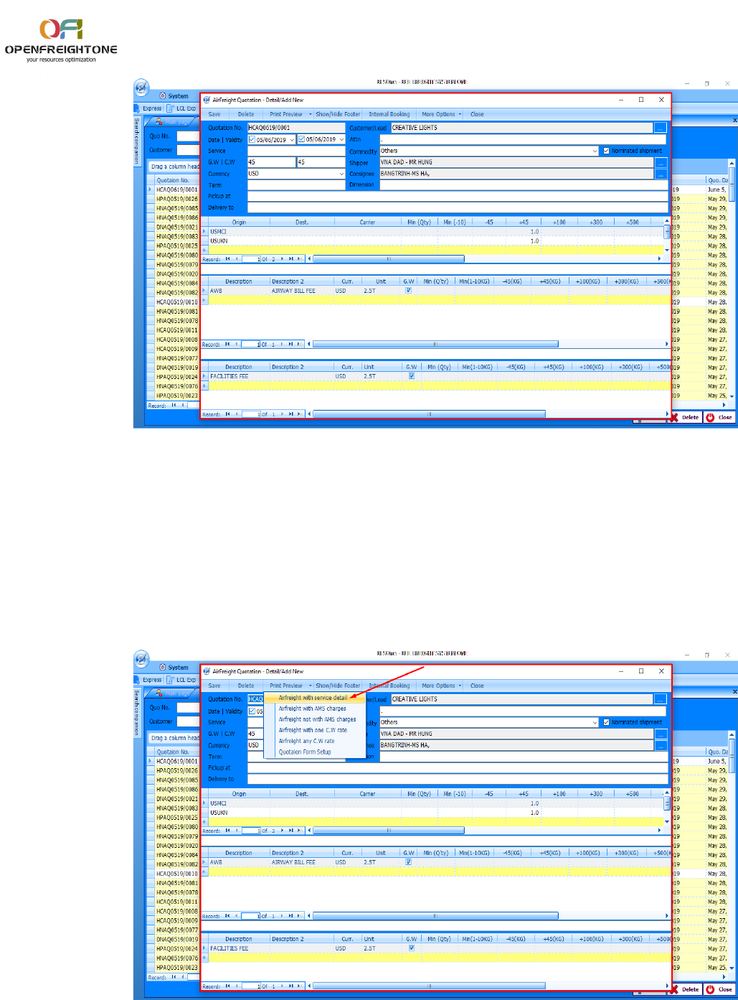

Các công cụ của bản báo giá:

- **Save:** Lưu thông tin
- **Delete:** Phải là người tạo file mới có quyền để xóa
- **Print Preview:**
  - Airfreight with service detail: In ra báo giá có chi tiết dịch vụ của lô hàng
  - Airfreight with AMS charges: Bản báo giá sẽ hiển thị thông tin chi phí AMS
  - Airfreight not with AMS charges: Bản báo giá sẽ không hiển thị chi phí AMS
  - Airfreight with one C.W rate: Bản báo giá in ra chỉ có một phí charge weight nhỏ nhất
  - Airfreight any C.W rate: Bản báo giá in ra sẽ hiển thị tất cả các phí charge weight

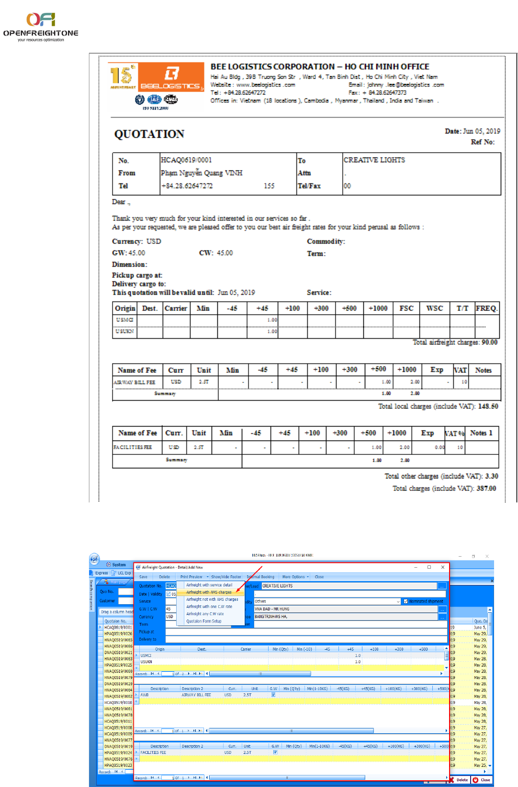

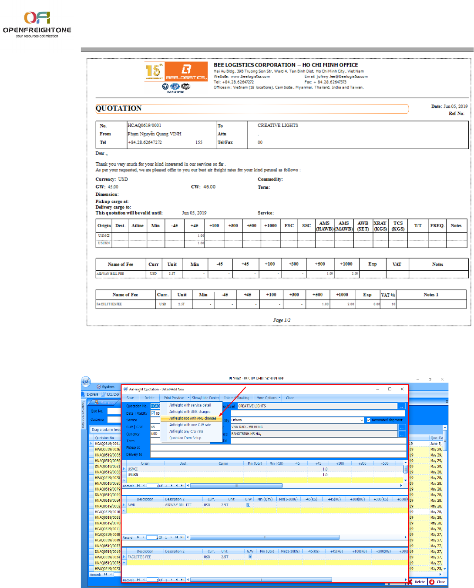

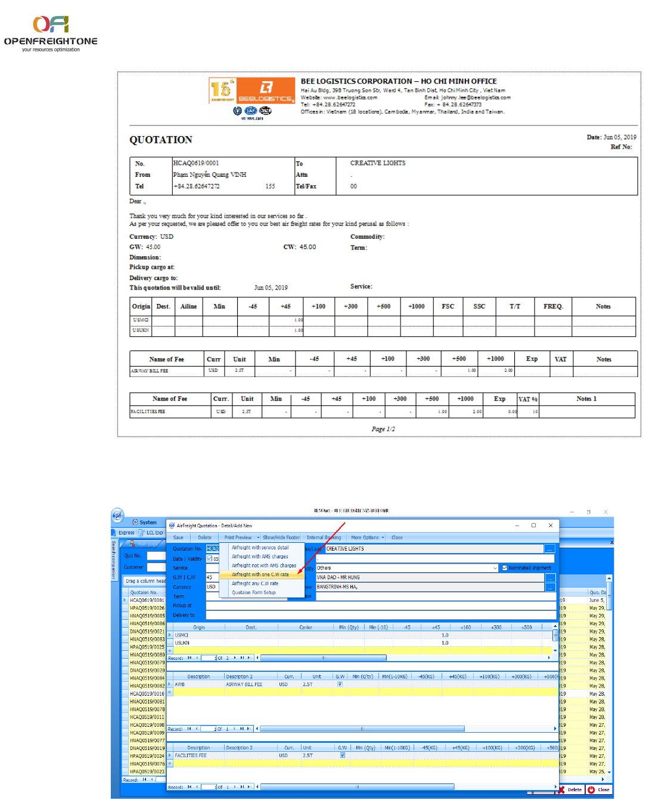

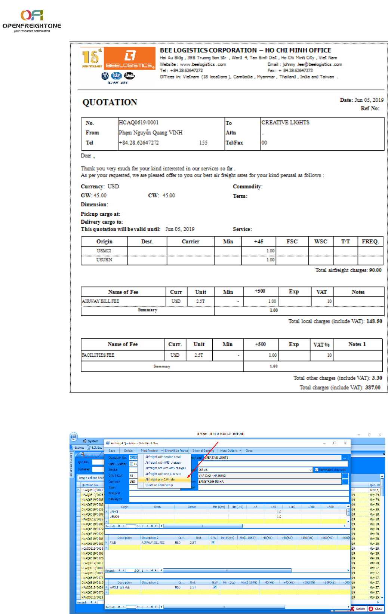

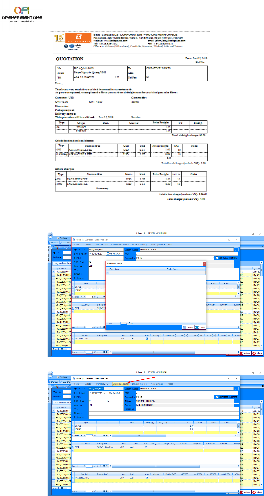

**Quotation Form Setup:** Bản báo giá có thể hiển thị theo format mong muốn.

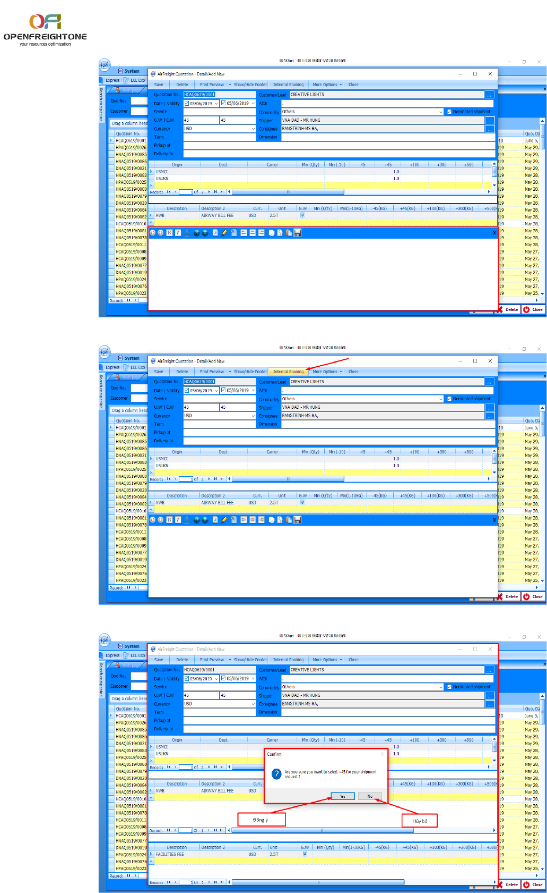

- **Show/Hide Footer:** Hiển thị / Ẩn phần ghi chú của bản báo giá

**Internal Booking:** Gửi internal booking cho bộ phận chứng từ để làm đơn hàng. Hệ thống sẽ thông báo bạn có muốn tạo internal booking hay không.

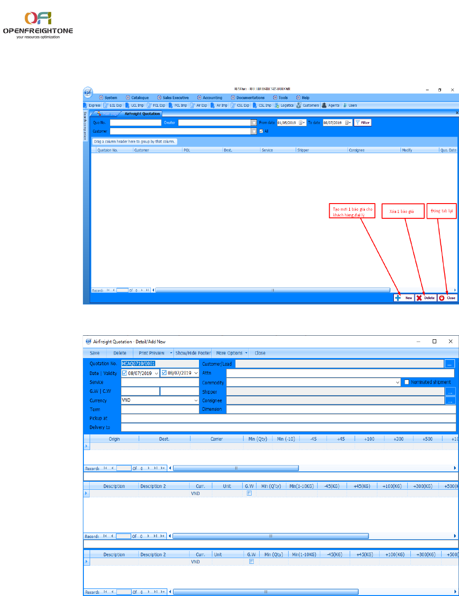

**More Options:**

- **Send Mail:** Gửi mail lên hệ thống chuyển qua cho bộ phận chứng từ. Lấy thông tin cho internal booking kiểm tra lại và gửi cho Docs.

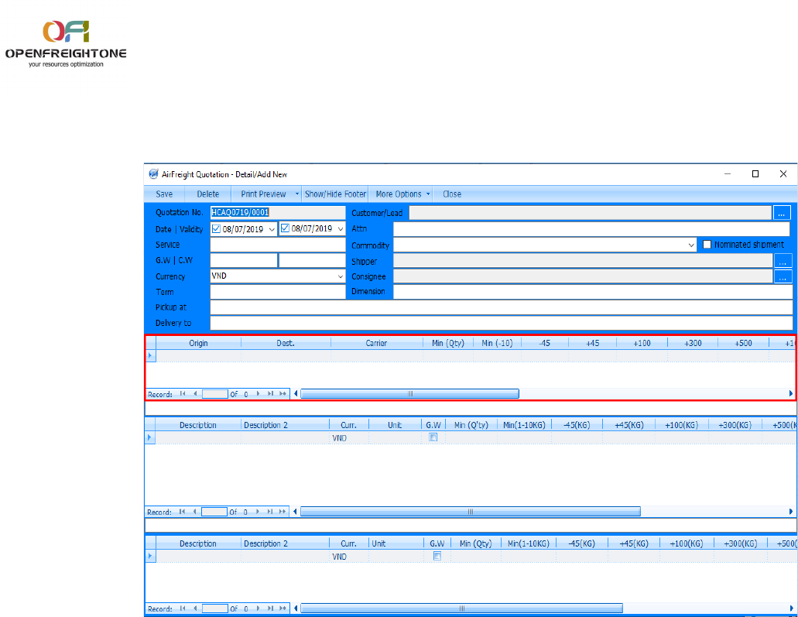

- **Re-send Internal Booking:** Gửi lại internal booking khi bên bộ phận chứng từ chưa phản hồi
- **Close:** Đóng bản báo giá

### c. Cách tạo mới báo giá

Click chọn nút **New** ở góc phải bên dưới màn hình. Hệ thống sẽ hiển thị một form để điền thông tin báo giá.

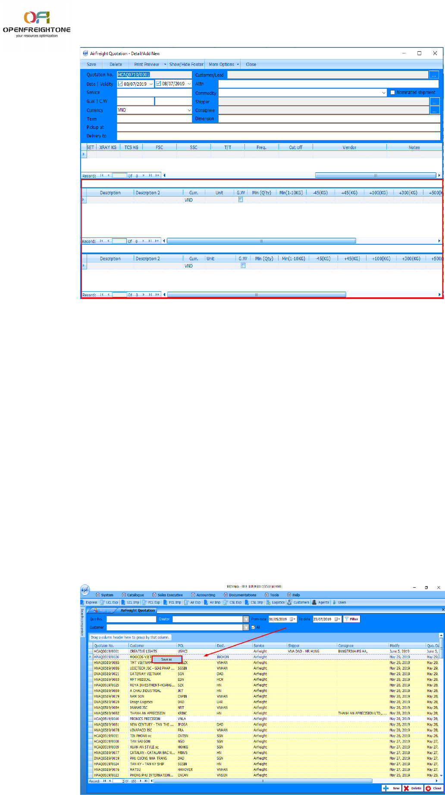

Các trường thông tin cần nhập:

- **Quotation No.:** Số ID bản báo giá (do hệ thống tự động cấp)
- **Date/Validity:** Ngày tạo / Ngày hiệu lực
- **Service:** Loại dịch vụ
- **G.W/C.W (Gross Weight/Charge Weight):** Khối lượng thực tế / Khối lượng tính phí
- **Currency:** Tỷ giá
- **Term:** Điều khoản
- **Pickup at:** Lấy hàng tại
- **Delivery to:** Giao đến
- **Customer/Lead:** Khách hàng / Khách hàng tiềm năng
- **Attn:** Tên người tạo file
- **Commodity:** Loại mặt hàng
- **Nominated shipment:** Hàng hóa chỉ định
- **Shipper:** Người vận chuyển
- **Consignee:** Người nhận hàng
- **Dimension:** Khoảng không gian của hàng hóa
- **Origin:** Nơi đi
- **Dest (Destination):** Điểm đến
- **Carrier:** Hãng tàu
- **Min (Qty) (Quantity):** Số lượng tối thiểu
- **Min (10):** Số lượng tối thiểu dưới 10kg
- **AMS HAWB:** Phí AMS trong House Air Waybill
- **AMS MAWB:** Phí AMS trong Master Air Waybill
- **AMS SET:** Phí AMS cố định
- **XRAY KG:** Phí soi X-ray theo kg
- **TCS KG:** Phí TCS theo kg
- **FSC:** Phụ phí nhiên liệu
- **SSC:** Phụ phí an ninh
- **T/T:** Thời gian chuyển tải
- **Freq (Frequency):** Tần suất hiệu lực
- **Cut off:** Ngày tàu đi
- **Vendor:** Nhà thầu phụ
- **Notes:** Ghi chú

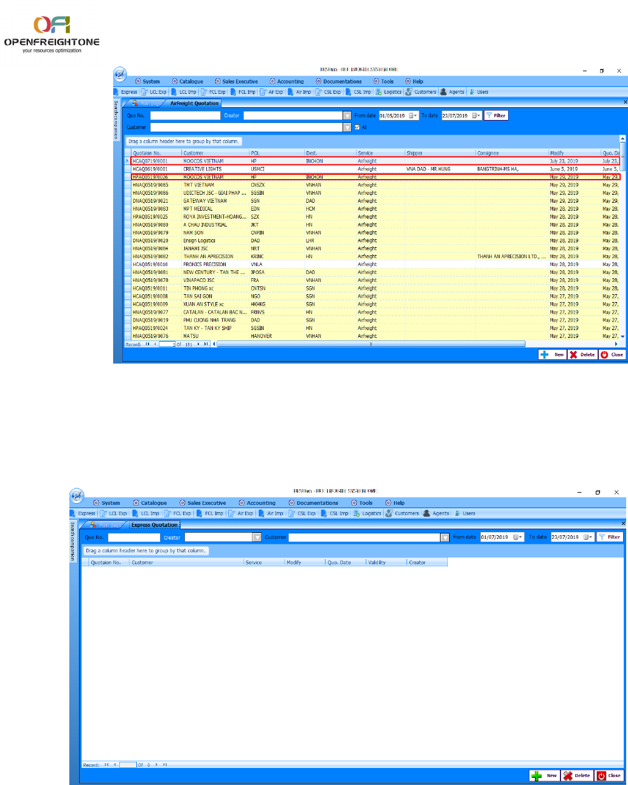

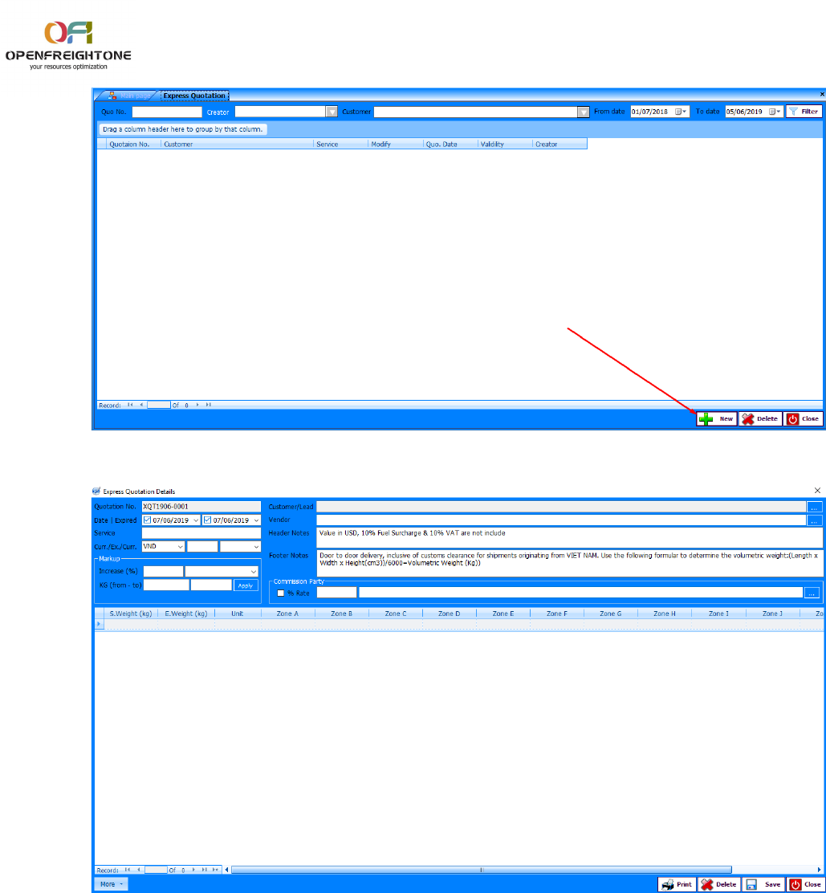

Bảng trên là các loại phí ở khu vực (Local Charge). Bảng bên dưới là các loại phí ở nước ngoài (Oversea Charge).

- **Description:** Mô tả chi tiết tên loại phí (có thể viết tắt)
- **Description 2:** Mô tả chi tiết chi phí (cụ thể chi tiết)
- **Curr (Currency):** Tỷ giá
- **Unit:** Đơn giá
- **GW (Gross Weight):** Khối lượng thực tế
- **Min (Q'ty):** Số lượng tối thiểu
- **Exception:** Các phí ngoài lệ
- **VAT:** Thuế giá trị gia tăng
- **Note:** Ghi chú

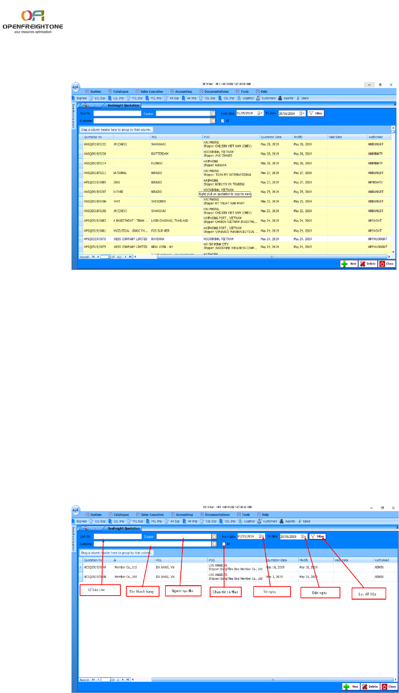

### d. Sao chép báo giá

Ta có thể sao chép một bản báo giá đã làm từ trước có nội dung kiện hàng và chi phí như nhau bằng cách click chuột phải vào bản báo giá cần sao chép.

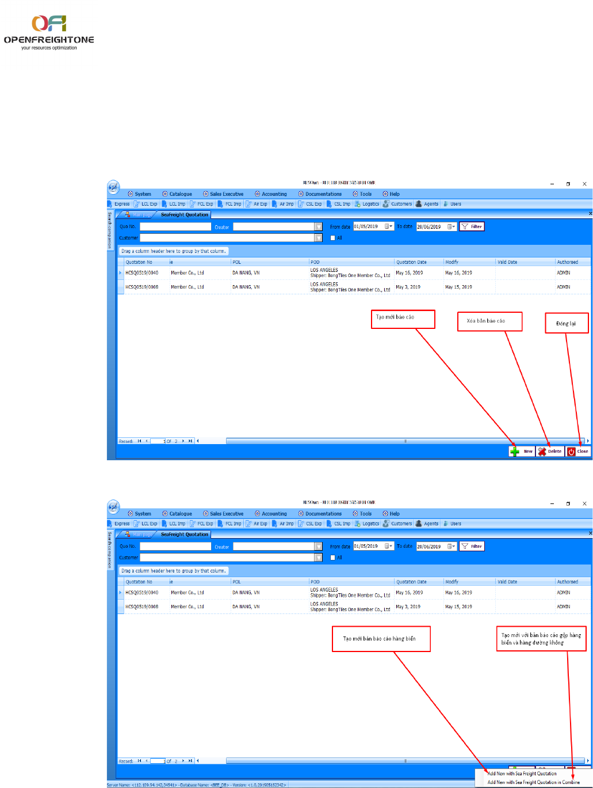

Chọn **Save as**, hệ thống sẽ tự động sao chép tất cả nội dung của bản báo giá đó thành một bản báo giá mới có số báo giá mới nhưng nội dung giống như bản báo giá vừa sao chép.

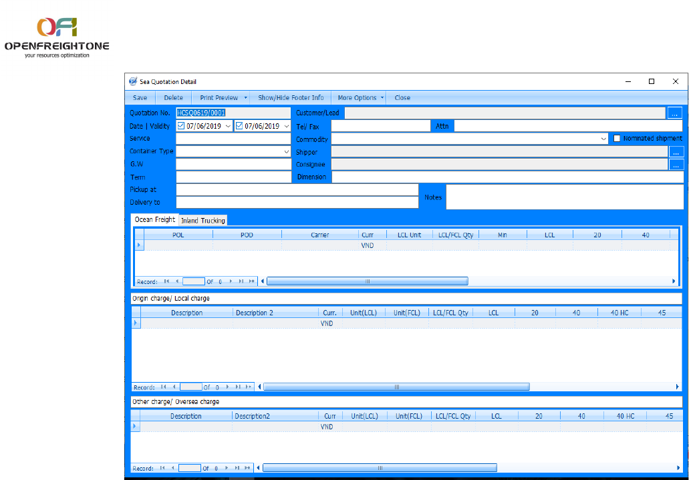

Tiện lợi cho Salesman không cần phải nhập lại tất cả các chi phí từ đầu đối với khách hàng đó, chỉ cần chỉnh sửa các loại phí (nếu có) và gửi cho bộ phận chứng từ approve.

---

## 6. Express Quotation (Báo giá hàng xuất)

Nhập các thông tin liên quan đến báo giá của hàng xuất để gửi cho khách hàng hoặc đại lý.

**Cách thực hiện:** Chọn Sales Executive → Express Quotation

Các trường thông tin:

- **Quotation No.:** Số bản báo giá (do hệ thống tự động cấp)
- **Customer:** Tên khách hàng
- **Service:** Dịch vụ
- **Modify:** Ngày file được chỉnh sửa
- **Quo.Date:** Ngày tạo báo giá
- **Validity:** Ngày hết hiệu lực
- **Creator:** Người tạo file

Ta có thể tìm kiếm file bằng cách chọn ngày tháng năm sau đó click chọn **Filter** để lọc dữ liệu. Nếu muốn tạo mới, click chọn **New**.

Hệ thống sẽ hiển thị form thông tin bao gồm:

- **Quotation No.:** Số báo giá (hệ thống tự động cấp)
- **Date/Expired:** Ngày tạo / Ngày hết hạn
- **Service:** Loại dịch vụ
- **Curr/Ex/Curr:** Tỷ giá hiện tại / Chuyển đổi / Tỷ giá mới
- **Increase:** Giá tăng (là %)

Sau khi nhập đầy đủ thông tin, click chọn **Save** để lưu thông tin hoặc click chọn **Delete** để xóa.

---

## 7. SeaFreight Quotation (Báo giá hàng biển)

### a. Giới thiệu

Nơi báo giá hàng biển.

**Cách thực hiện:** Chọn Sales Executive → SeaFreight Quotation

Các trường thông tin:

- **Quotation No.:** Số bản báo giá (do hệ thống tự động cấp)
- **Customer:** Tên khách hàng
- **POL (Port of Loading):** Cảng đi
- **POD (Port of Discharge):** Cảng đến
- **Modify:** Ngày file được chỉnh sửa
- **Quo.Date:** Ngày tạo báo giá
- **Validity:** Ngày hết hiệu lực
- **Authorised:** Được ủy quyền

### b. Tìm kiếm dữ liệu và xem chi tiết báo giá

Ta có thể tìm kiếm file bằng cách chọn ngày tháng năm sau đó click chọn **Filter** để lọc dữ liệu. Click chọn **All** để hiển thị tất cả các báo giá trong thời gian đó (đã xuất và chưa xuất internal booking).

Các trường tìm kiếm:

- **Quo No.:** Số ID báo giá (do hệ thống tự động cấp)
- **Creator:** Người tạo file
- **Customer:** Khách hàng
- **From date:** Từ ngày
- **To date:** Đến ngày
- **All:** Tất cả các báo giá bao gồm đã xuất internal booking và chưa

### c. Cách tạo mới báo giá

Click chọn **Add New** để thêm mới và **Delete** để xóa file đang chọn hiện tại.

Khi click **Add New**:

**Add New with Sea Freight Quotation:** Tạo một bản báo giá mới với hàng đường biển.

Các trường thông tin cần nhập:

- **Quotation No.:** Số bản báo giá (do hệ thống tự động cấp)
- **Date/Validity:** Ngày tạo file / Ngày hiệu lực
- **Service:** Dịch vụ
- **Container Type:** Loại container
- **G.W (Gross Weight):** Khối lượng thực tế
- **Term:** Điều khoản
- **Pickup at:** Lấy hàng tại
- **Delivery to:** Giao đến nơi
- **Customer/Lead:** Khách hàng / Khách hàng tiềm năng
- **Tel/Fax:** Số điện thoại / Fax
- **Attn:** Người tạo file
- **Commodity:** Loại mặt hàng
- **Shipper:** Người giao hàng
- **Consignee:** Người nhận hàng
- **Dimension:** Không gian hàng
- **Notes:** Ghi chú

**Ocean Freight:**

- **POL (Port of Loading):** Cảng đi
- **POD (Port of Discharge):** Cảng đến
- **Carrier:** Hãng tàu
- **Curr (Currency):** Tỷ giá
- **LCL Unit:** Đơn vị hàng LCL
- **LCL/FCL Qty (Quantity):** Số lượng hàng LCL/FCL
- **Min:** Số lượng tối thiểu
- **LCL:** Số lượng hàng LCL
- **Cut off:** Ngày tàu đi
- **VIA:** Cảng chuyển tải
- **Freq (Frequency):** Tần suất hiệu lực
- **T/T (Transit Time):** Thời gian chuyển tải
- **Notes:** Ghi chú

**Inland Trucking:**

- **From:** Từ đâu
- **To:** Đến đâu
- **Carrier:** Hãng tàu
- **LCL Min:** Hàng LCL tối thiểu
- **LCL:** Số lượng hàng LCL
- **VAT:** Thuế giá trị gia tăng
- **Curr (Currency):** Tỷ giá
- **Type:** Loại hàng
- **Empty Return:** Hàng rỗng trả lại
- **Notes:** Ghi chú

**Origin Charge / Local Charge (Phí trong nước / Phí khu vực):**

- **Description:** Mô tả chi tiết
- **Description 2:** Mô tả chi tiết 2
- **Curr (Currency):** Tỷ giá
- **Unit (LCL):** Đơn vị (hàng LCL)
- **Unit (FCL):** Đơn vị (hàng FCL)
- **LCL/FCL Qty (Quantity):** Số lượng hàng LCL/FCL
- **LCL:** Số lượng hàng LCL
- **20:** Cont 20
- **40:** Cont 40
- **40 HC:** Cont 40 HC
- **45:** Cont 45
- **VAT:** Thuế giá trị gia tăng
- **Min (LCL):** Số lượng tối thiểu (hàng LCL)
- **Notes:** Ghi chú
- **Origin:** Trong nước

**Other Charge / Oversea Charge (Phí nước ngoài):**

- **Description:** Mô tả chi tiết
- **Description 2:** Mô tả chi tiết 2
- **Curr (Currency):** Tỷ giá
- **Unit (LCL):** Đơn vị (hàng LCL)
- **Unit (FCL):** Đơn vị (hàng FCL)
- **LCL/FCL Qty (Quantity):** Số lượng hàng LCL/FCL
- **LCL:** Số lượng hàng LCL
- **20:** Cont 20
- **40:** Cont 40
- **40 HC:** Cont 40 HC
- **45:** Cont 45
- **VAT:** Thuế giá trị gia tăng
- **Payee:** Người chi trả
- **KB (Kick Back):** Tiền hoa hồng
- **TT (Trucking Time):** Thời gian chuyển tải
- **Min (LCL):** Số lượng tối thiểu (hàng LCL)
- **Notes:** Ghi chú
- **Origin:** Trong nước

**Các nút công cụ của bảng báo giá:**

- **Save:** Lưu thông tin báo giá
- **Delete:** Xóa thông tin báo giá
- **Print Preview:** In các bản in mẫu tùy theo form có sẵn trong hệ thống

---

## 8. AirFreight Booking Request (Yêu cầu đặt chỗ hàng không)

Nơi chứa những yêu cầu của hãng hàng không được gửi cho bộ phận chứng từ. Service Date Files sẽ được tính từ ngày ETD hoặc ETA.

**Cách thực hiện:** Chọn Sales Executive → AirFreight Booking Request

**General Information (Thông tin cơ bản):**

- **Booking No.:** Hệ thống sẽ tự động sinh số booking
- **To Co-loader/Airline:** Gửi tới co-loader / Hãng hàng không
- **Attn:** Người làm file
- **Date:** Ngày làm

**Detail Information (Thông tin chi tiết):**

- **Airport of Departure:** Cảng đi
- **Airport of Destination:** Cảng đến
- **Loading Date:** Ngày chuyển hàng lên
- **Flight Schedule Request:** Lịch trình ngày bay yêu cầu
- **Description of Goods:** Mô tả hàng hóa
- **No. Pieces:** Số kiện hàng
- **Gross Weight:** Khối lượng hàng hóa thực tế
- **CBM (Cubic Meter):** Nhập dài rộng chiều cao của kiện hàng để hệ thống tự quy đổi ra CBM
- **Request Contact:** Yêu cầu đến ai

---

## 9. AirFreight Booking Confirm (Xác nhận đặt chỗ hàng không)

Sau khi xác nhận đã nhận booking, hệ thống sẽ hiển thị form thông tin để điền đầy đủ thông tin đơn hàng.

**General Information (Thông tin cơ bản):**

- **Booking No.:** Số booking được tạo bên Booking Request
- **Date:** Ngày Booking Request được tạo
- **To Shipper:** Đến nhà vận chuyển

**Detail Information (Thông tin chi tiết):**

- **From:** Từ đâu
- **To:** Đến đâu
- **Flight:** Chuyến bay
- **ETD:** Ngày dự kiến khởi hành
- **ETA:** Ngày dự kiến đến nơi
- **G.W (Gross Weight):** Khối lượng thực tế của hàng hóa
- **CBM (Cubic Meter):** Thể tích khối hàng
- **DIM (Dimension):** Không gian hàng hóa
- **MAWB No.:** Mã số Master Air Waybill
- **HAWB No.:** Mã số House Air Waybill
- **Loading Date:** Ngày chuyển hàng lên
- **Warehouse:** Kho chứa hàng (nếu có)
- **Destination:** Điểm đến
- **Special Requirement:** Yêu cầu đặc biệt khác
- **Send request to Docs:** Gửi yêu cầu đến bộ phận chứng từ
- **OPS:** Nhân viên hiện trường chịu trách nhiệm

Sau khi điền đầy đủ thông tin, click chọn **Save** để lưu lên hệ thống OF1, **Delete** để xóa, **New** để tạo mới, **Preview** để xem bản báo giá.

---

## 10. Logistics Service Request Management (Quản lý yêu cầu dịch vụ Logistics)

Nơi chứa các internal booking bên báo giá gửi qua cho bộ phận Docs nhưng chưa được approve.

**Cách thực hiện:** Chọn Sales Executive → Logistics Service Request Management

Ta có thể lọc dữ liệu xem trong tháng đó có bao nhiêu yêu cầu. Sau khi click chọn, hệ thống sẽ lọc dữ liệu và xuất ra ở bảng bên dưới.

Các trường thông tin:

- **Ref No.:** Số file liên quan
- **Request Date:** Ngày tạo file yêu cầu
- **Customer:** Khách hàng
- **HBL No.:** Số House Bill
- **From:** Từ ngày
- **To:** Đến ngày
- **Service:** Loại dịch vụ
- **Requester:** Người yêu cầu
- **Approve by:** Được chấp thuận bởi
- **CDS No.:** Số chứng từ hải quan
- **Notes:** Ghi chú
- **Salesman:** Nhân viên kinh doanh chịu trách nhiệm lô hàng
- **OP Notify:** Lưu ý cho nhân viên hiện trường
- **Decline:** Từ chối
- **Approved:** Chấp thuận
- **Wait:** Chờ
- **Requester User:** Người dùng yêu cầu
- **Approved User:** Người dùng chấp thuận

Nếu muốn xem chi tiết một đơn yêu cầu, nhập đối vào đơn yêu cầu đó.

### Service Request

- **Salesman:** Nhân viên kinh doanh chịu trách nhiệm yêu cầu
- **From:** Từ nhân viên kinh doanh
- **Request No / Date:** Số yêu cầu / Ngày
- **Revision:** Sửa đổi
- **Shipper Name & Address:** Tên người vận chuyển và địa chỉ
- **Port of Loading:** Cảng đi
- **Empty Ret/Pickup:** Cont rỗng / Nơi lấy
- **Contact Name:** Tên liên hệ
- **Time at:** Thời gian
- **ETD/ETA:** Ngày dự kiến khởi hành / Ngày dự kiến đến nơi
- **Vessel Voy/Flight:** Chuyến tàu, Hải trình / Chuyến bay
- **Description of Goods:** Mô tả chi tiết hàng hóa
- **Quantity:** Số lượng
- **Truck Type:** Loại xe
- **Operation:** Người chấp thuận thực hiện
- **HBL No:** Số House Bill
- **Customer:** Tên khách hàng
- **Consignee Name & Address:** Tên người nhận và địa chỉ
- **CDS No.:** Số chứng từ hải quan
- **Port of Discharge:** Cảng đến
- **Address:** Địa chỉ
- **Tel No.:** Số điện thoại
- **Operation Notes:** Ghi chú của người chấp thuận
- **Type of Service:** Loại dịch vụ
- **CDS Type:** Loại chứng từ hải quan
- **Unit:** Đơn giá
- **Packages:** Kiện hàng
- **CBM (Cubic Meter):** Thể tích khối
- **Special Request / Notes:** Yêu cầu đặc biệt / Ghi chú

Bảng hiển thị thông tin chi tiết của bản yêu cầu. Có thể chỉnh sửa được nếu bộ phận Docs chưa approve.

**Các nút công cụ:**

- **Save:** Lưu chỉnh sửa
- **Delete:** Xóa yêu cầu
- **Send Request:** Gửi yêu cầu lại cho bộ phận Docs
- **Advance Request:** Các yêu cầu khác
- **Preview:** In bản mẫu để xem xét
- **Close:** Đóng lại

### Thông tin chi tiết lô hàng

- **Description:** Mô tả chi tiết
- **OP Staff:** Nhân viên hiện trường chịu trách nhiệm lô hàng
- **Start Date:** Ngày bắt đầu
- **Deadline:** Hạn chốt
- **Finish Date:** Ngày kết thúc
- **Comment:** Ghi chú
- **Modify:** Ngày chỉnh sửa
- **Authorized:** Được cấp quyền bởi

Thông tin chi tiết thêm về lô hàng: ngày bắt đầu nhận hàng và kết thúc lô hàng tùy theo hợp đồng của Salesman với khách hàng.

### Costing Rate (Giá mua)

Trả phí cho khách hàng nào theo lô hàng.

- **Subject To:** Cho đối tượng nào
- **Description:** Mô tả chi tiết
- **Quantity:** Số lượng
- **Unit:** Đơn vị
- **Unit Price:** Đơn giá
- **VAT:** Thuế giá trị gia tăng
- **Amount:** Tổng cộng
- **Curr (Currency):** Tỷ giá
- **Notes:** Ghi chú
- **OBH (On Behalf):** Chỉ hộ
- **A/C Ref:** Địa chỉ công ty mẹ để gửi thông báo
- **SOA (bắt buộc nhập):** Quản lý công nợ ở khu vực đó

### Selling Rate (Giá bán)

Nơi chứa các chi phí mà khách hàng phải trả cho BEE.

- **Subject to:** Tên khách hàng
- **Description:** Mô tả chi tiết
- **Quantity:** Số lượng
- **Unit:** Đơn vị
- **Unit Price:** Đơn giá
- **VAT:** Thuế giá trị gia tăng
- **Amount:** Tổng cộng
- **Curr (Currency):** Tỷ giá
- **Notes:** Ghi chú
- **OBH (On Behalf):** Chỉ hộ
- **A/C Ref:** Địa chỉ công ty mẹ để gửi thông báo
- **SOA (bắt buộc nhập):** Quản lý công nợ của khu vực

### Tạo mới yêu cầu

Click chọn **Add New**, hệ thống sẽ hiển thị form lựa chọn loại dịch vụ:

**Logistics Export Service:**

- **Service Type:** Có 3 lựa chọn
  - **Sea:** Yêu cầu hàng đường biển
  - **Air:** Yêu cầu hàng đường không
  - **Trucking:** Yêu cầu hàng cần trucking

**Logistics Import Service:**

- **Service Type:** Có 3 lựa chọn
  - **Sea:** Yêu cầu hàng đường biển
  - **Air:** Yêu cầu hàng đường không
  - **Trucking:** Yêu cầu hàng cần trucking

---

## 11. Inland Trucking Request Management (Quản lý yêu cầu trucking nội địa)

Nơi chứa các yêu cầu trucking gửi cho bộ phận Docs.

**Cách thực hiện:** Chọn Sales Executive → Inland Trucking Request Management

---

## 12. Freight Shipment Management (Quản lý vận chuyển hàng hóa)

Nơi quản lý các đơn hàng hóa được vận chuyển của khách hàng trên hệ thống OF1 để tiện việc tìm kiếm và truy xuất.

**Cách thực hiện:** Chọn Sales Executive → Freight Shipment Management

Ta có thể tìm kiếm dữ liệu bằng cách nhập trường tương ứng và click chọn **Apply**, hoặc xuất dữ liệu ra file Excel bằng cách click chọn **Export**.

Sau khi click chọn **Apply**, hệ thống sẽ hiển thị dữ liệu ở bảng bên dưới.

Các trường thông tin:

- **Customer:** Tên khách hàng
- **HBL/No:** Mã số House Bill
- **Cont 20:** Số cont 20
- **Cont 40:** Số cont 40
- **Cont 40HC:** Số cont 40HC
- **Cont 45:** Số cont 45
- **POD (Port of Discharge):** Cảng xuất trả hàng
- **ETD (Estimated Time of Departure):** Ngày khởi hành dự kiến của lô hàng
- **Line:** Hàng tàu
- **Selling Rate (Make up):** Giá bán (đã làm lại)
- **Selling Rate:** Giá bán
- **Comm (Customer) (Commission):** Tiền hoa hồng cho khách hàng
- **Buying Rate:** Giá mua
- **Comm Lines (Commission Lines):** Tiền hoa hồng cho lô hàng
- **Cover Charges:** Phí bảo hiểm
- **Description:** Mô tả lô hàng
- **Payable A/C:** Tài khoản chi trả
- **Profit:** Lợi nhuận
- **%Tax:** Phần trăm thuế
- **Tax Amount:** Tổng cộng thuế
- **R.Comm. (Customer):** Lợi nhuận hoa hồng (khách hàng)
- **Ex Rate:** Tỷ giá chuyển đổi

---

## 13. Sea Booking Acknowledgement (Xem xét đơn đặt hàng đường biển)

Nơi bao gồm tất cả các booking của hệ thống OF1 để quản lý lô hàng cũng như xem xét và xuất báo cáo doanh thu.

**Cách thực hiện:** Chọn Sales Executive → Sea Booking Acknowledgement

Ta có thể tìm kiếm một lô hàng bằng cách nhập trường tương ứng và click chọn **Apply**.

Hệ thống sẽ lọc dữ liệu và xuất ra ở bảng bên dưới.

Các trường thông tin:

- **Booking ID:** Số ID được cấp tự động trong hệ thống
- **Booking Date:** Ngày làm file booking
- **Shipper/Consignee:** Người vận chuyển / Người nhận hàng
- **ETD (Estimated Time of Departure):** Ngày dự kiến khởi hành của lô hàng
- **POL/POD:** Cảng đi / Cảng đến
- **Final Destination:** Dịch đến cuối cùng của lô hàng
- **Carrier:** Hãng tàu
- **Vessel:** Tàu
- **Voy (Voyage):** Hành trình của tàu
- **Q'ty (Quantity):** Số lượng lô hàng
- **CBM (Cubic Meter):** Thể tích khối hàng
- **Job ID:** Mã job của hệ thống tự động cấp
- **Pick up At:** Lấy hàng ở
- **Drop off At:** Trả hàng ở
- **Creator:** Người tạo booking

---

## 14. Internal Booking Request Management (Quản lý các yêu cầu internal booking)

Nơi chứa tất cả các internal booking đã được duyệt hoặc chưa duyệt bên bộ phận chứng từ hoặc CUS để làm đơn hàng. Mỗi user chỉ có thể thấy được internal booking của họ.

**Cách thực hiện:** Chọn Sales Executive → Internal Booking Request Management

Các trường thông tin:

- **Ref No.:** Số mã tạm được hệ thống tự động cấp
- **Created:** Ngày tạo
- **Shipment Date:** Ngày nhận hàng
- **Customer:** Khách hàng
- **Supplier:** Người cung cấp
- **Agent:** Đại lý
- **POL (Port of Loading):** Cảng đi
- **POD (Port of Discharge):** Cảng đến
- **Destination:** Điểm đến
- **GW (Gross Weight):** Khối lượng thực tế của lô hàng
- **CW (Charge Weight):** Khối lượng tính phí của lô hàng
- **CBM (Cubic Meter):** Thể tích khối của lô hàng
- **B/K No.:** Mã booking
- **Vessel/Flight:** Tàu / Chuyến bay
- **Job ID:** ID của job nếu có
- **H-B/L No.:** Số HBL
- **Requester:** Người yêu cầu
- **Approved By:** Được chấp thuận bởi
- **Booking Type:** Loại booking

Ta có thể tìm kiếm các internal booking theo các điều kiện trên, tạo mới bằng **New** hoặc **Delete** để xóa internal booking đang chọn.

Sau khi click chọn **New**, hệ thống sẽ hiển thị một form để lựa chọn dịch vụ của đơn hàng của khách hàng.

---

## 15. Service Inquiry (Yêu cầu chỉnh sửa giá mua)

Nơi yêu cầu bộ phận pricing chỉnh sửa giá mua.

**Cách thực hiện:** Chọn Sales Executive → Service Inquiry

Ta có thể tìm kiếm dữ liệu bằng cách nhập các trường tương ứng và click chọn **Apply** để hệ thống lọc dữ liệu.

**Các trường tìm kiếm:**

- **Service ID:** Mã service
- **POL (Port of Loading):** Cảng đi
- **POD (Port of Discharge):** Cảng đến
- **Dest. (Destination):** Dịch đến của lô hàng
- **Salesman:** Nhân viên kinh doanh
- **Inquiry:** Yêu cầu
- **Customer:** Tên khách hàng
- **From:** Từ ngày
- **To:** Đến ngày

**Các trường kết quả:**

- **Service ID:** Mã service
- **Create:** Ngày tạo file
- **ETD (Estimated Time of Departure):** Ngày dự kiến khởi hành
- **ETA (Estimated Time of Arrival):** Ngày dự kiến đến nơi
- **Customer:** Tên khách hàng
- **Salesman:** Nhân viên kinh doanh
- **Inquiry:** Yêu cầu
- **Commodity:** Loại mặt hàng
- **Container(s):** Số cont
- **Quantity:** Số lượng
- **G.W/C.W (Gross Weight/Charge Weight):** Khối lượng thực tế / Khối lượng tính phí
- **CBM (Cubic Meter):** Thể tích lô hàng
- **Dimension:** Không gian hàng
- **POL (Port of Loading):** Cảng đi
- **POD (Port of Discharge):** Cảng đến
- **Dest. (Destination):** Dịch đến của lô hàng
- **Vessel/Voyage:** Hàng tàu / Hải trình
- **Pickup Cargo:** Địa điểm lấy hàng
- **Notes:** Ghi chú

---

## 16. P/L Sheet (Bảng lợi nhuận / lỗ)

Xem lợi nhuận hoặc thất thoát của một lô hàng cụ thể.

**Cách thực hiện:** Chọn Sales Executive → P/L Sheet

**Các trường thông tin:**

- **Job ID:** Số job của lô hàng cần xem xét
- **H-B/L (HAWB):** Số House Bill của lô hàng
- **Total Cost:** Tổng chi phí phải trả cho lô hàng
- **Include:** Bao gồm cả chi phí phải trả cho lô hàng trong bảng kê
- **Exclude:** Ngoài trừ chi phí phải trả cho lô hàng trong bảng kê
- **Only:** Chỉ có chi phí phải trả cho lô hàng trong bảng kê

**Summary Report (Báo cáo tổng hợp):**

- **Revenue:** Doanh thu của lô hàng
- **Partner:** Khách hàng của lô hàng
- **Curr. (Currency):** Đơn vị tiền tệ

Sau khi điền đầy đủ thông tin, click chọn **Preview** để hệ thống hiển thị dữ liệu của lô hàng tại tab Sales Profit để xem xét lợi nhuận.

---

*Tài liệu này cung cấp hướng dẫn chi tiết về các chức năng của Sales Executive module trong phần mềm OF1.*
