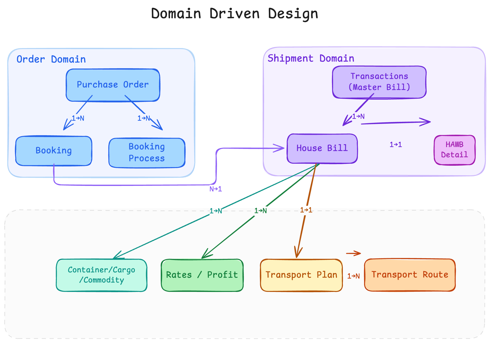
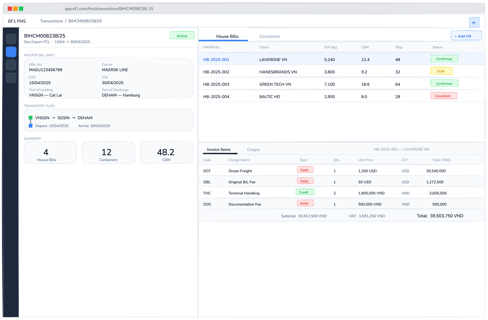

# ERP — BF1 Logistics Management

Sơ đồ Entity Relationship cho các thực thể nghiệp vụ cốt lõi của hệ thống BF1.

---

---

### `of1_fms_transactions` — Transactions - Vận đơn chủ (Master Bill)

| Trường | Kiểu | Bắt buộc | Mô tả | Note |
|---|---|---|---|---|
| `id` | bigserial |  | PK |  |
| `code` | varchar | ✓ | Mã lô hàng — UNIQUE (e.g. `BIHCM008238/25`) |  |
| `transaction_date` | timestamp |  | Ngày tạo lô hàng (nghiệp vụ) |  |
| `issued_date` | timestamp |  | Ngày phát hành |  |
| `etd` | timestamp |  | Estimated Time of Departure |  |
| `eta` | timestamp |  | Estimated Time of Arrival |  |
| `created_by_account_id` | bigint |  | FK → `of1_fms_user_role.id` — người tạo lô (nghiệp vụ) |  |
| `created_by_account_name` | varchar |  | Tên người tạo lô (denormalized) |  |
| `master_bill_no` | varchar |  | Số vận đơn chủ (MAWB# / MBL#) |  |
| `type_of_service` | enum TypeOfService |  | Loại dịch vụ (xem enum bên dưới) |  |
| `shipment_type` | enum ShipmentType |  | Loại lô hàng: `FREEHAND` / `NOMINATED` |  |
| `incoterms` | enum Incoterms |  | Điều kiện giao hàng (xem enum bên dưới) |  |
| `carrier_partner_id` | bigint |  | FK → `of1_fms_partner.id` — hãng vận chuyển (Air: hãng hàng không chi trả chi phí, Sea: Shipping Lines, Trucking: thầu phụ) |  |
| `carrier_label` | varchar |  | Tên hãng vận chuyển (denormalized) |  |
| `handling_agent_partner_id` | bigint |  | FK → `of1_fms_partner.id` (đại lý xử lý) | Move về house bill? |
| `handling_agent_label` | varchar |  | Tên đại lý xử lý (denormalized) | Move về house bill? |
| `transport_name` | varchar |  | Tên phương tiện (Sea: vessel, Air: flight, Trucking: xe) |  |
| `transport_no` | varchar |  | Số hiệu (Sea: voyage no, Air: flight no, Trucking: biển số xe) |  |
| `from_location_code` | varchar |  | Cảng xếp hàng (FK → `of1_fms_settings_location.code`) |  |
| `from_location_label` | varchar |  | Tên cảng xếp hàng (denormalized) |  |
| `to_location_code` | varchar |  | Cảng dỡ hàng (FK → `of1_fms_settings_location.code`) |  |
| `to_location_label` | varchar |  | Tên cảng dỡ hàng (denormalized) |  |
| `cargo_gross_weight_in_kgs` | double |  | Trọng lượng tổng (kg) | Measure trên MAWB |
| `cargo_volume_in_cbm` | double |  | Thể tích (CBM) | Measure trên MAWB |
| `cargo_chargeable_weight_in_kgs` | double |  | Trọng lượng tính cước | Measure trên MAWB |
| `package_quantity` | int |  | Số kiện hàng | Measure trên MAWB |
| `packaging_type` | varchar |  | Loại bao bì | Measure trên MAWB |
| `container_vol` | varchar |  | Thông tin container (text) | Measure trên MAWB |

> **`TypeOfService` enum:**
>
> | Code | Label |
> |---|---|
> | `AIR_EXPORT` | Air Export |
> | `AIR_IMPORT` | Air Import |
> | `SEA_EXPORT_FCL` | Sea Export FCL |
> | `SEA_EXPORT_LCL` | Sea Export LCL |
> | `SEA_IMPORT_FCL` | Sea Import FCL |
> | `SEA_IMPORT_LCL` | Sea Import LCL |
> | `CUSTOMS_LOGISTICS` | Customs & Logistics |
> | `INLAND_TRUCKING` | Inland Trucking |
> | `CROSS_BORDER` | Cross Border Logistics |
> | `ROUND_USE_TRUCKING` | Round Use Trucking |
> | `WAREHOUSE` | Warehouse Service |

> **`ShipmentType` enum:** `FREEHAND`, `NOMINATED`

> **`Incoterms` enum:**
>
> | Code | Label | Type of Service |
> |---|---|---|
> | `EXW` | EXW - Ex Works | `DOOR_TO_DOOR` |
> | `FCA` | FCA - Free Carrier | `DOOR_TO_DOOR` |
> | `FAS` | FAS - Free Alongside Ship | `PORT_TO_PORT` |
> | `FOB` | FOB - Free On Board | `PORT_TO_PORT` |
> | `CFR` | CFR - Cost and Freight | `PORT_TO_PORT` |
> | `CIF` | CIF - Cost, Insurance and Freight | `PORT_TO_PORT` |
> | `CPT` | CPT - Carriage Paid To | `DOOR_TO_PORT` |
> | `CIP` | CIP - Carriage and Insurance Paid To | `DOOR_TO_PORT` |
> | `DAP` | DAP - Delivered At Place | `DOOR_TO_DOOR` |
> | `DDU` | DDU - Delivered at Place Unloaded | `DOOR_TO_DOOR` |
> | `DDP` | DDP - Delivered Duty Paid | `DOOR_TO_DOOR` |

### `of1_fms_house_bill` — Vận đơn nhà (House Bill)

| Trường | Kiểu | Bắt buộc | Mô tả |
|---|---|---|---|
| `id` | bigserial |  | PK |
| `hawb_no` | varchar | ✓ | Mã nội bộ tự gen hoặc số house bill trên chứng từ — UNIQUE |
| `type_of_service` | enum TypeOfService |  | Loại dịch vụ (xem enum bên dưới) |
| `booking_process_id` | bigint |  | FK → `of1_fms_booking.id` → `of1_fms_purchase_order.id` |
| `transaction_id` | bigint |  | FK → `of1_fms_transactions.id` |
| `shipment_type` | enum ShipmentType |  | Loại lô hàng |
| `client_partner_id` | bigint |  | FK → `of1_fms_partner.id` (khách hàng) |
| `client_label` | varchar |  | Tên khách hàng (denormalized) |
| `handling_agent_partner_id` | bigint |  | FK → `of1_fms_partner.id` (đại lý xử lý) |
| `handling_agent_label` | varchar |  | Tên đại lý xử lý (denormalized) |
| `saleman_account_id` | bigint |  | FK → `of1_fms_user_role.id` (nhân viên kinh doanh) |
| `saleman_label` | varchar |  | Tên nhân viên kinh doanh (denormalized) |
| `assignee_account_id` | bigint |  | FK → `of1_fms_user_role.id` (nhân viên phụ trách) |
| `assignee_label` | varchar |  | Tên nhân viên phụ trách (denormalized) |
| `status` | varchar |  | Trạng thái |
| `issued_date` | date |  | Ngày phát hành |
| `cargo_gross_weight_in_kgs` | double |  | Trọng lượng tổng (kg) |
| `cargo_volume_in_cbm` | double |  | Thể tích (CBM) |
| `cargo_chargeable_weight_in_kgs` | double |  | Trọng lượng tính cước |
| `container_vol` | varchar |  | Thông tin container (text) |
| `desc_of_goods` | varchar |  | Mô tả hàng hóa |
| `package_quantity` | int |  | Số kiện hàng |
| `packaging_type` | varchar |  | Loại bao bì |

#### Quan hệ House Bill

| Quan hệ | Bảng | Mô tả |
|---------|------|-------|
| Transaction 1 → n | `of1_fms_house_bill` | Thông tin chung cho house bill (POL, POD, Client, Shipment Type, ...) |
| House Bill 1 → n | `of1_fms_house_bill_detail_base` | Các trường dùng chung cho mọi loại dịch vụ |
| House Bill 1 → n | `of1_fms_air_house_bill_detail` | Chi tiết riêng nghiệp vụ Air |
| House Bill 1 → n | `of1_fms_sea_house_bill_detail` | Chi tiết riêng nghiệp vụ Sea |
| House Bill 1 → n | `of1_fms_truck_house_bill_detail` | Chi tiết riêng nghiệp vụ Trucking |
| House Bill 1 → n | `of1_fms_logistics_house_bill_detail` | Chi tiết riêng nghiệp vụ Logistics |
| House Bill 1 → n | `of1_fms_cargo` | Từng kiện hàng: mô tả, commodity, HS code. Liên kết với `of1_fms_container` để biết cargo đóng ở container nào |

### `of1_fms_house_bill_detail_base` — Trường dùng chung (base)

| Trường | Kiểu | Bắt buộc | Mô tả |
|---|---|---|---|
| `id` | bigserial |  | PK |
| `house_bill_id` | bigint | ✓ | FK → `of1_fms_house_bill.id` |
| `payment_term` | varchar |  | Điều khoản thanh toán |
| `description_of_goods` | varchar |  | Mô tả hàng hóa |
| `quantity` | decimal |  | Số lượng |
| `weight` | decimal |  | Trọng lượng |
| `volume` | decimal |  | Thể tích |
| `rate_code` | varchar |  | Mã loại phí |

### `of1_fms_air_house_bill_detail` — Chi tiết riêng Air

| Trường | Kiểu | Bắt buộc | Mô tả |
|---|---|---|---|
| `id` | bigserial |  | PK |
| `house_bill_id` | bigint | ✓ | FK → `of1_fms_house_bill.id` |
| `shipper_partner_id` | bigint |  | FK → `of1_fms_partner.id` (người gửi) |
| `shipper_label` | varchar |  | Tên người gửi — hiển thị trên bill |
| `consignee_partner_id` | bigint |  | FK → `of1_fms_partner.id` (người nhận) |
| `consignee_label` | varchar |  | Tên người nhận — hiển thị trên bill |
| `notify_party_partner_id` | bigint |  | FK → `of1_fms_partner.id` (bên thông báo) |
| `notify_party_label` | varchar |  | Tên bên thông báo — hiển thị trên bill |
| `no_of_original_hbl` | int |  | Số bản gốc vận đơn |

### `of1_fms_sea_house_bill_detail` — Chi tiết riêng Sea

| Trường | Kiểu | Bắt buộc | Mô tả |
|---|---|---|---|
| `id` | bigserial |  | PK |
| `house_bill_id` | bigint | ✓ | FK → `of1_fms_house_bill.id` |
| `shipper_partner_id` | bigint |  | FK → `of1_fms_partner.id` (người gửi) |
| `shipper_label` | varchar |  | Tên người gửi — hiển thị trên bill |
| `consignee_partner_id` | bigint |  | FK → `of1_fms_partner.id` (người nhận) |
| `consignee_label` | varchar |  | Tên người nhận — hiển thị trên bill |
| `notify_party_partner_id` | bigint |  | FK → `of1_fms_partner.id` (bên thông báo) |
| `notify_party_label` | varchar |  | Tên bên thông báo — hiển thị trên bill |
| `no_of_original_hbl` | int |  | Số bản gốc vận đơn |
| `manifest_no` | varchar |  | Số manifest |
| `require_hc_surrender` | boolean |  | Yêu cầu surrender bill |
| `require_hc_seaway` | boolean |  | Yêu cầu seaway bill |
| `require_hc_original` | boolean |  | Yêu cầu original bill |
| `free_demurrage_note` | varchar |  | Ghi chú free time demurrage |
| `free_detention_note` | varchar |  | Ghi chú free time detention |
| `free_storage_note` | varchar |  | Ghi chú free time storage |

### `of1_fms_truck_house_bill_detail` — Chi tiết riêng Trucking

| Trường | Kiểu | Bắt buộc | Mô tả |
|---|---|---|---|
| `id` | bigserial |  | PK |
| `house_bill_id` | bigint | ✓ | FK → `of1_fms_house_bill.id` |

### `of1_fms_logistics_house_bill_detail` — Chi tiết riêng Logistics

| Trường | Kiểu | Bắt buộc | Mô tả |
|---|---|---|---|
| `id` | bigserial |  | PK |
| `house_bill_id` | bigint | ✓ | FK → `of1_fms_house_bill.id` |
| `cds_no` | varchar |  | Số tờ khai hải quan |
| `cds_date` | date |  | Ngày tờ khai hải quan |
| `customs_agency_partner_id` | bigint |  | FK → `of1_fms_partner.id` (đại lý hải quan) |
| `customs_agency_partner_name` | varchar |  | Tên đại lý hải quan (denormalized) |
| `selectivity_of_customs` | varchar |  | Luồng kiểm tra hải quan |
| `ops_account_id` | bigint |  | FK → `of1_fms_user_role.id` (nhân viên ops) |
| `ops_label` | varchar |  | Tên nhân viên ops (denormalized) |

---

## Nhóm B — Tracking & Tracing

### `of1_fms_container` — Container

| Trường | Kiểu | Bắt buộc | Mô tả |
|---|---|---|---|
| `id` | bigserial |  | PK |
| `transaction_id` | bigint |  | FK → `of1_fms_transactions.id` |
| `container_no` | varchar |  | Số container |
| `container_type` | varchar |  | Loại container: `20GP` / `40HQ` / ... |
| `seal_no` | varchar |  | Số chì seal |
| `quantity` | double |  | Số lượng |
| `gross_weight_in_kg` | double |  | Trọng lượng (kg) |
| `volume_in_cbm` | double |  | Thể tích (CBM) |

### `of1_fms_cargo` — Hàng hóa

> Kết hợp từ Commodity và Cargo cũ. Mỗi bản ghi là một kiện/lô hàng trong house bill, có thể gắn với container cụ thể.

| Trường | Kiểu | Bắt buộc | Mô tả |
|---|---|---|---|
| `id` | bigserial |  | PK |
| `house_bill_id` | bigint | ✓ | FK → `of1_fms_house_bill.id` |
| `container_id` | bigint |  | FK → `of1_fms_container.id` (nullable) |
| `commodity_code` | varchar |  | Mã hàng hóa (FK → `of1_fms_settings_commodity.code`) |
| `commodity_type` | varchar |  | Loại hàng hóa |
| `commodity_desc` | varchar(1024) |  | Mô tả hàng hóa |
| `desc_of_goods` | varchar(2048) |  | Mô tả chi tiết hàng hóa |
| `hs_code` | varchar |  | Mã HS code |
| `quantity` | double |  | Số lượng |
| `weight` | double |  | Trọng lượng (kg) |
| `volume` | double |  | Thể tích (CBM) |
| `packaging_type` | varchar |  | Loại bao bì |
| `package_quantity` | int |  | Số kiện |

### `of1_fms_transport_plan` — Kế hoạch vận chuyển

| Trường | Kiểu | Bắt buộc | Mô tả |
|---|---|---|---|
| `id` | bigserial |  | PK |
| `house_bill_id` | bigint |  | FK → `of1_fms_house_bill.id` |
| `booking_process_id` | bigint |  | FK → `of1_fms_booking.id` |
| `from_location_code` | varchar |  | Điểm đi chặng đầu (FK → `of1_fms_settings_location.code`) |
| `from_location_label` | varchar |  | Tên điểm đi chặng đầu (denormalized) |
| `to_location_code` | varchar |  | Điểm đến chặng cuối (FK → `of1_fms_settings_location.code`) |
| `to_location_label` | varchar |  | Tên điểm đến chặng cuối (denormalized) |
| `depart_time` | timestamp |  | Giờ khởi hành (chặng đầu) |
| `arrival_time` | timestamp |  | Giờ đến (chặng cuối) |

### `of1_fms_transport_route` — Chặng vận chuyển

| Trường | Kiểu | Bắt buộc | Mô tả |
|---|---|---|---|
| `id` | bigserial |  | PK |
| `transport_plan_id` | bigint |  | FK → `of1_fms_transport_plan.id` |
| `from_location_code` | varchar |  | Mã điểm đi (FK → `of1_fms_settings_location.code`) |
| `from_location_label` | varchar |  | Tên điểm đi (denormalized) |
| `to_location_code` | varchar |  | Mã điểm đến (FK → `of1_fms_settings_location.code`) |
| `to_location_label` | varchar |  | Tên điểm đến (denormalized) |
| `depart_time` | timestamp |  | Giờ khởi hành |
| `arrival_time` | timestamp |  | Giờ đến |
| `transport_no` | varchar |  | Số chuyến / tàu / chuyến bay |
| `transport_method_label` | varchar |  | Phương tiện |
| `carrier_partner_id` | bigint |  | FK → `of1_fms_partner.id` (hãng vận chuyển, type `COLOADER`) |
| `carrier_label` | varchar |  | Tên hãng vận chuyển (denormalized) |
| `sort_order` | int |  | Thứ tự chặng |

### `of1_fms_house_bill_invoice` — Hoá đơn House Bill

| Trường | Kiểu | Bắt buộc | Mô tả |
|---|---|---|---|
| `id` | bigserial |  | PK |
| `house_bill_id` | bigint |  | FK → `of1_fms_house_bill.id` |
| `invoice_type` | enum InvoiceType |  | Loại hoá đơn: `DEBIT` / `CREDIT` |
| `payer_partner_id` | bigint |  | FK → `of1_fms_partner.id` (bên thanh toán) |
| `payer_label` | varchar |  | Tên bên thanh toán (denormalized) |
| `payee_partner_id` | bigint |  | FK → `of1_fms_partner.id` (bên thụ hưởng) |
| `payee_label` | varchar |  | Tên bên thụ hưởng (denormalized) |
| `state` | varchar |  | Trạng thái hoá đơn |
| `currency` | varchar |  | Ngoại tệ |
| `total_amount` | double |  | Tổng tiền (trước thuế) |
| `total_tax` | double |  | Tổng thuế |
| `total_final_charge` | double |  | Tổng tiền (sau thuế) |
| `exchange_rate` | decimal(20,6) |  | Tỷ giá quy đổi |
| `domestic_currency` | varchar |  | Loại nội tệ (e.g. `VND`) |
| `domestic_total_amount` | double |  | Tổng tiền nội tệ (trước thuế) |
| `domestic_total_tax` | double |  | Tổng thuế nội tệ |
| `domestic_total_final_charge` | double |  | Tổng tiền nội tệ (sau thuế) |

> **`InvoiceType` enum:** `DEBIT`, `CREDIT`

### `of1_fms_house_bill_invoice_item` — Chi tiết dòng phí hoá đơn

| Trường | Kiểu | Bắt buộc | Mô tả |
|---|---|---|---|
| `id` | bigserial |  | PK |
| `invoice_id` | bigint |  | FK → `of1_fms_house_bill_invoice.id` |
| `charge_code` | varchar |  | Mã loại phí (FK → `of1_fms_settings_charge_type.code`) |
| `charge_name` | varchar |  | Tên phí |
| `quantity` | double |  | Số lượng |
| `unit` | varchar |  | Đơn vị tính phí |
| `unit_price` | double |  | Đơn giá |
| `total` | double |  | Thành tiền (trước thuế) |
| `total_tax` | double |  | Thuế |
| `final_charge` | double |  | Thành tiền (sau thuế) |
| `currency` | varchar |  | Ngoại tệ |
| `exchange_rate` | decimal(20,6) |  | Tỷ giá quy đổi |
| `domestic_currency` | varchar |  | Loại nội tệ (e.g. `VND`) |
| `domestic_total` | double |  | Thành tiền nội tệ (trước thuế) |
| `domestic_total_tax` | double |  | Thuế nội tệ |
| `domestic_final_charge` | double |  | Thành tiền nội tệ (sau thuế) |
| `payer_partner_id` | bigint |  | FK → `of1_fms_partner.id` (bên thanh toán) |
| `payer_label` | varchar |  | Tên bên thanh toán (denormalized) |
| `payee_partner_id` | bigint |  | FK → `of1_fms_partner.id` (bên thụ hưởng) |
| `payee_label` | varchar |  | Tên bên thụ hưởng (denormalized) |
| `reference_code` | varchar |  | Mã tham chiếu |

### `of1_fms_hawb_rates`

> Toàn bộ phí, cước mua bán trên từng house bill (selling, buying).

| Trường | Kiểu | Bắt buộc | Mô tả |
|---|---|---|---|
| `id` | bigserial |  | PK |
| `house_bill_id` | bigint |  | FK → `of1_fms_house_bill.id` |
| `charge_code` | varchar |  | Mã loại phí (FK → `of1_fms_settings_charge_type.code`) |
| `charge_name` | varchar |  | Tên phí |
| `rate_type` | varchar |  | Loại: `Debit` / `Credit` / `On_Behalf` |
| `quantity` | double |  | Số lượng |
| `unit` | varchar |  | Đơn vị tính phí (FK → `of1_fms_settings_unit.code`) |
| `unit_price` | double |  | Đơn giá |
| `total` | double |  | Thành tiền (trước thuế) |
| `total_tax` | double |  | Thuế |
| `final_charge` | double |  | Thành tiền (sau thuế) |
| `currency` | varchar |  | Ngoại tệ |
| `exchange_rate` | decimal(20,6) |  | Tỷ giá quy đổi |
| `domestic_currency` | varchar |  | Loại nội tệ (e.g. `VND`) |
| `domestic_total` | double |  | Thành tiền nội tệ (trước thuế) |
| `domestic_total_tax` | double |  | Thuế nội tệ |
| `domestic_final_charge` | double |  | Thành tiền nội tệ (sau thuế) |
| `payer_partner_id` | bigint |  | FK → `of1_fms_partner.id` (bên thanh toán) |
| `payer_label` | varchar |  | Tên bên thanh toán (denormalized) |
| `payee_partner_id` | bigint |  | FK → `of1_fms_partner.id` (bên thụ hưởng) |
| `payee_label` | varchar |  | Tên bên thụ hưởng (denormalized) |
| `reference_code` | varchar |  | Mã tham chiếu (dùng cho reference sau này) |

### `of1_fms_document_history` — Lịch sử chứng từ / tài liệu PDF

> Lưu snapshot dữ liệu tại thời điểm phát hành chứng từ (Authorize Letter, Delivery Order, ...). Mỗi lần in/phát hành là một bản ghi.

| Trường | Kiểu | Bắt buộc | Mô tả |
|---|---|---|---|
| `id` | bigserial |  | PK |
| `house_bill_id` | bigint |  | FK → `of1_fms_house_bill.id` |
| `transaction_id` | bigint |  | FK → `of1_fms_transactions.id` |
| `document_type` | enum DocumentType |  | Loại chứng từ (xem enum bên dưới) |
| `document_no` | varchar |  | Số chứng từ |
| `issued_time` | int |  | Lần phát hành (1st, 2nd, ...) |
| `issued_at` | timestamp |  | Thời điểm phát hành |
| `issued_by_account_id` | bigint |  | FK → `of1_fms_user_role.id` (người phát hành) |
| `issued_by_name` | varchar |  | Tên người phát hành (denormalized) |
| `storage_bucket` | varchar |  | S3/MinIO bucket lưu file PDF |
| `storage_key` | varchar(500) |  | S3/MinIO key của file PDF |
| `company_name_vi` | varchar(500) |  | Tên công ty (tiếng Việt) — snapshot |
| `company_name_en` | varchar(500) |  | Tên công ty (tiếng Anh) — snapshot |
| `company_address_vi` | varchar(1000) |  | Địa chỉ công ty (tiếng Việt) — snapshot |
| `company_address_en` | varchar(1000) |  | Địa chỉ công ty (tiếng Anh) — snapshot |
| `company_website` | varchar |  | Website công ty — snapshot |
| `company_email` | varchar |  | Email công ty — snapshot |
| `company_tel` | varchar |  | Số điện thoại công ty — snapshot |
| `company_fax` | varchar |  | Số fax công ty — snapshot |
| `company_offices` | varchar(500) |  | Danh sách văn phòng — snapshot |
| `consignee_label` | varchar(1000) |  | Tên người nhận hàng — snapshot |
| `notify_party_label` | varchar(1000) |  | Tên bên thông báo — snapshot |
| `shipper_label` | varchar(500) |  | Tên người gửi hàng — snapshot |
| `shipper_address` | varchar(1000) |  | Địa chỉ người gửi — snapshot |
| `transport_name` | varchar |  | Tên phương tiện — snapshot |
| `transport_no` | varchar |  | Số hiệu phương tiện — snapshot |
| `from_location_label` | varchar |  | Cảng đi — snapshot |
| `to_location_label` | varchar |  | Cảng đến — snapshot |
| `eta` | timestamp |  | ETA — snapshot |
| `master_bill_no` | varchar |  | Số MAWB/MBL — snapshot |
| `hawb_no` | varchar |  | Số HAWB/HBL — snapshot |
| `carrier_label` | varchar(500) |  | Tên hãng vận chuyển — snapshot |
| `delivery` | varchar |  | Địa điểm giao hàng |
| `delivery_type` | varchar |  | Loại giao hàng |
| `free_time_until` | varchar |  | Thời gian miễn phí đến ngày |
| `remark` | varchar(1000) |  | Ghi chú |
| `currency` | varchar(3) |  | Ngoại tệ |
| `total_charges` | varchar |  | Tổng phí (hiển thị dạng text) |
| `containers_json` | varchar(4000) |  | Thông tin containers (flatten JSON) |
| `payment_notice` | varchar(2000) |  | Thông báo thanh toán |
| `bank_info` | varchar(2000) |  | Thông tin ngân hàng |
| `service_note` | varchar(1000) |  | Ghi chú dịch vụ |
| `invoice_date` | timestamp |  | Ngày hoá đơn |
| `due_date` | timestamp |  | Ngày đến hạn thanh toán |
| `seller_name` | varchar(500) |  | Tên người bán — snapshot |
| `seller_address` | varchar(1000) |  | Địa chỉ người bán — snapshot |
| `seller_tax_id` | varchar |  | Mã số thuế người bán — snapshot |
| `seller_phone` | varchar |  | Số điện thoại người bán — snapshot |
| `seller_email` | varchar |  | Email người bán — snapshot |
| `buyer_name` | varchar(500) |  | Tên người mua — snapshot |
| `buyer_address` | varchar(1000) |  | Địa chỉ người mua — snapshot |
| `buyer_tax_id` | varchar |  | Mã số thuế người mua — snapshot |
| `buyer_phone` | varchar |  | Số điện thoại người mua — snapshot |
| `buyer_email` | varchar |  | Email người mua — snapshot |
| `invoice_items_json` | varchar(4000) |  | Chi tiết dòng phí (flatten JSON) |
| `subtotal` | double |  | Tổng trước thuế |
| `tax_rate` | double |  | Thuế suất |
| `tax_amount` | double |  | Tiền thuế |
| `total` | double |  | Tổng sau thuế |
| `notes` | varchar(1000) |  | Ghi chú thêm |
| `city_date` | varchar |  | Nơi và ngày ký (e.g. "TP. HCM, ngày 01/04/2026") |

> **`DocumentType` enum:** `AUTHORIZE_LETTER`, `DELIVERY_ORDER`

---

## Nhóm C — Order Domain

### Đặt vấn đề

#### Mô Hình Purchase Order (PO)

Sau khi nói chuyện kỹ với Xuân thì mình và Xuân có thống nhất một số vấn đề:

1. Mô hình hiện tại chỉ chú trọng giải quyết các bài toán về gom hàng ship hàng qua đường biển và đường hàng không.
2. Không giải quyết được bài toán như khách hàng có 5 lô hàng, cần giao trước hai lô, và giao tiếp 3 lô tháng sau nhưng vẫn cần theo dõi như một đơn hàng.
3. Mô hình hiện tại và các chức năng là chắp vá dựa trên mô hình master bill và house bill là mô hình cho vận tải đường biển. Rất khó để phát triển các nghiệp vụ khác trên nền tảng master bill/house bill. Ví dụ nghiệp vụ kê khai hải quan, hay nghiệp vụ vận tải đường đường bộ, gom và vận chuyển bằng xe tải.

**Mô hình Purchase Order:**

1. Coi tất cả các yêu cầu của khách hàng là một Purchase Order (PO)
2. 1 PO có thể có 1 hoặc nhiều booking (sẽ giải bài toán khách hàng cần giao trước một số lô hàng)
3. Mỗi một nghiệp vụ xử lý yêu cầu của khách hàng sẽ là 1 Purchase Order Process (POP), 1 POP sẽ hoạt động độc lập, có một mã số riêng để theo dõi, có lưu trữ các hoá đơn, chứng từ, document riêng cho từng POP.

> **Ví dụ:** Yêu cầu của khách hàng là có 5 kiện hàng, cần vận chuyển door to door, 2 kiện đi trước vào đầu tháng và 2 kiện đi sau vào giữa tháng. Như vậy ở đây chúng ta cần 3 nghiệp vụ để giải quyết yêu cầu khách hàng:
>
> 1. Nghiệp vụ gom hàng và vận chuyển hàng bằng xe tải từ kho tới cảng và từ cảng về kho.
> 2. Nghiệp vụ vận chuyển bằng đường biển.
> 3. Nghiệp vụ kê khai thông quan.
>
> Nếu tổ chức theo mô hình Purchase Order và Purchase Order Process chúng ta sẽ có:
>
> 1. 1 Purchase Order từ khách hàng với 2 booking cho 2 lần vận chuyển khác nhau.
> 2. 1 POP vận chuyển bằng xe tải từ kho ra cảng, 1 POP ship hàng, 1 POP khai quan và 1 POP vận chuyển hàng từ cảng về kho của khách hàng. Như vậy có 4 POP cho 1 lần vận chuyển và 2 lần vận chuyển là 8 POP.
> 3. Mô hình master bill/house bill cũ chỉ tương ứng với một POP (purchase order process) của 1 PO (Purchase Order).

---

### `of1_fms_purchase_order` — Đơn hàng

| Trường | Kiểu | Bắt buộc | Mô tả |
|---|---|---|---|
| `id` | bigserial |  | PK |
| `code` | varchar | ✓ | Mã đơn hàng — UNIQUE |
| `order_date` | timestamp |  | Ngày tạo đơn hàng (nghiệp vụ) |
| `label` | varchar |  | Tên đơn hàng |
| `client_partner_id` | bigint |  | FK → `of1_fms_partner.id` (khách hàng) |
| `client_label` | varchar |  | Tên khách hàng (denormalized) |
| `assignee_account_id` | bigint |  | FK → `of1_fms_user_role.id` (nhân viên phụ trách) |
| `assignee_label` | varchar |  | Tên nhân viên phụ trách (denormalized) |

### `of1_fms_booking_process` — Booking Process

> Clone từ booking của khách hàng. Tracking trạng thái xử lý được ghi nhận trên record này.

| Trường | Kiểu | Bắt buộc | Mô tả |
|---|---|---|---|
| `id` | bigserial |  | PK |
| `code` | varchar | ✓ | Mã booking — UNIQUE |
| `type_of_service` | enum TypeOfService |  | Loại dịch vụ (xem enum bên dưới) |
| `purchase_order_id` | bigint |  | FK → `of1_fms_purchase_order.id` |
| `state` | varchar |  | Trạng thái: `draft` / `confirmed` / ... |
| `close_date` | timestamp |  | Ngày đóng booking |

> **`TypeOfService` enum:** `AIR_EXPORT`, `AIR_IMPORT`, `SEA_EXPORT_FCL`, `SEA_EXPORT_LCL`, `SEA_IMPORT_FCL`, `SEA_IMPORT_LCL`, `CUSTOMS_LOGISTICS`, `INLAND_TRUCKING`, `CROSS_BORDER`, `ROUND_USE_TRUCKING`, `WAREHOUSE`

---

## Audit Fields (áp dụng cho tất cả bảng)

| Trường | Kiểu | Mô tả |
|---|---|---|
| `company_id` | bigint | FK → công ty sở hữu bản ghi |
| `created_by` | varchar | Người tạo |
| `created_time` | timestamp | Thời điểm tạo |
| `modified_by` | varchar | Người sửa cuối |
| `modified_time` | timestamp | Thời điểm sửa cuối |
| `version` | int | Optimistic locking |
| `storage_state` | varchar | Vòng đời bản ghi: `CREATED` / `ACTIVE` / `INACTIVE` / `JUNK` / `DEPRECATED` / `ARCHIVED` |

---
