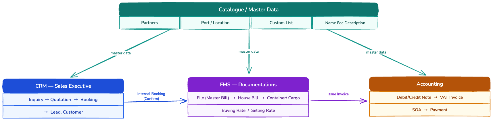
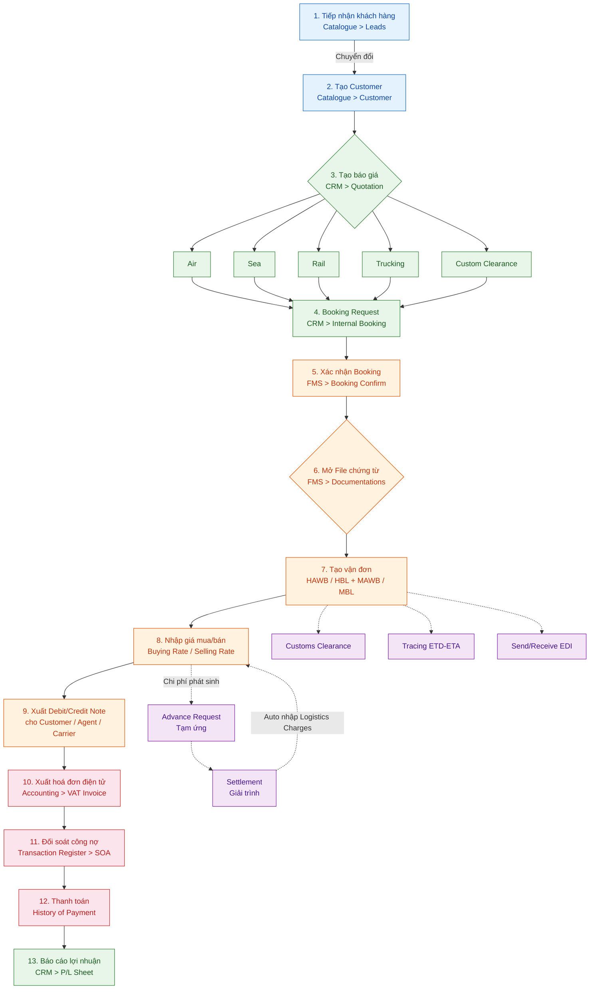
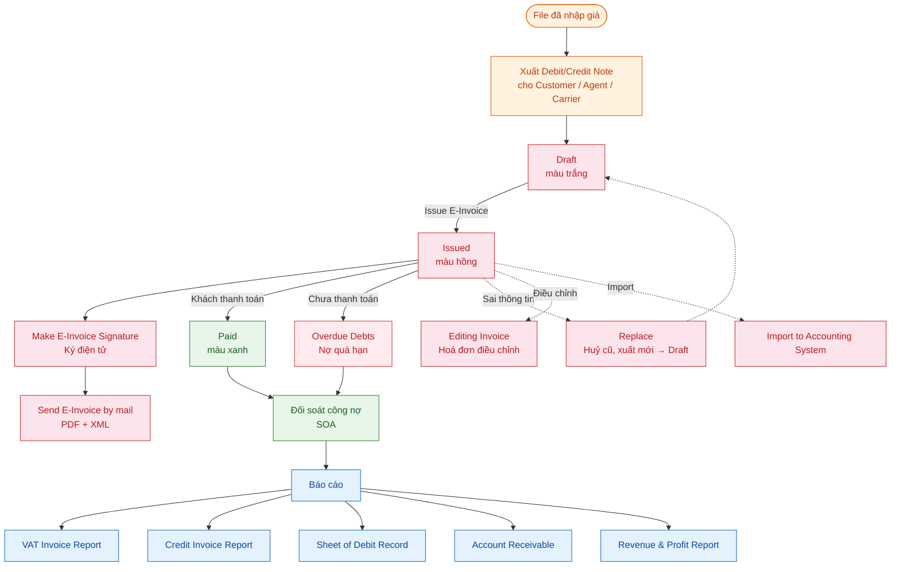
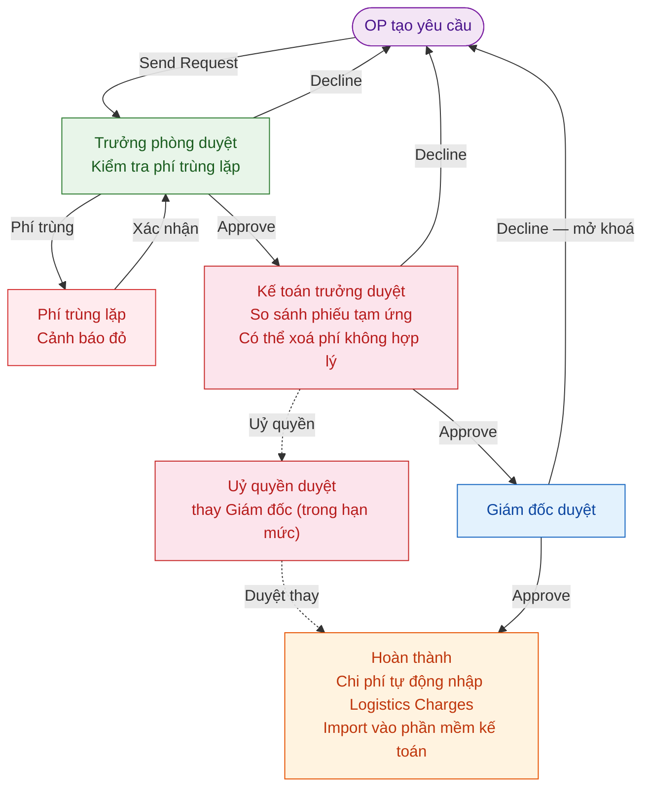
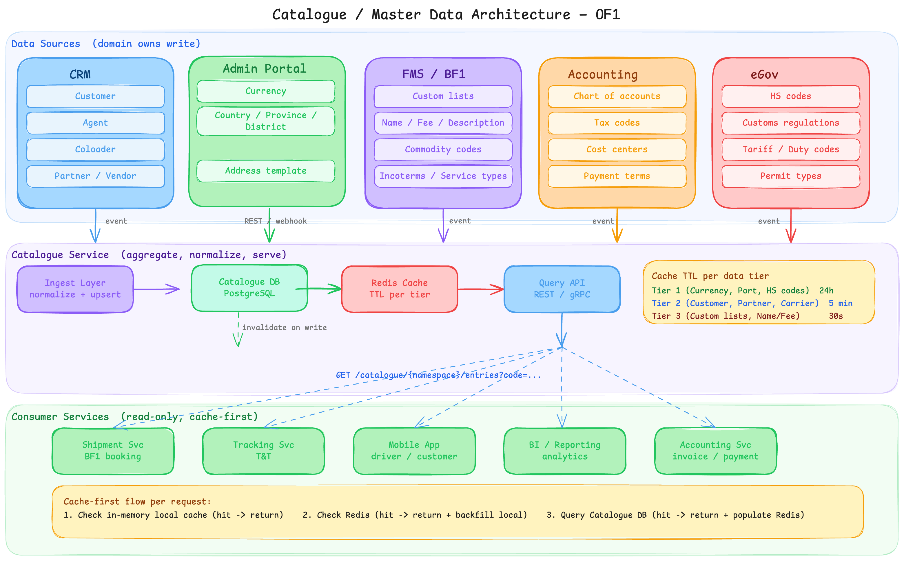
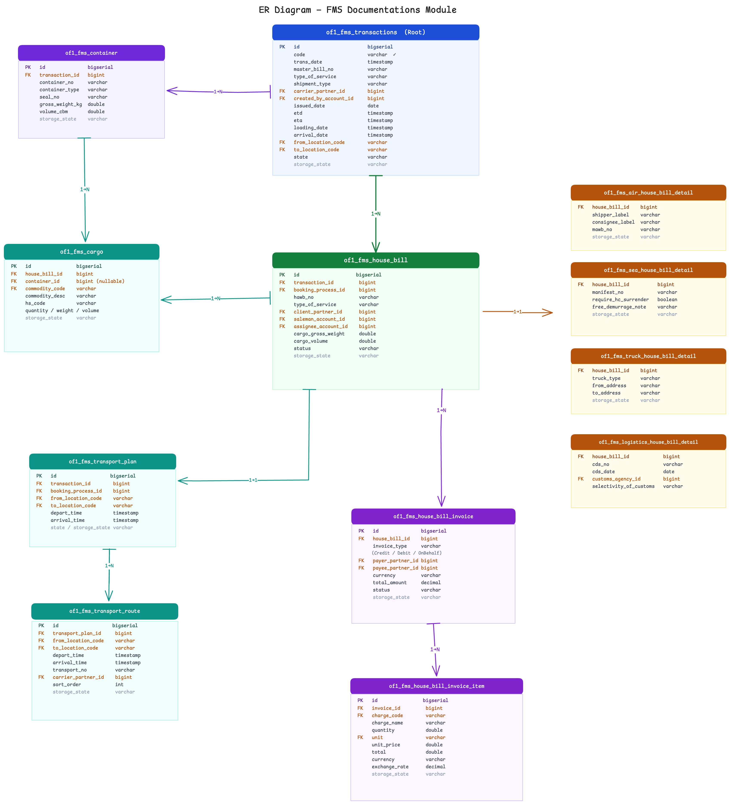

# ERP Analysis — OF1 Freight Management System

**Purpose:** Tài liệu phân tích toàn bộ nghiệp vụ và đặc tả tính năng của hệ thống OF1 FMS.

---

## 1. System Overview

### 1.1 Các ứng dụng trong hệ thống

| App | Mô tả |
|-----|-------|
| **Catalogue** | Master Data — đối tác, cảng, container, danh mục |
| **CRM** | Sales Executive — báo giá, đặt chỗ, internal booking |
| **FMS** | Documentations — chứng từ, vận đơn, giá mua/bán, invoice |
| **Accounting** | Accounting — hoá đơn điện tử, công nợ, tạm ứng, báo cáo |

### 1.2 Luồng dữ liệu giữa các app

---

## 2. Business Process Flows

### 2.1 Vòng đời lô hàng (Shipment Lifecycle — 13 bước)

---

### 2.2 Invoice Flow

---

### 2.3 Settlement Flow (Duyệt tạm ứng / giải trình — 3 cấp)

---

## 3. Catalogue Module

Catalogue là nền tảng master data của toàn hệ thống. Tất cả module đều tham chiếu dữ liệu từ đây.

| Nhóm | Tên | Vai trò / Đặc điểm | Comment |
|------|-----|--------------------|---------|
| **Hệ thống** | Departments | Phân quyền nội bộ — Admin only, theo chi nhánh | Chuyển function về HRM |
| | Container List | Container với ISO code, trọng lượng, kích thước | Cân nhắc bỏ |
| | Shipment Type Warning | Hàng hoá đặc biệt (nguy hiểm, đông lạnh, ...) | Cần làm rõ, review lại nghiệp vụ |
| | Transaction Task List | Danh sách giao dịch / công việc hệ thống | Cân nhắc bỏ |
| **Địa lý** | Country | Quốc gia — mã ISO 3166, tiền tệ mặc định, định dạng địa chỉ | |
| | Country Group | Nhóm quốc gia (ASEAN, EU, ...) — hỗ trợ phân cấp | |
| | Zone | Khu vực vận chuyển (Global, VN North, ...) | |
| | Location State | Tỉnh / Bang — mã hành chính, FK → Country | |
| | Location District | Huyện / Quận — FK → State | |
| | Location Subdistrict | Phường / Xã — FK → District | |
| | Location | Địa điểm — Airport, Port, KCN (IATA, UN/LOCODE) | Gộp chung Location - Master Data |
| | Port Index | Cảng biển và hàng không theo chuẩn UNECE | Gộp chung Location - Master Data |
| | Port Index Trucking | Cảng chuyên dùng cho trucking nội địa | Gộp chung Location - Master Data |
| **Đối tác** | Leads | Khách hàng tiềm năng — chuyển đổi 1-1 thành Customer | Chuyển function về CRM; chuyển đổi 1-1, giữ nguyên lịch sử liên lạc |
| | Customer | Khách hàng thực tế — trung tâm Quotation / File / Invoice | Chuyển function về CRM |
| | Shipper | Người gửi hàng — xuất hiện trên vận đơn | Chuyển function về CRM |
| | Consignee | Người nhận hàng — xuất hiện trên vận đơn | Chuyển function về CRM |
| | Carrier | Hãng tàu / hãng bay — vận chuyển thực tế | Chuyển function về CRM |
| | Agents | Đại lý nước ngoài — có `priority` (1–8) và `association_group` | Chuyển function về CRM; gợi ý theo priority 1–8 khi mở file |
| | Other Contacts | Hải quan, kho bãi, ... — liên hệ không thuộc nhóm trên | Chuyển function về CRM |
| | Industry | Ngành nghề đối tác — Manufacturing, Logistics, ... | Chuyển function về CRM |
| | Partner Source | Nguồn đối tác / mạng lưới forwarder — WCA, WPA | Chuyển function về CRM |
| | Custom List | Chi cục hải quan — mã, tỉnh, đội thủ tục | |
| | Partner | Đối tác / Khách hàng — category, group, scope, tax, bank | ac_ref: gom công nợ theo nhóm khi xuất SOA; status=Warning: ngăn tạo file mới |
| **Other** | Currency | Tiền tệ — mã ISO 4217, ký hiệu, số thập phân | |
| | Currency Exchange Rate | Tỷ giá theo thời kỳ — nguồn SBV / manual | |
| | Unit Group | Nhóm đơn vị đo (weight, volume, quantity) | |
| | Unit | Đơn vị đo — mã ISO, tỷ lệ quy đổi (kg, cbm, ...) | |
| | Commodity | Loại hàng hóa — HS code, cờ hàng nguy hiểm | |
| | Bank | Ngân hàng — mã SWIFT, FK → Country | |
| | Name Fee Description | Danh mục tên phí | |

---

## 4. CRM - Sales Executive Module

Quản lý toàn bộ quy trình kinh doanh: từ nhập cơ sở dữ liệu giá, lập báo giá, gửi cho khách hàng, đặt chỗ, đến gửi Internal Booking sang Documentations.

### Price Database (Cơ sở dữ liệu giá)

Lưu giá gốc từ nhà cung cấp để Sales dùng khi lập báo giá.

#### Database of AirFreight, SeaFreight, Trucking Pricing -> từ CRM.

#### Vessel Schedules (Lịch tàu)

> **Note:** CRM chưa có tính năng này.

Nhập lịch tàu từ hãng tàu. Tham chiếu khi báo giá Sea và tư vấn khách về ETD/ETA.

| Field | Kiểu | Mô tả |
|-------|------|-------|
| `line` | varchar | Tên hải trình |
| `pol` / `pod` | FK Port | Cảng đi / Cảng đến |
| `etd` / `eta` | date | Ngày dự kiến khởi hành / đến |
| `etd_transship` / `eta_transship` | date | ETD/ETA tại cảng chuyển tải |
| `vessel` / `vessel_no` | varchar | Tên tàu / Số hiệu hải trình |
| `is_active` | boolean | Đang hoạt động |

**Entity:** `of1_fms_vessel_schedule`

### Quotation, Booking & Request Management

Sales lập báo giá → khách confirm → đặt chỗ → tạo Service Request gửi sang Docs → Docs approve mở file hoặc decline trả lại.

**Tính năng:**

| Tính năng | Nhóm | Mô tả | Comment |
|-----------|------|-------|---------|
| Quotation | Báo giá | Tạo / chỉnh sửa / xóa / copy. Print Preview 5 dạng. Gửi Internal Booking (Draft → Sent). Re-send / Send Mail | |
| AirFreight Booking Request | Booking | Gửi yêu cầu đặt chỗ đến hãng bay / co-loader | Gộp chung thành 1 bảng Booking Request |
| AirFreight Booking Confirm | Booking | Xác nhận từ hãng bay — MAWB, HAWB, chuyến bay thực tế | Gộp chung thành 1 bảng Booking Request |
| Sea Booking Acknowledgement | Booking | Acknowledge booking đường biển từ co-loader / hãng tàu | Gộp chung thành 1 bảng Booking Request |
| Logistics Service Request | Request | Handover Sales → Docs. Tạo từ Quotation hoặc thủ công. Docs Approve → mở file / Decline → trả lại | Gộp chung thành 1 bảng Booking Request |
| Inland Trucking Request | Request | Tương tự Logistics Service Request, chuyên cho trucking nội địa | Gộp chung thành 1 bảng Booking Request |
| Freight Shipment Management | Request | Danh sách lô hàng đang vận chuyển — Sales theo dõi tiến độ sau handover | Gộp chung thành 1 bảng Booking Request |
| Internal Booking Request Management | Request | Tổng quan tất cả Internal Booking chưa approve, phân theo tháng — re-send | Gộp chung thành 1 bảng Booking Request |
| P/L Sheet | Request | `P/L = Selling Rate − Costing Rate` quy đổi về nội tệ | |

**Trạng thái Booking Request:** `Wait` → `Approved` / `Declined`

| Field | Kiểu | Mô tả |
|-------|------|-------|
| `request_no` | varchar | Số yêu cầu (auto-gen) |
| `revision` | int | Lần sửa đổi |
| `salesman_id` | FK | Nhân viên kinh doanh |
| `customer_id` | FK | Khách hàng |
| `type_of_service` | varchar | Air / Sea / Trucking / Logistics |
| `service_type_direction` | varchar | Export / Import |
| `pol` / `pod` | varchar | Cảng đi / Cảng đến |
| `etd` / `eta` | date | Ngày dự kiến |
| `status` | varchar | Wait / Approved / Declined |
| `costing_lines` | table | Giá mua |
| `selling_lines` | table | Giá bán |

---

## 5. FMS - Documentations Module

**Luồng chính:** Nhận Internal Booking từ Sales → mở File → tạo vận đơn (Master Bill / House Bill) → nhập giá mua/bán → xuất Debit/Credit Note.

> "File" (Transaction) là thực thể trung tâm của toàn hệ thống — mỗi lô hàng = 1 file.

### 5.1 Data Model — ERD Mapping

#### Transaction (Master Bill)

| Quan hệ | Bảng | Mô tả |
|---------|------|-------|
| Root | `of1_fms_transactions` | Master Bill — thực thể gốc đại diện cho 1 lô hàng |
| 1 → 1 | `of1_fms_transport_plan` | Kế hoạch vận chuyển tổng thể |
| 1 → n | `of1_fms_transport_route` | Từng tuyến vận chuyển cụ thể (ETD/ETA, thông tin chi tiết). Phản ánh route của từng dịch vụ cho từng khách hàng (Booking → Booking Process) |
| 1 → n | `of1_fms_container` | Thông tin container — áp dụng cho Sea / Trucking / Logistics (No, Type, Seal, GW/CBM) |

#### House Bill

| Quan hệ | Bảng | Mô tả |
|---------|------|-------|
| Transaction 1 → n | `of1_fms_house_bill` | Thông tin chung cho house bill (POL, POD, Client, Shipment Type, ...) |
| House Bill 1 → n | `of1_fms_air_house_bill_detail` | Chi tiết riêng nghiệp vụ Air |
| House Bill 1 → n | `of1_fms_sea_house_bill_detail` | Chi tiết riêng nghiệp vụ Sea |
| House Bill 1 → n | `of1_fms_truck_house_bill_detail` | Chi tiết riêng nghiệp vụ Trucking |
| House Bill 1 → n | `of1_fms_logistics_house_bill_detail` | Chi tiết riêng nghiệp vụ Logistics |
| House Bill 1 → n | `of1_fms_cargo` | Từng kiện hàng: mô tả, commodity, HS code. Liên kết với `of1_fms_container` để biết cargo đóng ở container nào |

#### Invoice (Chi phí)

| Quan hệ | Bảng | Mô tả |
|---------|------|-------|
| House Bill 1 → n | `of1_fms_house_bill_invoice` | Tổng hợp chi phí gom nhóm theo từng bên (party) |
| Invoice 1 → n | `of1_fms_house_bill_invoice_item` | Từng dòng phí chi tiết |

> **Lưu ý tách invoice:** Nếu thu cho khách hàng 5 phí, trong đó 2 phí thu hộ cho Agent → tạo 2 invoice riêng (tách theo payer). Màn hình in Debit/Credit Note sẽ flatten toàn bộ invoice items cho user chọn, hoặc query theo payer = client/customer.

### 5.2 Cấu trúc giá (Rates)

Tất cả loại giá đều lưu trong `of1_fms_house_bill_invoice`, phân biệt bằng `invoice_type`:

| Loại giá | `invoice_type` | Mặc định | Mô tả |
|----------|---------------|----------|-------|
| **Buying / Costing Rate** (Giá mua — phải trả) | `Credit` | `payer = BEE` | Phí công ty trả cho nhà cung cấp: co-loader, hãng tàu, hãng bay, customs agent |
| **Selling Rate** (Giá bán — phải thu) | `Debit` | `payee = BEE` | Phí khách hàng / agent trả cho công ty. Cấu trúc tương tự Costing Rate |
| **On Behalf** (Thu hộ — Chi hộ) | `OnBehalf` | `payer, payee ≠ BEE/HPS` | Phí công ty thu/chi hộ cho khách hàng hoặc agent |

### 5.3 Chức năng phụ trợ trên File

| Chức năng | Mô tả | Trạng thái |
|-----------|-------|------------|
| Invoice & Debit/Credit Note | Xuất Invoice từ Selling Rate → theo dõi thanh toán | ⚠️ Need to discuss |
| Customs Clearance | Theo dõi tờ khai hải quan. Gắn với OPS cho Logistics/Trucking | ⚠️ Need to discuss |
| Task Notes | Ghi chú công việc theo file. Gán cho OPS Staff với deadline và trạng thái | ⚠️ Need to discuss |
| EDI (Electronic Data Interchange) | Gửi/nhận dữ liệu điện tử với hãng tàu, cảng, hải quan | ⚠️ Need to discuss |
| Shipping Instruction (SI) | Hướng dẫn vận chuyển gửi co-loader / hãng tàu. Print Preview để gửi email | ⚠️ Need to discuss |

---

### 5.4 Các loại File theo nghiệp vụ (11 loại)

| Loại | Hướng | Phương thức | Đặc điểm | Ghi chú |
|------|-------|-------------|----------|---------|
| Express | Xuất | Chuyên phát nhanh | Đơn giản nhất, ít fields | ⚠️ Need to discuss |
| Outbound Air | Xuất | Hàng không | MAWB + HAWB, Print 2 dạng | |
| Inbound Air | Nhập | Hàng không | + Arrival Notice, Authorized Letter, DO | |
| LCL Outbound Sea | Xuất | Sea lẻ | HBL 15+ loại in, Extract E-Manifest | |
| LCL Inbound Sea | Nhập | Sea lẻ | + Arrival Notice, DO | |
| FCL Outbound Sea | Xuất | Sea nguyên cont | + Container info (No, Type, Seal, GW/CBM) | |
| FCL Inbound Sea | Nhập | Sea nguyên cont | + Arrival Notice, DO | |
| Outbound Sea Consol | Xuất | Gom hàng biển | Nhiều HBL → 1 MBL | ⚠️ Cân nhắc bỏ |
| Inbound Sea Consol | Nhập | Gom hàng biển | Nhiều HBL → 1 MBL | ⚠️ Cân nhắc bỏ |
| Inland Trucking | Nội địa | Xe tải | Truck Type, From/To, CDS No. | |
| Logistics | Phức hợp | Thông quan | CDS No/Date, Selectivity, Customs Agency | |

> _TODO: Xin toàn bộ form bản in từ nghiệp vụ._

### 5.5 Màu trạng thái Transaction (Master Bill)

> ⚠️ Need to discuss — áp dụng trên danh sách transactions.

| Màu | Trạng thái | Note |
|-----|-----------|------|
| Trắng | Chưa nhập giá | Transaction List |
| Hồng nhạt | Đã xuất Debit, chưa thanh toán | Transaction List |
| Xanh lá | Đã xuất Invoice / Debit / Credit | Invoice Items List |
| Đỏ | Thu chi xong hết | Invoice Items List |
| Xanh nước biển | Gợi ý giá (lô đã qua cảng) | Chưa rõ |

### 5.6 Cross-cutting Functions

> ⚠️ Need to discuss — toàn bộ nhóm chức năng này cần làm rõ scope.

| Chức năng | Mô tả |
|-----------|-------|
| Tracing ETD/ETA | Theo dõi ngày thực tế vs dự kiến, alert khi trễ |
| Change Salesman / Partner | Thay đổi nhân sự / đối tác trên file đang tồn tại, có audit trail |
| Send/Receive EDI Local | Gửi/nhận manifest điện tử với cảng, hải quan |
| Warehouse Management | Nhập/xuất kho, quản lý vị trí lưu trữ |
| CFS Inbound | Quản lý hàng nhập tại Container Freight Station |
| OPS Management | Dashboard task cho nhân viên OPS: danh sách, deadline, trạng thái |
| Customs Clearance List | Danh sách tờ khai hải quan theo kỳ, filter theo loại/nhân viên |

### 5.7 Chi tiết Function theo Category (BFS Reference)

> Tổng hợp từ BFS documentation — đây là hệ thống legacy, dùng làm tham chiếu khi thiết kế OF1.

| Category | Hướng | Mô tả ngắn |
|----------|-------|-----------|
| Express | Xuất | Chuyên phát nhanh, cấu trúc đơn giản nhất, ít fields |
| Outbound Air | Xuất | Hàng không xuất khẩu — MAWB + HAWB, Booking Note, SI |
| Inbound Air | Nhập | Hàng không nhập khẩu — Arrival Notice, Authorized Letter, DO |
| LCL Outbound Sea | Xuất | Hàng lẻ đường biển xuất — 15+ loại HBL print, E-Manifest, SI |
| LCL Inbound Sea | Nhập | Hàng lẻ đường biển nhập — Arrival Notice, DO, Import EDI |
| FCL Outbound Sea | Xuất | Container nguyên xuất — thêm thông tin container (No, Type, Seal, GW/CBM) |
| FCL Inbound Sea | Nhập | Container nguyên nhập — Cargo Manifest, Import EDI, Arrival Notice, DO |
| Outbound Sea Consol | Xuất | Gom hàng biển xuất — nhiều HBL → 1 MBL, Booking Note quản lý chỗ |
| Inbound Sea Consol | Nhập | Gom hàng biển nhập — phân phối hàng từ 1 MBL xuống nhiều HBL |
| Inland Trucking | Nội địa | Giao nhận bằng xe tải — Truck No., Pickup At, Destination |
| Logistics | Phức hợp | Logistics tổng hợp + thông quan — CDS tracking, Handle Instruction |
| Warehouse Management | — | Quản lý nhập/xuất kho, theo dõi tồn kho theo ngày |
| CFS Inbound | Nhập | Quản lý hàng nhập tại Container Freight Station, đẩy HĐ sang kế toán |
| OPS Management | — | Dashboard điều phối công việc OP Staff, giao task, theo dõi deadline |
| Customs Clearance List | — | Danh sách tờ khai hải quan theo kỳ, filter theo loại/nhân viên |
| Cross-cutting | — | Tracing ETD/ETA, đổi Salesman/Partner, Send/Receive EDI Local |

---

#### Shared Tools — Dùng chung cho tất cả loại file

| Function | Mô tả | Chi tiết |
|----------|-------|---------|
| **Print Preview** | In Debit/Credit Note | Subject to: Customer, Agent, Carrier/Co-loader, Other Credit, Other Debit, Logistics. Options: Show Group, Remark, Set template, Include Paid Records, As Invoice, Show Cont/Seal No., View Draft Invoice |
| **Refresh Data** | Làm mới dữ liệu | — |
| **Export Data** | Xuất file XML | — |
| **Cargo Manifest** | Bảng kê hàng hóa | Save, Print, E-Manifest, Send Mail |
| **Save As** | Sao chép file | Copy to new Shipment, Change Service, Attach HBL, Move to shipment. Options: Include Shipment Detail/Rates, Invoice & Packing List, HBL/HAWB, Include OBH charges |
| **Custom (Customs Clearance)** | Tờ khai hải quan | Non-Trading Customs Clearance Sheet, Trading Custom Clearance Sheet |
| **Send Shipment Pre-alert** | Gửi thông báo lô hàng cho agent | — |
| **Send Shipment Info** | Gửi thông tin hàng cho khách hàng | — |
| **Add Refund Charges** | Thêm hoàn phí | Add to Client, Agent (Other Credit), Agent (Other Debit) |
| **Convert Selling Rate to Local Rate** | Quy đổi tỷ giá về nội tệ | — |
| **Documents** | Upload file lên BEEcloud | 8 loại: Arrival Notice, HBL Info, Manifest, Shipment Instruction, Debit/Credit Note, P/L Sheet, EDI File, Other |
| **Request Collect Documents** | Yêu cầu thu hộ chứng từ | Fields: Job No, MBL, HBL, Date, Partner, Address, Content, Amount, OP Name, Request to, Status |
| **Request to Guaranteeing** | Yêu cầu bảo lãnh | Fields: Guaranteeing amount, current amount, remain amount |
| **Buying Rate** | Nhập giá mua | Fields: Description, GW, Qty, Unit, Unit Price, Curr, TAX, Total, Notes, A/C Ref, Docs, No Inv |
| **Selling Rate** | Nhập giá bán | Fields: Description, GW, Qty, Unit, Unit Price, Curr, TAX, Total, Notes, A/C Ref, Docs, No Inv |
| **Other Credit** | Phí thu hộ | Fields: Payee, GW, Qty, Unit, Unit Price, Curr, TAX, KB (Kick Back), OBH, Account, Notes. LCL/Consol có thêm S.S.P |
| **Other Debit** | Phí chi hộ | Fields: Payer, GW, Qty, Unit, Unit Price, Curr, TAX, KB, OBH, Account, Notes |
| **Logistics Charges** | Chi phí logistics | Fields: Description, Qty, Unit, Unit Price, Curr, TAX, Amount |
| **Sales Profit** | Lợi nhuận file | Fields: Currency, Destination, Qty, Buying Rate, Selling Rate, Other Credit, Other Debit, Logistics Charges, Fixed Costs, Total Profit |
| **Others Info** | Ghi chú nội bộ | Fields: Type, Date Modified, Start Date, Finish Date, Description, Done, Evaluation, Attached |
| **Task Notes** | Giao việc theo file | Màu đen: không gửi mail; Màu cam: gửi mail cho khách. Auto tick Done khi: Finish file, Export manifest, Send Pre-alert, Request collect documents |

---

#### Express — Chuyên phát nhanh

| Function | Mô tả |
|----------|-------|
| Mở file Express | File đơn giản, ít fields hơn các loại khác |
| Buying Rate / Selling Rate / Other Credit / Other Debit | Nhập giá mua/bán và phí hộ |
| Print Preview (Debit/Credit Note) | In chứng từ thanh toán |

---

#### Outbound Air — Hàng xuất đường không

| Function | Mô tả | Chi tiết |
|----------|-------|---------|
| Thông tin Master File | Thông tin chính của lô hàng | Job ID, ETD/ETA, Commodity, MAWB No., Mode, Flight No., B/K No., Airlines, AOL/AOD, GW/CW/CBM, Agent, OP IC |
| HAWB | House Airway Bill | Tạo, sửa, xem từng HAWB theo Customer/Shipper |
| HAWB Print Preview | In vận đơn | HAWB Preview (không khung), HAWB (Frame) Preview |
| **Booking Note** | Tạo/chỉnh sửa booking note | — |
| **Invoice & Packing List (Agent)** | Hóa đơn + danh sách kiện hàng cho agent | — |
| **Invoice & Packing List (Shipper)** | Hóa đơn + danh sách kiện hàng cho shipper | — |
| **ETA Reminder Date** | Cài ngày nhắc nhở ETA | — |
| **Shipping Instruction (SI)** | Hướng dẫn vận chuyển | Bill Detail, Attach List. Actions: Save, Reset, Print Preview |

---

#### Inbound Air — Hàng nhập đường không

| Function | Mô tả | Chi tiết |
|----------|-------|---------|
| Thông tin Master File | Thông tin chính của lô hàng | Job ID, ETD/ETA, Carrier/Customer, Agent, Routing, Qty, GW/CW |
| HAWB | House Airway Bill | Customer (Consignee/Payer), Qty, Unit, GW/CW/CBM, Dest, Salesman, Source |
| **Arrival Notice** | In thông báo hàng đến | 3 loại: Original Currency, Local, TEL |
| **Authorized Letter** | In giấy ủy quyền | 3 loại: Form 1, Form 2, TEL |
| **Delivery Order (DO)** | In lệnh giao hàng | DO, Document Release Form, DO (TEL) |
| **Send Mail** | Gửi mail AN/DO | Reset Freight in AN, Partner Email - Contact |
| **DO Reminder Date** | Cài ngày nhắc nhở in DO | — |

---

#### LCL Outbound Sea — Hàng LCL xuất đường biển

| Function | Mô tả | Chi tiết |
|----------|-------|---------|
| Thông tin Master File | Thông tin chính | Job ID, ETD, Co-loader/Customer, Agent, POL/POD, Qty, GW/CW |
| HBL | House Bill of Lading | Tạo, sửa từng HBL: No., Booking No., Payer/Shipper |
| **HBL Print Preview** | In vận đơn — 15+ loại | BEE, BEE(Frame), BSL(Frame), CRW(Frame), EVR(Frame), PLI(Frame), RMI(Frame), Nankai, Nankai(Frame), AGL, AGL(Frame), Nankai Express, Nankai Express(Frame), BEE-DN Drafts, BEE(DN) |
| **HBL Form Setup** | Cài đặt form HBL | — |
| **Search to Copy** | Sao chép HBL từ file khác | — |
| **Loading Confirm** | Xác nhận xếp hàng | — |
| **Telex Release** | Phát hành bản điện | — |
| **Insurance** | Bảo hiểm hàng hóa | — |
| **Extract E-Manifest** | Xuất manifest điện tử | — |
| **Show/Hide Signature Box** | Hiển thị/ẩn ô chữ ký | — |
| **Show Separate HBL / Combine** | Tách/gộp HBL | — |
| **Show Attach List / Preview Attach List** | Danh sách đính kèm | — |
| **Update CTNR Info to Master File** | Cập nhật thông tin container lên Master | — |
| **Export EDI** | Xuất file EDI | Local / Public |
| **Invoice & Packing List** | Hóa đơn + packing list | Agent / Shipper |
| **ETA Reminder Date** | Nhắc nhở ETA | — |
| **Shipping Instruction (SI)** | Hướng dẫn vận chuyển | Bill Detail, Attach List |
| **Other Credit** | Phí thu hộ | Có thêm S.S.P (Share Sales Profit) |

---

#### LCL Inbound Sea — Hàng LCL nhập đường biển

| Function | Mô tả | Chi tiết |
|----------|-------|---------|
| Thông tin Master File | Thông tin chính | Job ID, ETA, Shipping Lines/Customer, Agent, POL/POD, Container(s), Qty, GW, CBM |
| HBL | House Bill of Lading | Customer (Consignee/Payer), H-B/L |
| **Local Charges** | Phí địa phương | Default / Reset Freight Charges in AN |
| **E-Manifest** | Manifest điện tử | — |
| **Arrival Notice** | In thông báo hàng đến | Original Currency, LC Currency, TEL, A/N Print Setup |
| **Authorized Letter** | In giấy ủy quyền | Standard, TEL |
| **Delivery Order (DO)** | In lệnh giao hàng | DO, DO (Without letter-head), RMI-DO, DO Print Setup, Proof of Delivery, Attached Sheet |
| **Import EDI** | Nhập file EDI | CMS EDI file, BEE EDI file |
| **Send Mail** | Gửi mail | Partner Email - Contact |
| **Update CTNR Info to Master File** | Cập nhật thông tin container | — |
| **Other Credit** | Phí thu hộ | Có thêm S.S.P (Share Sales Profit) |

---

#### FCL Outbound Sea — Hàng FCL xuất đường biển

| Function | Mô tả | Chi tiết |
|----------|-------|---------|
| Thông tin Master File | Thông tin chính | Job ID, ETD, Co-loader/Customer, Agent, POL/POD, Container(s), GW/CW |
| HBL | House Bill of Lading | Tương tự LCL Outbound + thông tin container (No, Type, Seal, GW/CBM) |
| **HBL Print Preview** | In vận đơn | 15+ loại frame tương tự LCL Outbound Sea |
| **Loading Confirm / Telex Release** | Xác nhận xếp hàng / Phát hành bản điện | — |
| **Cargo Manifest** | Bảng kê hàng hóa | — |
| **Shipping Instruction (SI)** | Hướng dẫn vận chuyển | — |
| **ETA Reminder Date** | Nhắc nhở ETA | — |
| **Invoice & Packing List** | Hóa đơn + packing list | Agent / Shipper |
| **Export EDI** | Xuất file EDI | — |

---

#### FCL Inbound Sea — Hàng FCL nhập đường biển

| Function | Mô tả | Chi tiết |
|----------|-------|---------|
| Thông tin Master File | Thông tin chính | Job ID, ETA, Shipping Lines/Customer, Agent, POL/POD, Container(s), Qty, GW, CBM |
| HBL | House Bill of Lading | Tương tự LCL Inbound + thông tin container |
| **Cargo Manifest** | Bảng kê hàng hóa | Attached Sheet / Cargo Manifest, Extract E-Manifest, Preview, Cancel |
| **Import EDI** | Nhập file EDI | CMS EDI file, BEE EDI file |
| **Arrival Notice / Authorized Letter / DO** | Chứng từ nhập hàng | Tương tự LCL Inbound Sea |

---

#### Outbound Sea Consol — Hàng Consol xuất đường biển

| Function | Mô tả | Chi tiết |
|----------|-------|---------|
| Thông tin Master File | Thông tin chính | Job ID, ETD, Co-loader/Customer, Agent, POL/POD, Qty, GW/CW |
| **Booking Note** | Quản lý booking | New, Save, Preview, Search, Remove, Move to, Reset, Send Request |
| HBL | House Bill of Lading | Nhiều HBL gắn vào 1 MBL |
| **HBL Print Preview** | In vận đơn | 15+ loại frame tương tự LCL Outbound Sea |
| **Shipping Instruction (SI)** | Hướng dẫn vận chuyển | — |
| **Export EDI** | Xuất file EDI | Local / Public |
| **Invoice & Packing List** | Hóa đơn + packing list | Agent / Shipper |
| **ETA Reminder Date** | Nhắc nhở ETA | — |
| **Other Credit** | Phí thu hộ | Có thêm S.S.P (Share Sales Profit) |

---

#### Inbound Sea Consol — Hàng Consol nhập đường biển

| Function | Mô tả | Chi tiết |
|----------|-------|---------|
| Thông tin Master File | Thông tin chính | Job ID, ETA, MBL No., POL/POD, ETD, Vessel/Voyage, S.Lines, Agent, GW/CBM, Notes |
| HBL | House Bill of Lading | Nhiều HBL nhập từ 1 MBL, phân phối hàng |
| **Export Files** | Xuất file hỗ trợ | Excel CFS Storage template, Letter of CFS Storage, Export for BEE storage import, BEE EDI Public |
| **Import EDI** | Nhập file EDI | CMS EDI file, BEE EDI file |
| **Other Credit** | Phí thu hộ | Có thêm S.S.P (Share Sales Profit) |

---

#### Inland Trucking — Giao nhận nội địa

| Function | Mô tả | Chi tiết |
|----------|-------|---------|
| Thông tin Master File | Thông tin chính | Job No., T/K Date, Vendor, Invoice No., Service, P/K At, Destination, Truck No., Delivery, Notes |
| HBL | House Bill | Customer (Payer), HBL No. |
| **HBL Print Preview** | In vận đơn | 15+ loại frame |
| **Loading Confirm / Telex Release** | Xác nhận / phát hành | — |
| **Extract E-Manifest** | Manifest điện tử | — |
| **ETA Reminder Config** | Cài nhắc nhở ETA | — |
| **Insurance** | Bảo hiểm | — |
| **Show/Hide Signature Box** | Hiển thị/ẩn ô chữ ký | — |
| **Invoice & Packing List** | Hóa đơn + packing list | — |

---

#### Logistics — Hàng logistics / thông quan

| Function | Mô tả | Chi tiết |
|----------|-------|---------|
| Thông tin Master File | Thông tin chính | Job ID, ETD, Fleet/Customer, MBL, Qty, CTNS, GW/CBM, Custom No., Port Name, Invoice No., Service |
| HBL/CDS | Chi tiết lô hàng | No., CDS/INS/ROUTE/W.H, Customer/Payer, HBL (HAWB), Extra CDS, Delivery Place, Transfer, Signed, Regist, Inspection, Delivery, Salesman, S.Service, Quotation No., Link HBL |
| **Handle Instruction** | Chỉ thị xử lý | Save, Send Info to OP, Delete |
| **Send Request Handle Shipment Info** | Gửi thông tin lô hàng | — |
| **Custom (Customs Clearance)** | Theo dõi tờ khai | CDS No/Date, Selectivity, Customs Agency |

---

#### Warehouse Management — Quản lý kho

| Function | Mô tả | Chi tiết |
|----------|-------|---------|
| Danh sách phiếu kho | Xem tồn kho theo ngày | Màu xanh: đã thanh toán + xuất hàng; Cam: đã xuất debit chưa TT; Trắng: mới nhập |
| **Tạo phiếu kho** | Nhập mới phiếu kho | New, Save, Create File |
| **Make Payment** | Ghi nhận thanh toán | — |

---

#### CFS Inbound — Quản lý CFS nhập

| Function | Mô tả |
|----------|-------|
| Quản lý hóa đơn lưu kho | Theo dõi hàng tại CFS |
| Đẩy hóa đơn sang kế toán | Kết nối với Accounting module |

---

#### OPS Management — Điều phối vận hành

| Function | Mô tả | Chi tiết |
|----------|-------|---------|
| Danh sách công việc | Tìm kiếm và lọc | Filter: Job No., Requester, Approved by, Mode, From/To |
| **Tạo task** | Giao việc cho OP Staff | New, Save |
| **Xem chi tiết** | Xem chi tiết từng file | Details |

---

#### Customs Clearance List — Danh sách tờ khai hải quan

| Function | Mô tả | Chi tiết |
|----------|-------|---------|
| Danh sách tờ khai | Lọc theo kỳ | Fields: ID, Regist, CDS No., Type, Measure, CDS Officer, Shipper, Consignee, Creator, Job No., Service Type |
| Filter | Lọc theo ngày / tên file / KH | Tìm kiếm, click Apply |

---

#### Cross-cutting Operations

| Function | Mô tả | Chi tiết |
|----------|-------|---------|
| **Tracing ETD-ETA-Transit Time** | Theo dõi tiến độ lô hàng | Cảnh báo trước 2 ngày ETD/ETA, kiểm tra lô hàng sót, gửi mail tracing |
| **Change Salesman** | Đổi nhân viên kinh doanh trên file | TH1: Chưa nhập giá → click chọn trực tiếp. TH2: Đã nhập giá → request → salesman/admin approve |
| **Change Partner** | Đổi đối tác trên file | TH1: Chưa làm SM → click chọn trực tiếp. TH2: Đã duyệt SM → request kế toán trưởng approve |
| **Send/Receive EDI Local** | Trao đổi dữ liệu điện tử nội bộ | Gửi: More > Export Data > Send EDI in Local Office. Nhận: Tools > Create Shipment From Local EDI |

---

## 6. Accounting Module

Quản lý toàn bộ tài chính: từ xuất hoá đơn điện tử, đối soát công nợ, xử lý tạm ứng/giải trình, đến báo cáo tài chính.

> _Thiếu function cấu hình chart of account, journal (sổ nhật ký - sổ bank), tài khoản phân tích, phiếu thu phiếu chi,
nghiệp vụ thanh toán.

### 6.2 VAT Invoice (Hoá đơn điện tử)

#### New VAT Invoice

Tạo hoá đơn từ Debit/Credit Note của file.

**Luồng tạo:**
1. Chọn Accounting > New VAT Invoice
2. Add from list → chọn KH / File → Filter → tick chi phí → OK
3. Kiểm tra → Save

**Vòng đời:**

| Trạng thái | Màu | Hành động có thể thực hiện |
|------------|-----|---------------------------|
| Draft | Trắng | Issue E-Invoice |
| Issued | Hồng | Sign (ký điện tử), Send Mail (PDF + XML), Replace, Editing Invoice, Import to Acc System |
| Paid | Xanh | Đối soát SOA |
| Cancelled | Xám | Bị huỷ (sau Replace) |

#### VAT Invoice Management

Danh sách và quản lý tất cả hoá đơn đã phát hành. Filter theo kỳ, khách hàng, trạng thái.

---

### 6.3 Nhóm B — Quản lý công nợ

| Tính năng | Mô tả |
|-----------|-------|
| **Accounting Management** | Phiếu thu / phiếu chi — ghi nhận dòng tiền thực tế |
| **Transaction Register** | Trung tâm đối soát công nợ — gom tất cả Debit/Credit theo khách |
| **Statement of Account (SOA)** | Báo cáo công nợ tổng hợp gửi khách hàng theo kỳ |
| **Account Receivable** | Công nợ phải thu — theo dõi tiền khách chưa trả |
| **Overdue Debts** | Cảnh báo nợ quá hạn — filter theo số ngày trễ |

**Entity:**

| Entity | Mô tả |
|--------|-------|
| `INVOICE` | `invoice_no`, `job_id`, `customer_id`, `amount`, `vat`, `status` (Draft/Issued/Paid/Cancelled), `type` (VAT/Debit/Credit) |
| `SOA` | `soa_no`, `customer_id`, `from_date`, `to_date`, `total_amount`, `status` (Open/Paid/Partial) |

---

### 6.4 Nhóm C — Tạm ứng & Giải trình

| Tính năng | Mô tả |
|-----------|-------|
| **Advance Request** | OP tạo yêu cầu tạm ứng tiền mặt cho chi phí vận hành |
| **History of Payment** | Lịch sử giải trình đã hoàn thành |
| **Payment Request Control** | Kiểm soát các yêu cầu thanh toán đang chờ duyệt |
| **Shipment Payment Control** | Kiểm soát thanh toán theo file lô hàng |

**Quy trình duyệt 3 cấp:** (xem Section 2.3)

**Business rules:**
- Trưởng phòng: cảnh báo đỏ nếu phí trùng lặp với file khác
- Kế toán trưởng: có thể xoá chi phí không hợp lý, có thể uỷ quyền duyệt thay Giám đốc trong hạn mức
- Giám đốc Decline: mở khoá để OP chỉnh sửa (không xoá record)
- Sau khi approve xong: chi phí tự động nhập vào Logistics Charges của file

**Entity:**

| Entity | Mô tả |
|--------|-------|
| `ADVANCE_REQUEST` | `id`, `creator`, `amount`, `request_date`, `status` (Pending/Approved/Cleared) |
| `SETTLEMENT` | `id`, `advance_id`, `job_id`, `amount`, `status`, `approved_by_manager`, `approved_by_accountant`, `approved_by_director` |

---

### 6.5 Nhóm D — Reports & Financial Planning

| Báo cáo | Mô tả |
|---------|-------|
| **VAT Invoice Report** | Tổng hợp hoá đơn VAT theo kỳ |
| **Credit Invoice Report** | Báo cáo hoá đơn điều chỉnh / credit |
| **Sheet of Debit Record** | Danh sách Debit Note đã phát hành |
| **Account Receivable Report** | Công nợ phải thu theo khách hàng |
| **Revenue & Profit Report** | Doanh thu và lợi nhuận tổng hợp |
| **Financial Planning** | Kế hoạch thu chi — Payment-Receivable Planning |
| **Bank Transaction History** | Biến động tài khoản ngân hàng |

---

