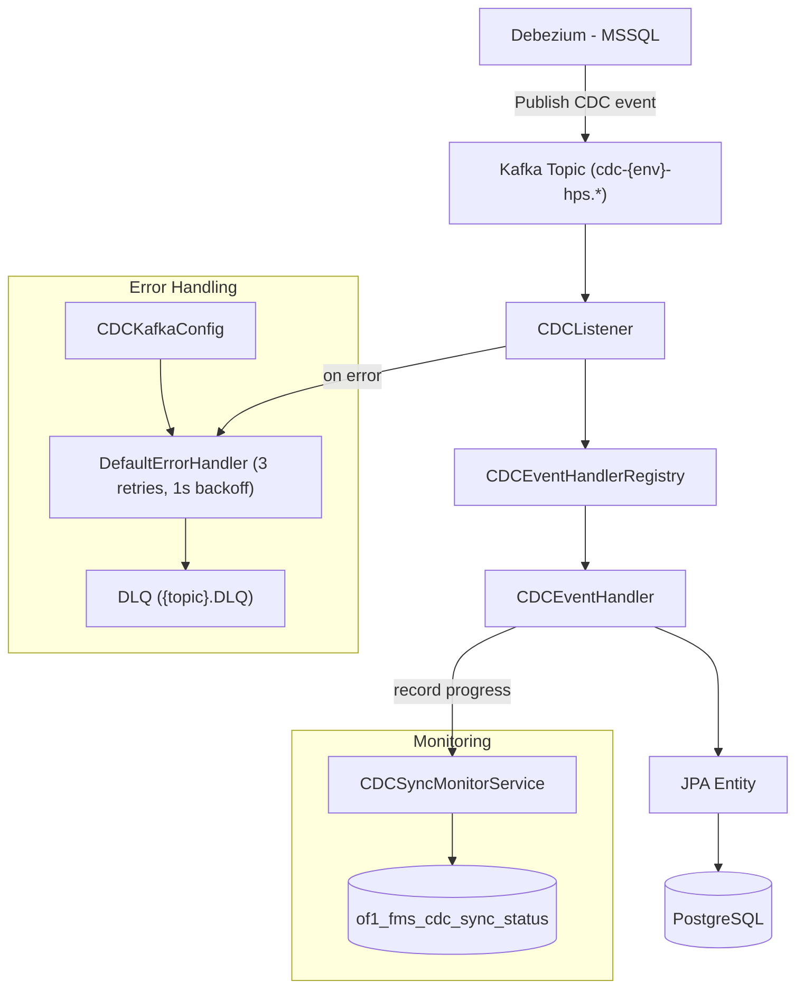
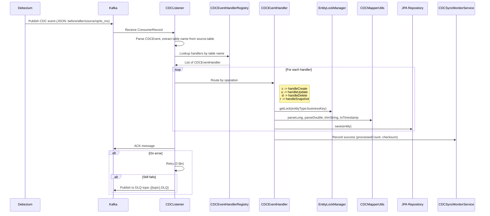
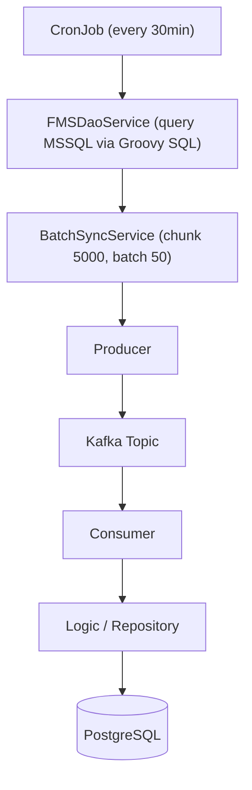
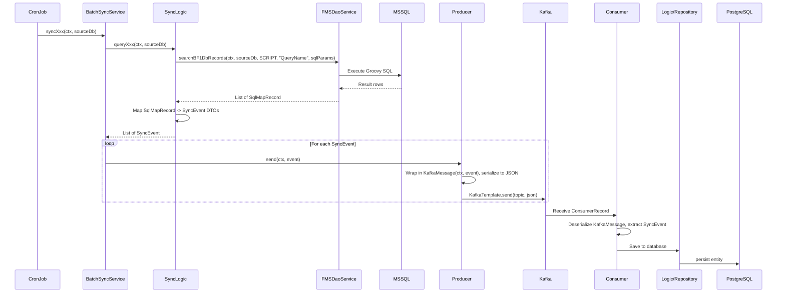

# Pipeline Guide: CDC & Batch Sync

Tài liệu hướng dẫn đầy đủ về hai data sync pipeline trong FMS: CDC (real-time) và Batch Sync (periodic).

**Đối tượng**: Developer mới (đọc từ đầu) và developer đã có kinh nghiệm (xem Quick Checklist ở Section 2).

---

## Mục lục

- [1. Tổng quan kiến trúc](#1-tổng-quan-kiến-trúc)
  - [1.1 CDC Pipeline (Real-time)](#11-cdc-pipeline-real-time)
  - [1.2 Batch Sync Pipeline (Periodic)](#12-batch-sync-pipeline-periodic)
  - [1.3 CDC vs Batch Sync - Ma trận quyết định](#13-cdc-vs-batch-sync---ma-trận-quyết-định)
- [2. Quick Checklist](#2-quick-checklist)
  - [2.1 Thêm CDC Handler mới](#21-thêm-cdc-handler-mới)
  - [2.2 Thêm Batch Sync mới](#22-thêm-batch-sync-mới)
- [3. Hướng dẫn triển khai chi tiết](#3-hướng-dẫn-triển-khai-chi-tiết)
  - [3.1 CDC Handler](#31-cdc-handler)
  - [3.2 Batch Sync](#32-batch-sync)
  - [3.3 Bảng cấu hình](#33-bảng-cấu-hình)
  - [3.4 Write-Back Pipeline](#34-write-back-pipeline)
- [4. Xử lý sự cố & Giám sát](#4-xử-lý-sự-cố--giám-sát)
  - [4.1 CDC - Xử lý sự cố](#41-cdc---xử-lý-sự-cố)
  - [4.2 Batch Sync - Xử lý sự cố](#42-batch-sync---xử-lý-sự-cố)
  - [4.3 Các truy vấn hữu ích](#43-các-truy-vấn-hữu-ích)

---

## 1. Tổng quan kiến trúc

### 1.1 CDC Pipeline (Real-time)

Pipeline đồng bộ real-time sử dụng Debezium Change Data Capture từ MSSQL sang PostgreSQL thông qua Kafka.

#### Flowchart



#### Sequence Diagram



#### Mô tả các component

- **CDCEvent** -- Model chung deserialize Debezium JSON. Các trường: `before` (dữ liệu trước khi thay đổi), `after` (dữ liệu sau khi thay đổi), `source` (db/table/lsn), `op` (c/u/d/r), `ts_ms`, `transaction`.

- **CDCEventHandler** -- Interface định nghĩa cách xử lý CDC event. Các method: `getTableName()`, `handleCreate()`, `handleUpdate()`, `handleDelete()`, `handleSnapshot()`. Tất cả nhận `CDCEvent<Map<String, Object>>`.

- **CDCListener** -- `@KafkaListener` lắng nghe topic pattern `cdc-{env}-hps.*`. Route event tới handler thông qua Registry. Sử dụng manual ACK mode. Tự động skip DLQ topics.

- **CDCEventHandlerRegistry** -- Quét tất cả Spring beans implement CDCEventHandler khi ApplicationReadyEvent. Route theo table name (hỗ trợ 1:N -- nhiều handler cho 1 table). Log khi khởi động: `"Registered CDC handler: {table} -> {class}"`.

- **EntityLockManager** -- ConcurrentHashMap cung cấp lock theo entity (ví dụ: `"partner:PART001"`). Đảm bảo thread-safe khi nhiều CDC event cùng cập nhật 1 entity. Tự động clear khi vượt 100k locks.

- **CDCSyncMonitorService** -- Ghi nhận tiến trình đồng bộ vào bảng `of1_fms_cdc_sync_status`: processedCount, errorCount, lastOffset, lastSyncTime, MD5 checksum.

- **CDCMapperUtils** -- Static utilities chuyển đổi dữ liệu từ CDC event: `parseLong()`, `parseInteger()`, `parseDouble()`, `parseBigDecimal()`, `parseBoolean()`, `trimString()`, `toTimestamp()`. Xử lý null an toàn.

- **CDCKafkaConfig** -- Cấu hình consumer factory, retry policy (DefaultErrorHandler + FixedBackOff), DLQ (DeadLetterPublishingRecoverer), manual ACK, concurrency (mặc định 5 threads).

> **Lưu ý**: CDC handlers làm việc trực tiếp với JPA Repository, KHÔNG thông qua FMSDaoService/Groovy SQL.

---

### 1.2 Batch Sync Pipeline (Periodic)

Pipeline đồng bộ định kỳ từ MSSQL sang PostgreSQL thông qua Kafka, sử dụng CronJob chạy mỗi 30 phút.

#### Flowchart



#### Sequence Diagram



#### Mô tả các component

- **CronJob** -- Kế thừa `net.datatp.module.bot.cron.CronJob`. Sử dụng `CronJobFrequency.EVERY_30_MINUTE` (prod) hoặc `NONE` (dev). Method `getTargetCompanies()` trả về `ICompany.SYSTEM`, `run()` gọi BatchSyncService.

- **FMSDaoService + Groovy SQL** -- Base class truy vấn MSSQL. Method chính: `searchBF1DbRecords(ctx, sourceDb, scriptPath, queryName, sqlParams)` với sourceDb="BEE_VN", scriptPath trỏ tới file .groovy, queryName là tên inner class trong file Groovy.

- **BatchSyncService** -- Orchestrator `@Service("BFSOneSyncService")`. Xử lý theo chunk: CHUNK_SIZE=5000 rows từ MSSQL, BATCH_SIZE=50 events gửi lên Kafka. Mỗi sync method được annotate với `@RPCCall`.

- **SyncEvent DTO** -- Lombok `@Data` classes (ví dụ: SettingUnitSyncEvent). Mang dữ liệu đã transform giữa producer và consumer.

- **Producer** -- Sử dụng `KafkaTemplate<String, String>`. Wrap event trong `KafkaMessage(ctx, event)`, serialize qua `DataSerializer.JSON`. Có enable flag (`event-producer-enable`).

- **Consumer** -- `@KafkaListener` với cấu hình manual topic/groupId/autoStartup. Deserialize `KafkaMessage`, extract event, lưu vào DB. Khi lỗi: log và skip (không retry/DLQ).

- **SyncQueueConfig** -- `@Configuration` class đăng ký tất cả Producer/Consumer beans qua `@Bean` factories.

---

### 1.3 CDC vs Batch Sync - Ma trận quyết định

| Tiêu chí | CDC | Batch Sync |
|----------|-----|------------|
| Độ trễ (Latency) | Real-time (giây) | Định kỳ (30 phút) |
| Data source | Cần Debezium connector | Bất kỳ MSSQL table/view |
| Độ phức tạp mapping | 1:1 table mapping | Multi-table JOIN/aggregate |
| Error handling | Retry 3 lần + DLQ | Log + skip |
| Concurrency | 5 threads (cấu hình được) | 1 thread |
| Use case | Thay đổi từng record | Transform phức tạp |

**Khi nào dùng cái nào:**

- **CDC**: Table đã có Debezium connector, cần real-time, mapping 1:1 đơn giản.
- **Batch Sync**: Cần aggregate/join nhiều bảng MSSQL, transform phức tạp, data không có CDC connector.
- **Cả hai**: CDC cho real-time + Batch cho reconciliation định kỳ.

#### Các implementation hiện có

**CDC Handlers (12 handlers, 11 tables):**

| Table (getTableName()) | Handler | Module |
|------------------------|---------|--------|
| Partners | PartnersCDCHandler | partner |
| Transactions | TransactionsCDCHandler, FmsTransactionCDCHandler | transaction |
| HAWB | HAWBCDCHandler | transaction |
| TransactionDetails | TransactionDetailsCDCHandler | transaction |
| HAWBDETAILS | HAWBDetailsCDCHandler | transaction |
| HAWBRATE | HAWBRATECDCHandler | transaction |
| SellingRate | SellingRateCDCHandler | transaction |
| BuyingRateWithHBL | BuyingRateCDCHandler | transaction |
| ContainerListOnHBL | ContainerListCDCHandler | transaction |
| OtherChargeDetail | OtherChargeCDCHandler | transaction |
| ExchangeRate | ExchangeRateCDCHandler | settings |

> **Lưu ý**: Table name phải khớp chính xác với tên bảng trong MSSQL mà Debezium capture. Sai tên = handler không được gọi.

**Batch Sync (7 implementations):**

| Sync | CronJob | Topic |
|------|---------|-------|
| Transaction | BFSOneSyncTransactionCronJob | transaction-sync |
| Housebill | (via Transaction sync) | housebill-sync |
| HAWB Profit | (via Transaction sync) | hawb-profit-sync |
| Exchange Rate | BFSOneSyncExchangeRateCronJob | exchange-rate-sync |
| Setting Unit | BFSOneSyncSettingUnitCronJob | setting-unit-sync |
| Name Fee Desc | BFSOneSyncNameFeeDescriptionCronJob | name-fee-desc-sync |
| Custom List | BFSOneSyncCustomListCronJob | custom-list-sync |

---

## 2. Quick Checklist

### 2.1 Thêm CDC Handler mới

Danh sách nhanh cho developer đã quen hệ thống. Xem Section 3.1 để biết chi tiết từng bước.

- [ ] **Bước 1**: Tạo Entity class (JPA, extends `PersistableEntity<Long>`) -- xem [3.1.1](#311-entity-class)
- [ ] **Bước 2**: Tạo Repository class (extends `JpaRepository`) -- xem [3.1.2](#312-repository)
- [ ] **Bước 3**: Tạo CDCEventHandler implementation (`@Component`) -- xem [3.1.3](#313-cdceventhandler)
- [ ] **Bước 4**: Thêm Liquibase migration cho table mới (nếu cần) -- xem [3.1.4](#314-liquibase-migration)
- [ ] **Bước 5**: Verify Debezium topic tồn tại: `cdc-{env}-hps.{TableName}`
- [ ] **Bước 6**: Restart app, kiểm tra log: `"Registered CDC handler: {TableName} -> {HandlerClass}"`

### 2.2 Thêm Batch Sync mới

- [ ] **Bước 1**: Tạo SyncEvent DTO class -- xem [3.2.1](#321-syncevent-dto)
- [ ] **Bước 2**: Thêm SQL query vào `BFSOneSyncSql.groovy` -- xem [3.2.2](#322-groovy-sql-query)
- [ ] **Bước 3**: Tạo SyncLogic class (extends `FMSDaoService`) -- xem [3.2.3](#323-synclogic)
- [ ] **Bước 4**: Tạo Producer class (`KafkaTemplate`) -- xem [3.2.4](#324-producer)
- [ ] **Bước 5**: Tạo Consumer class (`@KafkaListener`) -- xem [3.2.5](#325-consumer)
- [ ] **Bước 6**: Đăng ký Producer/Consumer beans trong `SyncQueueConfig` -- xem [3.2.6](#326-đăng-ký-beans-trong-syncqueueconfig)
- [ ] **Bước 7**: Thêm sync method trong `BatchSyncService` (`@RPCCall`) -- xem [3.2.7](#327-thêm-method-trong-batchsyncservice)
- [ ] **Bước 8**: Tạo CronJob class (extends `CronJob`) -- xem [3.2.8](#328-cronjob)
- [ ] **Bước 9**: Cấu hình topic trong `addon-fms-config.yaml` -- xem [3.2.9](#329-cấu-hình-trong-addon-fms-configyaml)
- [ ] **Bước 10**: Tạo/tái sử dụng Entity + Repository + Liquibase migration (nếu cần) -- xem [3.1.1](#311-entity-class), [3.1.2](#312-repository), [3.1.4](#314-liquibase-migration)

---

## 3. Hướng dẫn triển khai chi tiết

### 3.1 CDC Handler

#### 3.1.1 Entity class

Tạo JPA entity tương ứng với table trong PostgreSQL. Entity phải extends `PersistableEntity<Long>` (có sẵn các field: id, createdBy, createdTime, modifiedBy, modifiedTime, storageState, version).

```java
package of1.fms.module.xxx.entity; // TODO: thay đổi package

import com.fasterxml.jackson.annotation.JsonInclude;
import jakarta.persistence.*;
import lombok.Getter;
import lombok.NoArgsConstructor;
import lombok.Setter;
import net.datatp.module.data.db.entity.PersistableEntity;
import java.io.Serial;

@Entity
@Table(
  name = YourEntity.TABLE_NAME,
  indexes = {
    @Index(name = YourEntity.TABLE_NAME + "_code_idx", columnList = "code", unique = true)
    // TODO: thêm index cho các field thường query
  }
)
@JsonInclude(JsonInclude.Include.NON_NULL)
@NoArgsConstructor
@Getter @Setter
public class YourEntity extends PersistableEntity<Long> { // TODO: đổi tên class
  @Serial
  private static final long serialVersionUID = 1L;

  public static final String TABLE_NAME = "your_table_name"; // TODO: đổi tên table

  @Column(name = "code", unique = true)
  private String code; // TODO: thay đổi field chính

  @Column(name = "label")
  private String label; // TODO: thêm các field khác
}
```

**Quy ước:**
- `TABLE_NAME`: dùng snake_case, prefix `of1_fms_` cho FMS tables.
- Đặt tên index: `{TABLE_NAME}_{column}_idx`.
- Kế thừa `PersistableEntity<Long>` để có sẵn các audit fields.

#### 3.1.2 Repository

```java
package of1.fms.module.xxx.repository; // TODO: thay đổi package

import of1.fms.module.xxx.entity.YourEntity; // TODO: import entity tương ứng
import org.springframework.data.jpa.repository.JpaRepository;
import org.springframework.data.jpa.repository.Query;
import org.springframework.data.repository.query.Param;
import org.springframework.stereotype.Repository;
import java.io.Serializable;

@Repository
public interface YourEntityRepository extends JpaRepository<YourEntity, Serializable> {
  @Query("SELECT e FROM YourEntity e WHERE e.code = :code")
  YourEntity getByCode(@Param("code") String code); // TODO: đổi method theo business key
}
```

#### 3.1.3 CDCEventHandler

Template dựa trên ExchangeRateCDCHandler. Handler implement `CDCEventHandler` interface và đăng ký tự động với Registry thông qua `@Component`.

```java
package of1.fms.module.xxx.cdc; // TODO: thay đổi package

import lombok.extern.slf4j.Slf4j;
import net.datatp.module.data.db.entity.StorageState;
import of1.fms.core.cdc.handler.CDCEventHandler;
import of1.fms.core.cdc.lock.EntityLockManager;
import of1.fms.core.cdc.model.CDCEvent;
import of1.fms.core.cdc.util.CDCMapperUtils;
import of1.fms.module.xxx.entity.YourEntity; // TODO: import entity tương ứng
import of1.fms.module.xxx.repository.YourEntityRepository; // TODO: import repository tương ứng
import org.springframework.beans.factory.annotation.Autowired;
import org.springframework.stereotype.Component;
import org.springframework.transaction.annotation.Transactional;
import java.util.Map;

@Slf4j
@Component
public class YourCDCHandler implements CDCEventHandler { // TODO: đổi tên class

  @Autowired
  private YourEntityRepository repo; // TODO: inject repository tương ứng

  @Autowired
  private EntityLockManager lockManager;

  @Override
  public String getTableName() {
    return "YourMSSQLTableName"; // TODO: tên bảng CHÍNH XÁC trong MSSQL (Debezium capture)
  }

  @Override
  @Transactional(transactionManager = "fmsTransactionManager")
  public void handleCreate(CDCEvent<Map<String, Object>> event) {
    upsert(event.getAfter());
  }

  @Override
  @Transactional(transactionManager = "fmsTransactionManager")
  public void handleUpdate(CDCEvent<Map<String, Object>> event) {
    upsert(event.getAfter());
  }

  @Override
  @Transactional(transactionManager = "fmsTransactionManager")
  public void handleDelete(CDCEvent<Map<String, Object>> event) {
    Map<String, Object> before = event.getBefore();
    if (before == null) return;

    String code = CDCMapperUtils.trimString(before.get("YourKeyColumn")); // TODO: đổi tên column
    if (code == null) return;

    synchronized (lockManager.getLock("your_entity:" + code)) { // TODO: đổi lock prefix
      YourEntity entity = repo.getByCode(code);
      if (entity != null) {
        entity.setStorageState(StorageState.ARCHIVED);
        repo.save(entity);
        log.info("CDC DELETE (archive) your_entity: {}", code);
      }
    }
  }

  @Override
  @Transactional(transactionManager = "fmsTransactionManager")
  public void handleSnapshot(CDCEvent<Map<String, Object>> event) {
    upsert(event.getAfter());
  }

  private void upsert(Map<String, Object> data) {
    if (data == null) return;

    String code = CDCMapperUtils.trimString(data.get("YourKeyColumn")); // TODO: đổi tên column
    if (code == null) return;

    synchronized (lockManager.getLock("your_entity:" + code)) { // TODO: đổi lock prefix
      YourEntity entity = repo.getByCode(code);
      if (entity == null) {
        entity = new YourEntity();
        entity.setCode(code);
      }

      // TODO: map các field từ CDC data sang entity
      entity.setLabel(CDCMapperUtils.trimString(data.get("ColumnName")));
      // CDCMapperUtils methods: trimString(), parseLong(), parseInteger(),
      //   parseDouble(), parseBigDecimal(), parseBoolean(), toTimestamp()

      repo.save(entity);
      log.info("CDC UPSERT your_entity: {}", code);
    }
  }
}
```

#### 3.1.4 Liquibase migration

Tạo file SQL trong: `module/core/src/main/resources/db/changelog/changes/NNN-your-feature.sql`

```sql
--liquibase formatted sql

--changeset author:id labels:schema context:dev,beta,prod
--comment: Add your_table_name table

CREATE TABLE IF NOT EXISTS your_table_name (
    id BIGSERIAL PRIMARY KEY,
    created_by VARCHAR(255),
    created_time TIMESTAMP(6),
    modified_by VARCHAR(255),
    modified_time TIMESTAMP(6),
    storage_state VARCHAR(255),
    version BIGINT,
    -- TODO: thêm các column
    code VARCHAR(255),
    label VARCHAR(255)
);

-- Indexes
CREATE INDEX IF NOT EXISTS your_table_name_code_idx ON your_table_name(code);
CREATE UNIQUE INDEX IF NOT EXISTS uk_your_table_name_code ON your_table_name(code);
```

Thêm entry vào `db.changelog-master.yaml`:

```yaml
- include:
    file: changes/NNN-your-feature.sql
    relativeToChangelogFile: true
```

#### 3.1.5 Kiểm tra

1. Restart ứng dụng.
2. Kiểm tra log: `Registered CDC handler: YourMSSQLTableName -> YourCDCHandler`.
3. Kiểm tra log: `Total CDC handlers registered: N (for M tables)`.
4. Xác nhận Debezium topic tồn tại: `cdc-{env}-hps.YourMSSQLTableName`.
5. Test: INSERT/UPDATE/DELETE row trong MSSQL -> kiểm tra PostgreSQL table.

---

### 3.2 Batch Sync

#### 3.2.1 SyncEvent DTO

```java
package of1.fms.module.integration.batch.yourdata; // TODO: thay đổi package

import lombok.Data;

@Data
public class YourSyncEvent { // TODO: đổi tên class
  private String code;    // TODO: các field khớp với SQL query aliases
  private String label;
}
```

#### 3.2.2 Groovy SQL query

Thêm inner class vào file: `module/integration/src/main/java/of1/fms/module/integration/batch/config/groovy/BFSOneSyncSql.groovy`

```groovy
public class QueryYourData extends ExecutableSqlBuilder { // TODO: đổi tên class
  @Override
  public Object execute(ApplicationContext appCtx, ExecutableContext ctx) {
    return """
      SELECT
        ColumnA as code,   -- TODO: đổi tên column và alias
        ColumnB as label
      FROM YourMSSQLTable  -- TODO: đổi tên table MSSQL
      WHERE ColumnA IS NOT NULL
    """
  }
}
```

Đăng ký trong constructor của `BFSOneSyncSql`:

```groovy
register(new QueryYourData())
```

#### 3.2.3 SyncLogic

```java
package of1.fms.module.integration.batch.yourdata; // TODO: thay đổi package

import java.util.ArrayList;
import java.util.List;
import lombok.extern.slf4j.Slf4j;
import net.datatp.module.data.db.SqlMapRecord;
import net.datatp.module.data.db.query.SqlQueryParams;
import net.datatp.security.client.ClientContext;
import of1.fms.core.db.FMSDaoService;
import org.springframework.stereotype.Component;

@Component
@Slf4j
public class YourSyncLogic extends FMSDaoService { // TODO: đổi tên class
  private static final String SCRIPT = "of1/fms/module/integration/batch/config/groovy/BFSOneSyncSql.groovy";

  public List<YourSyncEvent> queryYourData(ClientContext ctx, String sourceDb) {
    List<SqlMapRecord> rows = searchBF1DbRecords(ctx, sourceDb, SCRIPT, "QueryYourData", new SqlQueryParams());
    // searchBF1DbRecords params:
    //   ctx: ClientContext (xác thực)
    //   sourceDb: tên datasource MSSQL (ví dụ: "BEE_VN")
    //   SCRIPT: classpath path tới Groovy file
    //   "QueryYourData": tên inner class trong Groovy file
    //   SqlQueryParams: named parameters (e.g. params.set("offset", 0))

    List<YourSyncEvent> events = new ArrayList<>();
    for (SqlMapRecord row : rows) {
      YourSyncEvent event = new YourSyncEvent();
      event.setCode(row.getString("code"));     // TODO: map fields theo alias trong SQL query
      event.setLabel(row.getString("label"));
      events.add(event);
    }
    return events;
  }
}
```

#### 3.2.4 Producer

```java
package of1.fms.module.integration.batch.yourdata; // TODO: thay đổi package

import datatp.data.kafka.KafkaMessage;
import jakarta.annotation.PostConstruct;
import lombok.extern.slf4j.Slf4j;
import net.datatp.security.client.ClientContext;
import net.datatp.util.dataformat.DataSerializer;
import net.datatp.util.error.ErrorType;
import net.datatp.util.error.RuntimeError;
import net.datatp.util.text.StringUtil;
import org.springframework.beans.factory.annotation.Autowired;
import org.springframework.beans.factory.annotation.Value;
import org.springframework.kafka.core.KafkaTemplate;

@Slf4j
public class YourSyncEventProducer { // TODO: đổi tên class

  @Autowired
  private KafkaTemplate<String, String> kafkaTemplate;

  @Value("${datatp.msa.fms.queue.event-producer-enable:false}")
  private boolean enable;

  @Value("${datatp.msa.fms.queue.topic.your-sync:fms.your-data.sync}") // TODO: đổi tên topic
  private String topicEvents;

  @PostConstruct
  public void onInit() {
    log.info("YourSyncEventProducer config: enable={}, topic={}", enable, topicEvents);
    if (enable && StringUtil.isEmpty(topicEvents)) {
      throw RuntimeError.IllegalArgument("Topic your-sync is empty.");
    }
  }

  public void send(ClientContext ctx, YourSyncEvent event) {
    if (!enable) return;
    try {
      KafkaMessage message = new KafkaMessage(ctx, event);
      String json = DataSerializer.JSON.toString(message);
      kafkaTemplate.send(topicEvents, json).whenComplete((result, ex) -> {
        if (ex != null) {
          log.error("Failed to send sync event to {}: {}", topicEvents, ex.getMessage(), ex);
        }
      });
    } catch (Exception e) {
      log.error("Error sending sync event: {}", e.getMessage(), e);
      throw new RuntimeError(ErrorType.IllegalState, "Failed to send sync event", e);
    }
  }
}
```

#### 3.2.5 Consumer

```java
package of1.fms.module.integration.batch.yourdata; // TODO: thay đổi package

import datatp.data.kafka.KafkaMessage;
import jakarta.annotation.PostConstruct;
import jakarta.transaction.Transactional;
import lombok.extern.slf4j.Slf4j;
import net.datatp.security.client.ClientContext;
import net.datatp.util.dataformat.DataSerializer;
import org.apache.kafka.clients.consumer.ConsumerRecord;
import org.springframework.beans.factory.annotation.Autowired;
import org.springframework.beans.factory.annotation.Value;
import org.springframework.kafka.annotation.KafkaListener;

@Slf4j
public class YourSyncEventConsumer { // TODO: đổi tên class

  @Value("${datatp.msa.fms.queue.topic.your-sync:fms.your-data.sync}") // TODO: đổi tên topic
  private String topicEvents;

  @Autowired
  private YourEntityLogic yourLogic; // TODO: inject logic/repository tương ứng

  @PostConstruct
  public void onInit() {
    log.info("YourSyncEventConsumer initialized for topic: {}", topicEvents);
  }

  @KafkaListener(
    id = "msa.YourSyncEventConsumer",                                          // TODO: đổi id
    topics = "${datatp.msa.fms.queue.topic.your-sync:fms.your-data.sync}", // TODO: đổi tên topic
    groupId = "fms-your-data-consumer-group",                                   // TODO: đổi consumer group
    autoStartup = "${datatp.msa.fms.queue.event-consumer-enable:false}",
    concurrency = "1"
  )
  @Transactional
  public void onEvent(ConsumerRecord<String, String> consumerRecord) {
    try {
      String json = consumerRecord.value();
      KafkaMessage message = DataSerializer.JSON.fromString(json, KafkaMessage.class);
      YourSyncEvent event = message.getDataAs(YourSyncEvent.class);
      ClientContext ctx = message.getClientContext();

      // TODO: viết logic lưu dữ liệu
      // Vd: yourLogic.save(ctx, entity);
      log.info("Saved your entity: {}", event.getCode());
    } catch (Exception e) {
      log.error("[SYNC_ERROR] topic={} offset={} key={} error={}",
        consumerRecord.topic(), consumerRecord.offset(), consumerRecord.key(), e.getMessage(), e);
    }
  }
}
```

#### 3.2.6 Đăng ký beans trong SyncQueueConfig

Thêm vào file `module/integration/src/main/java/of1/fms/module/integration/batch/config/SyncQueueConfig.java`:

```java
@Bean("YourSyncEventProducer")
YourSyncEventProducer createYourSyncEventProducer() {
  return new YourSyncEventProducer();
}

@Bean("YourSyncEventConsumer")
YourSyncEventConsumer createYourSyncEventConsumer() {
  return new YourSyncEventConsumer();
}
```

#### 3.2.7 Thêm method trong BatchSyncService

Thêm vào file `module/integration/src/main/java/of1/fms/module/integration/batch/BatchSyncService.java`:

```java
@Autowired
private YourSyncLogic yourSyncLogic;

@Autowired
private YourSyncEventProducer yourProducer;

@RPCCall(
  label = "BatchSync Your Data",
  allowedPaths = { AccessPath.Internal, AccessPath.Private },
  tags = { "batch", "sync" })
public int syncYourData(ClientContext ctx, String sourceDb) {
  List<YourSyncEvent> items = yourSyncLogic.queryYourData(ctx, sourceDb);
  for (YourSyncEvent event : items) {
    yourProducer.send(ctx, event);
  }
  log.info("Your data sync completed: total={}", items.size());
  return items.size();
}
```

#### 3.2.8 CronJob

```java
package of1.fms.module.integration.batch.yourdata; // TODO: thay đổi package

import jakarta.annotation.PostConstruct;
import java.util.ArrayList;
import java.util.List;
import lombok.extern.slf4j.Slf4j;
import net.datatp.module.app.AppEnv;
import net.datatp.module.bot.cron.CronJob;
import net.datatp.module.bot.cron.CronJobFrequency;
import net.datatp.module.bot.cron.CronJobLogger;
import net.datatp.module.data.db.entity.ICompany;
import net.datatp.security.client.ClientContext;
import net.datatp.security.client.DeviceInfo;
import net.datatp.security.client.DeviceType;
import of1.fms.module.integration.batch.BatchSyncService;
import org.springframework.beans.factory.annotation.Autowired;
import org.springframework.stereotype.Component;

@Slf4j
@Component
public class BFSOneSyncYourDataCronJob extends CronJob { // TODO: đổi tên class

  @Autowired
  private AppEnv appEnv;

  @Autowired
  private BatchSyncService syncService;

  public BFSOneSyncYourDataCronJob() {
    super("fms:bfsone:sync-your-data:30min", "FMS BFSOne Sync Your Data"); // TODO: đổi tên/label
  }

  @PostConstruct
  public void onInit() {
    if (appEnv.isDevEnv()) {
      setFrequencies(CronJobFrequency.NONE);        // Tắt trong dev
    } else {
      setFrequencies(CronJobFrequency.EVERY_30_MINUTE); // Chạy mỗi 30 phút trong prod
    }
  }

  @Override
  protected List<ICompany> getTargetCompanies() {
    List<ICompany> companies = new ArrayList<>();
    companies.add(ICompany.SYSTEM);
    return companies;
  }

  @Override
  protected ClientContext getClientContext(ICompany company) {
    ClientContext client = new ClientContext("default", "system", "localhost");
    if (appEnv.isProdEnv()) {
      client.setDeviceInfo(new DeviceInfo(DeviceType.Server));
    } else {
      client.setDeviceInfo(new DeviceInfo(DeviceType.Computer));
    }
    return client;
  }

  @Override
  protected void run(ClientContext client, ICompany company, CronJobLogger logger) {
    int total = syncService.syncYourData(client, "BEE_VN"); // TODO: đổi tên method
    logger.withMessage("Synced {0} your data records", total);
  }
}
```

#### 3.2.9 Cấu hình trong addon-fms-config.yaml

Thêm vào `release/src/app/server/addons/fms/config/addon-fms-config.yaml`:

```yaml
datatp:
  msa:
    fms:
      queue:
        topic:
          your-sync: "of1.${env.kafka.env}.fms.your-data.sync"  # TODO: đổi tên topic
```

#### 3.2.10 Entity + Repository + Migration

Nếu cần table mới trong PostgreSQL, xem lại các bước trong Section 3.1:
- [3.1.1 Entity class](#311-entity-class)
- [3.1.2 Repository](#312-repository)
- [3.1.4 Liquibase migration](#314-liquibase-migration)

Nếu tái sử dụng table có sẵn, chỉ cần inject Repository tương ứng.

---

### 3.3 Bảng cấu hình

| Property | Mặc định | Mô tả |
|----------|----------|-------|
| `spring.kafka.bootstrap-servers` | - | Địa chỉ Kafka broker |
| `datatp.msa.fms.queue.event-producer-enable` | `false` | Master flag: bật/tắt tất cả Batch Sync producers |
| `datatp.msa.fms.queue.event-consumer-enable` | `false` | Master flag: bật/tắt tất cả Batch Sync consumers và CDC listener |
| `datatp.msa.fms.queue.cdc.topics` | `cdc-dev-hps.*` | CDC topic pattern (Debezium) |
| `datatp.msa.fms.queue.cdc.consumer-group` | `fms-cdc-consumer` | CDC consumer group ID |
| `datatp.msa.fms.queue.cdc.concurrency` | `5` | Số thread CDC listener |
| `datatp.msa.fms.queue.cdc.auto-startup` | `false` | CDC listener tự động bật |
| `datatp.msa.fms.queue.cdc.retry.max-attempts` | `3` | Số lần retry trước khi gửi DLQ |
| `datatp.msa.fms.queue.cdc.retry.backoff-interval` | `1000` | Thời gian chờ giữa các lần retry (ms) |
| `datatp.msa.fms.queue.cdc.dlq.enabled` | `true` | Bật Dead Letter Queue |
| `datatp.msa.fms.queue.cdc.dlq.topic-suffix` | `.DLQ` | Suffix cho DLQ topic |
| `datatp.msa.fms.queue.topic.transaction-sync` | `fms.transaction.sync` | Batch: transaction sync topic |
| `datatp.msa.fms.queue.topic.housebill-sync` | `fms.housebill-info.sync` | Batch: housebill sync topic |
| `datatp.msa.fms.queue.topic.hawb-profit-sync` | `fms.hawb-profit.sync` | Batch: HAWB profit sync topic |
| `datatp.msa.fms.queue.topic.exchange-rate-sync` | `fms.exchange-rate.sync` | Batch: exchange rate sync topic |
| `datatp.msa.fms.queue.topic.setting-unit-sync` | `fms.setting-unit.sync` | Batch: setting unit sync topic |
| `datatp.msa.fms.queue.topic.name-fee-desc-sync` | `fms.name-fee-description.sync` | Batch: name fee desc sync topic |
| `datatp.msa.fms.queue.topic.custom-list-sync` | `fms.custom-list.sync` | Batch: custom list sync topic |
| `datatp.msa.fms.queue.topic.bank-sync` | `fms.bank.sync` | Batch: bank sync topic |
| `datatp.msa.fms.queue.topic.industry-sync` | `fms.industry.sync` | Batch: industry sync topic |
| `datatp.msa.fms.queue.topic.partner-source-sync` | `fms.partner-source.sync` | Batch: partner source sync topic |
| `datatp.msa.fms.queue.topic.commodity-sync` | `fms.commodity.sync` | Batch: commodity sync topic |
| `datatp.msa.fms.queue.topic.user-role-sync` | `fms.user-role.sync` | Batch: user role sync topic |
| `datatp.msa.fms.queue.topic.transaction-writeback` | _(empty)_ | Write-back: FMS -> BF1 topic |

---

### 3.4 Write-Back Pipeline

Dữ liệu cũng chạy ngược từ OF1 về BFS One thông qua Kafka (write-back pipeline).

- Cấu hình riêng: `writeback-producer-enable`, `writeback-consumer-enable`.
- Ngoài phạm vi tài liệu này.
- Xem source code tại: `module/integration/src/main/java/of1/fms/module/integration/writeback/` để biết chi tiết.

---

## 4. Xử lý sự cố & Giám sát

### 4.1 CDC - Xử lý sự cố

**1. Handler không được gọi**

- Kiểm tra `getTableName()` trả về đúng tên bảng trong MSSQL (case-sensitive).
- Kiểm tra log startup: `"Registered CDC handler: {TableName} -> {HandlerClass}"`.
- Xác nhận Debezium topic tồn tại và khớp pattern `cdc-{env}-hps.*`.
- Kiểm tra `auto-startup` và `event-consumer-enable` đang là `true`.

**2. Dữ liệu trùng lặp (duplicate)**

- CDCListener sử dụng MD5 checksum tracking trong `of1_fms_cdc_sync_status`.
- 1 table có thể có nhiều handlers (1:N) -- kiểm tra có đang đăng ký thừa handler không.
- Kiểm tra EntityLockManager có đang lock đúng key không.

**3. Message vào DLQ**

- Kiểm tra topic `{original-topic}.DLQ` cho failed messages.
- Xem `lastError` trong `of1_fms_cdc_sync_status`.
- Replay: publish lại message từ DLQ vào topic gốc.
- Kiểm tra retry config: `max-attempts` (mặc định 3), `backoff-interval` (mặc định 1000ms).

**4. Hiệu năng chậm**

- Tăng concurrency qua `cdc.concurrency` (mặc định: 5).
- Kiểm tra `max.partition.fetch.bytes` (mặc định: 1MB per partition).
- Theo dõi processing duration trong log: `[CDC_PROCESSED] ... duration=Xms`.

### 4.2 Batch Sync - Xử lý sự cố

**1. CronJob không chạy**

- Môi trường dev dùng `CronJobFrequency.NONE` (tắt).
- Kiểm tra `event-producer-enable` và `event-consumer-enable` flags trong config.
- Xác nhận CronJob class có `@Component` annotation.

**2. Consumer không nhận message**

- Xác nhận consumer group ID, topic name, `autoStartup` flag.
- Kiểm tra `SyncQueueConfig` có `@Bean` cho consumer của bạn.
- Kiểm tra topic name trong `@KafkaListener` khớp với topic trong Producer.

**3. Lỗi kết nối MSSQL**

- Kiểm tra BFS One datasource config trong `addon-fms-config.yaml` (env.hps.*).
- Xác nhận TenantRegistry có entry cho sourceDb (ví dụ: "BEE_VN").
- Kiểm tra kết nối mạng tới MSSQL server.

**4. Dữ liệu không khớp**

- So sánh kết quả SQL query trực tiếp trên MSSQL với dữ liệu trong PostgreSQL.
- Kiểm tra chunk/batch size: CHUNK_SIZE=5000, BATCH_SIZE=50.
- Review field mapping trong SyncLogic (`row.getString()` aliases phải khớp với SQL aliases).

### 4.3 Các truy vấn hữu ích

#### PostgreSQL

```sql
-- Tất cả CDC sync status
SELECT table_name, processed_count, error_count, last_error, last_sync_time
FROM of1_fms_cdc_sync_status ORDER BY table_name;

-- Các table có lỗi
SELECT table_name, error_count, last_error
FROM of1_fms_cdc_sync_status WHERE error_count > 0;

-- Last sync time theo table
SELECT table_name, last_sync_time, processed_count
FROM of1_fms_cdc_sync_status ORDER BY last_sync_time DESC;
```

#### Kafka CLI

```bash
# Check consumer group lag (CDC)
kafka-consumer-groups.sh --bootstrap-server <broker> --describe --group fms-cdc-consumer-<env>

# Check consumer group lag (Batch Sync)
kafka-consumer-groups.sh --bootstrap-server <broker> --describe --group fms-setting-unit-consumer-group

# List topics matching CDC pattern
kafka-topics.sh --bootstrap-server <broker> --list | grep "cdc-"

# Read DLQ messages
kafka-console-consumer.sh --bootstrap-server <broker> --topic cdc-<env>-hps.YourTable.DLQ --from-beginning
```
