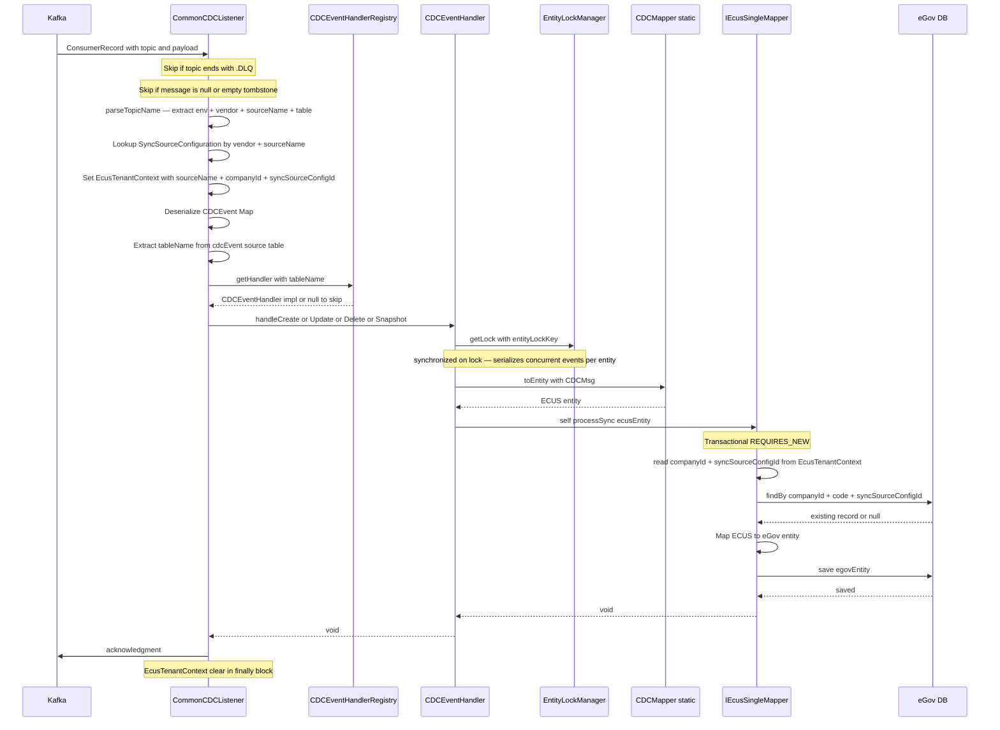
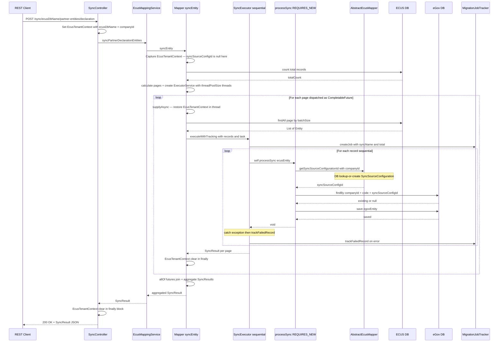
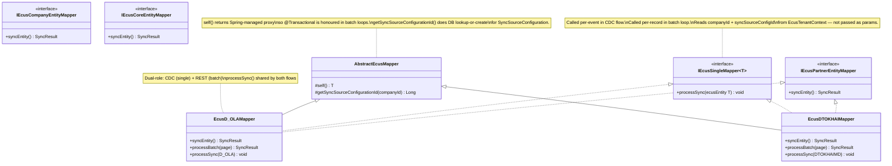
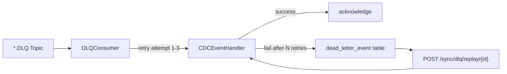

# ecus-thaison Module — Architecture Design

**Date:** 2026-03-29
**Scope:** `module/ecus-thaison` only
**Status:** As-Is documentation + Gap roadmap

---

## Part 1 — As-Is Architecture

### 1.1 Component Overview

```mermaid
graph TD
  subgraph Kafka
    CDC_TOPIC["CDC Topics\ncdc-{ENV}-{VENDOR}.{SOURCE_NAME}.{SCHEMA}.{TABLE}\ne.g. cdc-dev-ecus.ECUS5VNACCS.dbo.DTOKHAIMD"]
    DLQ_TOPIC["DLQ Topics\n*.DLQ\n(created only for non-wildcard patterns)"]
  end

  subgraph CDC Layer
    LISTENER["CommonCDCListener\n(@KafkaListener topicPattern)"]
    REGISTRY["CDCEventHandlerRegistry\n(auto-discover by @Service)"]
    HANDLER["CDCEventHandler impls\n(30+ table handlers)"]
    CDC_MAPPER["CDC Mappers\nMap → CDCMsg → Entity\n(stateless, static)"]
    LOCK["EntityLockManager\nper-entity synchronized lock\n(ConcurrentHashMap, max 100k keys)"]
  end

  subgraph Logic Layer
    SINGLE["IEcusSingleMapper&lt;T&gt;\nprocessSync(ecusEntity)\nREQUIRES_NEW tx\nUsed by CDC flow + batch loop"]
    PARTNER["IEcusPartnerEntityMapper\nsyncEntity() — full-table batch"]
    COMPANY["IEcusCompanyEntityMapper\nsyncEntity() — full-table batch"]
    CORE["IEcusCoreEntityMapper\nsyncEntity() — full-table batch"]
    ABSTRACT["AbstractEcusMapper\nself() — Spring proxy helper\ngetSyncSourceConfigurationId(companyId)"]
  end

  subgraph Sync Infrastructure
    EXECUTOR["SyncExecutor\nSequential per-record loop + error collection\n(no parallelism — parallelism lives in mapper.syncEntity())"]
    TRACKER["MigrationJobTracker\nDB job history — REQUIRES_NEW"]
    CONTEXT["EcusTenantContext\nThreadLocal: ecusDbName, companyId\nsyncSourceConfigId (null in batch path;\nresolved in processSync via AbstractEcusMapper)"]
  end

  subgraph REST API
    CTRL["SyncController\nPOST /sync/{ecusDbName}/partner-entities/*\nPOST /sync/{ecusDbName}/company-entities/*\nPOST /sync/{ecusDbName}/core-entities/*\nSets EcusTenantContext before delegating"]
    SVC["EcusMappingService"]
  end

  subgraph Databases
    ECUS_DB[("ECUS SQL Server\n(multi-tenant via ThreadLocal)")]
    EGOV_DB[("eGov PostgreSQL")]
    JOB_DB[("Migration Job DB\n(PostgreSQL)")]
  end

  CDC_TOPIC --> LISTENER
  DLQ_TOPIC --> LISTENER
  LISTENER --> REGISTRY
  REGISTRY --> HANDLER
  HANDLER --> CDC_MAPPER
  HANDLER --> LOCK
  CDC_MAPPER --> SINGLE

  CTRL --> SVC
  SVC --> PARTNER
  SVC --> COMPANY
  SVC --> CORE

  PARTNER --> EXECUTOR
  COMPANY --> EXECUTOR
  CORE --> EXECUTOR
  EXECUTOR --> SINGLE
  EXECUTOR --> TRACKER

  SINGLE --> ABSTRACT
  PARTNER --> ABSTRACT
  COMPANY --> ABSTRACT
  CORE --> ABSTRACT

  CONTEXT -. "ThreadLocal (cross-cutting)" .-> LISTENER
  CONTEXT -. "ThreadLocal (cross-cutting)" .-> EXECUTOR
  CONTEXT -. "ThreadLocal (cross-cutting)" .-> SINGLE

  SINGLE --> EGOV_DB
  HANDLER --> ECUS_DB
  EXECUTOR --> ECUS_DB
  TRACKER --> JOB_DB
```

### 1.2 CDC Single-Event Flow

One Kafka message → one eGov DB write, with an isolated transaction per event.
Concurrent events for the same entity are serialized by `EntityLockManager`.

### 1.3 Batch Sync Flow

REST trigger → parallel page processing → per-record REQUIRES_NEW transactions.

Key points:
- `SyncController` sets `EcusTenantContext(ecusDbName, companyId)` — **2 args only**, `syncSourceConfigId` is null at this stage.
- The concrete mapper's `syncEntity()` creates the `ExecutorService` and dispatches pages as `CompletableFuture` tasks — **parallelism lives here, not in SyncExecutor**.
- Each async thread restores `EcusTenantContext` with all 3 captured fields (syncSourceConfigId may be null).
- `SyncExecutor.executeWithTracking()` is a **sequential** per-record for-loop with error isolation.
- `processSync()` always calls `AbstractEcusMapper.getSyncSourceConfigurationId(companyId)` internally — it never relies on the context having syncSourceConfigId pre-populated.

### 1.4 Mapper Interface Hierarchy

### 1.5 Key Design Decisions (As-Is)

| Decision | Rationale |
|---|---|
| `REQUIRES_NEW` per record | Isolate failures — one bad record does not rollback the batch |
| `self()` proxy in `AbstractEcusMapper` | Trigger Spring `@Transactional` proxying when calling `processSync()` from inside a batch loop |
| `EcusTenantContext` ThreadLocal | Route to correct ECUS SQL Server tenant without passing context as method parameters |
| `IEcusSingleMapper` used in both CDC and batch | Avoid duplicate mapping logic — CDC and batch perform the same per-record work |
| CDC mapper layer (stateless, static) | Keep handler thin — raw `Map` → typed entity before handing to the logic layer |
| `EntityLockManager` (ConcurrentHashMap, max 100k keys) | Serialize concurrent CDC events targeting the same eGov entity while allowing different entities to run in parallel; map is cleared when size exceeds threshold |
| Context-over-parameters in `processSync()` | Signature takes only the source entity; companyId and syncSourceConfigId are read from `EcusTenantContext` — keeps the interface clean across CDC and batch call sites |
| DLQ topic `.DLQ` suffix skip in listener | Prevent infinite retry loop; DLQ topics are only created when `kafka.cdc.topics` is a static list (not a wildcard pattern) |

---

## Part 2 — Gap Analysis + Roadmap

### 2.1 Gap: DLQ Consumer *(High priority — data loss risk)*

**Current state:** `KafkaDLQConfig` creates `*.DLQ` topics on startup — but only when `kafka.cdc.topics` is a static list, not a wildcard pattern. In practice (wildcard config), no DLQ topics are pre-created. `CommonCDCListener` skips any topic ending in `.DLQ` to prevent recursion. Failed CDC events are silently lost.

**Target:** A dedicated `DLQConsumer` that:
1. Reads from `*.DLQ` topics (requires addressing the wildcard subscription problem first)
2. Retries with fixed backoff (e.g., 3 attempts, 5s delay)
3. On exhaustion: persists to a `dead_letter_event` DB table with full payload + error context
4. Exposes `POST /sync/dlq/replay/{id}` for manual replay of specific dead events

**Design decisions to make before implementation:**
- Wildcard DLQ subscription: use `@KafkaListener(topicPattern = ".*\\.DLQ")` or dynamically register topics?
- Retry in consumer (simpler) vs. separate scheduled retry job (more observable)?
- Dead event storage: dedicated `dead_letter_event` table vs. reuse `MigrationJobTracker`?

### 2.2 Gap: Batch Error Retry *(Medium priority — operational pain)*

**Current state:** `MigrationJobTracker` records failed records with `status=FAILED` in DB. No automated retry. Operator must trigger a full re-sync (expensive) to fix a few failed records.

**Target:**
- `GET /sync/jobs/{jobId}/failures` — list failed records for a job
- `POST /sync/jobs/{jobId}/retry-failures` — re-run only the failed records, creates a new child job

**Uses existing infrastructure:** `SyncExecutor` + `MigrationJobTracker` already handle per-record tracking. Retry just needs to load failed record IDs and re-submit to the same `SyncTask`. `processSync()` already does lookup-or-create, so idempotency is free.

### 2.3 Gap: Monitoring / Observability *(Medium priority — ops visibility)*

**Current state:** `MigrationJobTracker` writes job history to DB but nothing reads it for ops purposes.

**Target:**
- `GET /sync/jobs` — list recent jobs (paginated, filterable by status/name/date)
- `GET /sync/jobs/{jobId}` — job detail: total/success/failed/skipped counts + error list
- Spring Actuator counter: `ecus.cdc.events.processed` / `ecus.cdc.events.failed` (tagged by table name)

**Effort:** Low — `MigrationJobTracker` already has the data. Needs a read-only REST layer + Actuator metric increments in `CommonCDCListener`.

### 2.4 Implementation Priority Order

| # | Gap | Priority | Effort | Risk if skipped |
|---|-----|----------|--------|-----------------|
| 1 | DLQ Consumer | High | Medium | Silent data loss on CDC failures |
| 2 | Monitoring endpoints | Medium | Low | Blind to sync health |
| 3 | Batch error retry | Medium | Low | Full re-sync required for partial failures |
