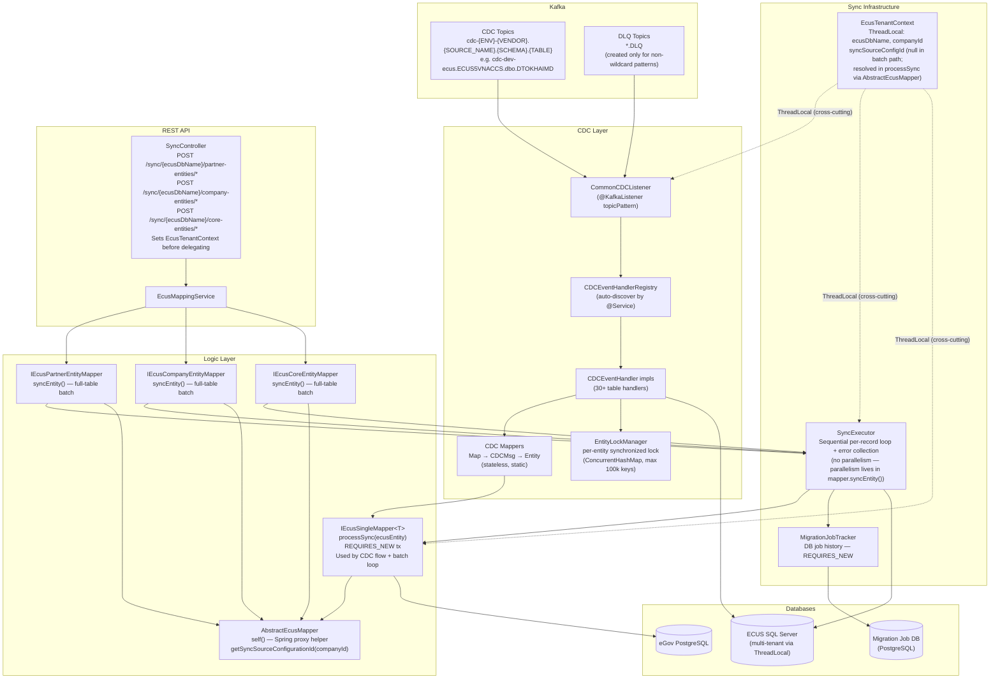
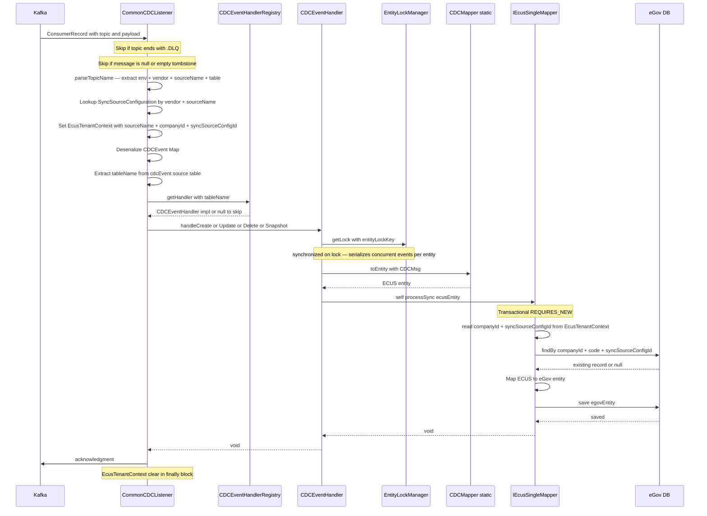
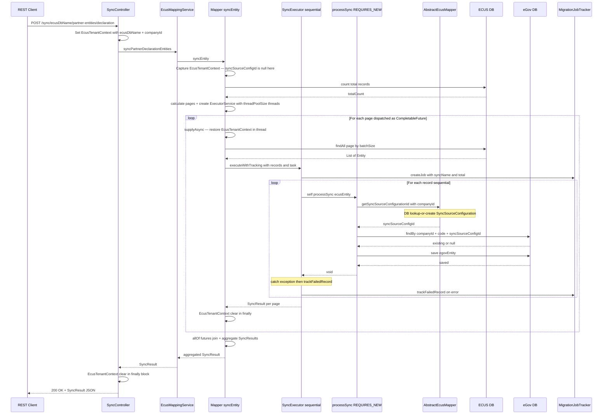
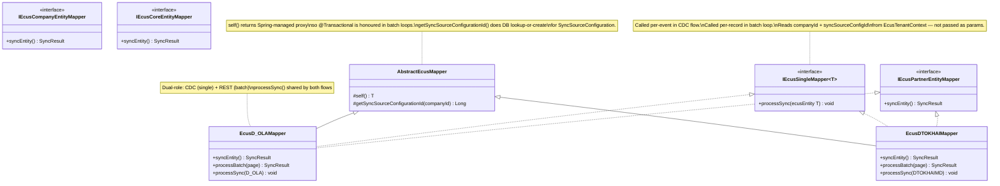
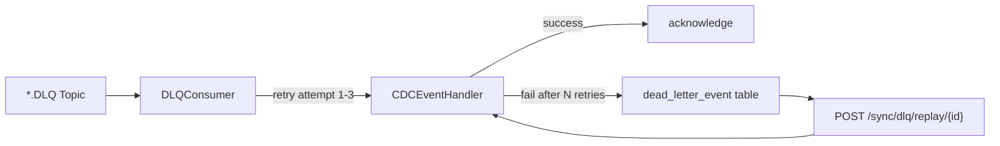

## Company Mapper Batch/Single Split Design (2026-03-29)

**Scope:** `module/ecus-thaison` — `logic/mapper/company/` (22 mapper classes)
**Goal:** Remove ~3600 lines of duplicated batch boilerplate; each mapper retains only its unique single-record logic.

---

### Problem

All 22 mappers in `logic/mapper/company/` share an identical ~165-line structure per file:

| Method | Lines | Uniqueness |
|---|---|---|
| `syncEntity()` | ~100 | 0% — only the entity name string differs |
| `processBatch()` | ~35 | ~5% — only repository type and extractors differ |
| `processSync()` | ~15 | 100% — the only real per-mapper logic |

All 22 files duplicate the same threading, paging, context propagation, result aggregation, and logging. Total waste: ~3600 lines.

---

### Chosen Approach: Provider + Orchestrator (Option B)

Mappers are decoupled from batch concerns entirely. A descriptor object carries per-mapper config; a shared orchestrator drives execution.

#### Why not abstract base class (Option A)

Inheritance couples mapper lifecycle to batch config. Harder to test batch logic in isolation. Adding new hooks (e.g., per-batch callbacks) requires touching the base class and all subclasses.

#### Why not interface extension only (Option C)

Does not eliminate the boilerplate — only formalises it. Each mapper still contains ~150 lines of duplicated code.

---

### Components

#### 1. `RecordProcessor<E>` (functional interface)

```java
@FunctionalInterface
public interface RecordProcessor<E> {
    void process(Long companyId, E record, Long syncSourceConfigId);
}
```

Single-responsibility: process one record. Matches the signature of all existing `processSync()` methods.

#### 2. `BatchSyncDescriptor<E>` (data object, no Spring dependency)

Holds all configuration and optional hooks for one sync job.

```java
@Getter
@Builder
public class BatchSyncDescriptor<E> {

    // Required
    private final String syncName;
    private final JpaRepository<E, ?> repository;
    private final Function<E, String> idExtractor;
    private final Function<E, String> descExtractor;
    private final RecordProcessor<E> recordProcessor;

    // Optional batch config overrides — null means use app-level @Value default
    private final Integer importLimit;
    private final Integer batchSize;
    private final Integer threadPoolSize;

    // Optional hooks — null means skip
    private final BiConsumer<Integer, SyncResult> onBatchComplete;  // (pageNumber, batchResult)
    private final Consumer<SyncResult> onSyncComplete;              // called after all pages
    private final UnaryOperator<SyncResult> resultEnricher;         // enrich final SyncResult
}
```

**Extension pattern:** to customise behaviour for a specific mapper, set the relevant hook in `descriptor()`. No subclassing required.

#### 3. `EcusBatchSyncProvider<E>` (interface)

```java
public interface EcusBatchSyncProvider<E> {
    BatchSyncDescriptor<E> descriptor();
}
```

All 22 company mappers implement this instead of `IEcusCompanyEntityMapper`.

#### 4. `BatchSyncOrchestrator` (`@Service`)

Owns all batch logic currently duplicated across `syncEntity()` and `processBatch()`.

**`run(descriptor)` flow:**

```
1. Validate companyId present in EcusTenantContext
2. Count total records via descriptor.repository
3. Return empty SyncResult if count == 0
4. Resolve effective batchSize / importLimit / threadPoolSize
   (descriptor override → app @Value default)
5. Calculate totalPages = ceil(min(count, importLimit) / batchSize)
6. Capture EcusTenantContext fields for async threads
7. Create ExecutorService (fixed thread pool)
8. For each page: submit CompletableFuture
   a. Restore EcusTenantContext in thread
   b. Call self.processBatch(descriptor, companyId, page, syncSourceConfigId)
      via Spring proxy (ApplicationContextProvider) to preserve @Transactional
   c. Clear EcusTenantContext in finally
   d. If onBatchComplete hook present: invoke after processBatch
9. join() all futures
10. Aggregate SyncResult across all pages
11. If resultEnricher present: apply to final SyncResult
12. If onSyncComplete present: invoke
13. Shutdown ExecutorService
14. Return final SyncResult
```

**`processBatch()` is `public` and annotated `@Transactional(propagation = Propagation.REQUIRED)`** — required for Spring proxy to wrap per-record `save()` calls within a transaction. Called via `ApplicationContextProvider.getBean(BatchSyncOrchestrator.class)` from async threads (same pattern as current mapper code).

**`EcusTenantContext` lifecycle in async threads:** each `CompletableFuture` restores context before calling `processBatch()` and always clears it in a `finally` block — even if `processBatch()` throws.

**`MigrationJob` lifecycle:** one `MigrationJob` is created per page (per `processBatch()` call) via `SyncExecutor.executeWithTracking()`. This matches current behaviour. The outer orchestrator aggregates page-level `SyncResult` objects into the final result; it does not create a top-level `MigrationJob` itself.

**Hook exception handling:** if any hook (`onBatchComplete`, `onSyncComplete`, `resultEnricher`) throws, the orchestrator logs the error and continues. Hooks must not affect batch correctness.

**Error handling:**
- CompanyId null → throw `RuntimeException` immediately, return error SyncResult
- Per-batch exception → return error SyncResult for that page, continue others
- Unexpected exception in outer try → log, return global error SyncResult

#### 5. `BatchSyncAdapterService` (`@Service`)

Auto-discovers all `EcusBatchSyncProvider` beans; provides routing.

```java
@Service
public class BatchSyncAdapterService {

    @Autowired private List<EcusBatchSyncProvider<?>> providers;
    @Autowired private BatchSyncOrchestrator orchestrator;

    public List<SyncResult> syncAll();                            // run all providers
    public SyncResult syncByName(String syncName);                // find by name, run
    public SyncResult sync(EcusBatchSyncProvider<?> provider);   // run one provider
}
```

`syncByName` throws `IllegalArgumentException` if no provider matches the name.

**`syncName` uniqueness:** each `descriptor().getSyncName()` must be unique across all providers. `BatchSyncAdapterService` logs all discovered providers and their names at startup (`@PostConstruct`) to surface duplicates early.

---

### Changes to Existing Code

#### `EcusMappingService`

Two changes only:

```java
// Remove
@Autowired private List<IEcusCompanyEntityMapper> companyEntityMappers;

// Add
@Autowired private BatchSyncAdapterService batchSyncAdapterService;

// syncCompanyEntities()
return batchSyncAdapterService.syncAll();

// syncIndividualCompanyEntity — signature change
public SyncResult syncIndividualCompanyEntity(EcusBatchSyncProvider<?> provider) {
    return batchSyncAdapterService.sync(provider);
}
```

#### `IEcusCompanyEntityMapper`

**Kept as-is.** Not used by company mappers after this change, but left for potential use by other mapper categories (core, partner) which are out of scope.

#### `SyncController`

**No changes required.** `SyncController` injects concrete mapper beans via `@RequiredArgsConstructor` (e.g. `EcusSLOAI_GPMapper`). After refactor, those beans still exist as `@Service` — they just implement `EcusBatchSyncProvider<E>` instead of `IEcusCompanyEntityMapper`. At call sites like:

```java
ecusMappingService.syncIndividualCompanyEntity(ecusSLOAI_GPMapper);
```

the concrete mapper instance satisfies the new `EcusBatchSyncProvider<?>` parameter type, so no change is needed in `SyncController`.

#### Concrete mappers (22 files)

Each mapper:
- Removes: `@Value` fields, `syncEntity()`, `processBatch()`, `@Autowired SyncExecutor`
- Removes: `implements IEcusCompanyEntityMapper`
- Adds: `implements EcusBatchSyncProvider<E>`
- Adds: `descriptor()` method (~10 lines)
- Keeps: `processSync()` (renamed to `private`, was `public`)

**Example — `EcusSHAIQUANMapper` after refactor (~35 lines):**

```java
@Service
@Slf4j
public class EcusSHAIQUANMapper implements EcusBatchSyncProvider<SHAIQUAN> {

    @Autowired private SHAIQUANRepository repo;
    @Autowired private CustomsOfficeService customsOfficeService;

    @Override
    public BatchSyncDescriptor<SHAIQUAN> descriptor() {
        return BatchSyncDescriptor.<SHAIQUAN>builder()
            .syncName("SHAIQUAN")
            .repository(repo)
            .idExtractor(SHAIQUAN::getMaHQ)
            .descExtractor(r -> r.getMaHQ() + " - " + r.getTenHQ())
            .recordProcessor(this::processSync)
            .build();
    }

    private void processSync(Long companyId, SHAIQUAN shaiquan, Long syncSourceConfigId) {
        String trimCode = shaiquan.getMaHQ() != null ? shaiquan.getMaHQ().trim() : null;
        CustomsOffice existing = customsOfficeService
            .findByCompanyIdAndCodeAndSyncSourceConfigurationId(companyId, trimCode, syncSourceConfigId);
        if (existing == null) {
            existing = new CustomsOffice();
            existing.setCompanyId(companyId);
            existing.setSyncSourceConfigurationId(syncSourceConfigId);
        }
        customsOfficeService.save(shaiquan.toCustomsOffice(existing));
    }
}
```

---

### File Layout (new files)

```
module/ecus-thaison/src/main/java/com/egov/ecusthaison/
  sync/
    BatchSyncDescriptor.java       (new)
    RecordProcessor.java           (new)
    BatchSyncOrchestrator.java     (new)
    BatchSyncAdapterService.java   (new)
  logic/
    EcusBatchSyncProvider.java     (new)
    mapper/company/
      Ecus*Mapper.java             (22 files — refactored)
  service/
    EcusMappingService.java        (modified — 2 changes)
```

---

### Scope Boundary

- **In scope:** `logic/mapper/company/` (22 files) + 5 new files + 2 modified files (`EcusMappingService`)
- **Out of scope:** `logic/mapper/partner/`, `logic/mapper/core/`, CDC event handlers — same boilerplate exists there but will be addressed separately if needed; `BatchSyncOrchestrator` and `EcusBatchSyncProvider` are designed to be reusable for those layers
- **No schema changes, no Liquibase migrations**

---

### Impact Summary

| Metric | Before | After |
|---|---|---|
| Lines per mapper | ~200 | ~35 |
| Total lines in company mappers | ~4400 | ~770 |
| Batch boilerplate locations | 22 | 1 (`BatchSyncOrchestrator`) |
| New files | — | 4 |
| Files modified | — | 23 (22 mappers + `EcusMappingService`) |

---

## ECUS Entity Mapping Design (2026-03-29)

**Module:** `ecus-thaison`

---

### Problem

Each mapper in `logic/mapper/company/` has a private `mapTo[EgovEntity]()` method responsible for pure field assignment (ECUS → eGov). This logic lives in the mapper class even though it has no dependency on Spring beans — it only reads from the ECUS entity and writes to the eGov entity.

Field mapping knowledge is scattered across 20+ mapper files instead of sitting alongside the data it describes.

---

### Goal

Move pure field mapping logic out of mapper classes and into the ECUS source entity as an instance method `to[EgovEntity](template)`.

---

### Design

#### Method signature on ECUS entity

```java
// In SCUAKHAU.java (ecus-thaison module)
public BorderGate toBorderGate(BorderGate template) {
  BorderGate bg = template != null ? template : new BorderGate();
  bg.setCode(this.maCK);
  bg.setName(this.tenCK);
  bg.setNameVn(this.tenCKVN);
  bg.setType("LOADING");
  bg.setOriginalId(this.maCK);
  // companyId + syncSourceConfigurationId: NOT set here — caller responsibility
  return bg;
}
```

#### Caller pattern in mapper (`processSync`)

```java
BorderGate existing = borderGateService.findByCompanyIdAndCodeAndTypeAndSyncSourceConfigurationId(
    companyId, scuakhau.getMaCK(), "LOADING", syncSourceConfigId);

if (existing == null) {
  existing = new BorderGate();
  existing.setCompanyId(companyId);             // set only when new
  existing.setSyncSourceConfigurationId(syncSourceConfigId);
}

BorderGate result = scuakhau.toBorderGate(existing);
borderGateService.save(result);
```

#### Rules

1. `to[EgovEntity]()` is a public **instance method** on the ECUS entity — never calls Spring services, never accesses `EcusTenantContext`.

2. `companyId` and `syncSourceConfigurationId` are **NOT set** inside `to*()`. They are set by the caller only when creating a new entity. Existing records already have them from DB. This is a deliberate change from the current pattern where some mappers set `companyId` unconditionally — the new behavior is correct and intentional.

3. **Trimmed code:** many ECUS entity fields contain trailing whitespace. The `to*()` method is responsible for trimming internally — not the caller. Use `Optional.ofNullable(this.field).map(String::trim).orElse(null)` for all code/key fields. Apply trim to every use of a field inside `to*()` — the field assignment, `originalId`, and any other assignment — regardless of whether the current mapper trims before or after calling `mapTo*()`. Several mappers trim a field only for the lookup key but pass the un-trimmed value into `mapTo*()`, where it is then assigned to both `code` and `originalId`. Known cases: `EcusSBIEU_THUE_TENMapper` (`maBT`), `EcusSDKGHMapper` (`maGH`), `EcusSPTVTMapper` (`maPTVT` trimmed for `setCode` but not `setOriginalId`). The new `to*()` methods for these entities must trim the field consistently everywhere. Review all 19 mappers systematically — do not rely solely on the named examples.

4. `to[EgovEntity]()` accepts `null` template defensively and creates a bare entity. In practice callers always pass a non-null template.

5. After refactor, the mapper's private `mapTo*()` method is **deleted entirely**.

---

### Architectural note — cross-module type coupling

ECUS entity classes currently import nothing from `ecutoms`. After this refactor, each ECUS entity will import one eGov entity type (e.g., `SCUAKHAU` imports `BorderGate`). This is a new **type-level coupling** from `ecus-thaison` entity classes into `ecutoms` entity classes.

The module-level dependency (`ecus-thaison` depends on `ecutoms`) already exists and will not change — this compiles without any build file changes. The tradeoff is accepted: ECUS entity classes gain a direct reference to their eGov counterpart, which is the whole point of the refactor (co-locating mapping knowledge with the source data).

---

### Scope

#### In scope — company mappers (19 files)

| ECUS Entity file | eGov Target | New method on ECUS entity |
|---|---|---|
| `SCUAKHAU.java` | `BorderGate` | `toBorderGate(BorderGate)` |
| `SCUAKHAUNN.java` | `BorderGate` | `toBorderGate(BorderGate)` |
| `SHAIQUAN.java` | `CustomsOffice` | `toCustomsOffice(CustomsOffice)` |
| `SNUOC.java` | `EgovCountry` | `toEgovCountry(EgovCountry)` |
| `SDVT.java` | `EgovUnit` | `toEgovUnit(EgovUnit)` |
| `SLOAI_KIEN.java` | `EgovUnit` | `toEgovUnit(EgovUnit)` |
| `SNGTE.java` | `EgovCurrency` | `toEgovCurrency(EgovCurrency)` |
| `SNGAN_HANG.java` | `Bank` | `toBank(Bank)` |
| `SPTTT.java` | `InvoicePaymentMethod` | `toInvoicePaymentMethod(InvoicePaymentMethod)` |
| `SPTVT.java` | `TransportMode` | `toTransportMode(TransportMode)` |
| `SDKGH.java` | `InvoiceDeliveryTerms` | `toInvoiceDeliveryTerms(InvoiceDeliveryTerms)` |
| `SVB_PQ.java` | `CustomsLegalCode` | `toCustomsLegalCode(CustomsLegalCode)` |
| `SLOAI_GP.java` | `TradingLicenseType` | `toTradingLicenseType(TradingLicenseType)` |
| `SLHINHMD.java` | `DeclarationType` | `toDeclarationType(DeclarationType)` |
| `SMA_AP_MIENTHUE.java` | `TaxExemption` | `toTaxExemption(TaxExemption)` |
| `SMA_MIENTHUE.java` | `TaxExemptionCategory` | `toTaxExemptionCategory(TaxExemptionCategory)` |
| `REPORTSEXCEL.java` | `CustomsMessageType` | `toCustomsMessageType(CustomsMessageType)` |
| `SBIEU_THUE_TEN.java` | `TariffSchedule` | `toTariffSchedule(TariffSchedule)` |
| `DCHUNGTUKEM.java` | `AttachedDocument` | `toAttachedDocument(AttachedDocument)` |

#### Explicitly excluded

| File | Reason |
|---|---|
| `EcusSMACACLOAIMapper` | Single ECUS entity (`SMACACLOAI`) fans out to 17 different eGov types based on a runtime `loaiMa` discriminator, with 18 `mapTo*()` methods (17 per eGov type + 1 shared field helper) each calling a distinct Spring service. Adding that many `to*()` methods on one entity is unreasonable. Excluded — keep current pattern. |
| `EcusSDIA_DIEMMapper` / `EcusSDIA_DIEM_THUPHIMapper` | `processSync()` delegates entirely to `transitLocationService.findOrCreateAndUpdateWithSyncSource()` with an inline lambda — there is no private `mapTo*()` method to move. The field assignment lives inside the service's updater lambda and is not separable without changing service-layer code that is out of scope. |
| All other partner mappers (including `EcusD_OLA_ContainerMapper`) | `mapTo*()` calls Spring services internally — cannot move to entity. |

---

### What changes per file

**ECUS entity class** (`ecus-thaison/entity/[SourceEntity].java`):
- Add `to[EgovEntity](template)` public instance method
- Add import for the eGov entity type (`com.egov.ecutoms.entity.*`)
- Replicate trim logic from mapper into the `to*()` method for any code/key fields

**Mapper class** (`logic/mapper/company/[XxxMapper].java`):
- `processSync()`: replace `mapTo*()` call block with template-prep pattern + `ecusEntity.to*(template)`
- Delete the private `mapTo*()` method
- Fix any inline FQCNs in `processSync()` while touching the method (e.g., `EcusSDKGHMapper` has `catch (org.springframework.dao.DataIntegrityViolationException e)` — replace with a proper `import` and simple name)

---

### Out of scope

- No change to `syncEntity()`, `processBatch()`, `SyncExecutor`, `SyncController`
- No `IEcusToEgov<T>` interface — YAGNI
- No changes to partner mappers
- No changes to `EcusSMACACLOAIMapper`

---

## ECUS ThaiSon Architecture Design (2026-03-29)

**Scope:** `module/ecus-thaison` only
**Status:** As-Is documentation + Gap roadmap

---

### Part 1 — As-Is Architecture

#### 1.1 Component Overview



#### 1.2 CDC Single-Event Flow

One Kafka message → one eGov DB write, with an isolated transaction per event.
Concurrent events for the same entity are serialized by `EntityLockManager`.



#### 1.3 Batch Sync Flow

REST trigger → parallel page processing → per-record REQUIRES_NEW transactions.

Key points:
- `SyncController` sets `EcusTenantContext(ecusDbName, companyId)` — **2 args only**, `syncSourceConfigId` is null at this stage.
- The concrete mapper's `syncEntity()` creates the `ExecutorService` and dispatches pages as `CompletableFuture` tasks — **parallelism lives here, not in SyncExecutor**.
- Each async thread restores `EcusTenantContext` with all 3 captured fields (syncSourceConfigId may be null).
- `SyncExecutor.executeWithTracking()` is a **sequential** per-record for-loop with error isolation.
- `processSync()` always calls `AbstractEcusMapper.getSyncSourceConfigurationId(companyId)` internally — it never relies on the context having syncSourceConfigId pre-populated.



#### 1.4 Mapper Interface Hierarchy



#### 1.5 Key Design Decisions (As-Is)

| Decision | Rationale |
|---|---|
| `REQUIRES_NEW` per record | Isolate failures — one bad record does not rollback the batch |
| `self()` proxy in `AbstractEcusMapper` | Trigger Spring `@Transactional` proxying when calling `processSync()` from inside a batch loop |
| `EcusTenantContext` ThreadLocal | Route to correct ECUS SQL Server tenant without passing context as method parameters |
| `IEcusSingleMapper` used in both CDC and batch | Avoid duplicate mapping logic — CDC and batch perform the same per-record work |
| CDC mapper layer (stateless, static) | Keep handler thin — raw `Map` → typed entity before handing to the logic layer |
| `EntityLockManager` (ConcurrentHashMap, max 100k keys) | Serialize concurrent CDC events targeting the same eGov entity while allowing different entities to run in parallel; map is cleared when size exceeds threshold |
| Context-over-parameters in `processSync()` | Signature takes only the source entity; companyId and syncSourceConfigId are read from `EcusTenantContext` — keeps the interface clean across CDC and batch call sites |
| DLQ topic `.DLQ` suffix skip in listener | Prevent infinite retry loop; DLQ topics are only created when `kafka.cdc.topics` is a static list (not a wildcard pattern) |

---

### Part 2 — Gap Analysis + Roadmap

#### 2.1 Gap: DLQ Consumer *(High priority — data loss risk)*

**Current state:** `KafkaDLQConfig` creates `*.DLQ` topics on startup — but only when `kafka.cdc.topics` is a static list, not a wildcard pattern. In practice (wildcard config), no DLQ topics are pre-created. `CommonCDCListener` skips any topic ending in `.DLQ` to prevent recursion. Failed CDC events are silently lost.

**Target:** A dedicated `DLQConsumer` that:
1. Reads from `*.DLQ` topics (requires addressing the wildcard subscription problem first)
2. Retries with fixed backoff (e.g., 3 attempts, 5s delay)
3. On exhaustion: persists to a `dead_letter_event` DB table with full payload + error context
4. Exposes `POST /sync/dlq/replay/{id}` for manual replay of specific dead events

**Design decisions to make before implementation:**
- Wildcard DLQ subscription: use `@KafkaListener(topicPattern = ".*\\.DLQ")` or dynamically register topics?
- Retry in consumer (simpler) vs. separate scheduled retry job (more observable)?
- Dead event storage: dedicated `dead_letter_event` table vs. reuse `MigrationJobTracker`?



#### 2.2 Gap: Batch Error Retry *(Medium priority — operational pain)*

**Current state:** `MigrationJobTracker` records failed records with `status=FAILED` in DB. No automated retry. Operator must trigger a full re-sync (expensive) to fix a few failed records.

**Target:**
- `GET /sync/jobs/{jobId}/failures` — list failed records for a job
- `POST /sync/jobs/{jobId}/retry-failures` — re-run only the failed records, creates a new child job

**Uses existing infrastructure:** `SyncExecutor` + `MigrationJobTracker` already handle per-record tracking. Retry just needs to load failed record IDs and re-submit to the same `SyncTask`. `processSync()` already does lookup-or-create, so idempotency is free.

#### 2.3 Gap: Monitoring / Observability *(Medium priority — ops visibility)*

**Current state:** `MigrationJobTracker` writes job history to DB but nothing reads it for ops purposes.

**Target:**
- `GET /sync/jobs` — list recent jobs (paginated, filterable by status/name/date)
- `GET /sync/jobs/{jobId}` — job detail: total/success/failed/skipped counts + error list
- Spring Actuator counter: `ecus.cdc.events.processed` / `ecus.cdc.events.failed` (tagged by table name)

**Effort:** Low — `MigrationJobTracker` already has the data. Needs a read-only REST layer + Actuator metric increments in `CommonCDCListener`.

#### 2.4 Implementation Priority Order

| # | Gap | Priority | Effort | Risk if skipped |
|---|-----|----------|--------|-----------------|
| 1 | DLQ Consumer | High | Medium | Silent data loss on CDC failures |
| 2 | Monitoring endpoints | Medium | Low | Blind to sync health |
| 3 | Batch error retry | Medium | Low | Full re-sync required for partial failures |

---

## Remove getSyncSourceConfigurationId Design (2026-03-29)

**Scope:** module/ecus-thaison

---

### Problem

`AbstractEcusMapper.getSyncSourceConfigurationId(companyId)` performs a DB lookup
(find-or-create `SyncSourceConfiguration`) on every batch/page during sync. This
lookup is redundant because `SyncController` already has the `SyncSourceConfiguration`
record in hand when it sets up the tenant context.

The root cause is that most `SyncController` multi-ECUS endpoints only pass 2 args to
`EcusTenantContext.set()`, leaving `syncSourceConfigurationId` out of context. Mappers
then re-derive it via a service call.

---

### Solution

Pass `mapping.getId()` as the 3rd arg in all remaining `SyncController` endpoints,
making `syncSourceConfigurationId` available in context for both CDC and batch flows.
Remove the redundant derivation from `AbstractEcusMapper` and from all mappers that
carry their own private copy.

---

### Changes

#### 1. SyncController — 9 remaining 2-arg call sites

`/{ecusDbName}/company-entities` (line 241) is already migrated to 3-arg. The
following 9 endpoints still use the 2-arg form and need updating:

| Line | Endpoint |
|---|---|
| 185 | `/{ecusDbName}/test` |
| 217 | `/{ecusDbName}/core-entities` |
| 264 | `/{ecusDbName}/partner-entities` |
| 287 | `/{ecusDbName}/partner-entities/declaration` |
| 309 | `/{ecusDbName}/partner-entities/vnaccs` |
| 331 | `/{ecusDbName}/partner-entities/goods` |
| 353 | `/{ecusDbName}/partner-entities/customs/dms` |
| 375 | `/{ecusDbName}/partner-entities/customs/loginfo` |
| 399 | `/{ecusDbName}/partner-entities/ola` |

Change:
```java
// Before
EcusTenantContext.set(ecusDbName, mapping.getCompanyId());

// After
EcusTenantContext.set(ecusDbName, mapping.getCompanyId(), mapping.getId());
```

`mapping` is fetched via `orElseThrow` in 8 of 9 endpoints, so `mapping.getId()` is
always non-null at the call site. The `/{ecusDbName}/test` endpoint uses `orElse(null)`
followed by an explicit null check and early return (line 175-179), so `mapping` is
also guaranteed non-null by line 185.

Note: `POST /company-entities/cache` (no `{ecusDbName}` path variable) does not set
`EcusTenantContext` and is intentionally excluded from this change.

#### 2. EcusTenantContext — keep 2-arg overload with TODO

The 2-arg `set(String ecusDbName, Long companyId)` is kept as-is but annotated:

```java
// TODO: remove once all callers migrated to 3-arg set()
public static void set(String ecusDbName, Long companyId) { ... }
```

#### 3. AbstractEcusMapper — remove service dependency and method

Remove:
- `@Autowired SyncSourceConfigurationService syncSourceConfigurationService` field
- `getSyncSourceConfigurationId(Long companyId)` method
- All associated imports (`SyncSourceConfiguration`, `SyncSourceConfigurationService`,
  `Optional`, `@Slf4j` annotation, `lombok.extern.slf4j.Slf4j`)

Result: `AbstractEcusMapper` becomes an empty abstract class.

#### 4. Mappers with private copies

Three mappers do NOT extend `AbstractEcusMapper` and carry their own private
`getSyncSourceConfigurationId(Long companyId)` method:

| File | Line of private method | Call site |
|---|---|---|
| `logic/mapper/core/EcusSDonViMapper.java` | 243 | line 102 (inside lambda) |
| `logic/mapper/partner/EcusDTOKHAIMDVNACCSMapper.java` | 203 | line 237 (inside `processBatch`) |
| `logic/mapper/partner/EcusDTOKHAIMDVNACCS2Mapper.java` | 199 | line 231 (inside `processBatch`) |

For all three:
- Remove the private `getSyncSourceConfigurationId` method and its unused imports.

**EcusSDonViMapper** — call site is inside the async lambda:
- Capture `capturedSyncSourceConfigId = EcusTenantContext.getSyncSourceConfigurationId()` before the lambda.
- Change `EcusTenantContext.set(ecusDbName, capturedCompanyId)` inside lambda to 3-arg.
- Replace `getSyncSourceConfigurationId(capturedCompanyId)` inside lambda with `EcusTenantContext.getSyncSourceConfigurationId()`.
- Remove dead commented-out line 212 in `processSync` (`// Long syncSourceConfigId = getSyncSourceConfigurationId(companyId);`).

**EcusDTOKHAIMDVNACCSMapper / EcusDTOKHAIMDVNACCS2Mapper** — call site is inside `processBatch`:
- Capture `capturedSyncSourceConfigId = EcusTenantContext.getSyncSourceConfigurationId()` before the lambda in `syncEntity()`.
- Change `EcusTenantContext.set(ecusDbName, companyId)` inside lambda to 3-arg (pass `capturedSyncSourceConfigId`).
- Replace `getSyncSourceConfigurationId(companyId)` inside `processBatch` with `EcusTenantContext.getSyncSourceConfigurationId()`.
- No change to `processBatch` method signature.
- **Dependency:** the capture in `syncEntity()` reads from `EcusTenantContext`, so Step 1
  (SyncController 3-arg) must be applied in the same commit. Applying this step alone
  would silently set `syncSourceConfigurationId = null` on all entities.

#### 5. 29 AbstractEcusMapper subclasses — replace call sites

**Case A — async mappers (27 files):**

Capture `syncSourceConfigId` from context BEFORE spawning threads, pass it into the
lambda via the 3-arg `set()`, then read from context inside the lambda.

```java
// Before
final Long capturedCompanyId = companyId;
CompletableFuture.supplyAsync(() -> {
    EcusTenantContext.set(ecusDbName, capturedCompanyId);
    ...
    Long syncSourceConfigId = getSyncSourceConfigurationId(capturedCompanyId);
    return self.processBatch(capturedCompanyId, currentPage, syncSourceConfigId);
});

// After
final Long capturedCompanyId = companyId;
final Long capturedSyncSourceConfigId = EcusTenantContext.getSyncSourceConfigurationId();
CompletableFuture.supplyAsync(() -> {
    EcusTenantContext.set(ecusDbName, capturedCompanyId, capturedSyncSourceConfigId);
    ...
    Long syncSourceConfigId = EcusTenantContext.getSyncSourceConfigurationId();
    return self.processBatch(capturedCompanyId, currentPage, syncSourceConfigId);
});
```

**Case B — direct (non-async) mappers (2 files: `EcusSPTVTMapper`, `EcusSPTTTMapper`):**

```java
// Before
Long syncSourceConfigId = getSyncSourceConfigurationId(companyId);

// After
Long syncSourceConfigId = EcusTenantContext.getSyncSourceConfigurationId();
```

---

### Files Affected

| File | Change |
|---|---|
| `controller/SyncController.java` | 9 call sites: 2-arg → 3-arg `set()` |
| `context/EcusTenantContext.java` | Add TODO comment on 2-arg overload |
| `logic/mapper/AbstractEcusMapper.java` | Remove field + method + imports |
| `logic/mapper/core/EcusSDonViMapper.java` | Remove private method, update lambda |
| `logic/mapper/partner/EcusDTOKHAIMDVNACCSMapper.java` | Remove private method, update lambda + `processBatch` |
| `logic/mapper/partner/EcusDTOKHAIMDVNACCS2Mapper.java` | Remove private method, update lambda + `processBatch` |
| 27 async AbstractEcusMapper subclasses (company/, partner/) | Case A: capture + 3-arg set + read from context |
| 2 direct AbstractEcusMapper subclasses (`EcusSPTVTMapper`, `EcusSPTTTMapper`) | Case B: direct replacement |

---

### Non-Goals

- No changes to CDC consumers (they already use 3-arg `set()`).
- No changes to `SyncSourceConfigurationService` itself.
- The 2-arg `EcusTenantContext.set()` overload is NOT removed (kept with TODO).
- No `processBatch` signature changes in VNACCS mappers.
- No behavior change — same `syncSourceConfigurationId` values flow through, just
  sourced from context instead of a DB lookup.
