# Declaration Entity — Design Reference

> Module: `ecutoms` | Updated: 2026-03-29

---

## Entity Relationship Diagram

```mermaid
erDiagram
    Declaration {
        bigint id PK
        bigint company_id "NOT NULL"
        bigint sync_source_configuration_id
        bigint partner_company_id
        varchar declaration_no
        bigint sequence_no
        enum category "IMPORT/EXPORT/TRANSIT"
        enum status "DRAFT/SUBMITTED/APPROVED/REJECTED/CANCELLED"
        enum declaration_source "DTOKHAIMD/OLA"
        bigint declaration_type_id
        varchar declaration_type_code
        bigint customs_office_id
        varchar customs_office_name
        bigint declaration_license_id FK
        bigint transport_document_id FK
        bigint trading_invoice_id FK
        bigint valuation_declaration_id FK
        bigint tax_and_guarantee_id FK
        bigint declaration_attached_document_id FK
        bigint transport_information_id FK
        bigint container_detail_id FK
        bigint declaration_trading_organization_id FK
    }

    DeclarationLicense {
        bigint id PK
    }

    DeclarationLicenseCustomsCode {
        bigint id PK
        bigint declaration_license_id FK
        int order_no "1-5"
        bigint customs_legal_code_id
        varchar customs_legal_code_name
        varchar customs_legal_code_code
    }

    DeclarationLicenseTradingType {
        bigint id PK
        bigint declaration_license_id FK
        int order_no
        bigint trading_license_type_id
        varchar trading_license_type_name
        varchar trading_license_number
    }

    DeclarationTradingOrganization {
        bigint id PK
        varchar code
        bigint company_id
        varchar name
        varchar tax_code
        varchar phone
        varchar address
    }

    TransportDocument {
        bigint id PK
        bigint company_id
        enum direction "IMPORT/EXPORT"
        varchar vessel_name
        date arrival_date
        date departure_date
        bigint loading_port_id
        varchar loading_port_name
        bigint unloading_port_id
        varchar unloading_port_name
        int no_of_container
        double total_gross_weight
        varchar guarantee_bank_code
        int guarantee_year
        double guarantee_amount
    }

    TransportDocumentBill {
        bigint id PK
        bigint transport_document_id FK
        varchar mawb_no
        date bill_date
        int order_no
    }

    TradingInvoice {
        bigint id PK
        bigint company_id
        bigint invoice_type_id
        varchar invoice_no
        date invoice_date
        bigint payment_method_id
        bigint price_classification_id
        bigint delivery_terms_id
        double total_invoice_amount
        double total_taxable_amount
        bigint currency_id
        varchar currency_code
    }

    ValuationDeclaration {
        bigint id PK
        bigint valuation_declaration_type_id
        varchar type_code
        decimal adjustment_basis_price "18,2"
        bigint freight_charge_type_id
        decimal freight_amount "18,2"
        bigint insurance_charge_type_id
        decimal insurance_amount "18,2"
        decimal total_adjustment_ratio "18,4"
        bigint taxpayer_type_id
    }

    ValuationAdjustment {
        bigint id PK
        bigint valuation_declaration_id FK
    }

    TaxAndGuarantee {
        bigint id PK
        bigint measure_reason_id
        varchar measure_reason_name
        bigint tax_payment_bank_id
        varchar tax_payment_bank_code
        bigint guarantee_bank_id
        varchar guarantee_bank_code
        int guarantee_year
        bigint payment_deadline_id
        decimal total_tax_value_allocation_ratio "18,4"
    }

    DeclarationAttachedDocument {
        bigint id PK
    }

    AttachedDocumentItem {
        bigint id PK
        bigint declaration_attached_document_id FK
        varchar document_type
        varchar document_no
    }

    TransportInformation {
        bigint id PK
        date warehouse_entry_date
        date transport_start_date
        bigint bonded_transport_location_id
        varchar bonded_transport_location_name
        date bonded_transport_arrival_date
    }

    TransportTransitDetail {
        bigint id PK
        bigint transport_information_id FK
    }

    ContainerDetail {
        bigint id PK
        bigint declaration_id "UNIQUE"
        bigint transit_location_id_1
        bigint transit_location_id_2
        bigint transit_location_id_3
        bigint transit_location_id_4
        bigint transit_location_id_5
        varchar container_no_1 "...container_no_50 (50 cols!)"
    }

    GoodsDeclaration {
        bigint id PK
        bigint customs_declaration_id FK "no @ManyToOne"
        bigint trading_invoice_id "UNIQUE"
        decimal total_gross_weight "18,3"
        decimal total_net_weight "18,3"
        decimal total_tax_value "18,2"
        decimal total_quantity "18,3"
    }

    GoodsItems {
        bigint id PK
        bigint goods_declaration_id FK
    }

    ContainerDeclaration {
        bigint id PK
        bigint declaration_id FK "NOT NULL, no @OneToMany"
        bigint ecus_container_id
        varchar so_container
        varchar so_seal
        varchar so_van_don
        varchar loai_cont
        varchar so_seal_hq
    }

    Declaration ||--|| DeclarationLicense : "declaration_license_id"
    Declaration ||--|| DeclarationTradingOrganization : "declaration_trading_organization_id"
    Declaration ||--|| TransportDocument : "transport_document_id"
    Declaration ||--|| TradingInvoice : "trading_invoice_id"
    Declaration ||--|| ValuationDeclaration : "valuation_declaration_id"
    Declaration ||--|| TaxAndGuarantee : "tax_and_guarantee_id"
    Declaration ||--|| DeclarationAttachedDocument : "declaration_attached_document_id"
    Declaration ||--|| TransportInformation : "transport_information_id"
    Declaration ||--|| ContainerDetail : "container_detail_id"

    DeclarationLicense ||--o{ DeclarationLicenseCustomsCode : "cascade ALL"
    DeclarationLicense ||--o{ DeclarationLicenseTradingType : "cascade ALL"

    TransportDocument ||--o{ TransportDocumentBill : "cascade ALL"

    ValuationDeclaration ||--o{ ValuationAdjustment : "cascade ALL"

    DeclarationAttachedDocument ||--o{ AttachedDocumentItem : "cascade ALL"

    TransportInformation ||--o{ TransportTransitDetail : "cascade ALL"

    GoodsDeclaration ||--o{ GoodsItems : "cascade ALL"

    GoodsDeclaration }o--|| Declaration : "customs_declaration_id (FK only)"
    ContainerDeclaration }o--|| Declaration : "declaration_id (FK only)"
```



---

## Inheritance Chain

```
PersistableEntity<Long>
  id BIGINT PK, created_at, created_by, updated_at, updated_by
  │
  └── CompanyEntity  (MappedSuperclass)
        company_id BIGINT NOT NULL, sync_source_configuration_id, original_id
        │
        └── PartnerCompanyEntity  (MappedSuperclass)
              partner_company_id BIGINT
              │
              └── Declaration  (Entity — Aggregate Root)
```

`TransportDocument` và `TradingInvoice` cũng extends `PartnerCompanyEntity`.
Các entity còn lại extends `PersistableEntity<Long>` trực tiếp.

---

## Chi tiết các bảng

### `declaration`

| Column | Type | Constraint |
|--------|------|-----------|
| `id` | BIGINT | PK |
| `company_id` | BIGINT | NOT NULL |
| `sync_source_configuration_id` | BIGINT | |
| `partner_company_id` | BIGINT | |
| `declaration_no` | VARCHAR | |
| `sequence_no` | BIGINT | |
| `category` | ENUM | IMPORT / EXPORT / TRANSIT |
| `status` | ENUM | DRAFT / SUBMITTED / APPROVED / REJECTED / CANCELLED |
| `declaration_source` | ENUM | DTOKHAIMD / OLA |
| `declaration_type_id/code` | BIGINT/VARCHAR | denorm lookup |
| `customs_office_id/name` | BIGINT/VARCHAR | denorm lookup |
| `exporter_id/name` | BIGINT/VARCHAR | denorm lookup |
| `importer_id/name` | BIGINT/VARCHAR | denorm lookup |
| `customer_country_id/code` | BIGINT/VARCHAR | denorm lookup |
| `declaration_license_id` | BIGINT | FK → declaration_license |
| `transport_document_id` | BIGINT | FK → transport_document |
| `trading_invoice_id` | BIGINT | FK → trading_invoice |
| `valuation_declaration_id` | BIGINT | FK → valuation_declaration |
| `tax_and_guarantee_id` | BIGINT | FK → tax_and_guarantee |
| `declaration_attached_document_id` | BIGINT | FK → declaration_attached_documents |
| `transport_information_id` | BIGINT | FK → transport_information |
| `container_detail_id` | BIGINT | FK → container_detail |
| `declaration_trading_organization_id` | BIGINT | FK → declaration_trading_organization |

**Unique constraint:** `(company_id, sequence_no, sync_source_configuration_id)`
**Index:** `(declaration_no, sequence_no)`

---

### `declaration_license`

Pure container — không có field riêng, chỉ giữ PK để làm parent cho 2 danh sách con.

| Column | Type | Constraint |
|--------|------|-----------|
| `id` | BIGINT | PK |

**Children:** `declaration_license_customs_code`, `declaration_license_trading_type`

---

### `declaration_license_customs_code`

| Column | Type | Constraint |
|--------|------|-----------|
| `id` | BIGINT | PK |
| `declaration_license_id` | BIGINT | FK, insertable=false updatable=false |
| `order_no` | INT | 1–5 |
| `customs_legal_code_id` | BIGINT | |
| `customs_legal_code_name` | VARCHAR | |
| `customs_legal_code_code` | VARCHAR | |

**Unique constraint:** `(declaration_license_id, order_no)`

---

### `declaration_license_trading_type`

| Column | Type | Constraint |
|--------|------|-----------|
| `id` | BIGINT | PK |
| `declaration_license_id` | BIGINT | FK |
| `order_no` | INT | |
| `trading_license_type_id` | BIGINT | |
| `trading_license_type_name` | VARCHAR | |
| `trading_license_number` | VARCHAR | |

**Unique constraint:** `(declaration_license_id, order_no)`
**Index:** `declaration_license_id`, `(declaration_license_id, order_no)`

---

### `declaration_trading_organization`

| Column | Type | Constraint |
|--------|------|-----------|
| `id` | BIGINT | PK |
| `code` | VARCHAR | |
| `company_id` | BIGINT | |
| `name` | VARCHAR | |
| `tax_code` | VARCHAR | |
| `phone` | VARCHAR | |
| `address` | VARCHAR | |

**Index:** `code`, `tax_code`, `company_id`

---

### `transport_document`

| Column | Type | Constraint |
|--------|------|-----------|
| `id` | BIGINT | PK |
| `direction` | ENUM | IMPORT / EXPORT |
| `vessel_name/code` | VARCHAR | |
| `arrival_date / departure_date` | DATE | |
| `loading_port_id/name` | BIGINT/VARCHAR | |
| `unloading_port_id/name` | BIGINT/VARCHAR | |
| `loading/unloading_location_id/code/name` | BIGINT/VARCHAR | |
| `loading/unloading_position_id/name` | BIGINT/VARCHAR | |
| `no_of_container` | INT | |
| `total_packages` | INT | |
| `total_gross_weight` | DOUBLE | |
| `guarantee_bank_code/year/amount` | VARCHAR/INT/DOUBLE | |
| `is_cv1593 / is_qd2061` | BOOLEAN | |
| `has_only_master_bills` | BOOLEAN | default false |

**Children:** `transport_document_bill`

---

### `transport_document_bill`

| Column | Type | Constraint |
|--------|------|-----------|
| `id` | BIGINT | PK |
| `transport_document_id` | BIGINT | FK |
| `mawb_no` | VARCHAR | |
| `bill_date` | DATE | |
| `order_no` | INT | |

---

### `trading_invoice`

| Column | Type | Constraint |
|--------|------|-----------|
| `id` | BIGINT | PK |
| `invoice_type_id/name` | BIGINT/VARCHAR | |
| `invoice_no` | VARCHAR | |
| `invoice_date` | DATE | |
| `payment_method_id/name` | BIGINT/VARCHAR | |
| `price_classification_id/code` | BIGINT/VARCHAR | |
| `delivery_terms_id/name` | BIGINT/VARCHAR | |
| `total_invoice_amount` | DOUBLE | ⚠ nên DECIMAL |
| `total_taxable_amount` | DOUBLE | ⚠ nên DECIMAL |
| `currency_id/code` | BIGINT/VARCHAR | |

---

### `valuation_declaration`

| Column | Type | Constraint |
|--------|------|-----------|
| `id` | BIGINT | PK |
| `valuation_declaration_type_id/code` | BIGINT/VARCHAR | |
| `integrated_declaration_no` | VARCHAR | |
| `currency_id/code` | BIGINT/VARCHAR | |
| `adjustment_basis_price` | DECIMAL(18,2) | |
| `freight_charge_type_id/code` | BIGINT/VARCHAR | |
| `freight_amount` | DECIMAL(18,2) | |
| `insurance_amount` | DECIMAL(18,2) | |
| `total_adjustment_ratio` | DECIMAL(18,4) | |
| `taxpayer_type_id/code` | BIGINT/VARCHAR | |

**Children:** `valuation_adjustment`

---

### `tax_and_guarantee`

| Column | Type | Constraint |
|--------|------|-----------|
| `id` | BIGINT | PK |
| `measure_reason_id/name/code` | BIGINT/VARCHAR | |
| `tax_payment_bank_id/name/code` | BIGINT/VARCHAR | |
| `tax_limit_year/document_symbol/document_no` | VARCHAR | |
| `guarantee_bank_id/name/code` | BIGINT/VARCHAR | |
| `guarantee_year` | INT | |
| `guarantee_document_symbol/no` | VARCHAR | |
| `payment_deadline_id/name/code` | BIGINT/VARCHAR | |
| `taxpayer_id` | BIGINT | ⚠ field name: taxpayer_type_id |
| `taxpayer_name/code` | VARCHAR | |
| `total_tax_value_allocation_ratio` | DECIMAL(18,4) | |

---

### `declaration_attached_documents`

Pure container — không có field riêng.

| Column | Type | Constraint |
|--------|------|-----------|
| `id` | BIGINT | PK |

**Children:** `attached_document_item`

---

### `transport_information`

| Column | Type | Constraint |
|--------|------|-----------|
| `id` | BIGINT | PK |
| `warehouse_entry_date` | DATE | |
| `transport_start_date` | DATE | |
| `bonded_transport_location_id/name/code` | BIGINT/VARCHAR | |
| `bonded_transport_arrival_date` | DATE | |

**Children:** `transport_transit_detail`

---

### `container_detail`

| Column | Type | Constraint |
|--------|------|-----------|
| `id` | BIGINT | PK |
| `declaration_id` | BIGINT | UNIQUE |
| `transit_location_id_1..5` | BIGINT | |
| `transit_location_name_1..5` | VARCHAR | |
| `loading_port_name/address` | VARCHAR | |
| `container_no_1..50` | VARCHAR | ⚠ 50 columns |

---

### `goods_declaration`

| Column | Type | Constraint |
|--------|------|-----------|
| `id` | BIGINT | PK |
| `customs_declaration_id` | BIGINT | FK → declaration (no @ManyToOne) |
| `trading_invoice_id` | BIGINT | UNIQUE |
| `total_gross_weight` | DECIMAL(18,3) | |
| `total_net_weight` | DECIMAL(18,3) | |
| `total_tax_value` | DECIMAL(18,2) | |
| `total_quantity` | DECIMAL(18,3) | |

**Children:** `goods_items`
**Note:** Không có `@ManyToOne` về `Declaration` — FK-only, truy cập qua repository.

---

### `container_declaration`

| Column | Type | Constraint |
|--------|------|-----------|
| `id` | BIGINT | PK |
| `declaration_id` | BIGINT | NOT NULL, FK → declaration (no @OneToMany) |
| `ecus_container_id` | BIGINT | |
| `so_container` | VARCHAR | |
| `so_dong_hang` | VARCHAR | |
| `so_seal` | VARCHAR | |
| `so_van_don` | VARCHAR | |
| `loai_cont` | VARCHAR | |
| `so_seal_hq / so_seal_2..6` | VARCHAR | |

**Index:** `declaration_id`
**Note:** `Declaration` không có `@OneToMany` về entity này — FK-only, intentional.

---

## Phân tích Design

### Điểm tốt

| Pattern | Mô tả |
|---------|-------|
| **Aggregate Root đúng hướng** | Tất cả 9 child entity save qua cascade từ `Declaration`. FK nằm trên `declaration` table (unidirectional). |
| **Unidirectional OneToOne** | Child không có `@ManyToOne` ngược về root — giữ đúng DDD aggregate boundary. |
| **`cascade = ALL, orphanRemoval = true`** | Delete `Declaration` → toàn bộ subtree tự xóa theo. Không có orphan records. |
| **Denorm lookup** | `declaration_type_code`, `customs_office_name`... cache inline trên root — tránh join khi display. |
| **Lazy fetch trên tất cả OneToOne** | `FetchType.LAZY` — chỉ load khi cần, phù hợp với entity có nhiều section. |

---

### Vấn đề cần chú ý

#### 1. `container_no_1..50` — anti-pattern nghiêm trọng

`container_detail` có 50 cột `container_no_1` đến `container_no_50`. Đây là Repeating Groups — vi phạm 1NF.

```
Hiện tại:  container_detail(id, container_no_1, container_no_2, ... container_no_50)
Nên là:    container_detail_item(id, container_detail_id, order_no, container_no)
```

Hệ quả: schema cứng ở 50 containers. Không thể index trên `container_no`. Query "tìm container theo số" phải scan 50 columns.

---

#### 2. `double` cho financial amounts trong `trading_invoice`

`total_invoice_amount` và `total_taxable_amount` là `DOUBLE` — có floating-point precision error khi cộng nhiều values.

```
// Ví dụ lỗi:
0.1 + 0.2 = 0.30000000000000004  (double)
0.1 + 0.2 = 0.3                  (BigDecimal)
```

`valuation_declaration` và `goods_declaration` dùng `DECIMAL` đúng. `trading_invoice` cần đồng bộ.

---

#### 3. 2 pure container tables

`declaration_license` và `declaration_attached_documents` không có field riêng, chỉ tồn tại để làm parent cho list con. Có thể bỏ 2 bảng này, đưa FK trực tiếp lên child:

```
Hiện tại:  declaration → declaration_license → declaration_license_customs_code
Đơn giản:  declaration ← declaration_license_customs_code (FK: declaration_id)
```

Giữ nguyên nếu không muốn migration. Nhưng cần biết đây là overhead.

---

#### 4. Naming mismatch trong `tax_and_guarantee`

```java
// Field name:
private Long taxpayerTypeId;

// Column name (annotation):
@Column(name = "taxpayer_id")   // ← thiếu "_type"
```

JPQL dùng field name, native query dùng column name — dễ gây confusion khi debug.

---

#### 5. `container_detail.declaration_id` — bidirectional reference thừa

`Declaration` giữ FK `container_detail_id` → `container_detail`.
`ContainerDetail` lại có thêm cột `declaration_id` trỏ ngược về `Declaration` với `UNIQUE` constraint.

Hai chiều reference tạo ra potential inconsistency: nếu 1 FK được cập nhật mà FK còn lại không, data sẽ corrupt.

---

#### 6. `GoodsDeclaration` và `ContainerDeclaration` — FK-only, không mapped

Đây là intentional design (tránh N+1 và lazy-load complexity), nhưng cần document rõ:

```java
// GoodsDeclaration: truy cập qua
goodsDeclarationRepository.findByCustomsDeclarationId(declarationId)

// ContainerDeclaration: truy cập qua
containerDeclarationRepository.findByDeclarationId(declarationId)

// KHÔNG có declaration.getGoodsDeclarations() hay declaration.getContainerDeclarations()
```

---

### Tóm tắt mức độ ưu tiên

| Vấn đề | Mức độ | Migration needed? |
|--------|--------|-------------------|
| `container_no_1..50` → normalize | **Cao** | Có — tạo bảng mới |
| `double` → `BigDecimal` cho tiền | **Trung bình** | Có — thay đổi column type |
| Bỏ 2 pure container tables | Thấp | Có — restructure FK |
| Fix `taxpayer_id` naming | Thấp | Có — rename column |
| Xóa `container_detail.declaration_id` | Thấp | Có — drop column |
| Document FK-only pattern | Thấp | Không |
