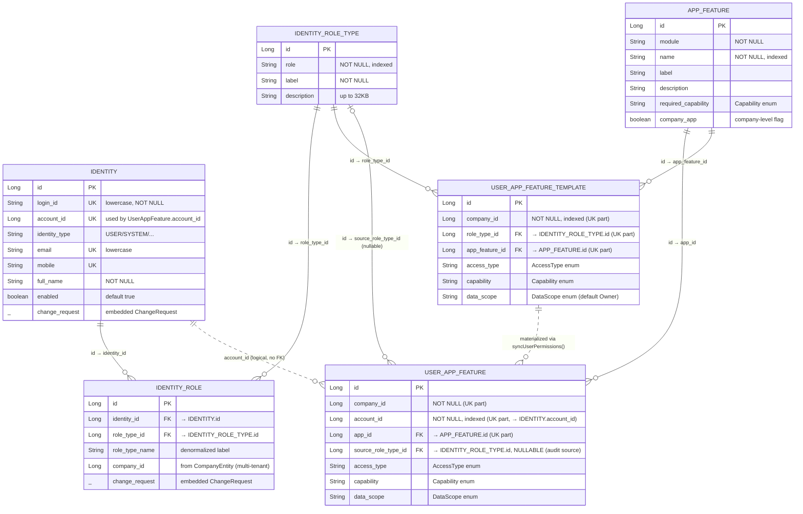

## Identity + App Feature ERD — platform-federation


> Module: `of1-core/module/platform-federation`
> Packages: `datatp.platform.identity.entity`, `datatp.platform.resource.entity`
> Date: 2026-04-10

## Scope

- Identity core: `Identity`, `IdentityRole`, `IdentityRoleType`
- App feature / permission: `AppFeature`, `UserAppFeature`, `UserAppFeatureTemplate`
- **Out of scope** (tạm chưa dùng): `IdentityGroup`, `IdentityMembership`

---

## ERD



**Legend:**
- `||--o{` — hard FK constraint (mandatory)
- `|o--o{` — optional FK constraint (nullable column)
- `||..o{` — logical/behavioral link, **no DB foreign key**

---

## Audit source column: `source_role_type_id`

Để trả lời câu hỏi **"permission này từ role type nào, hay là custom?"** — thêm 1 cột nullable `source_role_type_id` vào `security_user_app_feature`:

| Value | Ý nghĩa |
|-------|---------|
| `NULL` | **CUSTOM** — admin gán permission thủ công, sync không được xoá |
| `NOT NULL` | **Từ role type** — reference `identity_role_type.id` đã sinh ra row qua template |

**Tại sao `role_type_id` thay vì `identity_role_id`?**

- Câu hỏi audit là "từ role **type** nào" → trả lời thẳng bằng role type
- `IdentityRoleType` là master data stable, không bị xoá-tạo lại như `IdentityRole` instance
- Template đã key theo `role_type_id` → natural match
- Khi user mất 1 `IdentityRole` nhưng còn role khác cùng `roleTypeId` → không cần update cột

---

## Lookup path (full flow)

```
IdentityRole ──(role_type_id)──→ IdentityRoleType ──(role_type_id)──→ UserAppFeatureTemplate
                                        │                                    │
                                        │                            (app_feature_id)
                                        │                                    ▼
                                        │                               AppFeature
                                        │                                    ▲
                                        │                                (app_id)
                                        │                                    │
                              (source_role_type_id)  ───────────────→ UserAppFeature
                                                                             ▲
                                                                   (account_id, logical)
                                                                             │
                                                                        Identity
```

---

## Sync logic (target implementation)

File: `UserAppFeatureTemplateLogic.syncUserPermissions`

```java
public void syncUserPermissions(
    ClientContext ctx,
    Long companyId,
    Long accountId,
    List<Long> roleTypeIds
) {
  List<UserAppFeature> existing =
      userAppFeatureRepo.findAppPermissionByAccountId(companyId, accountId);

  // CUSTOM rows (source_role_type_id IS NULL) are never touched by sync
  List<UserAppFeature> roleSourced = existing.stream()
      .filter(p -> p.getSourceRoleTypeId() != null)
      .toList();

  if (roleTypeIds.isEmpty()) {
    if (!roleSourced.isEmpty()) userAppFeatureRepo.deleteAll(roleSourced);
    return;
  }

  List<UserAppFeatureTemplate> templates =
      templateRepo.findByRoleTypeIdIn(companyId, roleTypeIds);

  // Index existing role-sourced rows by appId
  Map<Long, UserAppFeature> bySourcedAppId = roleSourced.stream()
      .collect(Collectors.toMap(UserAppFeature::getAppId, p -> p, (p1, p2) -> p1));

  Set<Long> validAppIds = new HashSet<>();
  List<UserAppFeature> toSave = new ArrayList<>();

  for (UserAppFeatureTemplate template : templates) {
    validAppIds.add(template.getAppFeatureId());
    UserAppFeature current = bySourcedAppId.get(template.getAppFeatureId());

    if (current == null) {
      // Insert new role-sourced row
      UserAppFeature fresh = new UserAppFeature();
      fresh.setAppId(template.getAppFeatureId());
      fresh.setAccountId(accountId);
      fresh.setCompanyId(companyId);
      fresh.setSourceRoleTypeId(template.getRoleTypeId());   // ← tag source
      fresh.setAccessType(template.getAccessType());
      fresh.setCapability(template.getCapability());
      fresh.setDataScope(template.getDataScope());
      fresh.set(ctx);
      toSave.add(fresh);
    } else {
      // Refresh existing role-sourced row from latest template values
      current.setSourceRoleTypeId(template.getRoleTypeId());
      current.setAccessType(template.getAccessType());
      current.setCapability(template.getCapability());
      current.setDataScope(template.getDataScope());
      toSave.add(current);
    }
  }

  if (!toSave.isEmpty()) userAppFeatureRepo.saveAll(toSave);

  // Delete role-sourced rows no longer backed by a template
  List<UserAppFeature> toDelete = roleSourced.stream()
      .filter(p -> !validAppIds.contains(p.getAppId()))
      .toList();
  if (!toDelete.isEmpty()) userAppFeatureRepo.deleteAll(toDelete);
}
```

**Key guarantees:**

- Rows có `source_role_type_id IS NULL` (CUSTOM) **không bao giờ bị xoá** bởi sync
- Rows có `source_role_type_id IS NOT NULL` luôn được refresh từ template mới nhất
- Xoá role type → tất cả rows có `source_role_type_id` đó được xoá (cascade qua logic, xem section "Cascade" bên dưới)

---

## Audit query

**Single query trả lời "permission của user X đến từ đâu":**

```sql
SELECT
  uaf.id,
  uaf.app_id,
  af.module,
  af.name                AS app_name,
  uaf.capability,
  uaf.data_scope,
  uaf.access_type,
  CASE
    WHEN uaf.source_role_type_id IS NULL THEN 'CUSTOM'
    ELSE rt.role
  END                    AS source,
  rt.label               AS source_role_label
FROM security_user_app_feature uaf
JOIN security_app_feature af      ON af.id = uaf.app_id
LEFT JOIN identity_role_type rt   ON rt.id = uaf.source_role_type_id
WHERE uaf.account_id = ?
  AND uaf.company_id = ?
ORDER BY af.module, af.name;
```

Kết quả ví dụ:

| app_id | app_name | capability | source    | source_role_label |
|-------:|---------|-----------|-----------|-------------------|
| 1 | crm.customers  | ReadWrite | `ADMIN` | Administrator |
| 5 | fms.dashboard  | Read      | `STAFF` | Staff |
| 9 | fms.reports    | Write     | `CUSTOM` | *(null)* |

---

## Cascade behavior

| Operation | Effect on `security_user_app_feature` |
|-----------|----------------------------------------|
| Delete `IdentityRoleType` | All rows có `source_role_type_id = deleted.id` được xoá trong `IdentityLogic.deleteRoleTypes` |
| Delete `IdentityRole` (không phải role type) | Sync lại: gọi `syncUserPermissions(ctx, companyId, accountId, remainingRoleTypeIds)` cho account liên quan |
| Admin manual set permission | Set `source_role_type_id = NULL` → protected from sync |
| Template thay đổi | Gọi `syncUserPermissions` để refresh các row bị ảnh hưởng |

---

## Multi-role conflict resolution

Scenario: user có `IdentityRole` cho cả `ADMIN` và `AUDITOR`, cả 2 templates đều có entry cho `app_feature_id = 5`.

Unique constraint `(company_id, account_id, app_id)` → chỉ 1 row duy nhất cho app 5 → chỉ 1 `source_role_type_id` được lưu.

**Resolution strategy** (in sync logic): **last template iteration wins**.

- Template thứ hai iterate sẽ override row từ template trước (do đi qua nhánh `else` — refresh)
- Không lý tưởng nhưng deterministic khi templates được sort stable
- Nếu muốn merge capability (MAX) thì thêm logic trong nhánh `else`

**Ghi chú thực tế**: hiện tại chưa có requirement cho capability merge → giữ đơn giản, last wins. Khi cần sẽ extend.

---

## Trade-off (before vs after)

| Aspect | Before (no column) | After (`source_role_type_id`) |
|--------|-------------------|-------------------------------|
| Snapshot independence | ✅ | ✅ |
| Hot-path permission lookup O(1) | ✅ | ✅ không ảnh hưởng |
| Manual override support | ✅ any row editable | ✅ NULL flag được bảo vệ |
| Audit "từ role type nào" | ❌ phải join 4 bảng | ✅ 1 LEFT JOIN, dùng index |
| Distinguish custom vs role-sourced | ❌ không thể | ✅ IS NULL check |
| Cascade delete role type | ❌ manual | ✅ delete by `source_role_type_id` |
| Migration cost | — | 1 cột + 1 index + update sync |

---

## Tables Overview

### Identity domain (`datatp.platform.identity.entity`)

| Table | Purpose | Unique / Index |
|-------|---------|----------------|
| `identity_identity` | Core identity (user/system/service account) | UK `login_id`, UK `email`, UK `mobile` |
| `identity_role` | Identity ↔ role type, scoped by company | UK `(identity_id, role_type_id, company_id)` |
| `identity_role_type` | Master data of role types (system-wide, no company) | Index `role` |

### App feature domain (`datatp.platform.resource.entity`)

| Table | Purpose | Unique / Index |
|-------|---------|----------------|
| `security_app_feature` | Catalog of app features/modules | Index `name` |
| `security_user_app_feature` | Per-user permission grant on 1 feature | UK `(company_id, account_id, app_id)`; Index `source_role_type_id` |
| `security_user_app_feature_template` | Per-role-type default permissions | UK `(company_id, app_feature_id, role_type_id)` |

> `AppFeaturePermission` **không phải entity** — DTO/view class implementing `IFeaturePermission`, dùng ở query layer.

> `identity_group` và `identity_membership` tạm thời chưa dùng — đã bỏ khỏi ERD này.

---

## Relationship Details

### A. Direct FK relationships (5 mandatory)

| # | From | Cardinality | To | Column |
|---|------|------------|----|--------|
| 1 | `Identity` | 1 — N | `IdentityRole` | `identity_role.identity_id → identity.id` |
| 2 | `IdentityRoleType` | 1 — N | `IdentityRole` | `identity_role.role_type_id → identity_role_type.id` |
| 3 | `IdentityRoleType` | 1 — N | `UserAppFeatureTemplate` | `user_app_feature_template.role_type_id → identity_role_type.id` |
| 4 | `AppFeature` | 1 — N | `UserAppFeature` | `user_app_feature.app_id → app_feature.id` |
| 5 | `AppFeature` | 1 — N | `UserAppFeatureTemplate` | `user_app_feature_template.app_feature_id → app_feature.id` |

### B. Optional FK (nullable) — audit source

| # | From | Cardinality | To | Column |
|---|------|------------|----|--------|
| 6 | `IdentityRoleType` | 0..1 — N | `UserAppFeature` | `user_app_feature.source_role_type_id → identity_role_type.id` **NULLABLE** |

- `NULL` ⇒ custom (admin gán tay)
- `NOT NULL` ⇒ materialized từ template của role type này

### C. Logical links (no DB FK)

| # | From | To | Mechanism |
|---|------|----|-----------|
| 7 | `Identity` | `UserAppFeature` | `user_app_feature.account_id` convention-matches `identity.account_id` |
| 8 | `UserAppFeatureTemplate` | `UserAppFeature` | Materialized via `syncUserPermissions()` — template link được vật hoá qua `source_role_type_id + app_id` |

### D. Embedded

| Embeddable | Owners | Purpose |
|-----------|--------|---------|
| `ChangeRequest` | `Identity`, `IdentityRole` | Track ackStatus (`WAITING`/`PROCESSED`) cho Kafka sync protocol |

---

## Entity Invariants

| Entity | Invariant | Enforced Where |
|--------|-----------|----------------|
| `Identity` | `login_id`, `email` always lowercase | Setter override |
| `Identity` | `login_id`, `email`, `mobile` unique system-wide | DB unique |
| `IdentityRole` | 1 role type per identity per company | DB UK `(identity_id, role_type_id, company_id)` |
| `UserAppFeature` | 1 permission per `(company, account, app)` | DB UK `(company_id, account_id, app_id)` |
| `UserAppFeature.source_role_type_id` | Nullable FK to `identity_role_type.id`; NULL = CUSTOM | App-level (no DB FK constraint recommended — keep nullable flexible) |
| `UserAppFeatureTemplate` | 1 template per `(company, feature, role type)` | DB UK `(company_id, app_feature_id, role_type_id)` |
| `ChangeRequest.ackStatus` | `WAITING → PROCESSED` only | Only `IdentityEventLogic` flips |

---

## Enum Reference

| Enum | Values | Defined In |
|------|--------|-----------|
| `Capability` | `Read`, `Write`, `ReadWrite`, `Moderator` | `net.datatp.security.client.Capability` |
| `AccessType` | `Employee`, ... | `net.datatp.security.client.AccessType` |
| `DataScope` | `Owner`, `Group`, `Company`, `All` | `net.datatp.security.client.DataScope` |
| `ChangeRequest.AckStatus` | `WAITING`, `PROCESSED` | inner enum |
| `IdentityEventType` | `Create`, `Update`, `Delete`, `Sync` | enum file |

---

## Keycloak Link (logical, không phải FK)

```
identity_identity.login_id   ──→  Keycloak username
identity_identity.account_id ──→  of1-platform account system
identity_identity.email      ──→  Keycloak email
```

Password không lưu trong `identity_identity` — toàn bộ qua Keycloak admin client:
- `IdentityLogic.createKeycloakUserIfNotExists`
- `IdentityLogic.resetAccountPassword`
- `IdentityLogic.disabledIdentities`

---

## Implementation Checklist

- [x] **Entity**: thêm field `@Column(name = "source_role_type_id") private Long sourceRoleTypeId;` vào `UserAppFeature.java`
- [x] **Repository**: thêm `findBySourceRoleTypeId(Long)`, `deleteBySourceRoleTypeId(Long)` vào `AppPermissionRepository`
- [x] **Sync logic**: update `UserAppFeatureTemplateLogic.syncUserPermissions` theo pseudocode ở trên
- [x] **Cascade**: `IdentityLogic.deleteRoleTypes` gọi `permissionRepo.deleteBySourceRoleTypeId(id)` trước khi xoá `IdentityRoleType`
- [x] **DB migration SQL**: xem [`260410-user-app-feature-source-role-type-sql.md`](260410-user-app-feature-source-role-type-sql.md) — PostgreSQL + MSSQL, rollback, backfill, verification queries
- [ ] **Audit query** (optional): thêm `findPermissionsWithSource(accountId, companyId)` trả về `List<SqlMapRecord>` dùng query trong section Audit
- [ ] **API docs**: update `wiki/projects/of1/identity.md` nếu có endpoint trả về permission source

---

## References

- Entity source: `module/platform-federation/src/main/java/datatp/platform/{identity,resource}/entity/`
- Sync logic: `datatp/platform/resource/logic/UserAppFeatureTemplateLogic.syncUserPermissions`
- Permission read path: `datatp/platform/resource/logic/AppLogic.getAppPermission`
- API docs: `/Users/nqcdan/dev/wiki/wiki/projects/of1/identity.md`
- Module guide: `of1-core/module/platform-federation/CLAUDE.md`

---

## Source Role Type Team Update


> Date: 2026-04-10
> PR: https://git.datatp.cloud/of1-platform/of1-core/compare/develop...dan
> Design: [260410-identity-erd.md](260410-identity-erd.md)
> Migration SQL: [260410-user-app-feature-source-role-type-sql.md](260410-user-app-feature-source-role-type-sql.md)

---

## Vấn đề đang giải quyết

Trước đây, mỗi row trong bảng permission của user được tạo bằng 2 con đường khác nhau:
1. **Sync từ template** — khi user được gán role, hệ thống tự động tạo permissions từ template của role type đó
2. **Admin gán thủ công** — admin mở UI sửa permission trực tiếp

Nhưng hai loại này **trông giống hệt nhau** trong DB. Hậu quả:
- Không audit được "permission này từ đâu ra"
- Sync logic có thể **lỡ tay xoá** permission mà admin đã cố tình override
- Không biết khi xoá role type thì những permission nào cần cleanup

---

## Concept mới

Mỗi permission row giờ có thêm 1 field "**source role type**" — trỏ tới role type đã sinh ra nó:

- **Rỗng (NULL)** → **CUSTOM** — admin gán tay, được bảo vệ, sync không bao giờ động tới
- **Có giá trị** → **Role-sourced** — materialize từ template của role type đó, sync sẽ refresh/xoá theo template

---

## Các case cần nắm

**Case 1: User được gán role mới**
Hệ thống tự động materialize permissions từ template của role type → tag source là role type đó.

**Case 2: Admin override permission thủ công**
Permission được lưu với source rỗng → được đánh dấu là CUSTOM → từ giờ không bị sync xoá.

**Case 3: Role type bị xoá**
Tất cả permission có source trỏ tới role type đó được cascade xoá tự động. CUSTOM permissions vẫn giữ nguyên.

**Case 4: Template của role thay đổi**
Khi gọi sync, chỉ các role-sourced permissions được refresh theo template mới. CUSTOM permissions không đổi.

**Case 5: User có nhiều role cùng grant 1 app feature**
Ví dụ user có cả ADMIN và AUDITOR, cả 2 template đều có permission cho app X. Do unique constraint chỉ cho phép 1 row → template được iterate cuối sẽ thắng (deterministic). Chưa merge capability — sẽ extend sau nếu có requirement.

**Case 6: Audit — xem permission của user đến từ đâu**
Query bảng permission + join với role type → trả về từng permission kèm label CUSTOM hoặc tên role type. Có thể dùng cho màn hình audit trong admin panel.

---

## Impact lên code team đang viết

- **Hot-path đọc permission** (AppLogic.getAppPermission) — không đổi, vẫn nhanh như cũ
- **Các method save/update permission hiện có** — không cần sửa, giữ nguyên behavior
- **Các nơi gọi syncUserPermissions** — signature không đổi, nhưng behavior mới: CUSTOM rows được bảo vệ. Trước đây nếu gọi sync có thể vô tình xoá row admin đã override; giờ thì không.
- **Admin UI / API gán permission thủ công** — nên để source rỗng (NULL) để flag là CUSTOM. Mặc định Java field = null nên các path hiện tại đã đúng.
- **Khi xoá role type** — không cần xoá permission thủ công nữa, IdentityLogic.deleteRoleTypes đã tự cascade.

---

## Các bước triển khai

1. Review PR
2. Merge → deploy code mới (forward-compatible: cột NULL được treat như CUSTOM nên không break existing data)
3. Chạy migration SQL (xem file migration trong wiki — có sẵn script cho cả PostgreSQL và MSSQL)
4. *(Optional)* chạy backfill script 1-lần để tự động detect các permission cũ thực ra là role-sourced (dựa trên exact-match với template). Không bắt buộc — mặc định tất cả rows cũ sẽ thành CUSTOM.

---

## Câu hỏi team nên hỏi khi review

- Multi-role conflict strategy (last-wins) đã ổn cho use case hiện tại chưa? Có cần merge capability không?
- Có cần thêm endpoint RPC getPermissionsWithSource để UI hiển thị source không?
- Có cần DB-level FK source_role_type_id → identity_role_type.id không, hay giữ application-level cascade như hiện tại?

---

## UserAppFeature sourceRoleTypeId Refactor — Design Spec


**Date:** 2026-04-10
**Status:** Draft
**Owner:** nqcdan
**Scope:** `of1-core/module/platform-federation` (backend) + `of1-platform/webui/platform` (frontend)

## Problem

The `UserAppFeature` entity (table `security_user_app_feature`) now has a `sourceRoleTypeId` column that distinguishes two row types:

- `sourceRoleTypeId = NULL` → **CUSTOM** override, granted manually by an admin. Must be preserved across syncs.
- `sourceRoleTypeId NOT NULL` → **ROLE**-sourced, materialized from a `UserAppFeatureTemplate` owned by an `IdentityRoleType`. Refreshed/deleted on sync.

The field exists and `UserAppFeatureTemplateLogic.syncUserPermissions` has a first-pass implementation, but several logic paths are not yet wired correctly, and the frontend does not use the field at all.

### Concrete gaps

1. **`IdentityEventLogic.syncRoles`** — the entry point behind the UI "Sync Permission" button. Currently it only updates `IdentityRole.changeRequest` and publishes an async event. It does **not** directly materialize permissions. If no async consumer exists, `security_user_app_feature` is never populated.
2. **`UserAppFeatureTemplateLogic.syncUserAppFeatures(roleTypeId)`** — body is commented out. Template save/delete never re-materializes permissions for affected users.
3. **`AppSql.SearchUserAppPermissions`** — the SQL used to drive the frontend App Features list does not return `uaf.source_role_type_id` or join to `identity_role_type` for its label. Frontend cannot see CUSTOM vs ROLE.
4. **Frontend `UIIdentityAppFeatureList`** — today it guesses "in role template" by separately fetching templates and matching by `appFeatureName`. Redundant, fragile, and wrong once `sourceRoleTypeId` is available.
5. **`AppLogic.saveAppPermission(s)`** — the admin-add path does not explicitly set `sourceRoleTypeId = null`. It works by field default, but is implicit and allows a malicious/broken client to set a non-null value that violates the CUSTOM/ROLE invariant. The admin-edit path also risks overwriting a ROLE row's source and then having it silently reset on the next sync.
6. **`syncUserPermissions` latent bugs**:
   - **CUSTOM collision**: if an account has a CUSTOM row for app X and a new template also targets app X, the current code would insert a "fresh" role-sourced row and violate the unique constraint `(company_id, account_id, app_id)`.
   - **Multi-role conflict resolution**: the current `for (UserAppFeatureTemplate template : templates)` loop behaves differently for update vs insert paths. For update-in-place on an existing ROLE row, the last template iterated wins non-deterministically (depends on DB return order). For the insert path, multiple templates targeting the same `appFeatureId` produce duplicate fresh rows and trigger a unique constraint violation on `(company_id, account_id, app_id)` — a latent crash, not just indeterminism.

## Goals

- Backend becomes single source of truth for CUSTOM vs ROLE classification.
- The "Sync Permission" button deterministically materializes rows in the same transaction as the role ack update.
- Frontend reads `sourceRoleTypeId` / `sourceRoleTypeLabel` directly, without extra round-trips.
- Multi-role conflict resolution is deterministic and follows standard RBAC "max capability wins".
- CUSTOM rows are truly bullet-proof against sync.
- Admin edits on a ROLE row become an explicit conversion to CUSTOM so edits are not silently reset.

## Non-Goals

- Bulk sync across identities from the UI.
- Implementing the async event consumer for template-change → re-sync. Stubbed with a TODO.
- Adding a `priority` field to `IdentityRoleType`.
- Backfilling `source_role_type_id` on existing rows. They remain `NULL` (CUSTOM) until an admin clicks Sync.
- Onboarding banner / migration UX notification.
- Removing or replacing the async event published by `IdentityEventLogic.syncRoles` — it is still needed for other consumers (Keycloak, audit).

## Architecture & Data Model

### Row classification

| `sourceRoleTypeId` | Type | Owner | Sync behavior |
|---|---|---|---|
| `NULL` | CUSTOM | Admin (manual) | Never read, never written by sync |
| `NOT NULL` | ROLE | Template sync logic | Refreshed from template; deleted if no backing template remains |

Invariant (enforced by unique constraint `(company_id, account_id, app_id)`): exactly one row per account per app. Sync must never try to create a second row for an app that already has a CUSTOM row.

### Data flow

```
[Admin UI "Add App Feature"]
    → AppService.saveAppPermissions
    → AppLogic.saveAppPermissions (forces sourceRoleTypeId = null) — BE-5
    → security_user_app_feature (CUSTOM row)

[Admin UI "Edit App Feature" capability/dataScope]
    → AppService.saveAppPermission
    → AppLogic.saveAppPermission (forces sourceRoleTypeId = null) — BE-5 path (ii)
    → ROLE row is auto-converted to CUSTOM on edit

[Admin UI "Sync Permission"]
    → IdentityEventService.syncRoles(identityId, roleIds)
    → IdentityEventLogic.syncRoles — BE-2
        1. Update IdentityRole.changeRequest to PROCESSED
        2. Call UserAppFeatureTemplateLogic.syncUserPermissions(accountId, roleTypeIds)
        3. Publish async IdentityEvent (kept for other consumers)
    (whole method runs in one @Transactional boundary)

[Template save/delete — BE-4 stub]
    → saveUserAppFeatureTemplate / deleteUserAppFeatureTemplatesByIds
    → // TODO: publish TemplateChanged(roleTypeId) async event for re-sync
    → until then, admins must click Sync Permission manually
```

### Sync rules (inside `syncUserPermissions`)

1. **CUSTOM untouchable**: Build `Set<Long> customAppIds` from existing rows where `sourceRoleTypeId == null`. Templates whose `appFeatureId ∈ customAppIds` are skipped entirely — no insert, no update, no delete, no attempt.
2. **Multi-role conflict resolution — max capability wins**:
   - Capability rank: `Admin(4) > Moderator(3) > Write(2) > Read(1) > None(0)`.
   - DataScope rank: `All(4) > Company(3) > Group(2) > Owner(1)`.
   - Group templates by `appFeatureId`. For each group, pick winner via:
     ```
     Comparator.comparingInt(capabilityRank).reversed()
       .thenComparingInt(dataScopeRank).reversed()
       .thenComparingLong(template.roleTypeId)
     ```
   - The winner's `capability`, `dataScope`, `accessType`, and `roleTypeId` populate the resulting row. `sourceRoleTypeId = winner.roleTypeId`.
3. **Materialization**:
   - Existing ROLE rows for an app → update in place (preserves `id`, keeps FK references).
   - No existing ROLE row and no CUSTOM block → insert fresh.
4. **Cleanup**: ROLE rows whose `appId` is not in the winning set are deleted. CUSTOM rows are untouched.

## Backend Changes

### BE-1. SQL `SearchUserAppPermissions` returns source role type label

**File**: `of1-core/module/platform-federation/src/main/java/datatp/platform/resource/groovy/AppSql.groovy`

Modify the `SearchUserAppPermissions` query:

```sql
SELECT
  uaf.*,
  af.module                 AS module,
  af.name                   AS name,
  aa.login_id               AS login_id,
  aa.full_name              AS user_full_name,
  srt.label                 AS source_role_type_label
FROM security_user_app_feature uaf
  INNER JOIN security_app_feature af ON af.id = uaf.app_id
  INNER JOIN account_account    aa  ON aa.id  = uaf.account_id
  LEFT  JOIN identity_role_type srt ON srt.id = uaf.source_role_type_id
WHERE
  ${FILTER_BY_STORAGE_STATE('uaf', sqlParams)}
  ${AND_FILTER_BY_PARAM('uaf.app_id', 'appId', sqlParams)}
  ${AND_FILTER_BY_PARAM('uaf.account_id', 'accountId', sqlParams)}
  ${AND_FILTER_BY_PARAM('uaf.access_type', 'accessType', sqlParams)}
  ${AND_FILTER_BY_PARAM('uaf.company_id', 'companyId', sqlParams)}
  ${AND_FILTER_BY_RANGE('uaf.created_time', 'createdTime', sqlParams)}
  ${AND_FILTER_BY_RANGE('uaf.modified_time', 'modifiedTime', sqlParams)}
  ${AND_FILTER_BY_OPTION('uaf.capability', "capability", sqlParams)}
  ${ORDER_BY(sqlParams)}
${MAX_RETURN(sqlParams)}
```

`uaf.*` includes `source_role_type_id`, so the frontend receives `sourceRoleTypeId` automatically. The LEFT JOIN adds `sourceRoleTypeLabel` in the same round-trip, avoiding N+1.

### BE-2. `IdentityEventLogic.syncRoles` materializes permissions in-transaction

**File**: `of1-core/module/platform-federation/src/main/java/datatp/platform/identity/queue/IdentityEventLogic.java`

- Inject `UserAppFeatureTemplateLogic`. Prefer constructor injection (see Testing section note on mockability).
- Inside `syncRoles(ctx, identityId, roleIds)`, after persisting role change-request acks and before publishing the async event, insert:
  ```java
  Long accountId = identity.getAccountId();
  if (accountId != null) {
    List<Long> roleTypeIds = roles.stream()
      .map(IdentityRole::getRoleTypeId)
      .distinct()
      .collect(Collectors.toList());
    templateLogic.syncUserPermissions(ctx, ctx.getCompanyId(), accountId, roleTypeIds);
  }
  ```
- **Transaction boundary is already in place**: `IdentityEventService.syncRoles` is annotated `@Transactional` at the service layer (`IdentityEventService.java:30`). No new annotation needed — the injected `syncUserPermissions` call runs inside the same Spring-managed transaction, so any failure rolls back the ack update automatically. Caveat: during implementation, verify that nothing in the injected call chain overrides propagation to `REQUIRES_NEW`.
- The async event is still published afterwards; other consumers (Keycloak sync, audit, etc.) remain untouched.

### BE-2b. `IdentityEventLogic.syncIdentities` also materializes permissions

**File**: same `IdentityEventLogic.java`

`IdentityEventLogic.syncIdentities(ctx, identityIds)` (lines 60-94) is a second entry point that acks change-requests for a list of identities and emits `Sync` events. If left untouched, any caller of `IdentityEventService.syncIdentities` will ack role change-requests without materializing `security_user_app_feature`, leaving permissions stale.

Patch the per-identity loop: after loading `roles` for the identity and persisting `changeRequest` acks, add the same sync call:

```java
Long accountId = identity.getAccountId();
if (accountId != null) {
  List<Long> roleTypeIds = roles == null
      ? java.util.Collections.emptyList()
      : roles.stream().map(IdentityRole::getRoleTypeId).distinct().collect(Collectors.toList());
  templateLogic.syncUserPermissions(ctx, ctx.getCompanyId(), accountId, roleTypeIds);
}
```

`IdentityEventService.syncIdentities` is already `@Transactional` (line 20), so the sync runs inside the enclosing transaction — one identity failing rolls back its own updates. If partial success per identity is desired instead of all-or-nothing, that is an intentional design choice to make at implementation time; default to all-or-nothing because it matches the current behavior of `syncRoles`.

### BE-3. `UserAppFeatureTemplateLogic.syncUserPermissions` — bug fixes + max-capability rule

**File**: `of1-core/module/platform-federation/src/main/java/datatp/platform/resource/logic/UserAppFeatureTemplateLogic.java`

Rewrite the method body:

1. Load `existingPermissions = userAppFeatureRepo.findAppPermissionByAccountId(companyId, accountId)`.
2. Partition:
   - `customAppIds = existingPermissions.stream().filter(p -> p.getSourceRoleTypeId() == null).map(UserAppFeature::getAppId).collect(Collectors.toSet())`.
   - `roleSourced = existingPermissions.stream().filter(p -> p.getSourceRoleTypeId() != null).collect(Collectors.toList())`.
3. If `roleTypeIds` is null/empty, delete all `roleSourced` and return. CUSTOM rows are untouched.
4. Load `templates = templateRepo.findByRoleTypeIdIn(companyId, roleTypeIds)`.
5. **Filter out CUSTOM collisions**: `templates = templates.stream().filter(t -> !customAppIds.contains(t.getAppFeatureId())).toList()`. Log at DEBUG for each skipped entry.
6. **Group by appFeatureId and pick winners**:
   ```java
   Comparator<UserAppFeatureTemplate> bestFirst =
       Comparator.comparingInt((UserAppFeatureTemplate t) -> capabilityRank(t.getCapability())).reversed()
           .thenComparing(Comparator.comparingInt((UserAppFeatureTemplate t) -> dataScopeRank(t.getDataScope())).reversed())
           .thenComparingLong(UserAppFeatureTemplate::getRoleTypeId);

   Map<Long, UserAppFeatureTemplate> winnerByAppId = templates.stream()
       .collect(Collectors.toMap(
           UserAppFeatureTemplate::getAppFeatureId,
           Function.identity(),
           (a, b) -> bestFirst.compare(a, b) <= 0 ? a : b));
   ```
7. Index role-sourced existing rows by `appId`: `sourcedByAppId = roleSourced.stream().collect(Collectors.toMap(UserAppFeature::getAppId, ...))`.
8. For each `(appId, winner)`:
   - If `sourcedByAppId` has an entry, update in place: `current.setSourceRoleTypeId(winner.getRoleTypeId()); current.setAccessType(winner.getAccessType()); current.setCapability(winner.getCapability()); current.setDataScope(winner.getDataScope());`
   - Else, create a fresh row and add to `toSave`. CUSTOM collision is already filtered out in step 5, so no unique-constraint violation is possible.
9. Persist `toSave` via `userAppFeatureRepo.saveAll(toSave)`.
10. Delete `roleSourced` entries whose `appId` is not in `winnerByAppId`.

Add private helpers:

```java
private static int capabilityRank(Capability c) {
  if (c == null) return 0;
  switch (c) {
    case Admin:     return 4;
    case Moderator: return 3;
    case Write:     return 2;
    case Read:      return 1;
    case None:      return 0;
    default:        return 0;
  }
}

private static int dataScopeRank(DataScope s) {
  if (s == null) return 0;
  switch (s) {
    case All:     return 4;
    case Company: return 3;
    case Group:   return 2;
    case Owner:   return 1;
    default:      return 0;
  }
}
```

(Adjust enum constant names to match `net.datatp.security.client.Capability` / `DataScope`.)

### BE-4. `syncUserAppFeatures(roleTypeId)` — TODO stub

**File**: same `UserAppFeatureTemplateLogic.java`

Delete the commented-out body and replace with:

```java
/**
 * Trigger re-materialization of UserAppFeature rows for every account that
 * currently holds {@code roleTypeId}, after a template change on that role type.
 *
 * TODO: Publish TemplateChanged(roleTypeId) async event via IdentityEventProducer.
 * A consumer will iterate IdentityRole by roleTypeId → for each account, call
 * syncUserPermissions with the account's full current roleTypeIds set.
 *
 * Until the consumer is implemented, this is a no-op. Admins must click
 * "Sync Permission" on affected identities manually.
 */
public void syncUserAppFeatures(ClientContext ctx, Long roleTypeId) {
  // No-op. See TODO above.
}
```

Also add TODO markers in the two call-sites:

```java
public UserAppFeatureTemplate saveUserAppFeatureTemplate(ClientContext ctx, UserAppFeatureTemplate template) {
  template.set(ctx);
  template.setCompanyId(ctx.getCompanyId());
  UserAppFeatureTemplate saved = templateRepo.save(template);
  // TODO: trigger syncUserAppFeatures(ctx, saved.getRoleTypeId()) when async
  // re-sync consumer is in place. See syncUserAppFeatures() javadoc.
  return saved;
}

public void deleteUserAppFeatureTemplatesByIds(ClientContext ctx, List<Long> ids) {
  if (ids == null || ids.isEmpty()) return;
  // ... existing delete loop
  // TODO: for each distinct affected roleTypeId, call syncUserAppFeatures(ctx, roleTypeId)
  // when the async re-sync consumer is in place.
}
```

### BE-5. `AppLogic.saveAppPermission` — explicit CUSTOM assignment (single edit)

**File**: `of1-core/module/platform-federation/src/main/java/datatp/platform/resource/logic/AppLogic.java`

Only one method needs to change. `saveAppPermissions` (list variant), `updateAppPermissionCapabilities`, and `updateAppPermissionDataScopes` all delegate to `saveAppPermission(client, permission)` per row (verified in `AppLogic.java:91-128`), so a single edit propagates the rule to every Add / Edit / bulk-update path automatically.

```java
public UserAppFeature saveAppPermission(ClientContext client, UserAppFeature permission) {
  permission.setSourceRoleTypeId(null);   // BE-5: admin Add/Edit/Update is always CUSTOM
  permission.set(client);
  return permissionRepo.save(permission);
}
```

Decision (option ii from brainstorming): editing a ROLE row through any admin UI path (detail editor, capability popover, data-scope popover) **converts it to CUSTOM**. The next `syncUserPermissions` call then leaves it alone. This matches the mental model "admin edit = intentional override".

Consequence: `updateAppPermissionCapabilities` and `updateAppPermissionDataScopes` inherit CUSTOM conversion for free — no additional edits, no separate decision to make. This is the desired behavior.

## Frontend Changes

### FE-1. `UIIdentityAppFeatureList.tsx` — drop template fetch, read field directly

**File**: `of1-platform/webui/platform/src/module/platform/security/identity/UIIdentityAppFeatureList.tsx`

Remove:
- Instance field `templateAppMap: Map<string, string[]>`.
- Method `loadTemplates()`.
- The entire `componentDidMount` override — **delete the whole method, do not leave an empty stub**. An empty override without `super.componentDidMount()` would silently break the base class lifecycle.

Replace the current `In Role Template` column with:

```tsx
{
  name: 'sourceRoleTypeLabel', label: T('Source'), width: 200, filterable: true,
  customRender: (_ctx, _field, dRec) => {
    const record: any = dRec.record;
    const label = record.sourceRoleTypeLabel;

    if (!label) {
      return (
        <span className='badge bg-warning-soft text-warning border border-warning'
          style={{ fontSize: 11, fontWeight: 500 }}>
          {T('Custom')}
        </span>
      );
    }
    return (
      <span className='badge bg-success-soft text-success border border-success'
        style={{ fontSize: 11, fontWeight: 500 }}>
        {label}
      </span>
    );
  }
}
```

- CUSTOM rows render a warning-colored "Custom" badge.
- ROLE rows render a success-colored badge with the role type label.
- `sourceRoleTypeLabel` comes from BE-1's SQL alias.

### FE-2. `UIIdentity.tsx` — drop stale `loadTemplates()` call

**File**: `of1-platform/webui/platform/src/module/platform/security/identity/UIIdentity.tsx`

```tsx
onRolesChanged = () => {
  this.listRef.current?.reloadData();
  this.featureListRef.current?.reloadData();
  // removed: this.featureListRef.current?.loadTemplates();
}
```

After BE-2, a reload of the App Features list is sufficient — the freshly synced data already carries `sourceRoleTypeLabel`.

**FE-1 and FE-2 must ship together as one atomic change.** Shipping FE-1 without FE-2 leaves a `loadTemplates` call referencing a deleted method → TypeScript compile error. Shipping FE-2 without FE-1 leaves the stale `templateAppMap` code wired to a method that no longer runs.

### FE-3. Add App Feature payload — verify

**File**: same `UIIdentityAppFeatureList.tsx`, method `onAddAppFeature`

No code change. The payload sent to `AppService.saveAppPermissions` does not include `sourceRoleTypeId`. BE-5 guarantees the server sets it to `null` explicitly.

### FE-4. Sort options include the new column

**File**: same `UIIdentityAppFeatureList.tsx`, plugin `orderBy`:

```tsx
orderBy: {
  fields: ['module', 'name', 'sourceRoleTypeLabel', 'capability', 'modifiedTime'],
  fieldLabels: ['App', 'Feature Screen', 'Source', 'Capability', 'Modified Time'],
  selectFields: ['module', 'name'],
  sort: 'ASC'
}
```

Lets admins sort by source role type label, grouping CUSTOMs together.

## Testing

### Backend — unit tests (new file)

`of1-core/module/platform-federation/src/test/java/datatp/platform/resource/UserAppFeatureTemplateLogicTest.java`

| # | Name | Scenario |
|---|---|---|
| 1 | `syncWithEmptyRoleTypeIds_deletesAllRoleSourcedRowsOnly` | Arrange: 2 CUSTOM + 3 ROLE rows. Act: sync `[]`. Assert: 2 CUSTOM rows remain, 3 ROLE rows deleted. |
| 2 | `syncWithNewRoleType_insertsFreshRoleSourcedRows` | No existing rows; `R1` template has apps A, B. After sync `[R1]`: 2 new rows with `sourceRoleTypeId = R1`. |
| 3 | `syncWithExistingRoleRows_refreshesCapabilityFromTemplate` | Existing ROLE row for `appA` (`Read`, sourced from `R1`). Template `R1/appA` now `Write`. After sync `[R1]`: same row, now `Write`, same `sourceRoleTypeId`. |
| 4 | `syncRemovesRoleRowsNotBackedByAnyTemplate` | Existing ROLE row for `appA`. Template `R1` no longer has `appA`. After sync `[R1]`: row deleted. |
| 5 | `syncWithCustomCollision_customWinsAndTemplateSkipped` | Existing CUSTOM row `appA` (`Read`, `sourceRoleTypeId=null`). Template `R1/appA` has `Write`. After sync `[R1]`: CUSTOM row untouched, no extra row for `appA`, no unique-constraint violation. |
| 6 | `syncWithMultiRoleOverlap_picksMaxCapability` | `R1/appA=Read/Owner`, `R2/appA=Write/Company`. After sync `[R1,R2]`: row is `Write/Company`, `sourceRoleTypeId=R2`. |
| 7 | `syncWithMultiRoleSameCapability_tieBreaksByDataScope` | `R1/appA=Write/Owner`, `R2/appA=Write/Company`. After sync `[R1,R2]`: `dataScope=Company`, `sourceRoleTypeId=R2`. |
| 8 | `syncWithMultiRoleSameCapAndScope_tieBreaksBySmallerRoleTypeId` | `R1/appA=Write/Owner`, `R2/appA=Write/Owner`, `R1.id < R2.id`. Sync input order shuffled. Result: `sourceRoleTypeId=R1`. |

### Backend — integration tests (extend existing)

Add to `IdentityIntegrationTest` (or create `IdentityEventLogicIntegrationTest`):

| # | Name | Scenario |
|---|---|---|
| 9 | `syncRoles_materializesPermissionsInSameTransaction` | Identity with `accountId`, 2 role types each with a template. Call `IdentityEventLogic.syncRoles`. Assert: `IdentityRole.changeRequest.ackStatus == PROCESSED`, `security_user_app_feature` populated per templates, event published. |
| 10 | `syncRoles_rollbackOnPermissionSyncFailure` | Mock `syncUserPermissions` to throw. Call `syncRoles`. Assert: `IdentityRole.changeRequest` not updated (full rollback). |
| 11 | `syncIdentities_materializesPermissionsPerIdentity` | Two identities with distinct role types and templates. Call `IdentityEventLogic.syncIdentities`. Assert: each identity's `security_user_app_feature` rows match their respective templates; each `changeRequest` acked; event published per identity. |

**Mocking technique**: `IdentityEventLogic` currently uses field injection (`@Autowired`). To make test #10 feasible, either:
- Use `@MockBean UserAppFeatureTemplateLogic` in a `@SpringBootTest` slice, or
- Convert `IdentityEventLogic` to constructor injection for the new `UserAppFeatureTemplateLogic` dependency and pass a Mockito mock in a plain `@ExtendWith(MockitoExtension.class)` unit test.

Prefer constructor injection — it's more testable, documents dependencies, and matches modern Spring guidance.

### Frontend — manual QA checklist

- [ ] Identity detail opens; App Features list loads; `Source` column visible.
- [ ] Identity never synced → every row shows the yellow `Custom` badge.
- [ ] Click `Sync Permission` → list reloads; apps with templates now show a green badge with the role type label.
- [ ] `Add App Feature` popup → newly added row shows `Custom`.
- [ ] Admin edits `capability` on a ROLE row through `UIFeatureAccessEditor` → row becomes `Custom` on save (BE-5 path ii).
- [ ] Remove a role from the Role Type list + click `Sync` → apps that were only backed by that role disappear from App Features (CUSTOM overrides remain).
- [ ] Delete a role type in the Role Type admin page → all ROLE rows sourced from it disappear for affected users (existing `IdentityLogic.deleteRoleTypes` cascade path).

## Migration & Rollout

- **No DB migration script**. `source_role_type_id` column exists already; existing rows remain `NULL` → treated as CUSTOM.
- **Deploy order**:
  1. Backend (BE-1..BE-5). Backward compatible with old frontend; adding a field and logic does not break old clients.
  2. Frontend (FE-1..FE-4). Safe to deploy anytime after BE is live.
  3. Rollback: revert backend to previous version; old frontend still works because it does not read `sourceRoleTypeLabel`.
- **Admin communication** after deploy:
  > After this upgrade, all App Features on the identity detail screen will show as **Custom**. Click **Sync Permission** on each identity to materialize rows from the current role templates. CUSTOM rows are preserved; only role-sourced rows are created/refreshed.

## Risks

| # | Risk | Severity | Mitigation |
|---|---|---|---|
| R1 | Legacy rows are in fact template-sourced but now read as CUSTOM → admins may be confused. | High | Q4 rule "CUSTOM wins" guarantees that clicking Sync will not erase legacy rows; it only creates additional rows from templates. Manual review may be required but no data is lost. Documented in admin communication. |
| R2 | `syncRoles` runs sync + ack in one transaction → long transactions on accounts with many roles or large templates. | Medium | Monitor transaction duration post-deploy. Fallback: split permission sync into a non-transactional helper if throughput becomes a problem (trades off atomicity). |
| R3 | BE-5 path (ii) auto-converts ROLE row to CUSTOM on edit → an accidental edit permanently detaches the row from template sync. | Medium | Documented behavior. Optional follow-up: add a confirm dialog in `UIFeatureAccessEditor` when editing a row whose `sourceRoleTypeId != null`. Out of scope here. |
| R4 | Switching from "last wins" to max-capability may grant some accounts higher capabilities than before. | Low | "Last wins" was non-deterministic and largely unused; max-capability matches RBAC intent. Document and spot-check after deploy. |
| R5 | Bug in the CUSTOM collision filter → unique constraint violation on sync. | Low | Tests #1 and #5 cover exactly this scenario. CI gate required before deploy. |
| R6 | BE-4 stub → template save does not auto-propagate to existing users. | Medium | Admin communication + manual Sync workflow. Will be resolved by follow-up work on the async consumer. |
| R7 | Orphaned ROLE rows: if an identity previously had an `accountId` that materialized ROLE rows and the account link was later removed (identity.accountId set to NULL), those rows persist and are never touched by sync (the null-guard in BE-2/BE-2b skips them entirely). | Low | Out of scope for this refactor. Cascade cleanup on account unlink is handled by `IdentityLogic` deletion paths today. Flag as a known limitation; consider a follow-up cleanup job if it becomes material. |

## Open Questions

_(None. Both prior open questions were resolved during the spec review: bulk update paths delegate through `saveAppPermission` and inherit the CUSTOM rule automatically; `@Transactional` already lives at `IdentityEventService` for both `syncRoles` and `syncIdentities`.)_

## References

- `of1-core/module/platform-federation/src/main/java/datatp/platform/resource/entity/UserAppFeature.java` — entity with `sourceRoleTypeId`.
- `of1-core/module/platform-federation/src/main/java/datatp/platform/resource/logic/UserAppFeatureTemplateLogic.java` — `syncUserPermissions` first pass.
- `of1-core/module/platform-federation/src/main/java/datatp/platform/identity/queue/IdentityEventLogic.java` — entry point for the Sync Permission UI action.
- `of1-core/module/platform-federation/src/main/java/datatp/platform/resource/groovy/AppSql.groovy` — `SearchUserAppPermissions` SQL.
- `of1-platform/webui/platform/src/module/platform/security/identity/UIIdentityAppFeatureList.tsx` — current frontend list with `templateAppMap` hack.
- `of1-platform/webui/platform/src/module/platform/security/identity/UIIdentity.tsx` — `UIIdentityDetail` and `syncRoles` client call.

---

## UserAppFeature sourceRoleTypeId Refactor Implementation Plan


> **For agentic workers:** REQUIRED SUB-SKILL: Use superpowers:subagent-driven-development (recommended) or superpowers:executing-plans to implement this plan task-by-task. Steps use checkbox (`- [ ]`) syntax for tracking.

**Goal:** Wire `UserAppFeature.sourceRoleTypeId` end-to-end so that CUSTOM vs ROLE permission rows are distinguished, synced deterministically (max-capability wins), and surfaced on the Identity detail screen, with the "Sync Permission" button materializing rows atomically in the same transaction.

**Architecture:** Backend fixes: single-line guard in `AppLogic.saveAppPermission` (covers all admin save paths), rewrite of `UserAppFeatureTemplateLogic.syncUserPermissions` with CUSTOM-collision filter and max-capability winner selection, direct in-transaction sync call added to both `IdentityEventLogic.syncRoles` and `syncIdentities`, TODO stubs at template save/delete, and SQL exposure of `source_role_type_id` / `source_role_type_label`. Frontend cleanup: drop the `templateAppMap` workaround and read the new fields directly.

**Tech Stack:** Java 17 + Spring Boot + JPA + Lombok (backend), Groovy SQL templates, JUnit 5 + Mockito (frontend), React + TypeScript + custom `@of1-webui/lib`.

**Spec:** `/Users/nqcdan/dev/wiki/wiki/daily/260410-user-app-feature-source-role-type-refactor.md`

---

## Working Environment

**Repo root:** `/Users/nqcdan/OF1/forgejo/of1-platform/`

All relative paths in this plan are anchored to that root. Two top-level subprojects matter:

- **Backend:** `of1-core/` — Gradle project, no wrapper. Uses system `gradle` (verified 9.2.0+). Project name for the affected module: `datatp-core-module-platform-federation` (declared in `of1-core/settings.gradle` → `project(':datatp-core-module-platform-federation').projectDir = new File('module/platform-federation')`).
- **Frontend:** `of1-platform/webui/platform/` — TypeScript + webpack. Use `npx tsc` for type-check.

**Backend commands you will run repeatedly** (always from `of1-core/`):

```bash
cd /Users/nqcdan/OF1/forgejo/of1-platform/of1-core

# Compile only
gradle :datatp-core-module-platform-federation:compileJava

# Run all tests in the module
gradle :datatp-core-module-platform-federation:test

# Run a single test class
gradle :datatp-core-module-platform-federation:test --tests datatp.platform.resource.UserAppFeatureTemplateLogicTest

# Run a single test method
gradle :datatp-core-module-platform-federation:test \
  --tests 'datatp.platform.resource.UserAppFeatureTemplateLogicTest.syncWithCustomCollision_customWinsAndTemplateSkipped'
```

If `gradle` command is not on PATH, activate via sdkman: `source "$HOME/.sdkman/bin/sdkman-init.sh" && sdk use gradle current`.

**Frontend commands** (always from `of1-platform/webui/platform/`):

```bash
cd /Users/nqcdan/OF1/forgejo/of1-platform/of1-platform/webui/platform

# Type-check the whole project (raw exit code is the gate, not grep output)
npx tsc --noEmit -p tsconfig.json
```

**Git**: all commits are run from the repo root `/Users/nqcdan/OF1/forgejo/of1-platform/`.

## Conventions

- **Entities use Lombok `@Getter @Setter`**. If a setter like `setSourceRoleTypeId` is not visible in the source file, it is Lombok-generated — trust it and the build will confirm. `PersistableEntity<PK>` exposes `setId(PK)` / `getId()` via Lombok on its own superclass — do not reach for reflection to set the id.
- **Test packages**: existing tests live under `datatp.identity.*`, `datatp.federation.*`, `datatp.ai.*`. The new tests in this plan use `datatp.platform.resource.*` and `datatp.platform.identity.queue.*` — deliberate, matching the package of the class under test for discoverability. No Spring config restricts test class-scan.
- **Commits**: subject ≤70 chars, conventional-commits style (`feat:`, `fix:`, `chore:`, `test:`, `docs:`). No attribution footer (disabled globally).
- **TDD rhythm**: for every behavior change, write the failing test first, run it to see it fail, write the minimal code, run it to see it pass, commit. Commits happen at the end of each task, not after every step.

---

## File Structure

### Backend — files to create

- `of1-core/module/platform-federation/src/test/java/datatp/platform/resource/UserAppFeatureTemplateLogicTest.java` — unit tests for `syncUserPermissions` (tests 1–8 from the spec).
- `of1-core/module/platform-federation/src/test/java/datatp/platform/identity/queue/IdentityEventLogicSyncTest.java` — integration tests for `syncRoles` and `syncIdentities` in-transaction materialization (tests 9–11).

### Backend — files to modify

- `of1-core/module/platform-federation/src/main/java/datatp/platform/resource/groovy/AppSql.groovy` — add `source_role_type_label` to `SearchUserAppPermissions`.
- `of1-core/module/platform-federation/src/main/java/datatp/platform/resource/logic/AppLogic.java` — single-line edit in `saveAppPermission`.
- `of1-core/module/platform-federation/src/main/java/datatp/platform/resource/logic/UserAppFeatureTemplateLogic.java` — rewrite `syncUserPermissions`, add rank helpers, replace `syncUserAppFeatures` body with TODO stub, add TODO markers in save/delete paths.
- `of1-core/module/platform-federation/src/main/java/datatp/platform/identity/queue/IdentityEventLogic.java` — constructor-inject `UserAppFeatureTemplateLogic`, call `syncUserPermissions` inside `syncRoles` and `syncIdentities`.

### Frontend — files to modify

- `of1-platform/webui/platform/src/module/platform/security/identity/UIIdentityAppFeatureList.tsx` — drop `templateAppMap`, `loadTemplates`, `componentDidMount` override; replace column `customRender` to read `sourceRoleTypeLabel`; update `orderBy`.
- `of1-platform/webui/platform/src/module/platform/security/identity/UIIdentity.tsx` — remove `loadTemplates()` call from `onRolesChanged`.

---

## Task 1: BE-5 — Force `sourceRoleTypeId = null` in `AppLogic.saveAppPermission`

**Files:**
- Modify: `of1-core/module/platform-federation/src/main/java/datatp/platform/resource/logic/AppLogic.java` (method `saveAppPermission`)

**Rationale:** Smallest atomic change. All admin save paths (Add, Edit, bulk capability update, bulk data-scope update) delegate to this one method, so a single edit covers every admin-initiated write. Ship first to unblock downstream work.

- [ ] **Step 1: Read the file and locate `saveAppPermission`**

Open `AppLogic.java` and verify the method signature matches:
```java
public UserAppFeature saveAppPermission(ClientContext client, UserAppFeature permission) {
  permission.set(client);
  return permissionRepo.save(permission);
}
```

- [ ] **Step 2: Apply the edit**

Add one line at the top of the method body:
```java
public UserAppFeature saveAppPermission(ClientContext client, UserAppFeature permission) {
  permission.setSourceRoleTypeId(null);   // BE-5: admin Add/Edit/Update is always CUSTOM
  permission.set(client);
  return permissionRepo.save(permission);
}
```

- [ ] **Step 3: Build to verify no compile error**

```bash
cd /Users/nqcdan/OF1/forgejo/of1-platform/of1-core
gradle :datatp-core-module-platform-federation:compileJava
```

Expected: `BUILD SUCCESSFUL` with no errors.

- [ ] **Step 4: Commit**

```bash
cd /Users/nqcdan/OF1/forgejo/of1-platform
git add of1-core/module/platform-federation/src/main/java/datatp/platform/resource/logic/AppLogic.java
git commit -m "fix(security): force sourceRoleTypeId=null on saveAppPermission

Admin-initiated Add/Edit/Update paths all delegate to saveAppPermission.
Setting sourceRoleTypeId=null explicitly ensures ROLE rows become CUSTOM
on edit, preventing silent reset on the next syncUserPermissions call."
```

---

## Task 2: BE-3 setup — Add rank helpers to `UserAppFeatureTemplateLogic`

**Files:**
- Modify: `of1-core/module/platform-federation/src/main/java/datatp/platform/resource/logic/UserAppFeatureTemplateLogic.java` (add private helpers)
- Create: `of1-core/module/platform-federation/src/test/java/datatp/platform/resource/UserAppFeatureTemplateLogicTest.java` (test scaffolding)

**Rationale:** Pure functions are the cheapest to TDD. Get the ranking helpers correct and covered first, then build the sync logic on top.

- [ ] **Step 1: Create the test file with scaffolding**

Create `UserAppFeatureTemplateLogicTest.java`:
```java
package datatp.platform.resource;

import static org.junit.jupiter.api.Assertions.*;

import datatp.platform.resource.logic.UserAppFeatureTemplateLogic;
import net.datatp.security.client.Capability;
import net.datatp.security.client.DataScope;
import org.junit.jupiter.api.Test;

class UserAppFeatureTemplateLogicTest {
  // Rank helper tests
  @Test
  void capabilityRank_ordersAdminHighestNoneLowest() {
    fail("Not yet implemented");
  }

  @Test
  void dataScopeRank_ordersAllHighestOwnerLowest() {
    fail("Not yet implemented");
  }
}
```

- [ ] **Step 2: Run the tests to verify they fail**

```bash
cd /Users/nqcdan/OF1/forgejo/of1-platform/of1-core
gradle :datatp-core-module-platform-federation:test \
  --tests datatp.platform.resource.UserAppFeatureTemplateLogicTest
```

Expected: 2 tests fail with `Not yet implemented`.

- [ ] **Step 3: Write the first real test — capability ordering**

Replace `capabilityRank_ordersAdminHighestNoneLowest` body:
```java
@Test
void capabilityRank_ordersAdminHighestNoneLowest() {
  assertTrue(UserAppFeatureTemplateLogic.capabilityRank(Capability.Admin)
      > UserAppFeatureTemplateLogic.capabilityRank(Capability.Moderator));
  assertTrue(UserAppFeatureTemplateLogic.capabilityRank(Capability.Moderator)
      > UserAppFeatureTemplateLogic.capabilityRank(Capability.Write));
  assertTrue(UserAppFeatureTemplateLogic.capabilityRank(Capability.Write)
      > UserAppFeatureTemplateLogic.capabilityRank(Capability.Read));
  assertTrue(UserAppFeatureTemplateLogic.capabilityRank(Capability.Read)
      > UserAppFeatureTemplateLogic.capabilityRank(Capability.None));
  assertEquals(0, UserAppFeatureTemplateLogic.capabilityRank(null));
}
```

- [ ] **Step 4: Run it — expect compile error (helper doesn't exist)**

```bash
gradle :datatp-core-module-platform-federation:test \
  --tests 'datatp.platform.resource.UserAppFeatureTemplateLogicTest.capabilityRank_ordersAdminHighestNoneLowest'
```

Expected: compile failure "cannot find symbol: method capabilityRank".

- [ ] **Step 5: Add the helper in `UserAppFeatureTemplateLogic.java`**

Verified enum constants in `/Users/nqcdan/OF1/forgejo/of1-platform/of1-core/module/common/src/main/java/net/datatp/security/client/Capability.java` are `None, Read, Write, Moderator, Admin` (PascalCase). Add inside the class, near the bottom:

```java
static int capabilityRank(Capability c) {
  if (c == null) return 0;
  switch (c) {
    case Admin:     return 4;
    case Moderator: return 3;
    case Write:     return 2;
    case Read:      return 1;
    case None:      return 0;
    default:        return 0;
  }
}
```

Deliberate deviation from the spec's `private static`: the helper is package-private (no access modifier) so the test class in the same package can call it directly without reflection. Standard Java test-seam pattern.

- [ ] **Step 6: Run the test — expect pass**

```bash
gradle :datatp-core-module-platform-federation:test \
  --tests 'datatp.platform.resource.UserAppFeatureTemplateLogicTest.capabilityRank_ordersAdminHighestNoneLowest'
```

Expected: 1 test passed.

- [ ] **Step 7: Write the dataScope test**

Replace `dataScopeRank_ordersAllHighestOwnerLowest` body:
```java
@Test
void dataScopeRank_ordersAllHighestOwnerLowest() {
  assertTrue(UserAppFeatureTemplateLogic.dataScopeRank(DataScope.All)
      > UserAppFeatureTemplateLogic.dataScopeRank(DataScope.Company));
  assertTrue(UserAppFeatureTemplateLogic.dataScopeRank(DataScope.Company)
      > UserAppFeatureTemplateLogic.dataScopeRank(DataScope.Group));
  assertTrue(UserAppFeatureTemplateLogic.dataScopeRank(DataScope.Group)
      > UserAppFeatureTemplateLogic.dataScopeRank(DataScope.Owner));
  assertEquals(0, UserAppFeatureTemplateLogic.dataScopeRank(null));
}
```

- [ ] **Step 8: Run — expect compile failure, then add helper**

Verified enum constants in `/Users/nqcdan/OF1/forgejo/of1-platform/of1-core/module/common/src/main/java/net/datatp/security/client/DataScope.java` are `Owner, Group, Company, All` (PascalCase). Add to `UserAppFeatureTemplateLogic.java` below `capabilityRank`:

```java
static int dataScopeRank(DataScope s) {
  if (s == null) return 0;
  switch (s) {
    case All:     return 4;
    case Company: return 3;
    case Group:   return 2;
    case Owner:   return 1;
    default:      return 0;
  }
}
```

- [ ] **Step 9: Run both rank tests — expect pass**

```bash
gradle :datatp-core-module-platform-federation:test \
  --tests datatp.platform.resource.UserAppFeatureTemplateLogicTest
```

Expected: 2/2 passed.

- [ ] **Step 10: Commit**

```bash
cd /Users/nqcdan/OF1/forgejo/of1-platform
git add of1-core/module/platform-federation/src/main/java/datatp/platform/resource/logic/UserAppFeatureTemplateLogic.java \
        of1-core/module/platform-federation/src/test/java/datatp/platform/resource/UserAppFeatureTemplateLogicTest.java
git commit -m "test(security): add capabilityRank/dataScopeRank helpers with unit tests"
```

---

## Task 3: BE-3 — Rewrite `syncUserPermissions` with CUSTOM guard and max-capability winner

**Files:**
- Modify: `of1-core/module/platform-federation/src/main/java/datatp/platform/resource/logic/UserAppFeatureTemplateLogic.java` (method `syncUserPermissions`)
- Modify: `of1-core/module/platform-federation/src/test/java/datatp/platform/resource/UserAppFeatureTemplateLogicTest.java` (add tests 1–8)

**Rationale:** This is the heart of the refactor. Build up TDD style, one invariant at a time. Mock `UserAppFeatureTemplateRepository` and `AppPermissionRepository` to keep tests fast and hermetic.

- [ ] **Step 1: Extend the test class with mock infrastructure**

Add at the top of `UserAppFeatureTemplateLogicTest.java`:
```java
import static org.mockito.Mockito.*;
import static org.mockito.ArgumentMatchers.*;

import datatp.platform.resource.entity.UserAppFeature;
import datatp.platform.resource.entity.UserAppFeatureTemplate;
import datatp.platform.resource.repository.AppPermissionRepository;
import datatp.platform.resource.repository.UserAppFeatureTemplateRepository;
import java.util.*;
import net.datatp.security.client.AccessType;
import net.datatp.security.client.ClientContext;
import org.junit.jupiter.api.BeforeEach;
import org.mockito.ArgumentCaptor;
```

Add fields and setup:
```java
private UserAppFeatureTemplateLogic logic;
private UserAppFeatureTemplateRepository templateRepo;
private AppPermissionRepository permissionRepo;
private ClientContext ctx;

private static final Long COMPANY_ID = 100L;
private static final Long ACCOUNT_ID = 200L;

@BeforeEach
void setUp() throws Exception {
  logic = new UserAppFeatureTemplateLogic();
  templateRepo = mock(UserAppFeatureTemplateRepository.class);
  permissionRepo = mock(AppPermissionRepository.class);
  ctx = mock(ClientContext.class);

  // Use reflection to set @Autowired private fields.
  setField(logic, "templateRepo", templateRepo);
  setField(logic, "userAppFeatureRepo", permissionRepo);
}

private static void setField(Object target, String name, Object value) throws Exception {
  java.lang.reflect.Field f = target.getClass().getDeclaredField(name);
  f.setAccessible(true);
  f.set(target, value);
}

// AccessType.Employee confirmed as enum constant in net.datatp.security.client.AccessType
// (also used in UserAppFeature.java:64 default). DataScope.Owner confirmed similarly.
private static UserAppFeature custom(Long appId, Capability cap) {
  UserAppFeature u = new UserAppFeature();
  u.setAppId(appId);
  u.setAccountId(ACCOUNT_ID);
  u.setCompanyId(COMPANY_ID);
  u.setSourceRoleTypeId(null);
  u.setAccessType(AccessType.Employee);
  u.setCapability(cap);
  u.setDataScope(DataScope.Owner);
  return u;
}

private static UserAppFeature roleSourced(Long appId, Long roleTypeId, Capability cap, DataScope scope) {
  UserAppFeature u = new UserAppFeature();
  u.setAppId(appId);
  u.setAccountId(ACCOUNT_ID);
  u.setCompanyId(COMPANY_ID);
  u.setSourceRoleTypeId(roleTypeId);
  u.setAccessType(AccessType.Employee);
  u.setCapability(cap);
  u.setDataScope(scope);
  return u;
}

private static UserAppFeatureTemplate template(Long roleTypeId, Long appId, Capability cap, DataScope scope) {
  UserAppFeatureTemplate t = new UserAppFeatureTemplate();
  t.setRoleTypeId(roleTypeId);
  t.setAppFeatureId(appId);
  t.setCompanyId(COMPANY_ID);
  t.setAccessType(AccessType.Employee);
  t.setCapability(cap);
  t.setDataScope(scope);
  return t;
}
```

Verify the setter names (`setRoleTypeId`, `setAppFeatureId`, etc.) match the actual `UserAppFeatureTemplate` entity — read its source to be sure. Adjust if different.

- [ ] **Step 2: Write test #1 — empty roleTypeIds deletes only ROLE rows**

```java
@Test
void syncWithEmptyRoleTypeIds_deletesAllRoleSourcedRowsOnly() {
  UserAppFeature custom1 = custom(1L, Capability.Read);
  UserAppFeature custom2 = custom(2L, Capability.Write);
  UserAppFeature role1 = roleSourced(3L, 10L, Capability.Read, DataScope.Owner);
  UserAppFeature role2 = roleSourced(4L, 10L, Capability.Write, DataScope.Owner);
  UserAppFeature role3 = roleSourced(5L, 11L, Capability.Admin, DataScope.All);

  when(permissionRepo.findAppPermissionByAccountId(COMPANY_ID, ACCOUNT_ID))
      .thenReturn(List.of(custom1, custom2, role1, role2, role3));

  logic.syncUserPermissions(ctx, COMPANY_ID, ACCOUNT_ID, List.of());

  ArgumentCaptor<List<UserAppFeature>> deleteCaptor = ArgumentCaptor.forClass(List.class);
  verify(permissionRepo).deleteAll(deleteCaptor.capture());
  List<UserAppFeature> deleted = deleteCaptor.getValue();
  assertEquals(3, deleted.size());
  assertTrue(deleted.contains(role1));
  assertTrue(deleted.contains(role2));
  assertTrue(deleted.contains(role3));
  assertFalse(deleted.contains(custom1));
  assertFalse(deleted.contains(custom2));

  verify(permissionRepo, never()).saveAll(any());
  verifyNoInteractions(templateRepo);
}
```

- [ ] **Step 3: Run — expect fail (existing method may partially work; check)**

```bash
gradle :datatp-core-module-platform-federation:test \
  --tests 'datatp.platform.resource.UserAppFeatureTemplateLogicTest.syncWithEmptyRoleTypeIds_deletesAllRoleSourcedRowsOnly'
```

If the existing implementation already handles this, it passes — fine, move on. If it fails, implement the minimum to pass (likely already does).

- [ ] **Step 4: Write test #5 — CUSTOM collision wins**

```java
@Test
void syncWithCustomCollision_customWinsAndTemplateSkipped() {
  UserAppFeature customA = custom(1L, Capability.Read);
  when(permissionRepo.findAppPermissionByAccountId(COMPANY_ID, ACCOUNT_ID))
      .thenReturn(List.of(customA));
  when(templateRepo.findByRoleTypeIdIn(eq(COMPANY_ID), eq(List.of(10L))))
      .thenReturn(List.of(template(10L, 1L, Capability.Write, DataScope.Company)));

  logic.syncUserPermissions(ctx, COMPANY_ID, ACCOUNT_ID, List.of(10L));

  // saveAll must never be called with a row for appId=1
  ArgumentCaptor<List<UserAppFeature>> saveCaptor = ArgumentCaptor.forClass(List.class);
  verify(permissionRepo, atMost(1)).saveAll(saveCaptor.capture());
  if (!saveCaptor.getAllValues().isEmpty()) {
    List<UserAppFeature> saved = saveCaptor.getValue();
    assertTrue(saved.stream().noneMatch(u -> Long.valueOf(1L).equals(u.getAppId())),
        "No save should touch appId=1 because custom override exists");
  }
  // CUSTOM row must not be deleted
  verify(permissionRepo, never()).deleteAll(argThat(list -> list.contains(customA)));
}
```

- [ ] **Step 5: Run — expect fail because current code will try to insert a fresh row for appId=1**

```bash
gradle :datatp-core-module-platform-federation:test \
  --tests 'datatp.platform.resource.UserAppFeatureTemplateLogicTest.syncWithCustomCollision_customWinsAndTemplateSkipped'
```

Expected: FAIL — either assertion violation on save, or `saveAll` called with a row for appId=1.

- [ ] **Step 6: Rewrite `syncUserPermissions` to add CUSTOM filter**

Replace the entire method body with the new implementation (from spec BE-3). Full replacement, no patching:

```java
public void syncUserPermissions(ClientContext ctx, Long companyId, Long accountId, List<Long> roleTypeIds) {
  List<UserAppFeature> existingPermissions =
      userAppFeatureRepo.findAppPermissionByAccountId(companyId, accountId);

  List<UserAppFeature> roleSourced = existingPermissions.stream()
      .filter(p -> p.getSourceRoleTypeId() != null)
      .collect(Collectors.toList());

  if (roleTypeIds == null || roleTypeIds.isEmpty()) {
    if (!roleSourced.isEmpty()) userAppFeatureRepo.deleteAll(roleSourced);
    return;
  }

  Set<Long> customAppIds = existingPermissions.stream()
      .filter(p -> p.getSourceRoleTypeId() == null)
      .map(UserAppFeature::getAppId)
      .collect(Collectors.toSet());

  List<UserAppFeatureTemplate> rawTemplates =
      templateRepo.findByRoleTypeIdIn(companyId, roleTypeIds);

  List<UserAppFeatureTemplate> templates = rawTemplates.stream()
      .filter(t -> !customAppIds.contains(t.getAppFeatureId()))
      .collect(Collectors.toList());

  Comparator<UserAppFeatureTemplate> bestFirst =
      Comparator
          .comparingInt((UserAppFeatureTemplate t) -> capabilityRank(t.getCapability())).reversed()
          .thenComparing(Comparator.comparingInt(
              (UserAppFeatureTemplate t) -> dataScopeRank(t.getDataScope())).reversed())
          .thenComparingLong(UserAppFeatureTemplate::getRoleTypeId);

  Map<Long, UserAppFeatureTemplate> winnerByAppId = new HashMap<>();
  for (UserAppFeatureTemplate t : templates) {
    winnerByAppId.merge(t.getAppFeatureId(), t,
        (a, b) -> bestFirst.compare(a, b) <= 0 ? a : b);
  }

  Map<Long, UserAppFeature> sourcedByAppId = roleSourced.stream()
      .collect(Collectors.toMap(UserAppFeature::getAppId, p -> p, (p1, p2) -> p1));

  List<UserAppFeature> toSave = new ArrayList<>();
  for (Map.Entry<Long, UserAppFeatureTemplate> e : winnerByAppId.entrySet()) {
    Long appId = e.getKey();
    UserAppFeatureTemplate winner = e.getValue();
    UserAppFeature current = sourcedByAppId.get(appId);

    if (current == null) {
      UserAppFeature fresh = new UserAppFeature();
      fresh.setAppId(appId);
      fresh.setAccountId(accountId);
      fresh.setCompanyId(companyId);
      fresh.setSourceRoleTypeId(winner.getRoleTypeId());
      fresh.setAccessType(winner.getAccessType());
      fresh.setCapability(winner.getCapability());
      fresh.setDataScope(winner.getDataScope());
      fresh.set(ctx);
      toSave.add(fresh);
    } else {
      current.setSourceRoleTypeId(winner.getRoleTypeId());
      current.setAccessType(winner.getAccessType());
      current.setCapability(winner.getCapability());
      current.setDataScope(winner.getDataScope());
      toSave.add(current);
    }
  }

  if (!toSave.isEmpty()) {
    userAppFeatureRepo.saveAll(toSave);
  }

  Set<Long> validAppFeatureIds = winnerByAppId.keySet();
  List<UserAppFeature> toDelete = roleSourced.stream()
      .filter(p -> !validAppFeatureIds.contains(p.getAppId()))
      .collect(Collectors.toList());

  if (!toDelete.isEmpty()) {
    userAppFeatureRepo.deleteAll(toDelete);
  }
}
```

Ensure imports: add `java.util.Comparator` and `java.util.HashMap` if missing. `java.util.Map`, `java.util.HashSet`, `java.util.Set`, `java.util.List`, `java.util.ArrayList`, and `java.util.stream.Collectors` are already imported in the existing file.

- [ ] **Step 7: Run tests 1 and 5 — expect pass**

```bash
gradle :datatp-core-module-platform-federation:test \
  --tests 'datatp.platform.resource.UserAppFeatureTemplateLogicTest.syncWithEmptyRoleTypeIds_deletesAllRoleSourcedRowsOnly' \
  --tests 'datatp.platform.resource.UserAppFeatureTemplateLogicTest.syncWithCustomCollision_customWinsAndTemplateSkipped'
```

Expected: 2/2 passed.

- [ ] **Step 8: Write tests #2, #3, #4 (baseline sync behavior)**

```java
@Test
void syncWithNewRoleType_insertsFreshRoleSourcedRows() {
  when(permissionRepo.findAppPermissionByAccountId(COMPANY_ID, ACCOUNT_ID))
      .thenReturn(List.of());
  when(templateRepo.findByRoleTypeIdIn(eq(COMPANY_ID), eq(List.of(10L))))
      .thenReturn(List.of(
          template(10L, 1L, Capability.Read, DataScope.Owner),
          template(10L, 2L, Capability.Write, DataScope.Owner)
      ));

  logic.syncUserPermissions(ctx, COMPANY_ID, ACCOUNT_ID, List.of(10L));

  ArgumentCaptor<List<UserAppFeature>> saveCaptor = ArgumentCaptor.forClass(List.class);
  verify(permissionRepo).saveAll(saveCaptor.capture());
  List<UserAppFeature> saved = saveCaptor.getValue();
  assertEquals(2, saved.size());
  assertTrue(saved.stream().allMatch(u -> Long.valueOf(10L).equals(u.getSourceRoleTypeId())));
  assertTrue(saved.stream().anyMatch(u -> Long.valueOf(1L).equals(u.getAppId())));
  assertTrue(saved.stream().anyMatch(u -> Long.valueOf(2L).equals(u.getAppId())));
}

@Test
void syncWithExistingRoleRows_refreshesCapabilityFromTemplate() {
  UserAppFeature existing = roleSourced(1L, 10L, Capability.Read, DataScope.Owner);
  when(permissionRepo.findAppPermissionByAccountId(COMPANY_ID, ACCOUNT_ID))
      .thenReturn(List.of(existing));
  when(templateRepo.findByRoleTypeIdIn(eq(COMPANY_ID), eq(List.of(10L))))
      .thenReturn(List.of(template(10L, 1L, Capability.Write, DataScope.Company)));

  logic.syncUserPermissions(ctx, COMPANY_ID, ACCOUNT_ID, List.of(10L));

  ArgumentCaptor<List<UserAppFeature>> saveCaptor = ArgumentCaptor.forClass(List.class);
  verify(permissionRepo).saveAll(saveCaptor.capture());
  List<UserAppFeature> saved = saveCaptor.getValue();
  assertEquals(1, saved.size());
  UserAppFeature row = saved.get(0);
  assertSame(existing, row); // in-place update preserves identity
  assertEquals(Capability.Write, row.getCapability());
  assertEquals(DataScope.Company, row.getDataScope());
  assertEquals(Long.valueOf(10L), row.getSourceRoleTypeId());
}

@Test
void syncRemovesRoleRowsNotBackedByAnyTemplate() {
  UserAppFeature orphanRow = roleSourced(1L, 10L, Capability.Read, DataScope.Owner);
  when(permissionRepo.findAppPermissionByAccountId(COMPANY_ID, ACCOUNT_ID))
      .thenReturn(List.of(orphanRow));
  when(templateRepo.findByRoleTypeIdIn(eq(COMPANY_ID), eq(List.of(10L))))
      .thenReturn(List.of()); // role type no longer has any template for appId=1

  logic.syncUserPermissions(ctx, COMPANY_ID, ACCOUNT_ID, List.of(10L));

  ArgumentCaptor<List<UserAppFeature>> deleteCaptor = ArgumentCaptor.forClass(List.class);
  verify(permissionRepo).deleteAll(deleteCaptor.capture());
  assertEquals(1, deleteCaptor.getValue().size());
  assertSame(orphanRow, deleteCaptor.getValue().get(0));
}
```

- [ ] **Step 9: Run — expect all 3 pass**

```bash
gradle :datatp-core-module-platform-federation:test \
  --tests datatp.platform.resource.UserAppFeatureTemplateLogicTest
```

Expected: 5/5 sync tests passed + 2 rank helper tests = 7/7.

- [ ] **Step 10: Write tests #6, #7, #8 — multi-role tie-breakers**

```java
@Test
void syncWithMultiRoleOverlap_picksMaxCapability() {
  when(permissionRepo.findAppPermissionByAccountId(COMPANY_ID, ACCOUNT_ID))
      .thenReturn(List.of());
  when(templateRepo.findByRoleTypeIdIn(eq(COMPANY_ID), eq(List.of(10L, 20L))))
      .thenReturn(List.of(
          template(10L, 1L, Capability.Read, DataScope.Owner),
          template(20L, 1L, Capability.Write, DataScope.Company)
      ));

  logic.syncUserPermissions(ctx, COMPANY_ID, ACCOUNT_ID, List.of(10L, 20L));

  ArgumentCaptor<List<UserAppFeature>> saveCaptor = ArgumentCaptor.forClass(List.class);
  verify(permissionRepo).saveAll(saveCaptor.capture());
  List<UserAppFeature> saved = saveCaptor.getValue();
  assertEquals(1, saved.size());
  UserAppFeature row = saved.get(0);
  assertEquals(Capability.Write, row.getCapability());
  assertEquals(DataScope.Company, row.getDataScope());
  assertEquals(Long.valueOf(20L), row.getSourceRoleTypeId());
}

@Test
void syncWithMultiRoleSameCapability_tieBreaksByDataScope() {
  when(permissionRepo.findAppPermissionByAccountId(COMPANY_ID, ACCOUNT_ID))
      .thenReturn(List.of());
  when(templateRepo.findByRoleTypeIdIn(eq(COMPANY_ID), eq(List.of(10L, 20L))))
      .thenReturn(List.of(
          template(10L, 1L, Capability.Write, DataScope.Owner),
          template(20L, 1L, Capability.Write, DataScope.Company)
      ));

  logic.syncUserPermissions(ctx, COMPANY_ID, ACCOUNT_ID, List.of(10L, 20L));

  ArgumentCaptor<List<UserAppFeature>> saveCaptor = ArgumentCaptor.forClass(List.class);
  verify(permissionRepo).saveAll(saveCaptor.capture());
  UserAppFeature row = saveCaptor.getValue().get(0);
  assertEquals(DataScope.Company, row.getDataScope());
  assertEquals(Long.valueOf(20L), row.getSourceRoleTypeId());
}

@Test
void syncWithMultiRoleSameCapAndScope_tieBreaksBySmallerRoleTypeId() {
  when(permissionRepo.findAppPermissionByAccountId(COMPANY_ID, ACCOUNT_ID))
      .thenReturn(List.of());
  // Intentionally shuffle order to prove determinism
  when(templateRepo.findByRoleTypeIdIn(eq(COMPANY_ID), eq(List.of(10L, 20L))))
      .thenReturn(List.of(
          template(20L, 1L, Capability.Write, DataScope.Owner),
          template(10L, 1L, Capability.Write, DataScope.Owner)
      ));

  logic.syncUserPermissions(ctx, COMPANY_ID, ACCOUNT_ID, List.of(10L, 20L));

  ArgumentCaptor<List<UserAppFeature>> saveCaptor = ArgumentCaptor.forClass(List.class);
  verify(permissionRepo).saveAll(saveCaptor.capture());
  UserAppFeature row = saveCaptor.getValue().get(0);
  assertEquals(Long.valueOf(10L), row.getSourceRoleTypeId());
}
```

- [ ] **Step 11: Run — expect all 10 pass**

```bash
gradle :datatp-core-module-platform-federation:test \
  --tests datatp.platform.resource.UserAppFeatureTemplateLogicTest
```

Expected: 10/10 passed (2 rank helpers + 8 sync scenarios).

- [ ] **Step 12: Commit**

```bash
cd /Users/nqcdan/OF1/forgejo/of1-platform
git add of1-core/module/platform-federation/src/main/java/datatp/platform/resource/logic/UserAppFeatureTemplateLogic.java \
        of1-core/module/platform-federation/src/test/java/datatp/platform/resource/UserAppFeatureTemplateLogicTest.java
git commit -m "fix(security): rewrite syncUserPermissions with CUSTOM guard + max-capability

- Filter out templates targeting appIds that have CUSTOM (sourceRoleTypeId=null) rows
  to preserve admin overrides and prevent unique-constraint violations.
- Group templates by appFeatureId and pick winner via deterministic comparator:
  capability desc > dataScope desc > roleTypeId asc.
- Covered by 8 unit tests in UserAppFeatureTemplateLogicTest."
```

---

## Task 4: BE-4 — TODO stubs for template save/delete

**Files:**
- Modify: `of1-core/module/platform-federation/src/main/java/datatp/platform/resource/logic/UserAppFeatureTemplateLogic.java` (`syncUserAppFeatures`, `saveUserAppFeatureTemplate`, `deleteUserAppFeatureTemplatesByIds`)

**Rationale:** No behavior change, just documentation that async re-sync is a deferred concern. Keeps the call-sites honest for whoever implements the consumer.

- [ ] **Step 1: Delete commented-out body of `syncUserAppFeatures` and replace with stub**

Replace the entire method with:
```java
/**
 * Trigger re-materialization of UserAppFeature rows for every account that
 * currently holds {@code roleTypeId}, after a template change on that role type.
 *
 * TODO: Publish TemplateChanged(roleTypeId) async event via IdentityEventProducer.
 * A consumer will iterate IdentityRole by roleTypeId, then for each account call
 * syncUserPermissions with the account's current roleTypeIds set.
 *
 * Until the consumer is implemented, this is a no-op. Admins must click
 * "Sync Permission" on each affected identity manually.
 */
public void syncUserAppFeatures(ClientContext ctx, Long roleTypeId) {
  // No-op. See TODO above.
}
```

- [ ] **Step 2: Add TODO marker in `saveUserAppFeatureTemplate`**

```java
public UserAppFeatureTemplate saveUserAppFeatureTemplate(ClientContext ctx, UserAppFeatureTemplate template) {
  template.set(ctx);
  template.setCompanyId(ctx.getCompanyId());
  UserAppFeatureTemplate saved = templateRepo.save(template);
  // TODO: trigger syncUserAppFeatures(ctx, saved.getRoleTypeId()) when async
  // re-sync consumer is in place. See syncUserAppFeatures() javadoc.
  return saved;
}
```

- [ ] **Step 3: Add TODO marker in `deleteUserAppFeatureTemplatesByIds`**

At the end of the existing method, before the closing brace:
```java
// TODO: for each distinct affected roleTypeId, call syncUserAppFeatures(ctx, roleTypeId)
// when the async re-sync consumer is in place. Role type IDs are available on the
// loaded `templates` list above.
```

- [ ] **Step 4: Build to verify**

```bash
cd /Users/nqcdan/OF1/forgejo/of1-platform/of1-core
gradle :datatp-core-module-platform-federation:compileJava
```

Expected: `BUILD SUCCESSFUL`.

- [ ] **Step 5: Commit**

```bash
cd /Users/nqcdan/OF1/forgejo/of1-platform
git add of1-core/module/platform-federation/src/main/java/datatp/platform/resource/logic/UserAppFeatureTemplateLogic.java
git commit -m "chore(security): stub syncUserAppFeatures with TODO for async consumer"
```

---

## Task 5: BE-2 — `IdentityEventLogic.syncRoles` materializes permissions in-transaction

**Files:**
- Modify: `of1-core/module/platform-federation/src/main/java/datatp/platform/identity/queue/IdentityEventLogic.java` (constructor injection + call `syncUserPermissions` inside `syncRoles`)
- Create: `of1-core/module/platform-federation/src/test/java/datatp/platform/identity/queue/IdentityEventLogicSyncTest.java` (integration tests 9, 10)

**Rationale:** This is the customer-facing fix — the "Sync Permission" button actually materializes rows. Convert to constructor injection first so the logic is mockable in a plain unit test.

- [ ] **Step 1: Convert `IdentityEventLogic` to constructor injection for the new dependency**

Open `IdentityEventLogic.java`. Keep existing `@Autowired` fields as-is (don't churn unrelated code) and add a new constructor-injected field:

```java
private final UserAppFeatureTemplateLogic templateLogic;

public IdentityEventLogic(UserAppFeatureTemplateLogic templateLogic) {
  this.templateLogic = templateLogic;
}
```

Add `import datatp.platform.resource.logic.UserAppFeatureTemplateLogic;` if missing.

Spring auto-selects the single constructor (no `@Autowired` needed since Spring 4.3+). The other fields continue to be field-injected. The class has no subclass, so no `super()` call worries.

- [ ] **Step 2: Write integration test #9 — sync materializes rows**

Create `IdentityEventLogicSyncTest.java`. Key correctness notes baked into the scaffolding:

1. `Identity` extends `PersistableEntity<Long>`, which has Lombok `@Getter @Setter` → use `i.setId(...)`. No reflection needed.
2. Both `Identity.changeRequest` and `IdentityRole.changeRequest` are read inside `syncRoles` and `syncIdentities`. Production code uses `Objects.ensureNotNull(...)` for `Identity.changeRequest` but does direct `role.getChangeRequest().setAckStatus(...)` for `IdentityRole.changeRequest` in `syncRoles` — that path NPEs on null. Always attach a `ChangeRequest` instance to the role.
3. Use `lenient()` on stubs that may not be exercised by every test (Mockito strict-stubbing default fails on unused stubs).

```java
package datatp.platform.identity.queue;

import static org.junit.jupiter.api.Assertions.*;
import static org.mockito.ArgumentMatchers.*;
import static org.mockito.Mockito.*;

import datatp.platform.identity.entity.ChangeRequest;
import datatp.platform.identity.entity.Identity;
import datatp.platform.identity.entity.IdentityRole;
import datatp.platform.identity.repository.IdentityRepository;
import datatp.platform.identity.repository.IdentityRoleRepository;
import datatp.platform.resource.logic.UserAppFeatureTemplateLogic;
import java.util.List;
import net.datatp.security.client.ClientContext;
import org.junit.jupiter.api.BeforeEach;
import org.junit.jupiter.api.Test;
import org.mockito.ArgumentCaptor;

class IdentityEventLogicSyncTest {
  private IdentityEventLogic eventLogic;
  private UserAppFeatureTemplateLogic templateLogic;
  private IdentityRepository identityRepo;
  private IdentityRoleRepository identityRoleRepo;
  private IdentityEventProducer eventProducer;
  private ClientContext ctx;

  private static final Long COMPANY_ID = 100L;
  private static final Long IDENTITY_ID = 500L;
  private static final Long ACCOUNT_ID = 600L;

  @BeforeEach
  void setUp() throws Exception {
    templateLogic = mock(UserAppFeatureTemplateLogic.class);
    identityRepo = mock(IdentityRepository.class);
    identityRoleRepo = mock(IdentityRoleRepository.class);
    eventProducer = mock(IdentityEventProducer.class);
    ctx = mock(ClientContext.class);
    lenient().when(ctx.getCompanyId()).thenReturn(COMPANY_ID);

    eventLogic = new IdentityEventLogic(templateLogic);
    setField(eventLogic, "identityRepo", identityRepo);
    setField(eventLogic, "identityRoleRepo", identityRoleRepo);
    setField(eventLogic, "eventProducer", eventProducer);
  }

  private static void setField(Object target, String name, Object value) throws Exception {
    java.lang.reflect.Field f = target.getClass().getDeclaredField(name);
    f.setAccessible(true);
    f.set(target, value);
  }

  /** PersistableEntity has Lombok @Setter — setId(Long) exists via generation. */
  private static Identity identity(Long id, Long accountId) {
    Identity i = new Identity();
    i.setId(id);
    i.setAccountId(accountId);
    i.setChangeRequest(new ChangeRequest());
    return i;
  }

  private static IdentityRole role(Long roleTypeId) {
    IdentityRole r = new IdentityRole();
    r.setRoleTypeId(roleTypeId);
    r.setChangeRequest(new ChangeRequest());  // production reads this directly — must be non-null
    return r;
  }

  @Test
  void syncRoles_materializesPermissionsInSameTransaction() {
    Identity id = identity(IDENTITY_ID, ACCOUNT_ID);
    IdentityRole r1 = role(10L);
    IdentityRole r2 = role(20L);

    when(identityRepo.getById(IDENTITY_ID)).thenReturn(id);
    when(identityRoleRepo.findByIds(eq(COMPANY_ID), eq(List.of(30L, 40L))))
        .thenReturn(List.of(r1, r2));

    eventLogic.syncRoles(ctx, IDENTITY_ID, List.of(30L, 40L));

    // Assert: permissions sync was called with distinct roleTypeIds
    ArgumentCaptor<List<Long>> captor = ArgumentCaptor.forClass(List.class);
    verify(templateLogic).syncUserPermissions(eq(ctx), eq(COMPANY_ID), eq(ACCOUNT_ID), captor.capture());
    assertEquals(List.of(10L, 20L), captor.getValue());

    // Assert: event was still published
    verify(eventProducer).send(eq(ctx), any(IdentityEvent.class));
  }

  @Test
  void syncRoles_skipsSyncWhenAccountIdIsNull() {
    Identity id = identity(IDENTITY_ID, null);
    when(identityRepo.getById(IDENTITY_ID)).thenReturn(id);
    // empty roleIds → production short-circuits to roles=[] without calling identityRoleRepo,
    // so no stub needed for findByIds.

    eventLogic.syncRoles(ctx, IDENTITY_ID, List.of());

    verify(templateLogic, never()).syncUserPermissions(any(), any(), any(), any());
  }

  @Test
  void syncRoles_propagatesExceptionFromSyncUserPermissions() {
    Identity id = identity(IDENTITY_ID, ACCOUNT_ID);
    IdentityRole r1 = role(10L);
    when(identityRepo.getById(IDENTITY_ID)).thenReturn(id);
    when(identityRoleRepo.findByIds(eq(COMPANY_ID), eq(List.of(30L))))
        .thenReturn(List.of(r1));
    doThrow(new RuntimeException("boom"))
        .when(templateLogic).syncUserPermissions(any(), any(), any(), any());

    assertThrows(RuntimeException.class,
        () -> eventLogic.syncRoles(ctx, IDENTITY_ID, List.of(30L)));

    // Event must NOT be published on failure — transaction would rollback at the
    // service-layer @Transactional boundary (IdentityEventService.syncRoles).
    verify(eventProducer, never()).send(any(), any());
  }
}
```

Note on test #3 (`propagatesExceptionFromSyncUserPermissions`): this is the unit-level proxy for spec test #10. We assert the exception propagates and the event is not published. Actual DB rollback happens at `IdentityEventService.syncRoles`'s `@Transactional` boundary and would require an `@SpringBootTest`-style integration test to verify directly — out of scope here.

- [ ] **Step 3: Run tests — expect fail (method not yet calling syncUserPermissions)**

```bash
gradle :datatp-core-module-platform-federation:test \
  --tests datatp.platform.identity.queue.IdentityEventLogicSyncTest
```

Expected: `syncRoles_materializesPermissionsInSameTransaction` fails because `templateLogic.syncUserPermissions` is never called.

- [ ] **Step 4: Patch `syncRoles` to call `syncUserPermissions`**

Edit `IdentityEventLogic.syncRoles`. After the existing `identityRoleRepo.saveAll(roles)` and before the `IdentityEvent` construction, insert:

```java
Long accountId = identity.getAccountId();
if (accountId != null) {
  List<Long> roleTypeIds = roles.stream()
      .map(IdentityRole::getRoleTypeId)
      .distinct()
      .collect(Collectors.toList());
  templateLogic.syncUserPermissions(ctx, ctx.getCompanyId(), accountId, roleTypeIds);
}
```

Add `import java.util.stream.Collectors;` if not already imported.

- [ ] **Step 5: Run tests — expect pass**

```bash
gradle :datatp-core-module-platform-federation:test \
  --tests datatp.platform.identity.queue.IdentityEventLogicSyncTest
```

Expected: 3/3 passed.

- [ ] **Step 6: Commit**

```bash
cd /Users/nqcdan/OF1/forgejo/of1-platform
git add of1-core/module/platform-federation/src/main/java/datatp/platform/identity/queue/IdentityEventLogic.java \
        of1-core/module/platform-federation/src/test/java/datatp/platform/identity/queue/IdentityEventLogicSyncTest.java
git commit -m "feat(security): syncRoles materializes UserAppFeature rows in-transaction

IdentityEventLogic.syncRoles now calls UserAppFeatureTemplateLogic.syncUserPermissions
directly, inside the existing @Transactional boundary on IdentityEventService.syncRoles.
Failures roll back both the IdentityRole changeRequest ack and the permission sync.

Covered by IdentityEventLogicSyncTest (3 tests)."
```

---

## Task 6: BE-2b — `IdentityEventLogic.syncIdentities` also materializes permissions

**Files:**
- Modify: `of1-core/module/platform-federation/src/main/java/datatp/platform/identity/queue/IdentityEventLogic.java` (method `syncIdentities`)
- Modify: `of1-core/module/platform-federation/src/test/java/datatp/platform/identity/queue/IdentityEventLogicSyncTest.java` (add test #11)

**Rationale:** The second entry point must not diverge. Test first, patch, commit.

- [ ] **Step 1: Add test for bulk sync**

Append to `IdentityEventLogicSyncTest.java`:
```java
@Test
void syncIdentities_materializesPermissionsPerIdentity() {
  Long id1 = 501L, id2 = 502L, acc1 = 601L, acc2 = 602L;
  Identity i1 = identity(id1, acc1);
  Identity i2 = identity(id2, acc2);
  IdentityRole r1 = role(11L);
  IdentityRole r2 = role(12L);

  when(identityRepo.findByIds(eq(List.of(id1, id2)))).thenReturn(List.of(i1, i2));
  when(identityRepo.save(any(Identity.class))).thenAnswer(inv -> inv.getArgument(0));
  when(identityRoleRepo.getRoleByIdentityId(eq(COMPANY_ID), eq(id1))).thenReturn(List.of(r1));
  when(identityRoleRepo.getRoleByIdentityId(eq(COMPANY_ID), eq(id2))).thenReturn(List.of(r2));

  eventLogic.syncIdentities(ctx, List.of(id1, id2));

  verify(templateLogic).syncUserPermissions(ctx, COMPANY_ID, acc1, List.of(11L));
  verify(templateLogic).syncUserPermissions(ctx, COMPANY_ID, acc2, List.of(12L));
  verify(eventProducer, times(2)).send(eq(ctx), any(IdentityEvent.class));
}
```

The shared `identity(id, accountId)` helper from Task 5 already attaches a `ChangeRequest` and uses Lombok `setId` — no reflection.

- [ ] **Step 2: Run — expect fail**

```bash
gradle :datatp-core-module-platform-federation:test \
  --tests 'datatp.platform.identity.queue.IdentityEventLogicSyncTest.syncIdentities_materializesPermissionsPerIdentity'
```

Expected: verification fails because `syncIdentities` does not yet call `templateLogic.syncUserPermissions`.

- [ ] **Step 3: Patch `syncIdentities`**

Open `IdentityEventLogic.java` and locate `syncIdentities` (starts around line 60). The current shape inside the per-identity for-loop is:

```java
for (Identity identity : identities) {
  ChangeRequest identityCr = Objects.ensureNotNull(identity.getChangeRequest(), ChangeRequest::new);
  identityCr.setAckStatus(ChangeRequest.AckStatus.PROCESSED);
  identityCr.setAckNote("PROCESSED");
  identityCr.setAckAt(new Date());
  identity.setChangeRequest(identityCr);
  identity = identityRepo.save(identity);

  List<IdentityRole> roles = identityRoleRepo.getRoleByIdentityId(ctx.getCompanyId(), identity.getId());

  if (roles != null && !roles.isEmpty()) {
    roles.forEach(role -> {
      ChangeRequest roleCr = Objects.ensureNotNull(role.getChangeRequest(), ChangeRequest::new);
      roleCr.setAckStatus(ChangeRequest.AckStatus.PROCESSED);
      roleCr.setAckNote("PROCESSED");
      roleCr.setAckAt(new Date());
      role.setChangeRequest(roleCr);
    });
    identityRoleRepo.saveAll(roles);
  }

  // ← INSERT THE NEW BLOCK HERE, AFTER the closing } of the if-block ABOVE
  //   and BEFORE the IdentityEvent construction below.

  IdentityEvent event = new IdentityEvent();
  event.setType(IdentityEventType.Sync);
  event.setIdentity(identity);
  event.setRoles(roles);

  eventProducer.send(ctx, event);
  log.info("Sent Sync event for identity: {} ({})", identity.getId(), identity.getLoginId());
}
```

Insert at the marked location:

```java
Long syncAccountId = identity.getAccountId();
if (syncAccountId != null) {
  List<Long> roleTypeIds = roles == null
      ? java.util.Collections.<Long>emptyList()
      : roles.stream().map(IdentityRole::getRoleTypeId).distinct().collect(Collectors.toList());
  templateLogic.syncUserPermissions(ctx, ctx.getCompanyId(), syncAccountId, roleTypeIds);
}
```

Use `syncAccountId` (not `accountId`) to avoid any name collision with future locals. The new block is **outside** the `if (roles != null && !roles.isEmpty())` guard so that identities with zero roles still trigger a sync — that correctly deletes their orphaned role-sourced rows.

Add `import java.util.stream.Collectors;` if not already present (the existing file may already import it).

- [ ] **Step 4: Run — expect pass**

```bash
gradle :datatp-core-module-platform-federation:test \
  --tests datatp.platform.identity.queue.IdentityEventLogicSyncTest
```

Expected: 4/4 passed.

- [ ] **Step 5: Commit**

```bash
cd /Users/nqcdan/OF1/forgejo/of1-platform
git add of1-core/module/platform-federation/src/main/java/datatp/platform/identity/queue/IdentityEventLogic.java \
        of1-core/module/platform-federation/src/test/java/datatp/platform/identity/queue/IdentityEventLogicSyncTest.java
git commit -m "feat(security): syncIdentities also materializes UserAppFeature rows"
```

---

## Task 7: BE-1 — SQL exposes `source_role_type_label`

**Files:**
- Modify: `of1-core/module/platform-federation/src/main/java/datatp/platform/resource/groovy/AppSql.groovy` (query `SearchUserAppPermissions`)

**Rationale:** Frontend depends on this field. Ship after all the backend logic so that the sync actually populates the data the SQL will expose.

- [ ] **Step 1: Read the current `SearchUserAppPermissions` query**

Open `AppSql.groovy` and locate the inner class. Verify it starts at around line 12 and the SELECT currently has these columns: `uaf.*, af.module AS module, af.name AS name, aa.login_id AS login_id, aa.full_name AS user_full_name`.

- [ ] **Step 2: Patch the SELECT and FROM clauses**

Apply this edit:
```groovy
String query = """
  SELECT
    uaf.*,
    af.module      AS module,
    af.name        AS name,
    aa.login_id    AS login_id,
    aa.full_name   AS user_full_name,
    srt.label      AS source_role_type_label
  FROM security_user_app_feature uaf
    INNER JOIN security_app_feature af  ON af.id = uaf.app_id
    INNER JOIN account_account      aa  ON aa.id = uaf.account_id
    LEFT  JOIN identity_role_type   srt ON srt.id = uaf.source_role_type_id
  WHERE
    ${FILTER_BY_STORAGE_STATE('uaf', sqlParams)}
    ${AND_FILTER_BY_PARAM('uaf.app_id', 'appId', sqlParams)}
    ${AND_FILTER_BY_PARAM('uaf.account_id', 'accountId', sqlParams)}
    ${AND_FILTER_BY_PARAM('uaf.access_type', 'accessType', sqlParams)}
    ${AND_FILTER_BY_PARAM('uaf.company_id', 'companyId', sqlParams)}
    ${AND_FILTER_BY_RANGE('uaf.created_time', 'createdTime', sqlParams)}
    ${AND_FILTER_BY_RANGE('uaf.modified_time', 'modifiedTime', sqlParams)}
    ${AND_FILTER_BY_OPTION('uaf.capability', "capability", sqlParams)}
    ${ORDER_BY(sqlParams)}
  ${MAX_RETURN(sqlParams)}
"""
```

Only change: add `srt.label AS source_role_type_label` to the SELECT list and add the `LEFT JOIN identity_role_type srt ON srt.id = uaf.source_role_type_id` line. Do not touch the WHERE filters.

- [ ] **Step 3: Build to verify Groovy compiles**

```bash
cd /Users/nqcdan/OF1/forgejo/of1-platform/of1-core
gradle :datatp-core-module-platform-federation:compileGroovy
```

Expected: `BUILD SUCCESSFUL`. If the module does not have a `compileGroovy` task (Groovy may be loaded as a runtime resource rather than compiled), fall back to `gradle :datatp-core-module-platform-federation:compileJava` and rely on the test run to catch syntax issues at runtime via the Groovy script loader.

- [ ] **Step 4: Manual smoke test (optional, requires running instance)**

Start the backend locally, open the Identity detail screen on an identity that has both CUSTOM and synced permissions, and verify the response for `AppService.searchUserAppPermissions` contains `sourceRoleTypeId` and `sourceRoleTypeLabel` in each record. If running locally is not feasible, rely on the frontend task's QA checklist.

- [ ] **Step 5: Commit**

```bash
cd /Users/nqcdan/OF1/forgejo/of1-platform
git add of1-core/module/platform-federation/src/main/java/datatp/platform/resource/groovy/AppSql.groovy
git commit -m "feat(security): expose source_role_type_label in SearchUserAppPermissions"
```

---

## Task 8: FE-1 + FE-2 — Frontend reads `sourceRoleTypeLabel` directly (atomic change)

**Files:**
- Modify: `of1-platform/webui/platform/src/module/platform/security/identity/UIIdentityAppFeatureList.tsx`
- Modify: `of1-platform/webui/platform/src/module/platform/security/identity/UIIdentity.tsx`

**Rationale:** These two edits must ship in the same commit — shipping FE-1 without FE-2 leaves a TypeScript compile error (call to deleted method).

- [ ] **Step 1: Delete the obsolete pieces in `UIIdentityAppFeatureList.tsx`**

Identify and delete (in this order, save once at the end):
- The instance field `templateAppMap: Map<string, string[]> = new Map();`
- The entire `componentDidMount` override, including its `super.componentDidMount()` call. **Delete the whole method, do not leave an empty stub** — an empty override without `super` would silently break the base class lifecycle.
- The entire `loadTemplates = () => { ... }` method.
- The `In Role Template` column's current `customRender` block (it will be replaced in Step 2; do not leave stale code in place).

- [ ] **Step 1.5: Verify the deletions broke compilation as expected**

```bash
cd /Users/nqcdan/OF1/forgejo/of1-platform/of1-platform/webui/platform
npx tsc --noEmit -p tsconfig.json 2>&1 | grep -E "loadTemplates|templateAppMap"
```

Expected: a TypeScript error in `UIIdentity.tsx` referencing `loadTemplates` (it's still called from `onRolesChanged`). This is the RED state — proves your deletions actually took effect. The error disappears once Step 4 lands.

- [ ] **Step 2: Replace the column config**

Find the `roleTypeTemplate` column in the fields array and replace with:
```tsx
{
  name: 'sourceRoleTypeLabel', label: T('Source'), width: 200, filterable: true,
  customRender: (_ctx: grid.VGridContext, _field: grid.FieldConfig, dRec: grid.DisplayRecord) => {
    const record: any = dRec.record;
    const label = record.sourceRoleTypeLabel;

    if (!label) {
      return (
        <span className='badge bg-warning-soft text-warning border border-warning'
          style={{ fontSize: 11, fontWeight: 500 }}>
          {T('Custom')}
        </span>
      );
    }
    return (
      <span className='badge bg-success-soft text-success border border-success'
        style={{ fontSize: 11, fontWeight: 500 }}>
        {label}
      </span>
    );
  }
},
```

- [ ] **Step 3: Update `orderBy` to include the new field (FE-4)**

Locate the plugin's `orderBy` block:
```tsx
orderBy: {
  fields: ['module', 'name', 'capability', 'modifiedTime'],
  fieldLabels: ['App', 'Feature Screen', 'Capability', 'Modified Time'],
  selectFields: ['module', 'name'],
  sort: 'ASC'
},
```

Replace with:
```tsx
orderBy: {
  fields: ['module', 'name', 'sourceRoleTypeLabel', 'capability', 'modifiedTime'],
  fieldLabels: ['App', 'Feature Screen', 'Source', 'Capability', 'Modified Time'],
  selectFields: ['module', 'name'],
  sort: 'ASC'
},
```

- [ ] **Step 4: Open `UIIdentity.tsx` and remove the `loadTemplates()` call**

Find `onRolesChanged`:
```tsx
onRolesChanged = () => {
  this.listRef.current?.reloadData();
  this.featureListRef.current?.reloadData();
  this.featureListRef.current?.loadTemplates();
}
```

Delete the third line:
```tsx
onRolesChanged = () => {
  this.listRef.current?.reloadData();
  this.featureListRef.current?.reloadData();
}
```

- [ ] **Step 5: Type-check the whole project**

```bash
cd /Users/nqcdan/OF1/forgejo/of1-platform/of1-platform/webui/platform
npx tsc --noEmit -p tsconfig.json
```

Expected: exit code 0, no errors. The raw exit code is the gate, not a grep filter — if there are pre-existing errors elsewhere, investigate before continuing. A focused grep can isolate refactor-related ones if needed: `npx tsc --noEmit -p tsconfig.json 2>&1 | grep -E "UIIdentity|UIIdentityAppFeatureList"`.

- [ ] **Step 6: Manual QA checklist (requires the full stack running locally against the patched backend)**

Running the full stack locally is out of scope for this plan. If you cannot stand up the UI end-to-end, rely on the unit + integration tests as the gate and mark the manual QA items below as `[SKIPPED — no local env]` in the PR description, leaving them for the reviewer or downstream QA.

- [ ] Identity detail opens; the `Source` column is visible.
- [ ] An identity that has never been synced → all rows show the yellow `Custom` badge.
- [ ] Click "Sync Permission" → list reloads; apps backed by a role template now show a green badge with the role type label.
- [ ] Add App Feature popup → newly added row renders the yellow `Custom` badge.
- [ ] Edit a row's capability or data-scope via the feature access editor → after save, the row flips to `Custom` (BE-5 path ii).
- [ ] Remove a role from the Role Type list + click Sync → apps only backed by that role disappear; CUSTOM rows remain.
- [ ] Sort by `Source` groups all CUSTOM rows together.

- [ ] **Step 7: Commit**

```bash
cd /Users/nqcdan/OF1/forgejo/of1-platform
git add of1-platform/webui/platform/src/module/platform/security/identity/UIIdentityAppFeatureList.tsx \
        of1-platform/webui/platform/src/module/platform/security/identity/UIIdentity.tsx
git commit -m "feat(security): UIIdentityAppFeatureList reads sourceRoleTypeLabel directly

Drops the templateAppMap workaround and separate loadTemplates() fetch.
After BE-1, backend returns sourceRoleTypeLabel alongside the row, so the
Source column can render a yellow Custom badge or a green role-type badge
directly from the record. Sort options now include Source."
```

---

## Task 9: Full regression sweep

**Rationale:** Final sanity gate before the deploy checklist. All backend tests should pass; frontend TypeScript should be clean.

- [ ] **Step 1: Run the full backend test suite for the module**

```bash
cd /Users/nqcdan/OF1/forgejo/of1-platform/of1-core
gradle :datatp-core-module-platform-federation:test
```

Expected: all tests pass, including the new `UserAppFeatureTemplateLogicTest` and `IdentityEventLogicSyncTest`.

- [ ] **Step 2: Run frontend type-check on the whole project**

```bash
cd /Users/nqcdan/OF1/forgejo/of1-platform/of1-platform/webui/platform
npx tsc --noEmit -p tsconfig.json
```

Expected: exit code 0, zero errors.

- [ ] **Step 3: Review the full diff**

```bash
cd /Users/nqcdan/OF1/forgejo/of1-platform
git log --oneline origin/develop..HEAD
git diff origin/develop...HEAD --stat
```

Expected: around 8 commits, covering BE-5 / BE-3 helpers / BE-3 sync / BE-4 stub / BE-2 / BE-2b / BE-1 / FE-1+FE-2.

- [ ] **Step 4: Dry-run the deploy order**

Confirm the backend commits are ordered before the frontend commits. Deploy order matters: backend must be live before frontend, so the FE reader has the `sourceRoleTypeLabel` field available.

- [ ] **Step 5: Post-deploy admin communication**

Draft a short message for the admin team:
> Sau upgrade, toàn bộ App Features trên màn hình Identity Detail sẽ hiển thị dưới dạng **Custom**. Hãy click **Sync Permission** trên từng identity để re-materialize từ role template hiện tại. Các CUSTOM row cấp tay trước đây vẫn được giữ nguyên, sync chỉ tạo thêm các row từ template.

Post this to the team channel right after deploy.

---

## Rollback Plan

If any backend issue is discovered post-deploy:
1. Revert all BE commits (`git revert <range>`) and redeploy backend.
2. Frontend continues to work because FE reads `record.sourceRoleTypeLabel`, which will simply be `undefined` → renders as `Custom`. No breakage.
3. If the frontend commit must also be rolled back, revert FE-1+FE-2 together — they are atomic.

---

## Migration — Add source_role_type_id to security_user_app_feature


> **Date**: 2026-04-10
> **Ticket**: Audit source of user app feature permissions (custom vs role-sourced)
> **Related entity**: `datatp.platform.resource.entity.UserAppFeature`
> **Related logic**: `UserAppFeatureTemplateLogic.syncUserPermissions`, `IdentityLogic.deleteRoleTypes`
> **Design doc**: [`260410-identity-erd.md`](260410-identity-erd.md)

## Goal

Add a nullable column `source_role_type_id` to `security_user_app_feature` so every permission row can be audited as either:

- `NULL` → **CUSTOM** (granted manually by admin, protected from sync)
- `NOT NULL` → **Role-sourced** (materialized from `UserAppFeatureTemplate` of the referenced `IdentityRoleType`)

## Target schema

```
security_user_app_feature
├── id                    BIGINT  PK
├── company_id            BIGINT  NOT NULL  ─┐
├── account_id            BIGINT  NOT NULL   ├─ UK (company_id, account_id, app_id)
├── app_id                BIGINT  NOT NULL  ─┘
├── source_role_type_id   BIGINT  NULL      ─── NEW (indexed, nullable)
├── access_type           VARCHAR NOT NULL
├── capability            VARCHAR NOT NULL
├── data_scope            VARCHAR
└── ...                   (audit columns from PersistableEntity)
```

---

## Migration SQL

### PostgreSQL

```sql
-- =====================================================================
-- 2026-04-10: UserAppFeature.source_role_type_id (audit source column)
-- =====================================================================

BEGIN;

-- 1. Add nullable column
ALTER TABLE security_user_app_feature
  ADD COLUMN source_role_type_id BIGINT NULL;

-- 2. Index for cascade/audit queries (delete-by-source-role-type,
--    "find all permissions from role X", filter custom vs role-sourced)
CREATE INDEX idx_security_user_app_feature_source_role_type_id
  ON security_user_app_feature(source_role_type_id);

-- 3. (Optional) Add FK constraint referencing identity_role_type.
--    Kept commented out by default: keeping the FK soft lets us drop a
--    role type without touching permission rows at the DB layer — the
--    cascade is handled by IdentityLogic.deleteRoleTypes which calls
--    deleteBySourceRoleTypeId explicitly. Enable only if you prefer
--    a DB-level guarantee over application-level cascade.
--
-- ALTER TABLE security_user_app_feature
--   ADD CONSTRAINT fk_security_user_app_feature_source_role_type
--   FOREIGN KEY (source_role_type_id)
--   REFERENCES identity_role_type(id)
--   ON DELETE SET NULL;

COMMIT;
```

### Microsoft SQL Server

```sql
BEGIN TRANSACTION;

ALTER TABLE security_user_app_feature
  ADD source_role_type_id BIGINT NULL;

CREATE INDEX idx_security_user_app_feature_source_role_type_id
  ON security_user_app_feature(source_role_type_id);

-- Optional FK (see note above)
-- ALTER TABLE security_user_app_feature
--   ADD CONSTRAINT fk_security_user_app_feature_source_role_type
--   FOREIGN KEY (source_role_type_id)
--   REFERENCES identity_role_type(id)
--   ON DELETE SET NULL;

COMMIT TRANSACTION;
```

---

## Backfill (optional, 1-time)

Existing rows sẽ có `source_role_type_id = NULL` sau khi migration chạy → mặc định bị treat là **CUSTOM**. Nếu muốn tự động nhận dạng những row đã được template sync trước đây, chạy backfill script này.

**Chiến lược match**: row được coi là "từ role type X" nếu tồn tại template match **chính xác** với `(companyId, appId, capability, dataScope, accessType)`. Nếu nhiều templates match (user có nhiều role) — lấy role type ID **nhỏ nhất** (deterministic, tuỳ ý).

### PostgreSQL

```sql
-- =====================================================================
-- Backfill: detect role-sourced rows by exact template match
-- =====================================================================

BEGIN;

-- Update rows that match exactly one template per (company_id, app_id, account_id)
UPDATE security_user_app_feature uaf
SET source_role_type_id = sub.role_type_id
FROM (
  SELECT
    uaf.id AS uaf_id,
    MIN(t.role_type_id) AS role_type_id
  FROM security_user_app_feature uaf
  JOIN security_user_app_feature_template t
    ON t.company_id    = uaf.company_id
   AND t.app_feature_id = uaf.app_id
   AND t.access_type    = uaf.access_type
   AND t.capability     = uaf.capability
   AND COALESCE(t.data_scope, '') = COALESCE(uaf.data_scope, '')
  -- Only consider templates whose role type is currently assigned to the account
  JOIN identity_role ir
    ON ir.company_id   = uaf.company_id
   AND ir.role_type_id = t.role_type_id
  JOIN identity_identity i
    ON i.id         = ir.identity_id
   AND i.account_id = uaf.account_id
  WHERE uaf.source_role_type_id IS NULL
  GROUP BY uaf.id
) sub
WHERE uaf.id = sub.uaf_id;

-- Report how many rows are still CUSTOM after backfill
SELECT
  COUNT(*) FILTER (WHERE source_role_type_id IS NULL)      AS custom_rows,
  COUNT(*) FILTER (WHERE source_role_type_id IS NOT NULL)  AS role_sourced_rows,
  COUNT(*)                                                  AS total_rows
FROM security_user_app_feature;

COMMIT;
```

### Microsoft SQL Server

```sql
BEGIN TRANSACTION;

WITH matched AS (
  SELECT
    uaf.id AS uaf_id,
    MIN(t.role_type_id) AS role_type_id
  FROM security_user_app_feature uaf
  INNER JOIN security_user_app_feature_template t
    ON t.company_id    = uaf.company_id
   AND t.app_feature_id = uaf.app_id
   AND t.access_type    = uaf.access_type
   AND t.capability     = uaf.capability
   AND ISNULL(t.data_scope, '') = ISNULL(uaf.data_scope, '')
  INNER JOIN identity_role ir
    ON ir.company_id   = uaf.company_id
   AND ir.role_type_id = t.role_type_id
  INNER JOIN identity_identity i
    ON i.id         = ir.identity_id
   AND i.account_id = uaf.account_id
  WHERE uaf.source_role_type_id IS NULL
  GROUP BY uaf.id
)
UPDATE uaf
SET uaf.source_role_type_id = m.role_type_id
FROM security_user_app_feature uaf
INNER JOIN matched m ON m.uaf_id = uaf.id;

SELECT
  SUM(CASE WHEN source_role_type_id IS NULL     THEN 1 ELSE 0 END) AS custom_rows,
  SUM(CASE WHEN source_role_type_id IS NOT NULL THEN 1 ELSE 0 END) AS role_sourced_rows,
  COUNT(*)                                                          AS total_rows
FROM security_user_app_feature;

COMMIT TRANSACTION;
```

---

## Rollback

Migration này an toàn rollback vì cột mới chỉ là nullable, không ảnh hưởng existing queries.

```sql
BEGIN;

DROP INDEX IF EXISTS idx_security_user_app_feature_source_role_type_id;

-- If FK was enabled:
-- ALTER TABLE security_user_app_feature
--   DROP CONSTRAINT IF EXISTS fk_security_user_app_feature_source_role_type;

ALTER TABLE security_user_app_feature
  DROP COLUMN source_role_type_id;

COMMIT;
```

⚠️ **Trước khi rollback**, đảm bảo đã deploy lại code cũ (không còn reference tới `sourceRoleTypeId`), nếu không JPA sẽ fail khi bootstrap.

---

## Verification queries

### 1. Smoke test — column exists và index đã tạo

**PostgreSQL:**
```sql
SELECT column_name, data_type, is_nullable
FROM information_schema.columns
WHERE table_name = 'security_user_app_feature'
  AND column_name = 'source_role_type_id';

SELECT indexname FROM pg_indexes
WHERE tablename = 'security_user_app_feature'
  AND indexname = 'idx_security_user_app_feature_source_role_type_id';
```

**MSSQL:**
```sql
SELECT name, system_type_id, is_nullable
FROM sys.columns
WHERE object_id = OBJECT_ID('security_user_app_feature')
  AND name = 'source_role_type_id';

SELECT name FROM sys.indexes
WHERE object_id = OBJECT_ID('security_user_app_feature')
  AND name = 'idx_security_user_app_feature_source_role_type_id';
```

### 2. Audit — xem permission của 1 user kèm source

```sql
SELECT
  uaf.id,
  af.module,
  af.name        AS app_name,
  uaf.capability,
  uaf.data_scope,
  CASE
    WHEN uaf.source_role_type_id IS NULL THEN 'CUSTOM'
    ELSE rt.role
  END            AS source,
  rt.label       AS source_role_label
FROM security_user_app_feature uaf
JOIN security_app_feature af     ON af.id = uaf.app_id
LEFT JOIN identity_role_type rt  ON rt.id = uaf.source_role_type_id
WHERE uaf.account_id = :accountId
  AND uaf.company_id = :companyId
ORDER BY af.module, af.name;
```

### 3. Phân bố custom vs role-sourced

```sql
SELECT
  CASE WHEN source_role_type_id IS NULL THEN 'CUSTOM' ELSE 'ROLE' END AS source_type,
  COUNT(*) AS row_count
FROM security_user_app_feature
GROUP BY source_type;
```

### 4. Tìm all permissions materialized từ 1 role type cụ thể

```sql
SELECT COUNT(*) AS cnt
FROM security_user_app_feature
WHERE source_role_type_id = :roleTypeId;
```

---

## Deployment order

1. ✅ Deploy code mới (entity + repository + sync logic + cascade) — code **forward-compatible**: không đọc cột mới nếu NULL
2. ▶️ Chạy migration SQL (add column + index)
3. ▶️ (Optional) Chạy backfill script
4. ▶️ Verify bằng audit queries

**Reverse order** nếu rollback:
1. Rollback code trước
2. Rollback migration (drop column + index)

---

## Impact on existing code paths

| Path | Behavior before | Behavior after |
|------|----------------|----------------|
| `AppLogic.getAppPermission` (hot path) | Đọc row bình thường | Không đổi — không join `source_role_type_id` |
| `UserAppFeatureTemplateLogic.syncUserPermissions` | Sync tất cả rows | **Chỉ sync rows có `source_role_type_id NOT NULL`**; CUSTOM rows được bảo vệ |
| `IdentityLogic.deleteRoleTypes` | Xoá `IdentityRole` + templates | Cascade thêm: `deleteBySourceRoleTypeId` cho mỗi role type id |
| Admin UI (save permission manually) | Bình thường | Nên set `source_role_type_id = NULL` để flag là CUSTOM |

⚠️ **Action required**: các nơi trong code trực tiếp save `UserAppFeature` (không qua sync) cần đảm bảo `sourceRoleTypeId` để `NULL`. Hiện tại các path này:

- `AppLogic.saveAppPermission(...)` — admin grant → leave NULL (correct, sẽ auto-NULL vì field default)
- `AppLogic.updateAppPermissionCapabilities(...)` — admin update capability → **giữ nguyên** `sourceRoleTypeId` (không đổi)
- `AppLogic.updateAppPermissionDataScopes(...)` — tương tự, giữ nguyên

Không cần code thay đổi — mặc định Java field = NULL, và update paths không touch field mới.

---

## References

- Entity: `module/platform-federation/src/main/java/datatp/platform/resource/entity/UserAppFeature.java`
- Repository: `module/platform-federation/src/main/java/datatp/platform/resource/repository/AppPermissionRepository.java`
- Sync logic: `module/platform-federation/src/main/java/datatp/platform/resource/logic/UserAppFeatureTemplateLogic.java`
- Cascade: `module/platform-federation/src/main/java/datatp/platform/identity/IdentityLogic.java` (`deleteRoleTypes`)
- Design: [`260410-identity-erd.md`](260410-identity-erd.md)

---

## Auto-sync Permissions via Kafka — Design Spec (v2)


**Date:** 2026-04-12
**Module:** `module/platform-federation`
**Branch:** `dan`
**Revision:** v2 — incorporated spec review findings

## Problem

Khi admin thực hiện các thao tác liên quan đến Role và Template, permissions (UserAppFeature) của user không được tự động cập nhật. Admin phải bấm "Sync Permission" thủ công cho từng identity.

### Các luồng bị thiếu

| ID | Action | Hiện tại | Mong muốn |
|----|--------|----------|-----------|
| F1 | Assign role cho user (`saveRole`) | Lưu IdentityRole, không sync | Auto publish event → consumer sync permissions |
| F2 | Remove role từ user (`deleteIdentityRoles`) | Xóa IdentityRole, không sync | Auto publish event → consumer sync permissions |
| F3 | Sửa template (`saveUserAppFeatureTemplate`) | Lưu template, `syncUserAppFeatures()` là no-op | Auto publish event → consumer sync tất cả users thuộc role type |
| F4 | Xóa template (`deleteUserAppFeatureTemplatesByIds`) | Xóa template, không sync | Auto publish event → consumer sync tất cả users thuộc role type |
| F7 | Config typo | `${datatp.msa..identity.queue.topic.event-acks}` double dot | Fix thành 1 dot |

### Pre-existing bug cần sửa luôn

| ID | Vấn đề | Impact |
|----|--------|--------|
| BUG1 | `IdentityEventLogic.syncRoles` dùng `roles` từ event thay vì re-fetch all roles của identity | Nếu user có role A + B, event chỉ chứa role A → role B's permissions bị xóa |
| BUG2 | `IdentityRoleRepository.getRoleByRoleTypeId(roleTypeId)` không filter `companyId` | Query cross-tenant — có thể sync permissions cho user của company khác |
| BUG3 | `UserAppFeatureTemplateLogic.deleteUserAppFeatureTemplatesByIds` không null-check `getById` result | NPE nếu template ID không tồn tại |

## Design

### 1. Event Types mới

Thêm vào `IdentityEventType`:

```java
public enum IdentityEventType {
  Create, Update, Delete, Sync,
  RoleAssigned, RoleRemoved, TemplateChanged  // NEW
}
```

### 2. IdentityEvent — thêm fields

```java
@Getter @Setter
public class IdentityEvent {
  private IdentityEventType type;
  private Identity identity;
  private List<IdentityRole> roles;
  private Long roleTypeId;           // NEW: cho TemplateChanged event
  private Long companyId;            // NEW: multi-tenant context cho TemplateChanged
  private MapObject attributes = new MapObject();
  // ...
}
```

**Field semantics per event type:**

| Event Type | `identity` | `roles` | `roleTypeId` | `companyId` |
|------------|-----------|---------|---------------|-------------|
| `Create` | target identity | null | null | null (from ctx) |
| `Update` | target identity | null | null | null (from ctx) |
| `Delete` | target identity | null | null | null (from ctx) |
| `Sync` | target identity | ACK-processed roles | null | null (from ctx) |
| `RoleAssigned` | target identity | newly saved roles | null | null (from ctx) |
| `RoleRemoved` | target identity | null (already deleted) | null | null (from ctx) |
| `TemplateChanged` | null | null | affected roleTypeId | **required** |

### 3. Event Publishing — layering rule

**Nguyên tắc:** Event publishing CHỈ xảy ra trong `IdentityLogic` (đã hold `Optional<IdentityEventProducer>`). `UserAppFeatureTemplateLogic` KHÔNG được inject event producer — giữ nguyên nó là pure persistence + materialization class.

Cho F3/F4 (template changes), publish point nằm ở **Service layer**:

```
UserAppFeatureTemplateService.saveUserAppFeatureTemplate(ctx, template)
  ├── templateLogic.saveUserAppFeatureTemplate(ctx, template)  // pure save
  └── identityLogic.publishTemplateChanged(ctx, template.getRoleTypeId())  // event
```

`IdentityLogic` thêm 1 method mới:

```java
public void publishTemplateChanged(ClientContext ctx, Long roleTypeId) {
  if (eventProducer.isEmpty()) return;
  IdentityEvent event = new IdentityEvent();
  event.setType(IdentityEventType.TemplateChanged);
  event.setRoleTypeId(roleTypeId);
  event.setCompanyId(ctx.getCompanyId());
  eventProducer.get().send(ctx, event);
}
```

### 4. Luồng F1: Assign Role

```
IdentityLogic.saveRole(ctx, role)
  ├── save to DB (existing)
  ├── load identity = identityRepo.getById(role.getIdentityId())
  └── publish IdentityEvent(type=RoleAssigned, identity=identity, roles=[savedRole])

IdentityEventLogic.handleRoleAssigned(ctx, event)
  ├── identity = event.getIdentity()
  ├── accountId = identity.getAccountId()
  ├── if accountId == null → skip (chưa có account)
  ├── allRoles = identityRoleRepo.getRoleByIdentityId(companyId, identity.getId())
  ├── roleTypeIds = allRoles.stream().map(getRoleTypeId).distinct()
  └── templateLogic.syncUserPermissions(ctx, companyId, accountId, roleTypeIds)
```

**`saveRoles(ctx, List<IdentityRole>)`**: Gom tất cả roles saved, publish 1 event duy nhất chứa `identity` + `roles` list.

**Accepted risk:** Nếu `saveRoles` save 3 roles thành công rồi publish event fail → 3 roles committed nhưng không sync. Đây là limitation của non-outbox pattern hiện tại. Admin vẫn có thể bấm manual sync.

### 5. Luồng F2: Remove Role

```
IdentityLogic.deleteIdentityRoles(ctx, ids)
  ├── TRƯỚC khi delete:
  │     ├── roles = identityRoleRepo.findByIds(ctx.getCompanyId(), ids)
  │     ├── affectedIdentities = roles → group by identityId → load Identity for each
  ├── delete roles (existing deleteByIds)
  └── for each affected identity:
        publish IdentityEvent(type=RoleRemoved, identity=identity)

IdentityEventLogic.handleRoleRemoved(ctx, event)
  ├── identity = event.getIdentity()
  ├── accountId = identity.getAccountId()
  ├── if accountId == null → skip
  ├── remainingRoles = identityRoleRepo.getRoleByIdentityId(companyId, identity.getId())
  ├── roleTypeIds = remainingRoles.stream().map(getRoleTypeId).distinct()
  └── templateLogic.syncUserPermissions(ctx, companyId, accountId, roleTypeIds)
```

Nếu user không còn role nào, `roleTypeIds` = empty → `syncUserPermissions` sẽ xóa hết role-sourced rows, giữ CUSTOM.

**Lưu ý:** `deleteIdentityRoles` hiện tại gọi `deleteByIds` (bulk delete). Cần đổi thành load-then-delete để capture affected identityIds trước.

### 6. Luồng F3: Sửa Template

```
UserAppFeatureTemplateService.saveUserAppFeatureTemplate(ctx, template)
  ├── saved = templateLogic.saveUserAppFeatureTemplate(ctx, template)
  └── identityLogic.publishTemplateChanged(ctx, saved.getRoleTypeId())
```

Consumer handler (trong `IdentityEventLogic`):

```
handleTemplateChanged(ctx, event)
  ├── roleTypeId = event.getRoleTypeId()
  ├── companyId = event.getCompanyId()
  ├── identityRoles = identityRoleRepo.findByRoleTypeId(companyId, roleTypeId)  // MUST filter by companyId
  ├── distinctIdentityIds = identityRoles.stream().map(getIdentityId).distinct()
  ├── for each identityId:
  │     ├── TRY (per-identity, catch-and-log):
  │     │     ├── identity = identityRepo.getById(identityId)
  │     │     ├── accountId = identity.getAccountId()
  │     │     ├── if accountId == null → skip
  │     │     ├── allRoles = identityRoleRepo.getRoleByIdentityId(companyId, identityId)
  │     │     ├── roleTypeIds = allRoles.stream().map(getRoleTypeId).distinct()
  │     │     └── syncSingleIdentity(ctx, companyId, accountId, roleTypeIds)  // REQUIRES_NEW tx
  │     ├── CATCH: log.error("Failed to sync identity {}: {}", identityId, e.getMessage())
  │     └── increment counter
  └── log.info("TemplateChanged: synced {}/{} identities for roleTypeId={}", success, total, roleTypeId)
```

### 7. Luồng F4: Xóa Template

```
UserAppFeatureTemplateService.deleteUserAppFeatureTemplatesByIds(ctx, ids)
  ├── templates = templateLogic.loadTemplatesByIds(ids)  // load trước, filter null
  ├── distinctRoleTypeIds = templates.stream().map(getRoleTypeId).distinct()
  ├── templateLogic.deleteUserAppFeatureTemplatesByIds(ctx, ids)
  └── for each roleTypeId:
        identityLogic.publishTemplateChanged(ctx, roleTypeId)
```

### 8. Transaction boundary cho fan-out (TemplateChanged)

**Vấn đề:** Nếu 1 role type có 500 users, sync tất cả trong 1 transaction sẽ timeout.

**Giải pháp:** Mỗi identity sync trong transaction riêng.

```java
// Trong IdentityEventLogic hoặc tách ra helper class
@Transactional(propagation = Propagation.REQUIRES_NEW)
public void syncSingleIdentity(ClientContext ctx, Long companyId, Long accountId, List<Long> roleTypeIds) {
  templateLogic.syncUserPermissions(ctx, companyId, accountId, roleTypeIds);
}
```

`handleTemplateChanged` KHÔNG có `@Transactional` ở method level — nó chỉ loop và gọi `syncSingleIdentity` cho mỗi identity.

**Error handling:** Per-identity catch-and-log. Nếu identity #47 fail, tiếp tục với #48. Log summary cuối cùng.

### 9. EventAckConsumer — dispatch logic

Hiện tại `EventAckConsumer.receiveMessage` parse event nhưng không dispatch. Thêm dispatch switch:

```java
public void receiveMessage(ConsumerRecord<String, String> consumerRecord) {
  String json = consumerRecord.value();
  KafkaMessage message = DataSerializer.JSON.fromString(json, KafkaMessage.class);
  IdentityEvent event = message.getDataAs(IdentityEvent.class);
  ClientContext ctx = message.getClientContext();

  switch (event.getType()) {
    case RoleAssigned:
      eventLogic.handleRoleAssigned(ctx, event);
      break;
    case RoleRemoved:
      eventLogic.handleRoleRemoved(ctx, event);
      break;
    case TemplateChanged:
      eventLogic.handleTemplateChanged(ctx, event);
      break;
    default:
      log.debug("Ignoring event type: {}", event.getType());
      break;
  }
}
```

**Lưu ý:** `EventAckConsumer` cần inject `IdentityEventLogic`. Thêm `@Autowired` field.

### 10. Fix BUG1: syncRoles re-fetch all roles

Sửa `IdentityEventLogic.syncRoles` (existing code):

```java
// BEFORE (buggy): dùng roles từ event
List<Long> roleTypeIds = roles.stream()
    .map(IdentityRole::getRoleTypeId).distinct().collect(Collectors.toList());

// AFTER (correct): re-fetch all current roles for identity
List<IdentityRole> allCurrentRoles = identityRoleRepo.getRoleByIdentityId(ctx.getCompanyId(), identity.getId());
List<Long> roleTypeIds = allCurrentRoles.stream()
    .map(IdentityRole::getRoleTypeId).distinct().collect(Collectors.toList());
```

### 11. Fix BUG3: null-check trong deleteUserAppFeatureTemplatesByIds

```java
// BEFORE
for (Long id : ids) {
  UserAppFeatureTemplate template = templateRepo.getById(id);
  templates.add(template);  // null nếu không tìm thấy
}

// AFTER
for (Long id : ids) {
  UserAppFeatureTemplate template = templateRepo.getById(id);
  if (template != null) templates.add(template);
}
```

### 12. Fix F7: Config typo

```java
// BEFORE (EventAckConsumer.java:25)
topics = "${datatp.msa..identity.queue.topic.event-acks}"

// AFTER
topics = "${datatp.msa.identity.queue.topic.event-acks}"
```

### 13. deleteRoleTypes — out-of-band path (no event needed)

`IdentityLogic.deleteRoleTypes` đã cascade-delete `UserAppFeature` rows trực tiếp qua `deleteBySourceRoleTypeId`. Không cần publish event vì DB đã clean. Đây là intentional — khi xóa role type, không có identity nào còn giữ role đó.

## Files cần thay đổi

| # | File | Thay đổi |
|---|------|----------|
| 1 | `IdentityEventType.java` | Thêm `RoleAssigned`, `RoleRemoved`, `TemplateChanged` |
| 2 | `IdentityEvent.java` | Thêm fields `Long roleTypeId`, `Long companyId` |
| 3 | `IdentityLogic.java` | `saveRole`/`saveRoles` → publish `RoleAssigned`; `deleteIdentityRoles` → load-then-delete + publish `RoleRemoved`; thêm `publishTemplateChanged()` |
| 4 | `UserAppFeatureTemplateLogic.java` | Tách `loadTemplatesByIds()` với null-guard; fix `deleteUserAppFeatureTemplatesByIds` null-check |
| 5 | `UserAppFeatureTemplateService.java` | Inject `IdentityLogic`; gọi `publishTemplateChanged` sau save/delete template |
| 6 | `IdentityEventLogic.java` | Thêm `handleRoleAssigned`, `handleRoleRemoved`, `handleTemplateChanged`, `syncSingleIdentity` (REQUIRES_NEW); fix `syncRoles` re-fetch all roles |
| 7 | `EventAckConsumer.java` | Fix double dot typo; inject `IdentityEventLogic`; thêm dispatch switch |
| 8 | `IdentityQueueConfig.java` | Đảm bảo `EventAckConsumer` được inject `IdentityEventLogic` |

## Đặc tính kỹ thuật

### Idempotent
`syncUserPermissions` đã idempotent — gọi lại nhiều lần cho kết quả giống nhau. Event trùng lặp không gây side-effect.

### CUSTOM rows được bảo vệ
Logic hiện tại filter `sourceRoleTypeId == null` → permissions do admin gán custom không bao giờ bị ảnh hưởng bởi auto-sync.

### Multi-tenant safety
Tất cả query trong consumer PHẢI filter `companyId`:
- Dùng `findByRoleTypeId(companyId, roleTypeId)` — KHÔNG dùng `getRoleByRoleTypeId(roleTypeId)`
- Dùng `getRoleByIdentityId(companyId, identityId)` — đã có sẵn
- `companyId` lấy từ `event.getCompanyId()` (TemplateChanged) hoặc `ctx.getCompanyId()` (RoleAssigned/RoleRemoved)

### Fan-out cho TemplateChanged
Nếu 1 role type có N users:
- Consumer gọi `syncSingleIdentity` N lần
- Mỗi lần trong transaction riêng (`REQUIRES_NEW`)
- Per-identity error handling: catch-and-log, tiếp tục với identity tiếp theo
- Log progress: `"TemplateChanged: synced {success}/{total} identities for roleTypeId={id}"`

### Event publishing trong transaction
Event được publish trong cùng `@Transactional` block (non-outbox pattern — giữ nguyên consistency với codebase hiện tại).
- **Accepted risk:** Nếu Kafka down sau DB commit → data committed nhưng event mất. Admin vẫn có thể manual sync.
- **Accepted risk (batch):** `saveRoles` save N roles rồi publish 1 event. Nếu publish fail → N roles committed, không sync. Manual sync vẫn available.

### Backward compatible
- Không thay đổi DB schema
- Không thay đổi API contract (RPC endpoints giữ nguyên)
- Consumer dispatch: event types cũ (Create/Update/Delete/Sync) fall through default → `log.debug`, không bị ảnh hưởng

## Test Plan

### Unit tests

- [ ] `handleRoleAssigned`: assign role → verify `syncUserPermissions` called with ALL roleTypeIds of identity (not just event roles)
- [ ] `handleRoleRemoved`: remove role → verify sync with remaining roleTypeIds
- [ ] `handleRoleRemoved`: remove last role → verify sync called with empty roleTypeIds → role-sourced rows deleted, CUSTOM preserved
- [ ] `handleTemplateChanged`: change template → verify sync for all affected identities of correct company only
- [ ] `handleTemplateChanged` fan-out: role type với 3 users → verify 3 separate `syncSingleIdentity` calls
- [ ] `handleTemplateChanged` partial failure: 1 of 3 identities fails → other 2 still synced, error logged
- [ ] CUSTOM rows preserved after any sync trigger
- [ ] Identity with `accountId = null` → skipped gracefully, no error
- [ ] `deleteIdentityRoles` loads roles before delete → captures correct identityIds
- [ ] `deleteUserAppFeatureTemplatesByIds` null-guard → stale ID skipped, no NPE

### Bug fix tests

- [ ] `syncRoles` (BUG1 fix): user has role A + B, event contains only role A → verify sync uses BOTH role type IDs
- [ ] `deleteUserAppFeatureTemplatesByIds` (BUG3 fix): mix of valid + invalid IDs → valid ones deleted, no NPE

### Integration tests

- [ ] Full flow: saveRole → Kafka event → consumer dispatch → syncUserPermissions → verify UserAppFeature rows created
- [ ] Full flow: deleteRole → Kafka event → consumer dispatch → syncUserPermissions → verify UserAppFeature rows updated
- [ ] Verify EventAckConsumer connects to correct topic after F7 typo fix

### Multi-tenant tests

- [ ] TemplateChanged for company A → only syncs company A's users, not company B's

---

## Auto-sync Permissions — Implementation Plan


> **For agentic workers:** REQUIRED SUB-SKILL: Use superpowers:subagent-driven-development (recommended) or superpowers:executing-plans to implement this plan task-by-task. Steps use checkbox (`- [ ]`) syntax for tracking.

**Goal:** Auto-sync UserAppFeature permissions via Kafka when roles or templates change, eliminating manual "Sync Permission" clicks.

**Architecture:** Extend existing Kafka event infrastructure with 3 new event types (RoleAssigned, RoleRemoved, TemplateChanged). Event publishing stays in IdentityLogic (single publish site). EventAckConsumer gains dispatch logic to route new events to handler methods in IdentityEventLogic. TemplateChanged fan-out uses per-identity REQUIRES_NEW transactions.

**Tech Stack:** Java 21, Spring Boot 3.2, Spring Kafka, JPA/Hibernate, Lombok

**Spec:** `/Users/nqcdan/dev/wiki/wiki/daily/260412-auto-sync-permissions-design.md`

---

## File Map

| # | File | Action | Responsibility |
|---|------|--------|---------------|
| 1 | `.../queue/IdentityEventType.java` | Modify | Add 3 enum values |
| 2 | `.../queue/IdentityEvent.java` | Modify | Add `roleTypeId`, `companyId` fields |
| 3 | `.../queue/EventAckConsumer.java` | Modify | Fix typo + inject EventLogic + dispatch switch |
| 4 | `.../queue/IdentityEventLogic.java` | Modify | Add 3 handlers + syncSingleIdentity + fix syncRoles BUG1 |
| 5 | `.../IdentityLogic.java` | Modify | Publish events in saveRole/saveRoles/deleteIdentityRoles + publishTemplateChanged() |
| 6 | `.../resource/logic/UserAppFeatureTemplateLogic.java` | Modify | Null-guard fix (BUG3) |
| 7 | `.../resource/logic/UserAppFeatureTemplateService.java` | Modify | Inject IdentityLogic + orchestrate publish after save/delete template |
| 8 | `.../queue/IdentityQueueConfig.java` | Modify | Wire EventAckConsumer with IdentityEventLogic |

All paths relative to: `module/platform-federation/src/main/java/datatp/platform/`

---

### Task 1: Event Type + Event Model changes

**Files:**
- Modify: `identity/queue/IdentityEventType.java`
- Modify: `identity/queue/IdentityEvent.java`

- [ ] **Step 1: Add new enum values to IdentityEventType**

```java
package datatp.platform.identity.queue;

public enum IdentityEventType {
  Create, Update, Delete, Sync,
  RoleAssigned, RoleRemoved, TemplateChanged
}
```

- [ ] **Step 2: Add fields to IdentityEvent**

Add after the `roles` field:

```java
private Long roleTypeId;
private Long companyId;
```

These are Lombok `@Getter @Setter` — no manual getter/setter needed.

- [ ] **Step 3: Verify build compiles**

Run: `gradle :datatp-core-module-platform-federation:compileJava`
Expected: BUILD SUCCESSFUL

- [ ] **Step 4: Commit**

```bash
git add module/platform-federation/src/main/java/datatp/platform/identity/queue/IdentityEventType.java module/platform-federation/src/main/java/datatp/platform/identity/queue/IdentityEvent.java
git commit -m "feat: add RoleAssigned, RoleRemoved, TemplateChanged event types and event fields"
```

---

### Task 2: Fix F7 config typo + wire dispatch in EventAckConsumer

**Files:**
- Modify: `identity/queue/EventAckConsumer.java`
- Modify: `identity/queue/IdentityQueueConfig.java`

- [ ] **Step 1: Fix double dot typo in EventAckConsumer (line 25)**

Change:
```java
topics = "${datatp.msa..identity.queue.topic.event-acks}",
```
To:
```java
topics = "${datatp.msa.identity.queue.topic.event-acks}",
```

- [ ] **Step 2: Inject IdentityEventLogic and add dispatch switch**

Replace the full `EventAckConsumer` class:

```java
package datatp.platform.identity.queue;

import datatp.data.kafka.KafkaMessage;
import jakarta.annotation.PostConstruct;
import lombok.extern.slf4j.Slf4j;
import net.datatp.security.client.ClientContext;
import net.datatp.util.dataformat.DataSerializer;
import org.apache.kafka.clients.consumer.ConsumerRecord;
import org.springframework.beans.factory.annotation.Autowired;
import org.springframework.beans.factory.annotation.Value;
import org.springframework.core.annotation.Order;
import org.springframework.kafka.annotation.KafkaListener;

@Slf4j
@Order(100)
public class EventAckConsumer {
  @Value("${datatp.msa.identity.queue.event-ack-consumer-enable:false}")
  boolean enable;

  @Autowired
  private IdentityEventLogic eventLogic;

  @PostConstruct
  public void onInit() {
    log.info("datatp.msa.identity.queue.event-ack-consumer-enable is {}", enable);
  }

  @KafkaListener(
    id = "identity.EventAckConsumer",
    topics = "${datatp.msa.identity.queue.topic.event-acks}",
    groupId = "identity-event-ack-consumer",
    autoStartup = "true",
    concurrency = "1",
    containerFactory = "kafkaListenerContainerFactory")
  public void receiveMessage(ConsumerRecord<String, String> consumerRecord) {
    String json = consumerRecord.value();
    KafkaMessage message = DataSerializer.JSON.fromString(json, KafkaMessage.class);
    IdentityEvent event = message.getDataAs(IdentityEvent.class);
    ClientContext ctx = message.getClientContext();

    log.info("EventAckConsumer received event type: {}", event.getType());

    switch (event.getType()) {
      case RoleAssigned:
        eventLogic.handleRoleAssigned(ctx, event);
        break;
      case RoleRemoved:
        eventLogic.handleRoleRemoved(ctx, event);
        break;
      case TemplateChanged:
        eventLogic.handleTemplateChanged(ctx, event);
        break;
      default:
        log.debug("Ignoring event type: {}", event.getType());
        break;
    }
  }
}
```

- [ ] **Step 3: Verify IdentityQueueConfig already wires EventAckConsumer**

Check `IdentityQueueConfig.java` — `EventAckConsumer` is created via `new EventAckConsumer()` and `IdentityEventLogic` is also a bean in same config. Spring will auto-wire `@Autowired private IdentityEventLogic eventLogic` since both beans are in same context. No config change needed.

- [ ] **Step 4: Verify build compiles**

Run: `gradle :datatp-core-module-platform-federation:compileJava`
Expected: Compile error — `handleRoleAssigned`, `handleRoleRemoved`, `handleTemplateChanged` not yet defined on `IdentityEventLogic`. This is expected — will be added in Task 3.

- [ ] **Step 5: Commit (compile error accepted — resolved in Task 3)**

```bash
git add module/platform-federation/src/main/java/datatp/platform/identity/queue/EventAckConsumer.java
git commit -m "feat: fix EventAckConsumer topic typo and add dispatch switch for new event types"
```

---

### Task 3: IdentityEventLogic — handlers + BUG1 fix

**Files:**
- Modify: `identity/queue/IdentityEventLogic.java`

- [ ] **Step 1: Fix BUG1 in syncRoles — re-fetch all roles**

In `syncRoles` method (around line 59-65), replace:

```java
    Long accountId = identity.getAccountId();
    if (accountId != null) {
      List<Long> roleTypeIds = roles.stream()
          .map(IdentityRole::getRoleTypeId)
          .distinct()
          .collect(Collectors.toList());
      templateLogic.syncUserPermissions(ctx, ctx.getCompanyId(), accountId, roleTypeIds);
    }
```

With:

```java
    Long accountId = identity.getAccountId();
    if (accountId != null) {
      List<IdentityRole> allCurrentRoles = identityRoleRepo.getRoleByIdentityId(ctx.getCompanyId(), identity.getId());
      List<Long> roleTypeIds = allCurrentRoles.stream()
          .map(IdentityRole::getRoleTypeId)
          .distinct()
          .collect(Collectors.toList());
      templateLogic.syncUserPermissions(ctx, ctx.getCompanyId(), accountId, roleTypeIds);
    }
```

- [ ] **Step 2: Add handleRoleAssigned method**

Add after `syncIdentities`:

```java
  public void handleRoleAssigned(ClientContext ctx, IdentityEvent event) {
    Identity identity = event.getIdentity();
    if (identity == null) {
      log.warn("handleRoleAssigned: identity is null, skipping");
      return;
    }

    Long accountId = identity.getAccountId();
    if (accountId == null) {
      log.info("handleRoleAssigned: identity {} has no accountId, skipping", identity.getId());
      return;
    }

    Long companyId = ctx.getCompanyId();
    List<IdentityRole> allRoles = identityRoleRepo.getRoleByIdentityId(companyId, identity.getId());
    List<Long> roleTypeIds = allRoles.stream()
        .map(IdentityRole::getRoleTypeId)
        .distinct()
        .collect(Collectors.toList());

    templateLogic.syncUserPermissions(ctx, companyId, accountId, roleTypeIds);
    log.info("handleRoleAssigned: synced permissions for identity {} with {} role types", identity.getId(), roleTypeIds.size());
  }
```

- [ ] **Step 3: Add handleRoleRemoved method**

```java
  public void handleRoleRemoved(ClientContext ctx, IdentityEvent event) {
    Identity identity = event.getIdentity();
    if (identity == null) {
      log.warn("handleRoleRemoved: identity is null, skipping");
      return;
    }

    Long accountId = identity.getAccountId();
    if (accountId == null) {
      log.info("handleRoleRemoved: identity {} has no accountId, skipping", identity.getId());
      return;
    }

    Long companyId = ctx.getCompanyId();
    List<IdentityRole> remainingRoles = identityRoleRepo.getRoleByIdentityId(companyId, identity.getId());
    List<Long> roleTypeIds = remainingRoles.stream()
        .map(IdentityRole::getRoleTypeId)
        .distinct()
        .collect(Collectors.toList());

    templateLogic.syncUserPermissions(ctx, companyId, accountId, roleTypeIds);
    log.info("handleRoleRemoved: synced permissions for identity {} with {} remaining role types", identity.getId(), roleTypeIds.size());
  }
```

- [ ] **Step 4: Add syncSingleIdentity with REQUIRES_NEW**

Add import at top:
```java
import org.springframework.transaction.annotation.Propagation;
import org.springframework.transaction.annotation.Transactional;
```

Add method:
```java
  @Transactional(propagation = Propagation.REQUIRES_NEW)
  public void syncSingleIdentity(ClientContext ctx, Long companyId, Long accountId, List<Long> roleTypeIds) {
    templateLogic.syncUserPermissions(ctx, companyId, accountId, roleTypeIds);
  }
```

- [ ] **Step 5: Add handleTemplateChanged method**

```java
  public void handleTemplateChanged(ClientContext ctx, IdentityEvent event) {
    Long roleTypeId = event.getRoleTypeId();
    Long companyId = event.getCompanyId();
    if (roleTypeId == null || companyId == null) {
      log.warn("handleTemplateChanged: roleTypeId or companyId is null, skipping");
      return;
    }

    List<IdentityRole> identityRoles = identityRoleRepo.findByRoleTypeId(companyId, roleTypeId);
    List<Long> distinctIdentityIds = identityRoles.stream()
        .map(IdentityRole::getIdentityId)
        .distinct()
        .collect(Collectors.toList());

    int success = 0;
    int total = distinctIdentityIds.size();

    for (Long identityId : distinctIdentityIds) {
      try {
        Identity identity = identityRepo.getById(identityId);
        if (identity == null) continue;

        Long accountId = identity.getAccountId();
        if (accountId == null) continue;

        List<IdentityRole> allRoles = identityRoleRepo.getRoleByIdentityId(companyId, identityId);
        List<Long> roleTypeIds = allRoles.stream()
            .map(IdentityRole::getRoleTypeId)
            .distinct()
            .collect(Collectors.toList());

        syncSingleIdentity(ctx, companyId, accountId, roleTypeIds);
        success++;
      } catch (Exception e) {
        log.error("handleTemplateChanged: failed to sync identity {}: {}", identityId, e.getMessage());
      }
    }

    log.info("handleTemplateChanged: synced {}/{} identities for roleTypeId={}", success, total, roleTypeId);
  }
```

- [ ] **Step 6: Verify build compiles**

Run: `gradle :datatp-core-module-platform-federation:compileJava`
Expected: BUILD SUCCESSFUL

- [ ] **Step 7: Commit**

```bash
git add module/platform-federation/src/main/java/datatp/platform/identity/queue/IdentityEventLogic.java
git commit -m "feat: add event handlers for RoleAssigned, RoleRemoved, TemplateChanged + fix syncRoles BUG1"
```

---

### Task 4: IdentityLogic — publish events + publishTemplateChanged

**Files:**
- Modify: `identity/IdentityLogic.java`

- [ ] **Step 1: Add publishTemplateChanged method**

Add at end of class (before closing brace):

```java
  public void publishTemplateChanged(ClientContext ctx, Long roleTypeId) {
    if (eventProducer.isEmpty()) return;
    IdentityEvent event = new IdentityEvent();
    event.setType(IdentityEventType.TemplateChanged);
    event.setRoleTypeId(roleTypeId);
    event.setCompanyId(ctx.getCompanyId());
    eventProducer.get().send(ctx, event);
    log.info("Published TemplateChanged event for roleTypeId={}", roleTypeId);
  }
```

- [ ] **Step 2: Modify saveRole to publish RoleAssigned event**

In `saveRole` method (line 154-167), add event publishing after the save. Replace:

```java
  public IdentityRole saveRole(ClientContext ctx, IdentityRole identityRole) {

    if (identityRole.isNew()) {
      ChangeRequest cr = Objects.ensureNotNull(identityRole.getChangeRequest(), ChangeRequest::new);
      cr.setNote("CREATE");
      cr.setRequestAt(new Date());
      cr.setAckStatus(ChangeRequest.AckStatus.WAITING);
      cr.setAckNote("WAITING");
      identityRole.setChangeRequest(cr);
    }

    identityRole.set(ctx, ctx.getCompanyId());
    return identityRoleRepo.save(identityRole);
  }
```

With:

```java
  public IdentityRole saveRole(ClientContext ctx, IdentityRole identityRole) {
    boolean isNew = identityRole.isNew();

    if (isNew) {
      ChangeRequest cr = Objects.ensureNotNull(identityRole.getChangeRequest(), ChangeRequest::new);
      cr.setNote("CREATE");
      cr.setRequestAt(new Date());
      cr.setAckStatus(ChangeRequest.AckStatus.WAITING);
      cr.setAckNote("WAITING");
      identityRole.setChangeRequest(cr);
    }

    identityRole.set(ctx, ctx.getCompanyId());
    IdentityRole savedRole = identityRoleRepo.save(identityRole);

    if (isNew && eventProducer.isPresent()) {
      Identity identity = identityRepo.getById(savedRole.getIdentityId());
      if (identity != null) {
        IdentityEvent event = new IdentityEvent();
        event.setType(IdentityEventType.RoleAssigned);
        event.setIdentity(identity);
        event.setRoles(List.of(savedRole));
        eventProducer.get().send(ctx, event);
      }
    }

    return savedRole;
  }
```

- [ ] **Step 3: Modify saveRoles to publish single aggregate RoleAssigned event**

Replace:

```java
  public List<IdentityRole> saveRoles(ClientContext ctx, List<IdentityRole> identityRoles) {
    List<IdentityRole> savedRoles = new ArrayList<>();

    for (IdentityRole role : identityRoles) {
      savedRoles.add(saveRole(ctx, role));
    }

    return savedRoles;
  }
```

With:

```java
  public List<IdentityRole> saveRoles(ClientContext ctx, List<IdentityRole> identityRoles) {
    List<IdentityRole> savedRoles = new ArrayList<>();
    List<IdentityRole> newRoles = new ArrayList<>();

    for (IdentityRole role : identityRoles) {
      boolean isNew = role.isNew();

      if (isNew) {
        ChangeRequest cr = Objects.ensureNotNull(role.getChangeRequest(), ChangeRequest::new);
        cr.setNote("CREATE");
        cr.setRequestAt(new Date());
        cr.setAckStatus(ChangeRequest.AckStatus.WAITING);
        cr.setAckNote("WAITING");
        role.setChangeRequest(cr);
      }

      role.set(ctx, ctx.getCompanyId());
      IdentityRole saved = identityRoleRepo.save(role);
      savedRoles.add(saved);
      if (isNew) newRoles.add(saved);
    }

    if (!newRoles.isEmpty() && eventProducer.isPresent()) {
      Long identityId = newRoles.get(0).getIdentityId();
      Identity identity = identityRepo.getById(identityId);
      if (identity != null) {
        IdentityEvent event = new IdentityEvent();
        event.setType(IdentityEventType.RoleAssigned);
        event.setIdentity(identity);
        event.setRoles(newRoles);
        eventProducer.get().send(ctx, event);
      }
    }

    return savedRoles;
  }
```

Note: `saveRoles` no longer calls `saveRole` to avoid double-publishing. The ChangeRequest logic is inlined.

- [ ] **Step 4: Modify deleteIdentityRoles — load-then-delete + publish RoleRemoved**

Replace:

```java
  public void deleteIdentityRoles(ClientContext ctx, List<Long> ids) {
    identityRoleRepo.deleteByIds(ids);
  }
```

With:

```java
  public void deleteIdentityRoles(ClientContext ctx, List<Long> ids) {
    if (ids == null || ids.isEmpty()) return;

    List<IdentityRole> roles = identityRoleRepo.findByIds(ctx.getCompanyId(), ids);
    if (roles.isEmpty()) return;

    Map<Long, Identity> affectedIdentities = new HashMap<>();
    for (IdentityRole role : roles) {
      affectedIdentities.computeIfAbsent(role.getIdentityId(),
          id -> identityRepo.getById(id));
    }

    identityRoleRepo.deleteByIds(ids);

    if (eventProducer.isPresent()) {
      for (Identity identity : affectedIdentities.values()) {
        if (identity == null) continue;
        IdentityEvent event = new IdentityEvent();
        event.setType(IdentityEventType.RoleRemoved);
        event.setIdentity(identity);
        eventProducer.get().send(ctx, event);
      }
    }
  }
```

Add import at top:
```java
import java.util.HashMap;
import java.util.Map;
```

- [ ] **Step 5: Verify build compiles**

Run: `gradle :datatp-core-module-platform-federation:compileJava`
Expected: BUILD SUCCESSFUL

- [ ] **Step 6: Commit**

```bash
git add module/platform-federation/src/main/java/datatp/platform/identity/IdentityLogic.java
git commit -m "feat: publish RoleAssigned/RoleRemoved events from saveRole/saveRoles/deleteIdentityRoles + add publishTemplateChanged"
```

---

### Task 5: UserAppFeatureTemplateLogic — BUG3 null-guard fix

**Files:**
- Modify: `resource/logic/UserAppFeatureTemplateLogic.java`

- [ ] **Step 1: Fix deleteUserAppFeatureTemplatesByIds null-check**

Replace (line 186-199):

```java
  public void deleteUserAppFeatureTemplatesByIds(ClientContext ctx, List<Long> ids) {
    if (ids == null || ids.isEmpty()) return;

    List<UserAppFeatureTemplate> templates = new ArrayList<>();
    for (Long id : ids) {
      UserAppFeatureTemplate template = templateRepo.getById(id);
      templates.add(template);
    }

    templateRepo.deleteAll(templates);
    // TODO: for each distinct affected roleTypeId, call syncUserAppFeatures(ctx, roleTypeId)
    // when the async re-sync consumer is in place. Role type IDs are available on the
    // loaded `templates` list above.
  }
```

With:

```java
  public List<UserAppFeatureTemplate> loadTemplatesByIds(List<Long> ids) {
    List<UserAppFeatureTemplate> templates = new ArrayList<>();
    for (Long id : ids) {
      UserAppFeatureTemplate template = templateRepo.getById(id);
      if (template != null) templates.add(template);
    }
    return templates;
  }

  public void deleteUserAppFeatureTemplatesByIds(ClientContext ctx, List<Long> ids) {
    if (ids == null || ids.isEmpty()) return;

    List<UserAppFeatureTemplate> templates = loadTemplatesByIds(ids);
    if (!templates.isEmpty()) {
      templateRepo.deleteAll(templates);
    }
  }
```

- [ ] **Step 2: Remove the no-op syncUserAppFeatures and its TODO**

Remove (line 148-161):

```java
  /**
   * Trigger re-materialization of UserAppFeature rows for every account that
   * currently holds {@code roleTypeId}, after a template change on that role type.
   *
   * TODO: Publish TemplateChanged(roleTypeId) async event via IdentityEventProducer.
   * A consumer will iterate IdentityRole by roleTypeId, then for each account call
   * syncUserPermissions with the account's current roleTypeIds set.
   *
   * Until the consumer is implemented, this is a no-op. Admins must click
   * "Sync Permission" on each affected identity manually.
   */
  public void syncUserAppFeatures(ClientContext ctx, Long roleTypeId) {
    // No-op. See TODO above.
  }
```

Also remove the TODO comment in `saveUserAppFeatureTemplate` (line 143):

```java
    // TODO: trigger syncUserAppFeatures(ctx, saved.getRoleTypeId()) when async
    // re-sync consumer is in place. See syncUserAppFeatures() javadoc.
```

- [ ] **Step 3: Verify build compiles**

Run: `gradle :datatp-core-module-platform-federation:compileJava`
Expected: May fail if `UserAppFeatureTemplateService` still calls `syncUserAppFeatures`. Check in Task 6.

- [ ] **Step 4: Commit**

```bash
git add module/platform-federation/src/main/java/datatp/platform/resource/logic/UserAppFeatureTemplateLogic.java
git commit -m "fix: add null-guard in deleteUserAppFeatureTemplatesByIds + remove no-op syncUserAppFeatures"
```

---

### Task 6: UserAppFeatureTemplateService — orchestrate publish

**Files:**
- Modify: `resource/logic/UserAppFeatureTemplateService.java`

- [ ] **Step 1: Inject IdentityLogic and update service**

Replace full class:

```java
package datatp.platform.resource.logic;

import java.util.List;
import java.util.stream.Collectors;

import org.springframework.beans.factory.annotation.Autowired;
import org.springframework.stereotype.Service;
import org.springframework.transaction.annotation.Transactional;

import datatp.platform.identity.IdentityLogic;
import datatp.platform.resource.entity.UserAppFeatureTemplate;
import lombok.Getter;
import net.datatp.module.data.db.SqlMapRecord;
import net.datatp.module.data.db.query.SqlQueryParams;
import net.datatp.module.service.BaseComponent;
import net.datatp.security.client.ClientContext;

@Service("UserAppFeatureTemplateService")
@Getter
public class UserAppFeatureTemplateService extends BaseComponent {
  @Autowired
  private UserAppFeatureTemplateLogic templateLogic;

  @Autowired
  private IdentityLogic identityLogic;

  @Transactional(readOnly = true)
  public UserAppFeatureTemplate getUserAppFeatureTemplateById(ClientContext ctx, Long id) {
    return templateLogic.getUserAppFeatureTemplateById(ctx, id);
  }

  @Transactional(readOnly = true)
  public UserAppFeatureTemplate getByRoleTypeIdAndAppFeatureIdAndCompanyId(
    ClientContext ctx, Long companyId, Long roleTypeId, Long appFeatureId) {
    return templateLogic.getByRoleTypeIdAndAppFeatureIdAndCompanyId(ctx, companyId, roleTypeId, appFeatureId);
  }

  @Transactional(readOnly = true)
  public List<SqlMapRecord> searchUserAppFeatureTemplates(ClientContext ctx, SqlQueryParams params) {
    return templateLogic.searchUserAppFeatureTemplates(ctx, params);
  }

  @Transactional(readOnly = true)
  public List<UserAppFeatureTemplate> findByRoleTypeId(ClientContext ctx, Long companyId, Long roleTypeId) {
    return templateLogic.findByRoleTypeId(ctx, companyId, roleTypeId);
  }

  @Transactional(readOnly = true)
  public List<UserAppFeatureTemplate> findByRoleTypeIdIn(ClientContext ctx, Long companyId, List<Long> roleTypeIds) {
    return templateLogic.findByRoleTypeIdIn(ctx, companyId, roleTypeIds);
  }

  @Transactional
  public void syncUserPermissions(ClientContext ctx, Long companyId, Long accountId, List<Long> roleTypeIds) {
    templateLogic.syncUserPermissions(ctx, companyId, accountId, roleTypeIds);
  }

  @Transactional
  public UserAppFeatureTemplate saveUserAppFeatureTemplate(ClientContext ctx, UserAppFeatureTemplate template) {
    UserAppFeatureTemplate saved = templateLogic.saveUserAppFeatureTemplate(ctx, template);
    identityLogic.publishTemplateChanged(ctx, saved.getRoleTypeId());
    return saved;
  }

  @Transactional
  public void deleteUserAppFeatureTemplatesByIds(ClientContext ctx, List<Long> ids) {
    List<UserAppFeatureTemplate> templates = templateLogic.loadTemplatesByIds(ids);
    List<Long> distinctRoleTypeIds = templates.stream()
        .map(UserAppFeatureTemplate::getRoleTypeId)
        .distinct()
        .collect(Collectors.toList());

    templateLogic.deleteUserAppFeatureTemplatesByIds(ctx, ids);

    for (Long roleTypeId : distinctRoleTypeIds) {
      identityLogic.publishTemplateChanged(ctx, roleTypeId);
    }
  }
}
```

Key changes:
- Inject `IdentityLogic`
- `saveUserAppFeatureTemplate`: publish `TemplateChanged` after save
- `deleteUserAppFeatureTemplatesByIds`: load templates first for roleTypeIds, delete, then publish per roleTypeId
- Removed `syncUserAppFeatures` method (no longer exists in Logic)

- [ ] **Step 2: Verify build compiles**

Run: `gradle :datatp-core-module-platform-federation:compileJava`
Expected: BUILD SUCCESSFUL

- [ ] **Step 3: Commit**

```bash
git add module/platform-federation/src/main/java/datatp/platform/resource/logic/UserAppFeatureTemplateService.java
git commit -m "feat: orchestrate TemplateChanged event publish from UserAppFeatureTemplateService"
```

---

### Task 7: Full build verification

- [ ] **Step 1: Run full module build**

Run: `gradle :datatp-core-module-platform-federation:compileJava`
Expected: BUILD SUCCESSFUL

- [ ] **Step 2: Run existing tests**

Run: `gradle :datatp-core-module-platform-federation:test`
Expected: All existing tests pass (or no tests to run — test class was deleted in previous session)

- [ ] **Step 3: Run full project build**

Run: `gradle build -x test`
Expected: BUILD SUCCESSFUL — no downstream breakage

- [ ] **Step 4: Commit (if any fixups needed)**

---

### Task 8: Unit tests for new handlers

**Files:**
- Create: `identity/queue/IdentityEventLogicUnitTest.java` in `src/test/java/datatp/platform/`

- [ ] **Step 1: Write test class with mocks**

```java
package datatp.platform.identity.queue;

import datatp.platform.identity.entity.Identity;
import datatp.platform.identity.entity.IdentityRole;
import datatp.platform.identity.repository.IdentityRepository;
import datatp.platform.identity.repository.IdentityRoleRepository;
import datatp.platform.resource.logic.UserAppFeatureTemplateLogic;
import net.datatp.security.client.ClientContext;
import org.junit.jupiter.api.BeforeEach;
import org.junit.jupiter.api.DisplayName;
import org.junit.jupiter.api.Tag;
import org.junit.jupiter.api.Test;
import org.junit.jupiter.api.extension.ExtendWith;
import org.mockito.InjectMocks;
import org.mockito.Mock;
import org.mockito.junit.jupiter.MockitoExtension;

import java.util.Collections;
import java.util.List;

import static org.mockito.ArgumentMatchers.*;
import static org.mockito.Mockito.*;

@ExtendWith(MockitoExtension.class)
class IdentityEventLogicUnitTest {

  @Mock private IdentityRepository identityRepo;
  @Mock private IdentityRoleRepository identityRoleRepo;
  @Mock private IdentityEventProducer eventProducer;
  @Mock private UserAppFeatureTemplateLogic templateLogic;

  private IdentityEventLogic eventLogic;

  private static final Long COMPANY_ID = 1L;
  private static final Long ACCOUNT_ID = 100L;
  private static final Long IDENTITY_ID = 10L;

  @BeforeEach
  void setUp() {
    eventLogic = new IdentityEventLogic(templateLogic);
    // Inject mocks via reflection since IdentityEventLogic uses @Autowired fields
    try {
      var f1 = IdentityEventLogic.class.getSuperclass().getDeclaredField("identityRepo");
      // Fields are on the class itself via @Autowired
    } catch (Exception e) { /* handled by @InjectMocks alternative below */ }
  }

  private ClientContext createCtx() {
    ClientContext ctx = new ClientContext();
    ctx.setCompanyId(COMPANY_ID);
    return ctx;
  }

  private Identity createIdentity(Long id, Long accountId) {
    Identity identity = new Identity();
    identity.setId(id);
    identity.setAccountId(accountId);
    return identity;
  }

  private IdentityRole createRole(Long identityId, Long roleTypeId) {
    IdentityRole role = new IdentityRole();
    role.setIdentityId(identityId);
    role.setRoleTypeId(roleTypeId);
    return role;
  }

  @Test
  @DisplayName("handleRoleAssigned: syncs with ALL role types of identity")
  void handleRoleAssigned_syncsAllRoleTypes() {
    ClientContext ctx = createCtx();
    Identity identity = createIdentity(IDENTITY_ID, ACCOUNT_ID);

    IdentityEvent event = new IdentityEvent();
    event.setType(IdentityEventType.RoleAssigned);
    event.setIdentity(identity);

    IdentityRole roleA = createRole(IDENTITY_ID, 1L);
    IdentityRole roleB = createRole(IDENTITY_ID, 2L);
    when(identityRoleRepo.getRoleByIdentityId(COMPANY_ID, IDENTITY_ID))
        .thenReturn(List.of(roleA, roleB));

    eventLogic.handleRoleAssigned(ctx, event);

    verify(templateLogic).syncUserPermissions(eq(ctx), eq(COMPANY_ID), eq(ACCOUNT_ID), argThat(ids ->
        ids.size() == 2 && ids.contains(1L) && ids.contains(2L)));
  }

  @Test
  @DisplayName("handleRoleAssigned: skips identity with null accountId")
  void handleRoleAssigned_skipsNullAccountId() {
    ClientContext ctx = createCtx();
    Identity identity = createIdentity(IDENTITY_ID, null);

    IdentityEvent event = new IdentityEvent();
    event.setType(IdentityEventType.RoleAssigned);
    event.setIdentity(identity);

    eventLogic.handleRoleAssigned(ctx, event);

    verifyNoInteractions(templateLogic);
  }

  @Test
  @DisplayName("handleRoleRemoved: syncs with remaining role types")
  void handleRoleRemoved_syncsRemainingRoles() {
    ClientContext ctx = createCtx();
    Identity identity = createIdentity(IDENTITY_ID, ACCOUNT_ID);

    IdentityEvent event = new IdentityEvent();
    event.setType(IdentityEventType.RoleRemoved);
    event.setIdentity(identity);

    IdentityRole remainingRole = createRole(IDENTITY_ID, 3L);
    when(identityRoleRepo.getRoleByIdentityId(COMPANY_ID, IDENTITY_ID))
        .thenReturn(List.of(remainingRole));

    eventLogic.handleRoleRemoved(ctx, event);

    verify(templateLogic).syncUserPermissions(eq(ctx), eq(COMPANY_ID), eq(ACCOUNT_ID), argThat(ids ->
        ids.size() == 1 && ids.contains(3L)));
  }

  @Test
  @DisplayName("handleRoleRemoved: empty roleTypeIds when last role removed")
  void handleRoleRemoved_lastRoleRemoved() {
    ClientContext ctx = createCtx();
    Identity identity = createIdentity(IDENTITY_ID, ACCOUNT_ID);

    IdentityEvent event = new IdentityEvent();
    event.setType(IdentityEventType.RoleRemoved);
    event.setIdentity(identity);

    when(identityRoleRepo.getRoleByIdentityId(COMPANY_ID, IDENTITY_ID))
        .thenReturn(Collections.emptyList());

    eventLogic.handleRoleRemoved(ctx, event);

    verify(templateLogic).syncUserPermissions(eq(ctx), eq(COMPANY_ID), eq(ACCOUNT_ID), eq(Collections.emptyList()));
  }

  @Test
  @DisplayName("handleTemplateChanged: syncs only company-filtered identities")
  void handleTemplateChanged_filtersCompany() {
    ClientContext ctx = createCtx();
    Long roleTypeId = 5L;

    IdentityEvent event = new IdentityEvent();
    event.setType(IdentityEventType.TemplateChanged);
    event.setRoleTypeId(roleTypeId);
    event.setCompanyId(COMPANY_ID);

    IdentityRole role1 = createRole(10L, roleTypeId);
    IdentityRole role2 = createRole(20L, roleTypeId);
    when(identityRoleRepo.findByRoleTypeId(COMPANY_ID, roleTypeId))
        .thenReturn(List.of(role1, role2));

    Identity identity1 = createIdentity(10L, 100L);
    Identity identity2 = createIdentity(20L, 200L);
    when(identityRepo.getById(10L)).thenReturn(identity1);
    when(identityRepo.getById(20L)).thenReturn(identity2);

    when(identityRoleRepo.getRoleByIdentityId(eq(COMPANY_ID), anyLong()))
        .thenReturn(List.of(createRole(0L, roleTypeId)));

    eventLogic.handleTemplateChanged(ctx, event);

    verify(identityRoleRepo).findByRoleTypeId(COMPANY_ID, roleTypeId);
    // Should NOT use getRoleByRoleTypeId(roleTypeId) without company filter
    verify(identityRoleRepo, never()).getRoleByRoleTypeId(anyLong());
  }

  @Test
  @DisplayName("handleTemplateChanged: skips null roleTypeId or companyId")
  void handleTemplateChanged_skipsNullFields() {
    ClientContext ctx = createCtx();

    IdentityEvent event = new IdentityEvent();
    event.setType(IdentityEventType.TemplateChanged);
    event.setRoleTypeId(null);
    event.setCompanyId(null);

    eventLogic.handleTemplateChanged(ctx, event);

    verifyNoInteractions(identityRoleRepo);
    verifyNoInteractions(templateLogic);
  }
}
```

**Note:** This test skeleton may need adjustments based on how `IdentityEventLogic` fields are injected (constructor vs `@Autowired`). The `identityRepo` and `identityRoleRepo` are `@Autowired` fields — Mockito `@InjectMocks` or manual reflection injection may be needed. Adjust based on compile result.

- [ ] **Step 2: Run test to verify**

Run: `gradle :datatp-core-module-platform-federation:test --tests "datatp.platform.identity.queue.IdentityEventLogicUnitTest"`
Expected: Tests pass (or fail if mock injection needs adjustment — fix accordingly)

- [ ] **Step 3: Commit**

```bash
git add module/platform-federation/src/test/java/datatp/platform/identity/queue/IdentityEventLogicUnitTest.java
git commit -m "test: add unit tests for handleRoleAssigned, handleRoleRemoved, handleTemplateChanged"
```

---

## Execution Order Summary

```
Task 1: Event model changes (no dependencies)
  ↓
Task 2: EventAckConsumer fix + dispatch (depends on Task 1 for event types)
  ↓
Task 3: IdentityEventLogic handlers (depends on Task 1, called by Task 2)
  ↓
Task 4: IdentityLogic event publishing (depends on Task 1)
  ↓
Task 5: UserAppFeatureTemplateLogic bug fixes (independent)
  ↓
Task 6: UserAppFeatureTemplateService orchestration (depends on Task 4 + 5)
  ↓
Task 7: Full build verification
  ↓
Task 8: Unit tests
```

Tasks 1-5 can partially overlap, but the compile will only succeed after Task 3 (when EventLogic handlers exist for the dispatch switch in Task 2).
